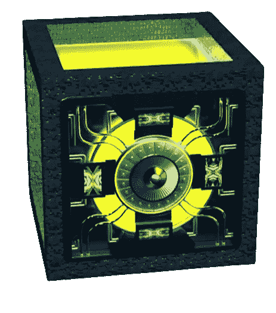
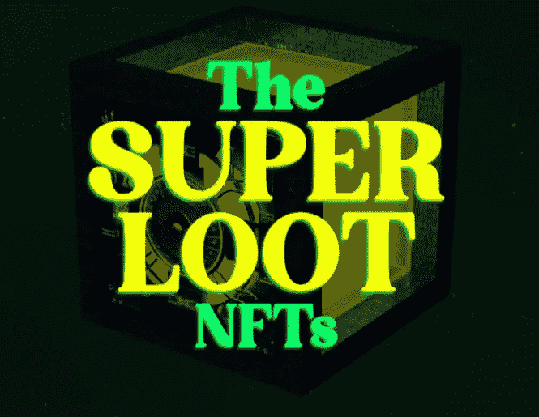
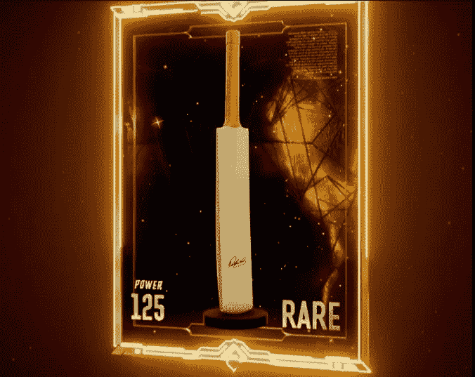

# NFT 超级战利品 2022

> 原文：<https://medium.com/geekculture/nft-super-loot-2022-2595884211c2?source=collection_archive---------22----------------------->

如果你一直在定期更新自己的加密新闻，你可能不会错过世界上第一次 NFT 板球比赛的 NFT 下降事件的信息。这个特别的掉落事件据说是今年即将到来的 NFT 掉落事件之一，它将为未来在元宇宙举行的板球比赛铺平道路。在这篇博客中，我们将详细看到关于板球 NFT 下降的讨论。

# 超级战利品——简介

“超级战利品”是今年即将到来的 NFT 最佳空投之一，将在 Jump.trade NFT 市场举行。这个板球 NFT 收集将是通往“元板球联盟”，世界上第一个 NFT 为基础的板球比赛。超级战利品板球 NFT 下降将在 2022 年 4 月 22 日举行。这里的所有产品都是由 NFT 应用开发公司 GuardianLink 开发的。

# 超级战利品包含什么？

超级战利品板球 NFT 下降将出售板球 NFT 收集的 25，000 个数字收藏品。这些包括板球运动员和板球拍的数字卡。此外，由板球传奇人物签名的原始实物收藏品将提供给幸运的购买者。板球 NFT 收集的收藏品定价如下:一个收藏品为 25 美元，5 个收藏品为 125 美元。购买者每购买 5 件 NFT 板球收藏品，就会得到一个免费的宝盒。Jump.trade NFT 市场最近也更新了宝箱的总内容，宝箱将赠送大量加密货币和本地令牌。

# 围绕这个即将到来的顶级 NFT 下降的嗡嗡声

当超级战利品板球 NFT 掉落的最初声明出来时，来自目标观众各阶层的积极响应——板球、游戏和 NFT 爱好者。此外，全球社交媒体已经陷入狂热，标签#jumptrade 和# nftcricketgame 成为潮流，还有以幽默和教育方式传达板球 NFT 系列的帖子。在 Discord、Telegram、Reddit 和 Clubhouse 等基于社区的社交平台上，每天都有很多讨论，这些讨论围绕这场板球 NFT 赛获得了很多关注。围绕超级战利品的参与程度非常激烈，这使得它成为今年即将到来的 NFT 最佳掉落物之一。

# 总结想法

因此，超级战利品板球 NFT 下降从跳。贸易 NFT 市场一直是最期待和顶部即将到来的 NFT 下降之一。由于代币在未来板球比赛中的作用以及在接下来的寻宝活动中赢得大奖的可能性，将在下降期间出售的板球 NFT 收藏提供了很多承诺。通过玩游戏赚钱的前景进一步提高了对板球 NFT 下降的预期，因为它将通过货币化一个人的消遣增加另一种被动收入的方式。