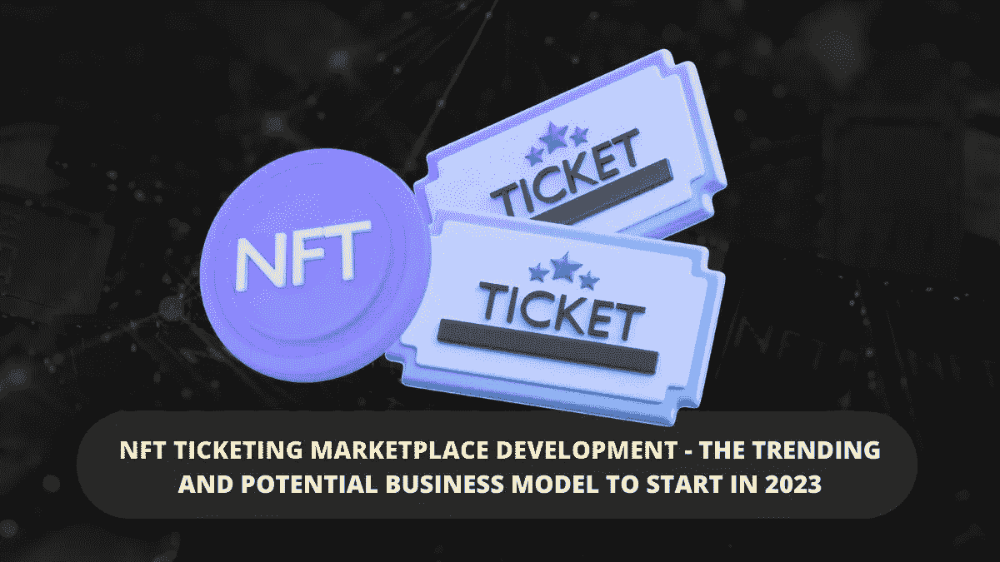

# NFT 票务市场发展——2023 年开始的趋势和潜在商业模式

> 原文：<https://medium.com/geekculture/nft-ticketing-marketplace-development-the-trending-and-potential-business-model-to-start-in-2023-671c172656af?source=collection_archive---------18----------------------->

**NFT ticketing Marketplace Development- The Trending And Potential Business Model To Start In 2023**

NFT 已经引起了相当长一段时间的讨论，并且由于其不可变和独特的特性而变得非常流行。非正规金融服务催生了许多非正规金融服务爱好者和 NFT 企业家。世界各地的人们对 NFTs 非常着迷，并表现出浓厚的兴趣，紧跟 NFT 的发展趋势。NFT 于 2014 年出现，但 2021 年被称为 NFT 的黄金年，因为 NFT 行业经历了更大的交易量，很少有 NFT 以创纪录的价格售出。也就是说，希望进入高利润行业的企业家可以利用 [**NFT 票务市场的发展。**](https://www.turnkeytown.com/nft-ticketing-marketplace-development)

NFTs 的潜力已经在包括票务行业在内的各种行业取得了成功。NFTs 的流行不仅带来了将数字收藏品标记化的创新解决方案，还在票务行业掀起了一场革命。NFT 票务市场的发展是新时代的业务，正在 NFT 和票务行业创造革命。

# **NFT 票务市场特色:**

*   **二级市场-** 对于无法参加活动的粉丝，门票转售将在二级市场上无缝处理。
*   **活动页面-** 包含活动时间、票价、场地等信息。
*   **列表门户-** 列表门户允许活动经理列出他们主持的活动。活动的详细信息，如日期、时间和地点，都有条不紊地提前列出。
*   **结帐门户-** 此功能负责接收门票付款。通过这个入口，用户可以快速完成支付流程，购买门票。
*   **吸引人的用户界面-** 支持吸引人的屏幕回放功能，可列出事件。NFT 票务平台的个性化和交互式设计创造了令人难忘的用户体验，吸引了许多用户。
*   **通知和警报-** 关于事件的定期更新通过通知发送。这使得平台用户保持更新。

# **传统票务系统面临哪些挑战？**

## **门票黑营销**

欺诈行为一直困扰着票务行业，迫使粉丝支付更高的费用，并增加了活动组织者的安全威胁。通过利用技术，售票机器人肆虐，网上门票被大量购买并在二级市场高价出售。这可以用 [**NFT 票务市场**](https://www.turnkeytown.com/nft-ticketing-marketplace-development) 来消除。

## **没有交换协议**

不可能跨越提供商边界跟踪客户或共享数据，并且缺乏交换协议使得二级市场欺诈成为可能。如果是这样，门票将不再是原购买者的财产，其详细信息将由组织者保留。因此，组织者不知道谁在参与该活动。因为票是以不允许二级市场赎回的方式发行的，所以没有办法改变持票人的名字或控制票所有者改变的频率。

## **客户信任度**

客人最关心的问题之一是他买的是真票还是假票。一些客户可能会在网站上购买假机票，认为是合法的机票代理机构，导致金钱损失和失望。

# **NFT 票务的优势**

NFTs 这种新的票务形式有可能彻底改变消费者和活动组织者的票务流程。非功能性测试的优势包括:

## **避免欺诈和假票**

区块链可以被信任为购票者和活动策划人之间的诚实中介。从第一次销售到转售，所有各方都可以验证 NFT 的合法性，这要归功于区块链上记录的不可改变的交易记录。您可以创建不可转让的机票，用于机票转售受限的情况。

## **省钱**

与纸质门票相比，NFT 的销售和铸造成本是最低的。买家和活动组织者受益于以折扣价创建防伪门票的能力，验证流通中每张门票的合法性，并跟踪从卖家到买家的旅程。

## **生产率**

创建不可替换的令牌(NFT ),脱离标准的数字票务流程，以创纪录的速度创建它们。NFT 在不到一分钟的时间内发布并准备好以旧换新。

## **盈利能力**

可编程 NFTs 可以包括产品、内容、转售和版税分割的规则，因此组织者可以计算未来在二级市场上转售的利润份额。

# **用户使用 NFT 门票有什么好处？**

*   组织者为他们提供津贴和奖励。
*   他们可以通过倒卖他们不能参加的活动的门票来赚钱。
*   收藏票是一个很好的市场，因为持票人可以在各种 NFT 市场上转售这张票。
*   他们可以妥善保管门票和回忆。

# **NFT 票务公司的活动策划有什么好处？**

*   通过描绘事件背后的故事，你可以创造艺术作品的收藏门票。
*   每张票都由其所有者验证，并被证明是合法的。只要 NFT 门票被转售，原购买者和转售者都会从中受益。
*   这使你容易获得信息，从而改进未来活动的组织。
*   您可以通过电子邮件或短信发送 NFT 活动的门票。

# **结论:**

NFTs 正在席卷全球，NFT 票务行业是 NFT 空间的下一个趋势。如果你是一个企业家，正在寻找一个有前途的商业解决方案，依靠 NFT 票务市场的发展。与一家 [**NFT 票务市场发展公司**](https://www.turnkeytown.com/nft-ticketing-marketplace-development) 取得联系，开始红红火火的生意。