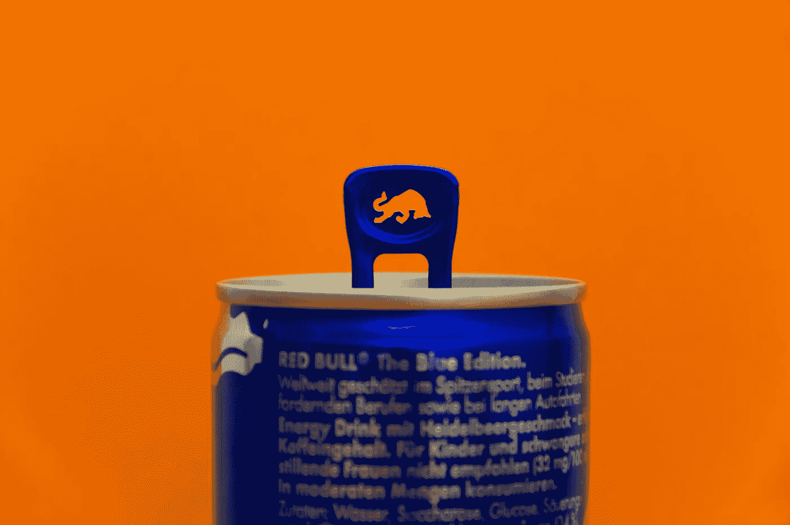

# NFT 就像卖罐头里的名人屁

> 原文：<https://medium.com/geekculture/nfts-are-like-selling-celebrity-farts-in-a-can-6ed85903dbca?source=collection_archive---------12----------------------->

## 一种病毒正在攻击我们大脑的逻辑中枢

Photo by [Alexander Sinn](https://unsplash.com/@swimstaralex?utm_source=unsplash&utm_medium=referral&utm_content=creditCopyText) on [Unsplash](https://unsplash.com/s/photos/can-of-farts?utm_source=unsplash&utm_medium=referral&utm_content=creditCopyText)

## 人们愿意花大价钱买的东西总是让我吃惊。

2015 年，加拿大的几个人开始在易贝上卖空气拉链，这只是个玩笑。第一个卖了 168 美元。有人付钱买了一袋空气。