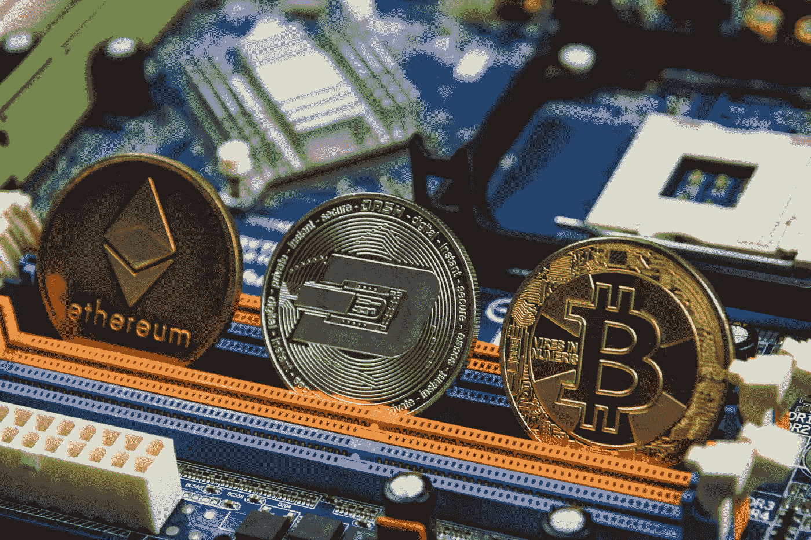
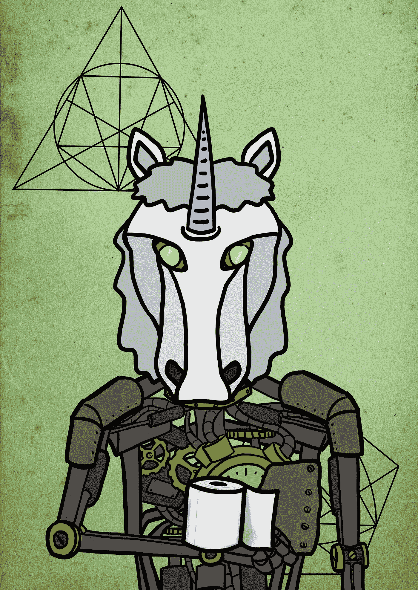

# NFT 不是未来…改变我的想法

> 原文：<https://medium.com/geekculture/nfts-are-not-the-future-change-my-mind-d5dbcad51df?source=collection_archive---------10----------------------->

在过去的几个月里，NFT 艺术运动爆发了。习惯于以数百美元的价格出售作品的艺术家现在已经以数百万美元的价格出售他们的作品。从美术摄影师到数字创作者，艺术家们疯狂地将他们的一些最佳作品转移到 NFT 市场，试图从这块隐藏的馅饼中分得一杯羹。这种疯狂的 NFTs 冲刺让艺术家、评论家和投资者都叫嚣着，他们都声称这是艺术的未来。在过去的 20 年里，戏剧性的技术进步已经成为一种日常现象，并为更光明的未来铺平了道路。然而，这种以区块链技术为代表的数字艺术，被称为 NFTs，绝对不是一种更光明的前进方式，也不是我们的未来。试着改变我的想法。

# 价值主张

艺术的价值常常是一个困难而有争议的问题。我将把艺术价值主张分解为三个部分，然后将这些部分与 NFTs 进行比较。高价值艺术的第一个组成部分是技术专长和质量。艺术家使用的技巧是否达到了极高的水平？在这一部分，我们正在考虑艺术家是否通过优秀的技术方面，如构图、色彩科学、使用的材料等，创造了一件强有力的作品。一件具有高超技术专长的艺术品具有内在价值，因为它是一件很少有人有知识去创作的作品。第二个组成部分是名字识别。一个公认的或著名的艺术家将能够创作出具有内在价值的作品，因为他们的名字。他们出名的原因可能是由于其他方面(比如技术专长)，但我认为你会经常发现这些著名的艺术家在他们职业生涯的后期会更加偏离常规，因为他们名字背后的杠杆作用。一个知名品牌的艺术品具有内在价值。第三个组成部分是排他性。人们自然倾向于用更大的价值来对待排他性。在其他条件都相同的情况下，一枚 10 分之一的硬币可能比一枚 100 分之一的硬币价值更高。更多的独家艺术品通常也被视为更好的投资，在未来有更大的转售价值。这种独特感觉的创造是所有高价值艺术中的一个事实。现在，肯定有其他因素影响一件艺术品的价值，但在基本层面上，我认为根据技术质量、艺术家的名字和独特性来评估艺术品的价值是合理的。基于这三个类别，购买一件高价值的艺术品不仅是为了展示而欣赏，也是作为一种投资。

‘Robocorn’ by HashMasks last sold for $170,000

现在，让我们回到 NFTs，看看价值主张的这三个类别是如何转化的。首先，我们来看看技术专长。NFT 市场是你能找到的离优质艺术最远的地方。这些数字图书馆充满了迷因、截图和奇异的数字漫画。这些数字资产最多是从互联网上免费下载的，但出于某种原因，正在以数千美元的价格进行买卖。这些艺术作品的技术质量并没有创造出内在的价值。你听说过艺术家的“杂凑任务”吗？没想到会这样。嗯，他们最近以大约 17 万美元的价格出售了一幅机器人独角兽拿着一卷卫生纸的图像。在很多情况下，NFT 这个名字似乎并不重要。这一点似乎尤其正确，因为艺术家的名字往往会随着时间的流逝而消失，因为这件作品会在很短的时间内被多次转售。考虑到低技术质量、缺乏知名度和高转卖率，很难证明人们是为了欣赏艺术而购买这些非艺术作品。第三个因素，排他性。这是价值主张中事实上成立的一个组成部分。艺术家可以很容易地在 NFT 市场上出售限量版或一对一的作品。这种排他性确实增加了资产的价值。

当我们后退一步，进一步评估 NFTs 的价值主张时，让我们再添加一个技术性的活动扳手。有了传统的高价值艺术品，就可以买来展示了。不用太深入，这些 NFT 交易被列为区块链的一个条目。区块链条目没有存储大量数据的能力，因此条目包含数字艺术的网址，而不是实际的艺术作品。因此，你不仅购买了一件无法实际展示的艺术作品，而且实际上你只购买了数字艺术作品的网址。这一事实，加上上面讨论的价值主张的三个组成部分，使一件艺术作品的价值值得怀疑。从投资的角度来看， 你付出的东西并没有得到多少，从艺术家的角度来看，以天文数字的价格为你的客户创造的价值的缺乏在道德上是有问题的。 非正规金融工具缺乏真正的价值，并为许多道德上有问题的交易打开了大门。再说一次，这不是艺术的未来，试着改变我的想法。

# 可持续性和环境责任

我们的世界正处于一个转折点。在多年不愿接受环境法规后，如果我们想要这个星球上的未来，世界已经到了这样一个时刻，即朝着正确方向改变气候排放的政策不再是可选的。那是事实，没什么可争论的。清洁能源的缺乏和过度消费导致了这一点，如果不做出改变，它将把我们推向悬崖边缘。当想到气候变暖排放和环境责任时，数字技术不是第一个想到的东西，但也许是时候了。这里有一些关于加密技术及其环境影响的事实。除了 38 个国家之外，比特币每年消耗的能源比其他所有国家都多。一笔比特币交易消耗的能量相当于普通美国家庭一个月的用电量。2021 年，比特币的能源使用量可能高达 450 万亿瓦特小时，使英国 300 万亿瓦特小时的能源使用量相形见绌。这些数字令人震惊。加密技术在很大程度上不受联邦政府的检查，从环境的角度来看，这对我们的星球将是灾难性的。

Photo by Chris LeBoutillier from Unsplash

让我们直接看看 NFTs。一个 NFT 的碳足迹大约相当于普通家庭两个月的用电量。这是不可理解的，坦率地说是站不住脚的。一些艺术家称 NFTs 为“生态噩梦金字塔计划”。一些更知名的艺术家在得知这些技术对环境造成的噩梦般的影响后，已经撤回了他们的 NFT 收藏。密码领域有影响力的个人声称绿色变革即将到来，但这很难让人相信。建立了这些区块链技术的公司已经看到了戏剧性的短期利润。在这个世界上，人们会为了赚钱不择手段，短期利润每次都会战胜长期责任。从环境的角度来看，在他们最好的日子里，NFT 在伦理上是有争议的，是一场环境灾难。在一个必须承担环境责任并做出改变的世界里，非森林技术不是未来。试着改变我的想法。

# 未来

NFTs 最初是为了帮助饥饿的艺术家而设计的。它们被设计成允许艺术家从他们的作品中赚钱。NFT 市场的现状远非如此。这是一个数字资产的集合，其中大多数看起来几乎没有价值，所有这些都导致了环境危机。对 NFT 的逻辑分析会让任何人得出这些结论，但这仍然没有回答为什么这些数字艺术品会以如此天文数字的价格出售的问题。我相信在创建数字艺术和 NFTs 的最初想法方面有影响力的 Anil Dash 说得很好。我最近读了他写的一篇文章，他谈到了加密货币在这个独立的宇宙中是如何运作的。你不能用比特币买车买房，那你用它做什么？你在密码世界里交易它。这就是 NFTs 正在发生的事情。有越来越多的人拥有大量的加密货币，这些钱都花在了非加密货币上。他在这方面做了一个很好的类比:想象一个孩子已经玩了几个小时的双向飞碟球，现在有了他赢得的所有这些彩票。这些票其实没什么用，除了在街机柜台后面买些垃圾玩具。NFT 是垃圾玩具。NFT 不是未来，试着改变我的想法。

非常感谢您花时间阅读这篇文章。我叫马特·阿什利，是北卡罗来纳州夏洛特的一名美术风景摄影师。如果你想看我的任何作品，请到我的网站查看。如果您有任何问题或意见，请随时联系[联系](https://mattgashley.com/contact)。如果你想了解最新的文章发布，可以考虑让[订阅](https://mattgashley.com/newsletter)我的时事通讯。谢谢，我很快会再和你们聊的！