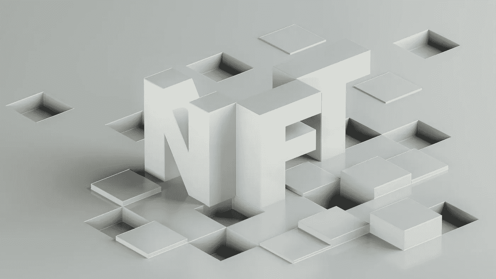

# NFT 是 Web3 的基础

> 原文：<https://medium.com/geekculture/nfts-are-the-building-blocks-of-web3-199d9fda3401?source=collection_archive---------10----------------------->

Photo by [Milad Fakurian](https://unsplash.com/@fakurian?utm_source=unsplash&utm_medium=referral&utm_content=creditCopyText) on [Unsplash](https://unsplash.com/s/photos/nft?utm_source=unsplash&utm_medium=referral&utm_content=creditCopyText)

## Web3 和 L1·区块链

在 crypto 内部总是有大量的机会。如果你在 2012 年至 2015 年间看到了数字货币的潜力，那么你很有可能做得非常好。这是假设你持有你的投资，直到加密成为主流。

秘密空间总是被投机所推动。战斗口号*我们还早*推动新的…