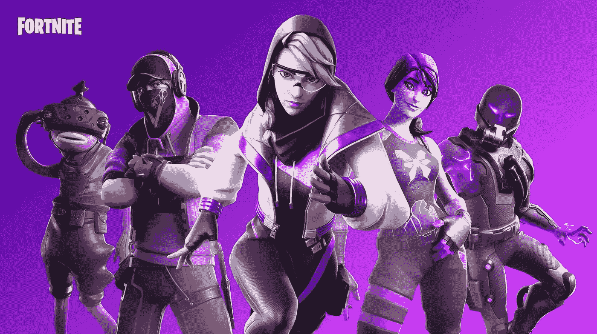
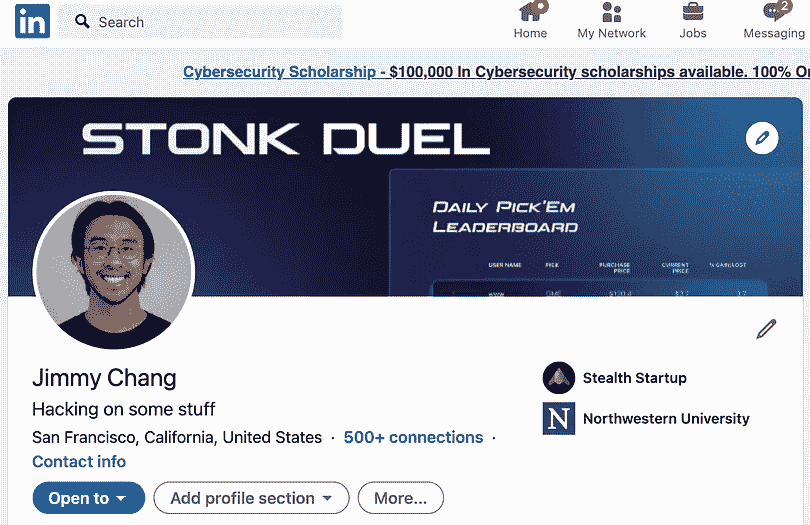
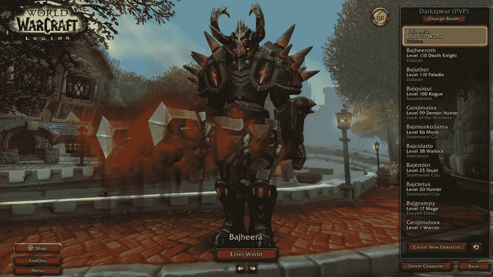
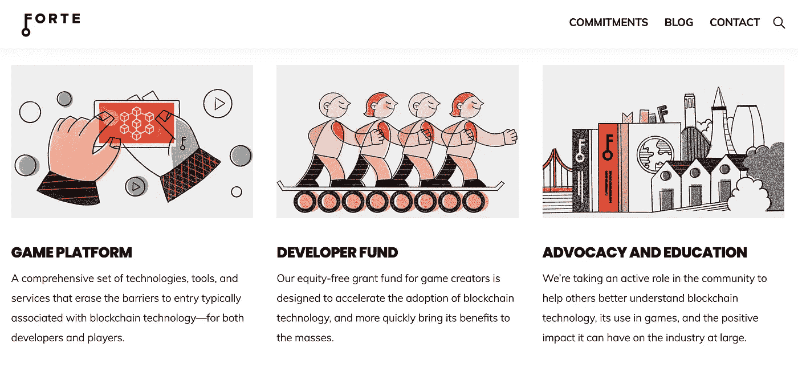
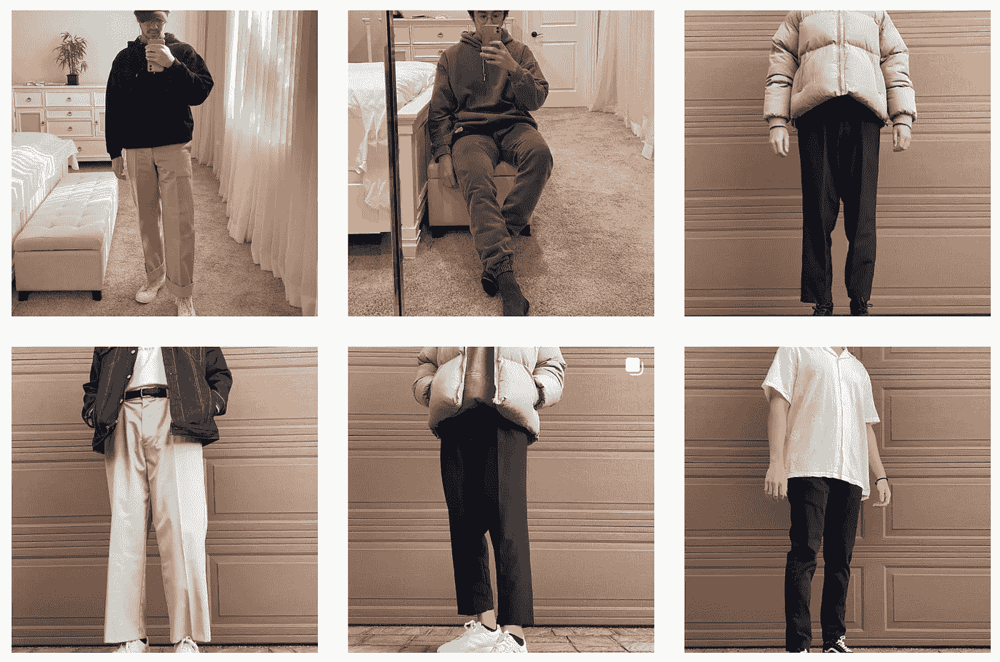
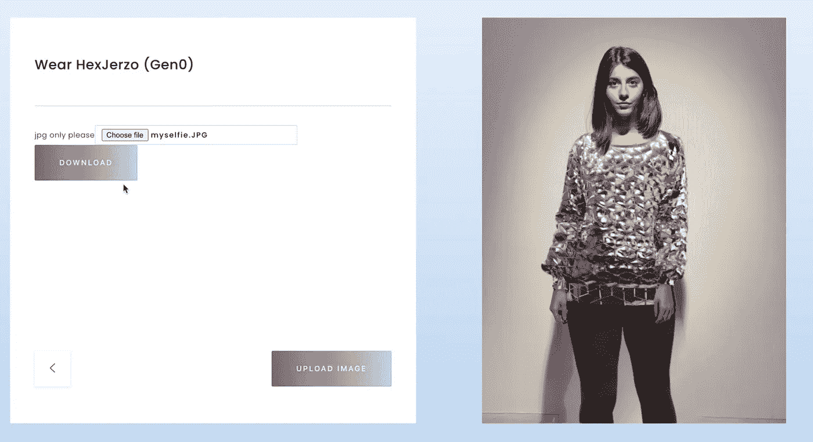

# NFTs 开启了一种新形式的数字身份

> 原文：<https://medium.com/geekculture/nfts-unlock-a-new-form-of-digital-identity-7145aa7b48c9?source=collection_archive---------5----------------------->

## 我们越来越依赖社交媒体及其与非功能性测试的关系

Source: [Epic Games](https://www.epicgames.com/fortnite/en-US/download)

作者注:这是我的 NFT 系列的第三部分。 [*点击这里阅读第一部分*](https://jimmy-chang.medium.com/how-did-nfts-become-so-popular-f894eea22f90) *，我在这里记录了 NFTs 的崛起。这是第二部分，我把它作为新世界的基础。*

让我们回顾一下这个系列的前两部分。

NFTs 是一种加密标准，允许对资产所有权进行认证和验证，这在数字产品中最容易实现。

NFT 的受欢迎程度激增，虽然[目前是一个泡沫](http://www.theartnewspaper.com/news/sorry-to-burst-your-bubble-nft-prices-slump-70)，但底层技术仍将存在。

NFT 之所以会存在，是因为它们是两种震撼世界的范式转变的交汇点:元宇宙和 Web3。

元宇宙是一个虚拟世界，每个人都可以进入，并将在其中度过一生中相当长的一段时间。

随着 5G、VR/AR 和云游戏等技术的改进，我们正在快速向元宇宙迈进——由 Covid 疫情加速，迫使世界采取更加数字化优先的工作和社交生活方式。

Web3 是互联网的下一个时代，它建立在开放、无许可和无信任的价值观之上；区块链是 Web3 运动的技术驱动力量之一。

**TLDR；随着世界变得更加数字化，对不可信数字所有权的需求将会增加，而 NFTs 将会解决这一需求。**

唷——现在，这个问题已经解决了，我们也理解了非功能性测试的重要性——让我们双击非功能性测试在当今世界的战术含义。

# Covid 世界中的数字身份

社交媒体一直是我们生活中很重要的一部分。

我甚至无法想象我们这一代人(和 Zoomers)花了多少集体时间来考虑在我们的 Instagrams 上放哪些照片，在我们的 Twitter 个人资料上放哪些词，或者在我们的铰链个人资料上回答哪些问题。

My Instagram looks very different than my LinkedIn

每一个平台都有我们自己的细微变化。

海滩照片在 LinkedIn 上是不允许的，但在 Insta 上是受欢迎的。你不能在 Insta 上发布你喝酒的故事，但是在 Snapchat 上就可以了。在 Linkedin 上穿西装打领带没问题，但在 Hinge 上就失礼了。

每个平台都展示了我们的一面。

我们将整个人格的不同部分打包成与环境相关的互动——无论是约会、社交、炫耀等等。

Covid 只是加剧了我们对数字平台的依赖，从增强我们的 IRL 身份到完全替代我们的社交生活甚至工作生活。

我们关心自己在网上的形象，因为在 Covid 期间，这已经成为我们与家庭之外的世界互动的唯一方式。

换句话说，我们的数字身份*就是*我们的身份——至少对外是这样。

这就是为什么我们有变焦的[滤镜。](https://snapcamera.snapchat.com/)

这就是为什么有几十个应用程序在你发布新照片之前预览你的 Instagram 个人资料。影响者确保他们的订阅源在与世界分享之前看起来绝对完美。

这就是为什么人们在堡垒之夜的人物皮肤上花费了数十亿美元。

这就是为什么人们花费数百小时为 Clubhouse、 [Twitter](https://twitter.com/0xJim) 和 Substack(有罪)创建内容——希望为自己建立一个品牌，并希望向世界其他地方展示他们是谁的某种形象。

# NFT 是数字身份的下一次发展

如果我告诉你，你花在精心构建数字图像上的所有时间都可能在一眨眼的时间里消失——完全是因为少数人的突发奇想，你会怎么想？

你可能会再三考虑在这个平台上投入时间。

但这种情况发生的几率有多大，对吗？

这每天都在发生——成千上万的账户打破了抖音和推特等平台建立的社区准则。

这并不是说公司没有权利——他们最终拥有在他们的平台上发布什么和不发布什么的最终发言权。当我们加入该平台时，我们同意 T&C 的这些条件。

但是，所有的照片、视频、文章和关注者都随着它消失了——你投入的所有时间也随着它们消失了，这确实是一个该死的耻辱。

这就像创作者为这些公司创造了所有这些价值(从用户采用和广告收入的角度来看)，而他们充其量只能获得微薄的血汗和眼泪。

好吧——但是如果我们能够准确地*保留*为每个平台制作的所有内容呢？

如果我们可以将我们的内容从一个平台转移到另一个平台，根据平台的上下文来管理每一个提要，会怎么样？

这些平台看起来不太像围墙花园，而更像是将内容包装在令人愉快的用户体验中的开放平台——可能会在核心体验之上提供服务，以此作为一种赚钱的方式。

然后，这些平台将不得不为最佳体验和最佳服务而竞争，就像银行如何区分其服务、产品和客户体验来争夺我们的资金一样。

为了实现这一目标，我们需要真正拥有我们的数字内容，也就是我们的数字身份。

我们需要非功能性测试。

我们 instas 的 NFT，我们 tweets 的 NFT，堡垒之夜皮肤的 NFT。

最终，随着我们的世界变得更加数字化，首先是在人与人的互动方面，我们也需要拥有自己的数字空间。

我们的数字土地，我们的数字家庭，我们的数字家具。

因为就像我的 IRL 身份一样，我想真正拥有我的数字身份，而不是像脸书那样出租给房东。

我们的头像实际上就是我们在数字世界中的面孔。

[梅塔科万](https://twitter.com/MetaKovan?ref_src=twsrc%5Egoogle%7Ctwcamp%5Eserp%7Ctwgr%5Eauthor)，NFT 基金 [Metapurse](https://www.metapurse.fund/) 的创始人，也是价值 6900 万美元的 Beeple 作品的买家，他把虚拟化身比作我们的“宇航服”。

他们是我们想成为的人，也是我们想被人看到的人。

所以投资一个虚拟形象，并实际拥有它，难道不是有意义的吗？

此外，就像拥有实物一样，我希望能够出售或货币化我的数字财产。

我希望能够转售我从堡垒之夜或使命召唤购买的物品。这样做，我能够从我的购买中产生资产价值——而不仅仅是重写为没有内在货币价值的购买。

拥抱的是一个由用户创造的数字商品的双边经济。以剑换皮。汽车家具。或者只是卖些好东西。

数字所有权的民主化——在这个曾经是一面倒的市场中，游戏创作者带着财富走了。

# NFTs 作为身份的下一步是什么

## 神使

像 Twitter 和 Discord 这样的以密码为中心的社区已经采用了将 NFT 作为其化身的社会规范——他们的宇航服体现了他们希望在当今几乎是元宇宙的形象。

OG 的密码主管和 NFT 的行家们将会穿上[密码朋克](https://www.larvalabs.com/cryptopunks)作为他们的头像，最初的密码朋克从 4 万美元到几百万美元不等。

像我这样资金不足的人会穿“非官方朋克”——原始朋克的后续版本——或者另一个准确描述他们是谁的 NFT。

## 游戏项目

皮肤是视频游戏中最大的表现形式，但其他物品如武器、盔甲和车辆在形成数字身份方面仍然很有价值。

毕竟——在你完全改造过的角色中漫游并在他人身上活动，感觉不是很好吗？

Gain some clout with your maxed out World of Warcraft character

Forte 正在为游戏开发者构建一个平台，让他们能够轻松地将区块链融入到他们的游戏中——允许玩家将他们的资产令牌化，参与双边市场，以及可以跨平台和跨游戏转移的真正所有权。

[Immutable X](https://venturebeat.com/2021/04/08/immutable-x/) 是另一个 NFT 游戏开发者平台，它有一个本地市场，玩家可以在流行的 NFT 游戏如《被解放的上帝》中交易商品。

## 衣服

我有一个 Instagram 账户，可以发布我的日常服装(目前暂停使用，因为我用完了服装组合)。

这是一个很好的强迫功能，让我穿上由于疫情而很久没有穿过的衣服，也让我更有创造力，更注意将衣服层叠在一起。

有趣的是，90%的我的追随者实际上永远不会看到那些服装——因为他们永远不会看到我。

我知道，我想他们也知道，但是在网上看服装还是很有趣的。

我们可以把这种风气带得更远一点，用数字服装作为 NFT。

[非物质化](https://thedematerialised.com/)是一家推动数字服装、非物质化技术和加密货币发展的公司。

他们出售 NFT 服装，可以上传到现有的照片上，甚至可以使用 AR 投影到“真实”世界中。

Source: [https://thedematerialised.com/](https://thedematerialised.com/)

此外，像古驰和 LVMH 这样的时尚巨头的高管已经公开表达了对 NFT 的兴趣——特别是考虑到制造稀缺性的能力和对真实性的可靠验证，这是奢侈品牌价值的两个品质。

> *Emma-Jane MacKinnon-Lee 说道，她是*[*DIGITALAX*](https://www.digitalax.xyz/)*的创始人兼首席执行官*

*一如既往，如果你有任何问题或想详细讨论这些话题，请在 LinkedIn 或 Twitter 上给我发消息。我喜欢和人们谈论加密和广泛的生活:)*