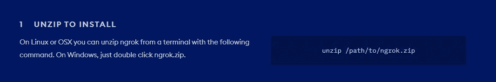
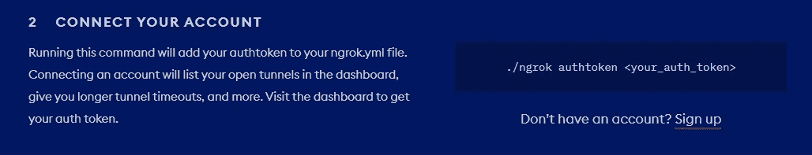
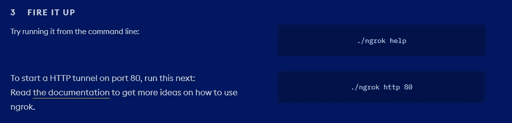
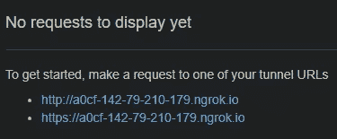
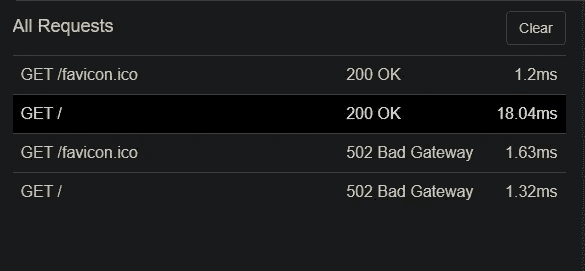
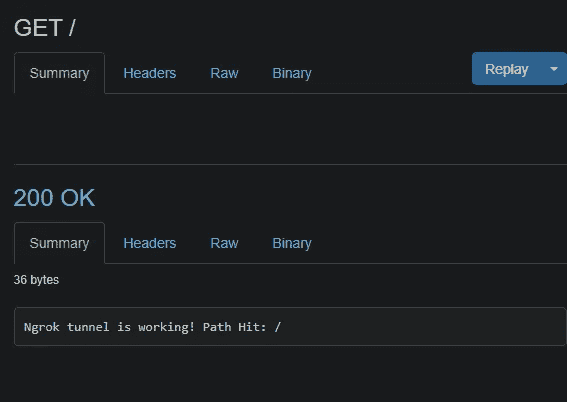

# Ngrok 促进地方发展

> 原文：<https://medium.com/geekculture/ngrok-for-local-development-8309848d5bb3?source=collection_archive---------21----------------------->


Photo by [Aryan Dhiman](https://unsplash.com/@mylifeasaryan_?utm_source=medium&utm_medium=referral) on [Unsplash](https://unsplash.com?utm_source=medium&utm_medium=referral)

我最近不得不安装一个本地开发服务器来测试一个 API。虽然有其他选项可用，如在线 IDE，但有时自己设置隧道更安全也更容易设置。对于这个例子，我使用 Ngrok。

# Ngrok 是什么？

Ngrok 是允许你通过云运行网络服务器的软件。流量通过您自己的计算机进行中继，并提供一个安全的 HTTP URL 进行隧道传输。不需要端口转发！您可以使用隧道服务轻松构建 RESTful APIs。这项服务也是免费的，如果你没有注册账户，你的 Ngrok 服务器将运行 2 小时。您可以选择付费计划，这样它也可以全天候运行。

# 我能用它做什么？

我之前使用 Ngrok 的软件是出于非开发目的。很久以前，我为一群《我的世界》玩家管理一个社区服务器，并因此获得报酬。这是在公测期间！目前，有多种服务提供价格合理的云平台游戏服务器。可以在上传补丁时自动更新客户端，并允许您无缝地运行服务器修改，而不会影响您的进度。

出于开发目的，您可以使用 Ngrok 来测试应用程序、演示网站以及在另一个应用程序上测试 webhooks！我保证用起来超级简单。

# 我们开始吧！

第一步:

在主站点[这里](https://ngrok.com/download)下载 Ngrok！


第二步:

将文件解压缩到 path 变量中。



在这种情况下，我将它解压缩到本地存储磁盘的某个地方，以便于访问！

步骤 3(可选):

如果您已经注册了帐户，您可以使用授权令牌将其连接到您的帐户。



Hint: Auth-token is in your accout dashboard.

第四步:

打开 ngrok，在端口 80 上启动一个简单的 HTTP 隧道！该终端代码因操作系统而异。如果您使用的是 Windows，只需运行以下代码行:

```
ngrok http 80
```



瞧啊。您将可以访问 Ngrok Inspect，它允许您查看对服务器的所有 HTTP 请求。它看起来会像下面的截图。



你可以访问 HTTP 和 HTTPS。我推荐 HTTPS，原因很明显，比如安全！



Requests from the Inspect UI.



GET Request: HTTP STATUS 200 OK

在这种情况下，当一切都**正常**时，我运行了一个 Node JS 应用程序来返回上面的字符串。我正在用这个应用程序测试一个 RESTful API！您所要做的就是在 Node + Express 应用程序中创建一个 web 服务器对象来设置它。

希望这有助于您进入本地开发和测试的世界！我在下面列出了一些资源，如果你遇到困难，可能会对你有用。

# 资源

[Ngrok Docs](https://ngrok.com/docs)
[HTTP Status Dogs](https://httpstatusdogs.com/)
[SSH/port forwarding 简介](https://help.ubuntu.com/community/SSH/OpenSSH/PortForwarding)
[HTTP 的区别& HTTPS](https://www.keycdn.com/blog/difference-between-http-and-https)