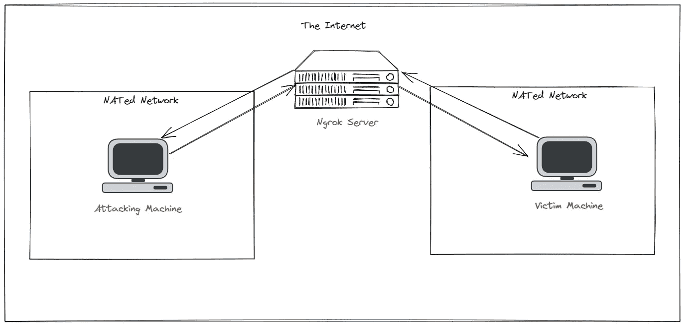

# 渗透测试仪的 Ngrok

> 原文：<https://medium.com/geekculture/ngrok-for-penetration-testers-78761ba0d02?source=collection_archive---------12----------------------->

## 在 NAT 网络后公开您的本地笔测试工具

H ello，🌎！Ngrok 是一个简单的工具，但有一个重要的目的——让您的本地服务可以在 NAT 后的网络中访问，而不必暴露您的公共 IP 地址。Ngrok 是我最喜欢的工具之一，在这篇博客中，我将向你展示我在评估中使用 Ngrok 的几种方式。让我们去争取吧。