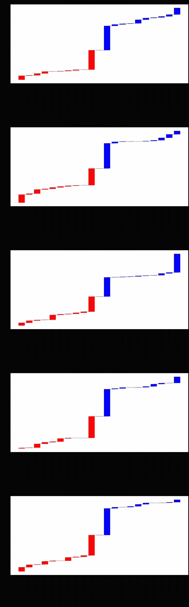
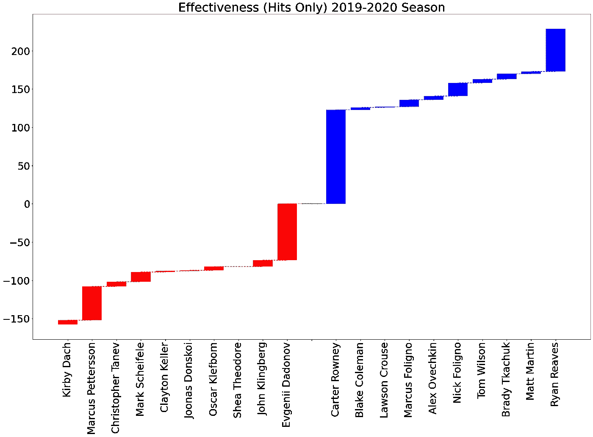
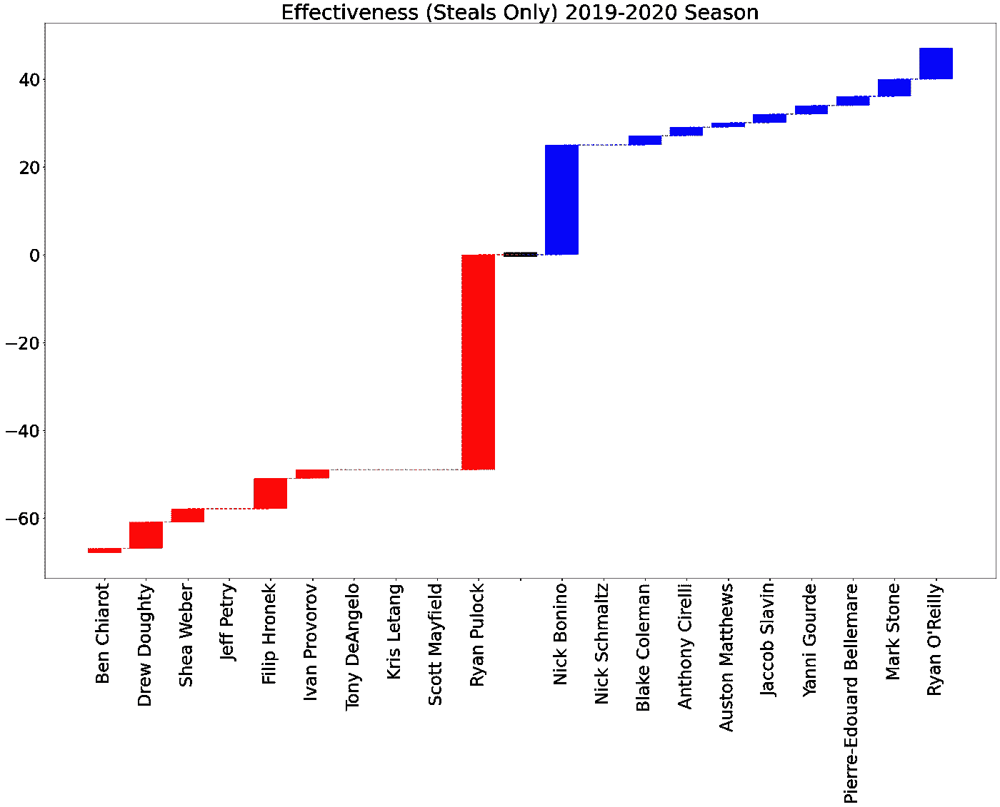
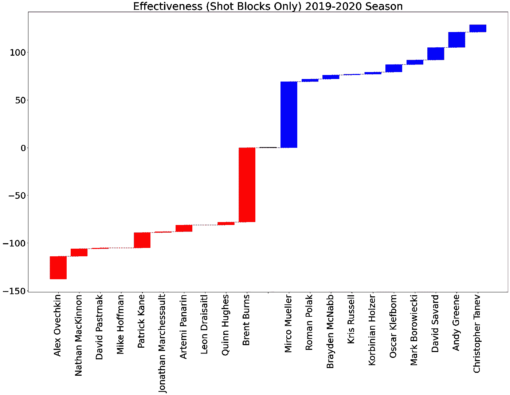
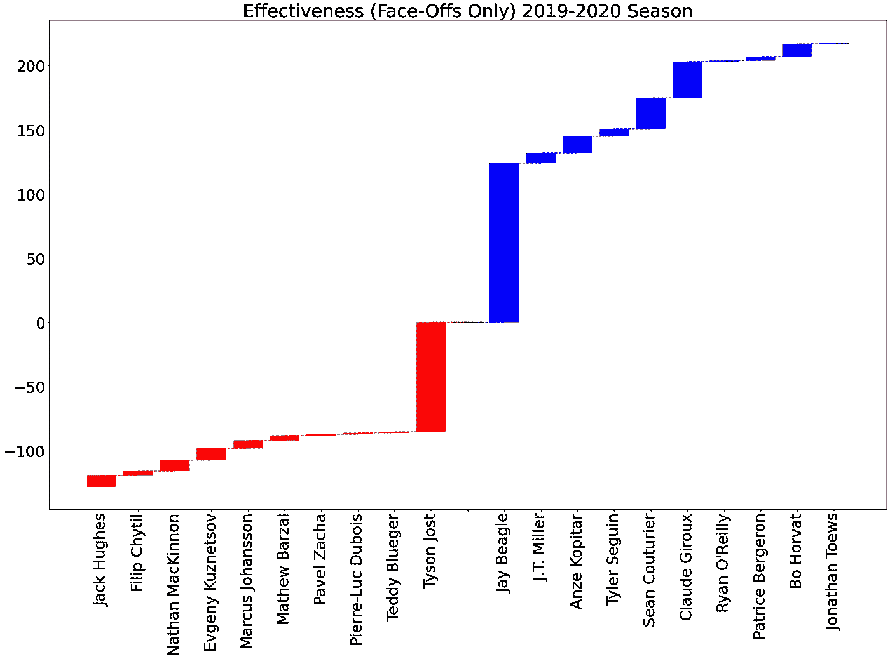
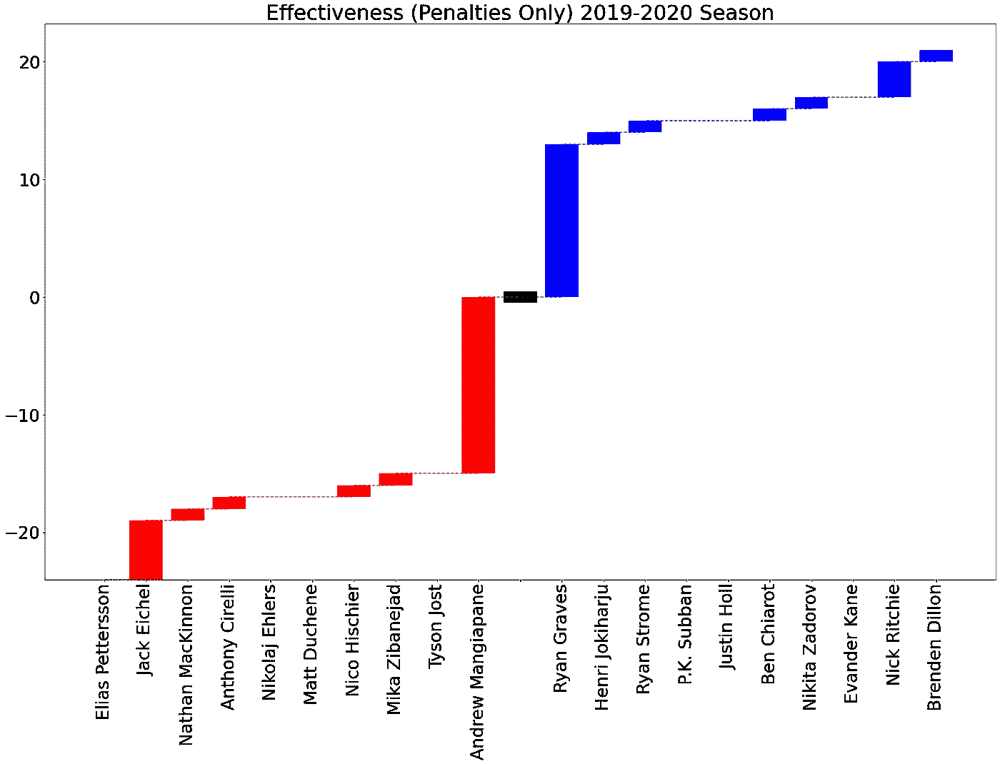
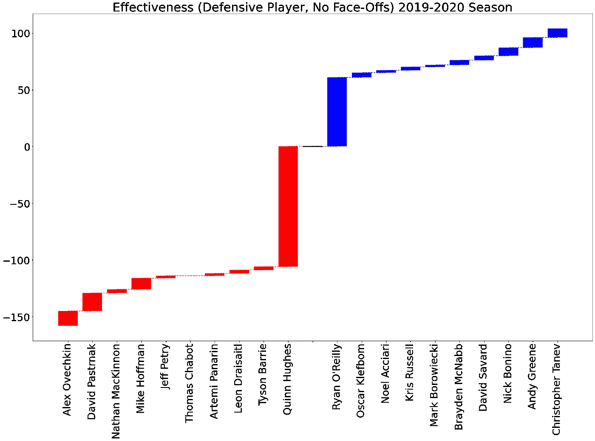
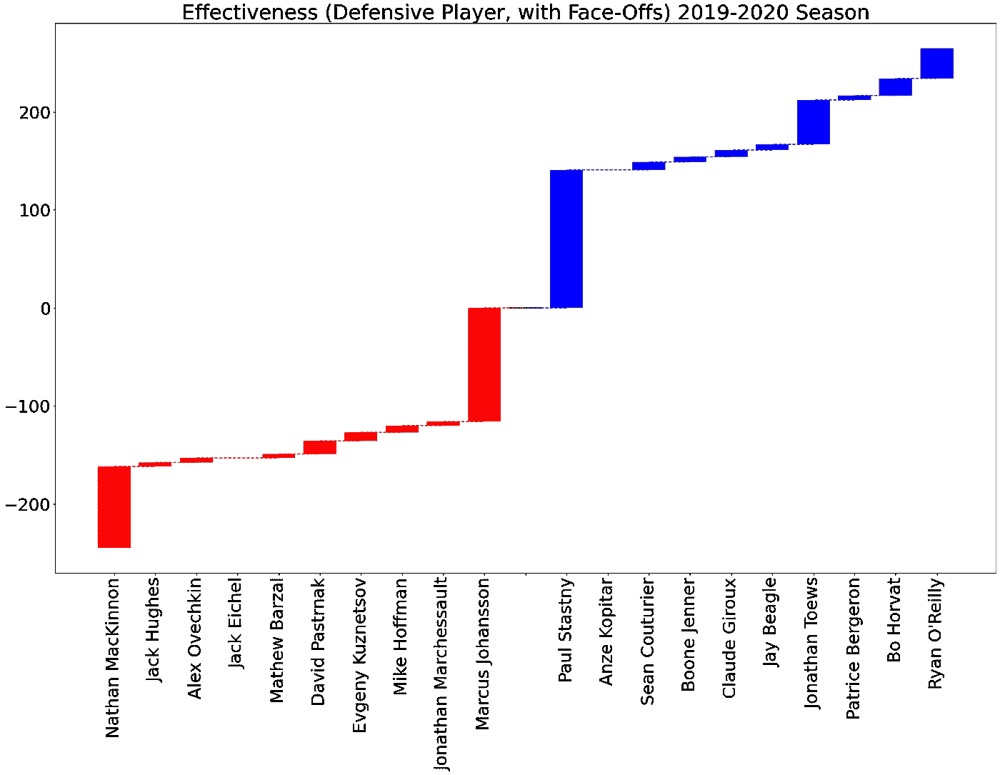
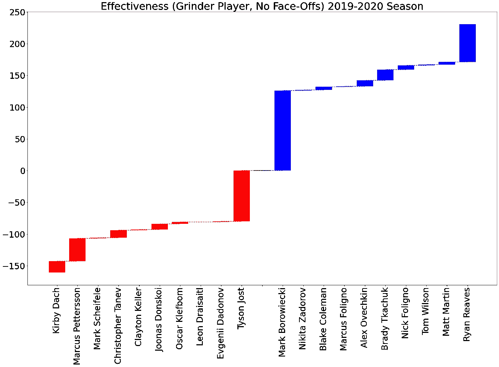

# NHL 深潜:有效性

> 原文：<https://medium.com/geekculture/nhl-deep-dive-effectiveness-cf8642859d5b?source=collection_archive---------64----------------------->

Photo by [Markus Spiske](https://unsplash.com/@markusspiske?utm_source=medium&utm_medium=referral) on [Unsplash](https://unsplash.com?utm_source=medium&utm_medium=referral)

NHL 提供了一个游戏中统计数据的 API，包括:

*   像进球、助攻、得分、开球率、扑救率等常规数据
*   更具体的事件，如击球、射门、点球、发球等(包括涉及哪些球员)

我希望找到一个包括传球和传球尝试的数据集。我已经做了一个包括传球的 MLS 数据的项目，但是很难找到如此详细的数据。

哦好吧，我们继续往前开！数据集是使用来自[这里](http://statsapi.web.nhl.com)的数据通过一个简短的教程[这里](https://www.kaggle.com/kapastor/nhl-analytics-data-collection/execution)收集的。

我们将以三种方式解读数据:

1.  积极性
2.  有效性
3.  [酷肖](https://brandon-elford.medium.com/nhl-deep-dive-resemblance-297d3500d98)

这将是一个三部分的分析，如果你想阅读其他项目，我会在这里链接其他的文章。在本文中，我们将探讨有效性。

# 有效性的定义

我对“有效的”NHL 选手的定义是:

> "在任何两人比赛中，一个运动员的得分率为正(例如，投出的安打数比接到的安打数多)。"

我们将比较比率的事件(和相应的分数)有

*   盖帽(-1)和盖帽(+1)
*   命中次数(-1)和命中次数(+1)
*   赠品(-1)和外卖(+1)
*   面对面输了(-1)，面对面赢了(+1)
*   接受的处罚(-1)和接受的处罚(+1)

上述事件让我们可以比较每个球员的贡献。

在这篇文章中，我们将想象那些在上述五个指标中拥有最佳比率(或比率的加权组合)的玩家。

# 原始有效性

如果指标的权重相等，那么我们会得到下图。请注意，根据这些权重，蓝色是最有效的玩家，红色是最无效的**玩家。**

以下是 2015/16 至 2019/20 赛季的剧情。

乍一看这些图，似乎有些不对劲。过去五个赛季效力最差的球员是埃切尔、舍费尔、麦克戴维、舍费尔(再次)和达奇。这是联盟前 50 进攻球员中的四个！

另一方面，过去五个赛季最有效率的球员是凯斯勒、贝吉龙、奥莱利、劳瑞和里维斯。这里有一些全明星，但是劳瑞和里维斯(无意冒犯)？

原因是我们对所有事件比率的权重相同。这不是最好的方法(是的，我知道这是我做的)，因为一些事件的频率。例如，考虑命中数与惩罚数。平均来说，一场比赛中的命中率要比点球高，所以命中率比点球高。

因此，让我们试着通过不同的方式称量组件来查看结果。我们将尝试分别检查每个事件，然后将事件组合到相关的组中。

# 加权有效性

合乎逻辑的下一步是对五个指标进行不同的“优先排序”。这将有助于想象最有效的击球手、开球手等。我们将分别研究每个特征，然后将它们结合起来，试图勾勒出玩家的类型。我们只看最近一季。首先，我们将考虑点击量。

## 命中率

当只考虑投出的安打数和被击中的安打数之间的比率时，一些非常明显的名字在列表的顶端:Reaves，Martin，B. Tkachuk，Wilson 等。这些球员是整个联盟中最难对付的球员，这与他们被击中的次数比他们被击中的次数多多少有关。接下来的问题可能是**为什么**他们的命中率这么高？他们的投篮次数多得离谱吗？大概吧。它们是不是很有气势，没人想打？大概吧。我们可能永远不会知道。

我们可以从效率最低的击球手那里获得更多有趣的信息(那些比其他人打得更多的击球手)。我们看到一些名字，如达奇、彼得森、塔内夫、舍费尔、凯勒等。他们中的一些人(彼得森，塔内夫)是防守队员，而另一些人(达奇，舍费尔，凯勒)是前锋。有些人总是需要像这样在名单的底部，但我很惊讶地看到一些球员在这种情况下。相反，我认为像塔内夫和舍费尔这样的球员愿意接触比赛。他们可能不会像其他人那样打出那么多安打，但他们确实在玩身体对抗游戏。我想他们让自己处于很多被打击的情况中。

## 带走/送走比率

在这一节中，我们将讨论被盗冰球两边的球员。出现更多外卖的名字有奥赖利、斯通、贝勒马尔、马修斯等。奥利里和斯通在联盟中以锁定防守者闻名，所以他们在这个名单上名列前茅是很有意义的。像马修斯这样的球员以其出色的手眼协调能力而闻名，我曾看过他在对方滑过时毫不费力地从对方球棍上拿走冰球。然而，贝勒马尔是这个名单上一个让我有点惊讶的名字。我不认为一个四线球员是一个有效的冰球小偷。他可能是一个在冰球位置上挣扎的球队，可能会考虑让他们得到冰球的人。

在另一端，我们看到像基亚罗、多尔蒂、韦伯、皮特里等球员。几乎所有这些球员都是防守队员，奇怪的是，垫底的四名球员中有三名是蒙特利尔加拿大人队的现役球员！有一个 NHL 历史上最好的守门员在我身后，肯定会减轻我急于把冰球从我的棍子上拿下来的压力。

请注意，最有效的冰球手是进攻型球员，进攻和防守之间有明显的区别。

## 投篮命中率

这是区分位置滑冰运动员的另一个指标。前十的盖帽比都属于 defencemen，有道理。这个位置决定了他的投篮命中率。

如果我们看看盖帽率的底部，我们会看到一些超级巨星出现，大部分是前锋。像奥韦奇金、麦金农、帕斯捷尔纳克、凯恩等名字。这些球员是联盟中最好的进攻天才，可以说是 NHL 历史上最好的射手！有趣的是，我们看到两名防守队员在后十名中:伯恩斯和休斯，两名进攻型防守队员。也许他们的球队会有更多的成功，如果他们阻止更多的投篮？开个玩笑，他们俩在进攻区都是高度危险的，不应该盖帽。让联盟的塔尼夫去做吧。

## 面对面比率

这个比例明显倾向于前锋，特别是中锋。NHL 中顶级的对峙家伙是意料之中的:Toews，Horvat，Bergeron，O'Rielly，Couturier 等。这些家伙是防守型前锋，如果没有出色的对抗数据，你就不能被认为是一个防守型中锋。

联盟中一些最糟糕的对抗球员都很年轻，或者只是那些不是防守型前锋的球员。像麦金农、库兹涅佐夫和巴尔扎尔这样的家伙是进攻型第一前锋。幸运的是，他们赢了多少场对抗似乎并不重要，这些球员似乎更多的时候是站在正确的一边。

## 罚款比率

当我们开始考虑处罚比率时，我们看到一些*有趣的*结果。统计学。也就是说，谁得到的惩罚比他们得到的多？比例最好的球员有迪伦、里奇、e .凯恩、基亚罗特、苏班等。为什么是这些玩家？我不知道前十名中的所有球员，但我**知道**凯恩、苏班和基亚罗特都在规则的边缘打球，他们努力打球，而且冷酷无情。然而，他们似乎有足够的自制力来吸引更多的方式。+12)的处罚。

另一方面，我们看到一些非常有天赋的进攻球员，如彼得森、埃切尔和麦金农。这三个家伙给他们的球队带来了太多的进攻，但是他们倾向于罚更多的球。这是不是另一种情况，裁判决定让对手砍杀明星球员，因为否则他们只会绕过他们？看你问谁了。

有趣的是深入探究这些球员到底受到了什么样的处罚？未来可能的项目想法。

## 防守效力

现在，我们将使用上面提到的五种属性的一些组合来计算有效性得分。第一个混合分数将是确定最有效的防守球员。我们会考虑盖帽和抢断的比例。然后我们将它分成两种情况，有和没有对峙。

虽然忽略了对抗，我们看到一些防守队员在塔内夫，格林，博尼诺，萨瓦德，麦克纳布这里名列前茅。在名单的底部，我们看到了奥韦奇金、帕斯特拉克、麦金农这些通常的进攻型球员。

杰夫·皮特里目前在斯坦利杯决赛中为蒙特利尔加拿大人队防守，他在 2019/20 赛季的防守效率中排名第五。我承认这是**我对“防守”的**定义，但是这些数据通常与良好的防守相关。如果我们在防守球员的定义中包括更多的数据，我肯定像皮特里这样的人不会垫底。

如果我们包括面对面，名单的顶部和底部由前锋接管。这些比较真实地展现了麦金农和奥赖利玩的不同游戏。

## 研磨机效率

我们下一步要做的比率组合是尝试定义一个有效的研磨机(就像一个大前锋)。我们将结合命中率和罚分率，然后加上对峙。

第一眼我们看到的是热门人物的名字，如里维斯、马丁、威尔逊。这些选手绝对符合 Grinder 的标签。另一方面，我们看到很多同样的球员在命中率垫底。这几乎是肯定的，因为命中比惩罚多得多，这是未来项目中要考虑的问题。

当我们将对峙加入到这个指标中时，我们会看到一些有趣的名字出现在列表的顶部。塞古因、霍尔瓦特、吉鲁、贝吉龙都不是“磨砺”型球员，但他们确实打得很努力，也很有竞争力。展望未来，我可能会看到这些球员在击球手联盟中的额外幻想价值。

在下端，我们看到许多相同的名字。事实上，这些球员中的大多数(像约斯特、杜布瓦、埃切尔、巴尔扎尔等)都有进攻意识，所以他们可能不会想到“命中”或“不要罚点球”，而是“不惜一切代价得到冰球！”

# 用效率来填补漏洞

我们可以使用这些指标的事情之一是确定一个球员的优势和劣势。这在比较可能被收购的球员时很有用，可以确保你有一个全面发展的球队或合同谈判。

这个工具可以用于的另一个项目是建立一个梦幻团队。如果你有机会进入你的联盟的积分系统，你可以使用这些作为五个指标的权重，并建立一个有效的团队。一个得分会比他们承认的多的队。

我们讨论了一些对一些冰球迷来说可能显而易见的观点。例如，瑞安·里夫斯是一个可怕的人，没有人想惹他，或者瑞安·奥赖利是一个封闭的防守型中锋。我们还发现了一些令人惊讶的数据，比如内森·麦金农罚进的点球比他得到的要多。考虑到他的天赋，我本以为他会在绕过对手时得到点球。或许我需要多看麦金农的比赛，或许这又回到了我之前提到的关于裁判用不同的方式称呼明星球员的观点。

不管这些数据是如何使用的，这都是一个有趣的项目，我制作了一个工具来帮助构建一个全面的梦幻团队来迎接下一季！感谢您花时间通读，如果您对新的体育数据科学项目 **有任何想法，请不要犹豫发表评论或联系我们！**我总是在寻找兼职项目！