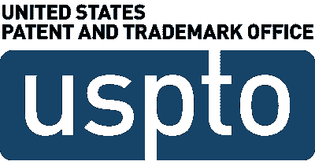

# 耐克收购 NFT 收藏品初创公司 RTFKT 以获得用户参与

> 原文：<https://medium.com/geekculture/nike-acquires-nft-collectibles-startup-rtfkt-for-user-engagement-6930e06c144?source=collection_archive---------25----------------------->

Image credit: [Piqsels](https://www.piqsels.com/en/public-domain-photo-soutf)

耐克最近宣布收购了 NFT 一家专注于收藏品的初创公司 [RTFKT](https://rtfkt.com/) (发音为 artifact)。双方没有披露交易的总价值。

RTFKT 由三个朋友于 2020 年 1 月共同创立，是一个创作者主导的组织。他们创造运动鞋、迷因和其他收藏品的 NFT。在 2020 年推出之前，RTFKT 是一个未定义的集体，为选择游戏公司和时尚品牌提供设计。联合创始人 Benoit Pagotto、Chris Le 和 Steven Vasil 决定扩大在元宇宙的业务，并成立了一个实体。从那以后，这家初创公司以不可思议的速度增长。

“这是一个建立 RTFKT 品牌的独特机会，我们很高兴能够受益于耐克的基础实力和专业知识来建立我们热爱的社区，”联合创始人 Benoit Pagotto 说。“耐克是世界上唯一一个分享我们对创新、创造力和社区的深厚热情的品牌，我们很高兴能够发展我们在[元宇宙](https://www.wired.com/story/what-is-the-metaverse/)完全形成的品牌。”

## 为什么要收购？

此次收购的目标是帮助耐克增加与数字用户的互动。作为世界上最大的运动鞋和服装品牌之一，耐克探索如何扩展其业务的数字方面，并涉足 NFTs 等新兴技术。像其他零售公司一样，耐克也深受供应链延误之苦。NFT 的销售可能成为避开供应链困境的另一个收入来源。

耐克总裁兼首席执行官约翰·多纳霍表示:“此次收购是加速耐克数字化转型的又一步，让我们能够为体育、创意、游戏和文化交汇处的运动员和创作者提供服务。”。“我们正在收购一个非常有才华的创作者团队，他们拥有一个真实而有联系的品牌。我们的计划是投资 RTFKT 品牌，服务和发展他们的创新和创意社区，并扩展耐克的数字足迹和能力。”

## **NFT 社区的反应**

NFT 的爱好者们很兴奋，另一个知名品牌正在进军 NFT 市场。Justin Bazdarich 是 Brooklyn 的一个餐馆老板，拥有几个 NFT，他相信耐克的收购将会鼓励其他大公司参与到 NFT 的热潮中来。

“如果一个大品牌像耐克一样开始发挥作用，那么他们将帮助教育人们这是未来的发展方向，并将允许其他行业参与进来，”Bazdarich 评论道。

37 岁的托马斯·阿里亚斯在迈阿密经营着一家小进口公司，他是一名狂热的 NFT 收藏家，对收集虚拟耐克运动鞋很感兴趣。阿里亚斯说，“我看到了一项资产，它可能在未来某个时候会比我支付的价格更有价值。”。

## **耐克的野心**

在最近的收购消息之前，耐克已经定位于增加数字参与。10 月下旬，耐克向美国专利商标局提交了几项商标申请，以保护其虚拟运动鞋和其他印有耐克 swoosh 标志的商品。不久之后，耐克与 Roblox 合作创建了一个名为 NIKELAND 的虚拟世界。这个免费的在线游戏平台让用户可以穿上耐克品牌的运动鞋和衣服。

Piper Sandler & Co .的高级分析师 Erinn Murphy 在回应耐克最近的收购新闻时表示，“耐克在数字领域也有很多空白空间需要征服。”。

RTFKT 在 2021 年 5 月由 Andreessen Horowitz 牵头的一轮种子基金中筹集了 800 万美元。这轮融资结束后，这家初创公司的估值为 3330 万美元。尽管耐克需要时间才能将 NFTs 变成主要的收入来源，而且 NFT 定价的投机性质也存在财务风险，但耐克的收购为这家运动服装巨头带来了巨大的希望。

## **阿迪达斯 NFT 系列**

鞋类竞争对手阿迪达斯一直处于 NFTs 的最前沿。2021 年 12 月中旬，阿迪达斯推出了第一个 NFT 系列，并在几个小时内赚了 2300 万美元。阿迪达斯“走进元宇宙”系列中的 30，000 件 NFT 在开始销售的当天下午就销售一空。

阿迪达斯与 Bored Ape 游艇俱乐部、朋克漫画和 GMoney 合作制作了 NFT。无聊猿游艇俱乐部和朋克漫画是 NFT 的项目，而格莫尼是一个著名的 NFT 收藏家和密码爱好者。鉴于阿迪达斯首次推出 NFT 系列的成功，这不太可能是他们提供的最后一个 NFT。

## **其他公司进入 NFTs**

许多公司，尤其是时尚和消费品行业的公司，很快就在 NFTs 中站稳了脚跟。几个奢侈时尚品牌拍卖 NFT 系列，通过区块链技术鉴定。例如，杜嘉班纳 NFT 系列在最近的一次拍卖中筹集了 570 万美元。

2021 年 9 月，巴黎世家与 Epic Games 合作，将高级时装引入网络游戏[堡垒之夜](https://www.epicgames.com/fortnite/en-US/home)。2021 年 5 月，古驰进入元宇宙，并在 Roblox 上推出了一个虚拟环境。古驰花园体验展示了 Roblox 的尖端开发工具，并向古驰的 100 周年纪念致敬。最后，奢侈鞋店 Jimmy Choo 于 2021 年 10 月在币安 NFT 市场首次推出其 NFT 系列。