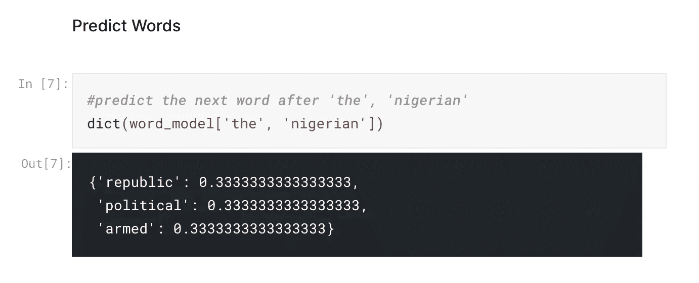

# NLP:构建一个基本的“自动文本填充器”——介绍

> 原文：<https://medium.com/geekculture/nlp-building-a-basic-automated-text-filler-an-introduction-d560ac2b5cdf?source=collection_archive---------31----------------------->


SOURCE: [Morioh (Website)](https://morioh.com/p/8bb5b207c3b9)

自动文本填充器是一个非常受欢迎的自然语言处理应用，智能手机键盘和谷歌等公司使用它来预测或建议用户将输入的下一个单词/短语来完成一个句子。单词预测有广泛的应用:

1.  像谷歌搜索、Youtube 这样的应用程序使用单词预测来推荐热门搜索，这启发了用户，也节省了时间。
2.  Gmail 和 Grammarly 使用单词预测来纠正语法错误，并建议同义词，这有助于用户在撰写电子邮件和文章时更加专业和富有表现力。
3.  Instagram、Twitter、LinkedIn 等应用程序使用单词预测来建议标签，帮助提高用户帖子的可见性。

可能的应用点的列表是无穷无尽的，虽然可以使用长期短期记忆(LSTM)等深度学习算法来建立复杂的模型，但在本教程中，我们将使用 **N-Grams +马尔可夫链**方法来建立一个基本的下一个单词预测模型。

# 什么是 N-gram？

> n 元语法是来自给定文本或语音序列的 n 个项目的连续序列。——【Definitions.net 

n-gram 是你可以在源文本中找到的长度为 ***n*** 的相邻单词或字母的组合。例如，给出这样一句话:

> “祝你生日快乐，无名氏”。

这句话的 2 个字母是:

> “**祝你**”、“**生日快乐**”、**“无名氏**”。

这句话的三个字母是:

> ”**祝你快乐**“**生日无名氏**”。

在本教程中，我们将使用三元模型构建一个基本的马尔可夫预测模型，三元模型将从 1960 年 10 月 1 日**尼日利亚第一任总理哈吉·阿布巴卡尔·塔法瓦·巴勒瓦爵士的演讲中生成。**

# 马尔可夫链概述

马尔可夫链是一个数学系统，它根据某些概率规则经历从一种状态到另一种状态的转换。它是描述一系列可能事件的随机模型，其中每个事件的概率仅取决于前一个事件达到的状态。— [维基百科](https://en.wikipedia.org/wiki/Markov_chain#:~:text=A%20Markov%20chain%20is%20a,time%20Markov%20chain%20(DTMC).)

使用 N-Grams 模型，序列中的一个项目(一个单词)可以被视为马尔可夫状态。这意味着一旦我们成功地构建了模型，我们将能够根据之前看到的数据中出现的单词来预测下一个单词。

# 入门指南

首先，我们导入所有需要的库，并使用漂亮的 Soup Python 库抓取数据(段落):

## 导入库

```
from bs4 import BeautifulSoup
from nltk.util import ngrams
from collections import defaultdict
from nltk import trigrams
from nltk.tokenize import RegexpTokenizer
import requests

*#load fetch speech text from blog*
response = requests.get("https://maxsiollun.wordpress.com/great-speeches-in-nigerias-history/")
soup = BeautifulSoup(response.text,'html.parser')
sentence = soup.find_all('p',text=True)
print(sentence[1:3])
```

## 预处理文本

下一步是预处理文本并删除不需要的字符。我们需要将文本输入到标记列表中，并删除所有点，这样所有输入三元语法模型的数据都是单词。

```
note=None *#we will merge the list string values into a single string*
for line **in** sentence[1:3]:
    note+=str(line)*#convert text to lower case*
sentence=note.lower()*#convert Sentence into Tokens and extract all punctuations*
tokenizer = RegexpTokenizer(r'\w+')
tk_sentence=tokenizer.tokenize(sentence)
```

## 创建三元模型

现在我们生成我们的三元模型:

```
gram_sentence=list(ngrams(tk_sentence, 3))
```

## 建立模型

最后，我们现在可以使用我们的列表三元组来构建马尔可夫模型。

```
*# Create Word Model*
word_model = defaultdict(lambda: defaultdict(lambda: 0))

for sentence **in** tk_sentence:
    for first_word, second_word, word_label **in** trigrams(tk_sentence,pad_left=True,pad_right=True):
        word_model[(first_word, second_word)][word_label] += 1dict(word_model)
```

如果你想自己尝试或者查看模型的结果，可以查看我的 [**Kaggle 笔记本**](https://www.kaggle.com/nnitiwe/nlp-predicting-next-word) 上的完整代码。

对于这个特定的预测，列出的单词集的概率得分是 ***0.33*** 。然而，在得分大小不同的情况下，具有较高大小的得分是最优选的预测。



如果你觉得这个教程有帮助，比如👏🏻👏🏻更多内容请关注我。