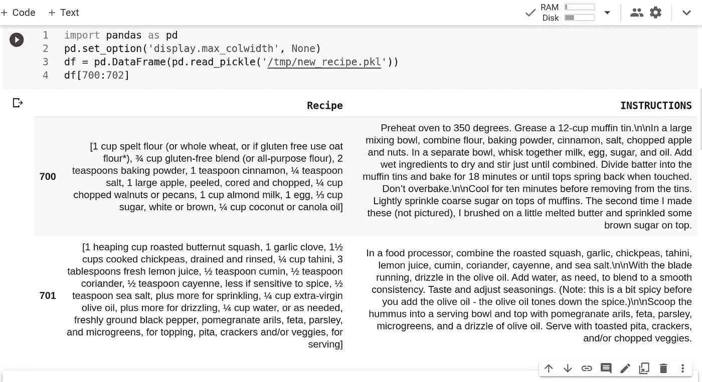
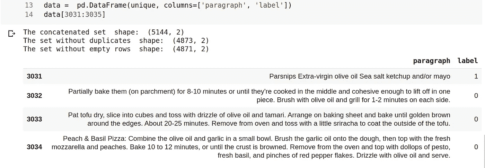
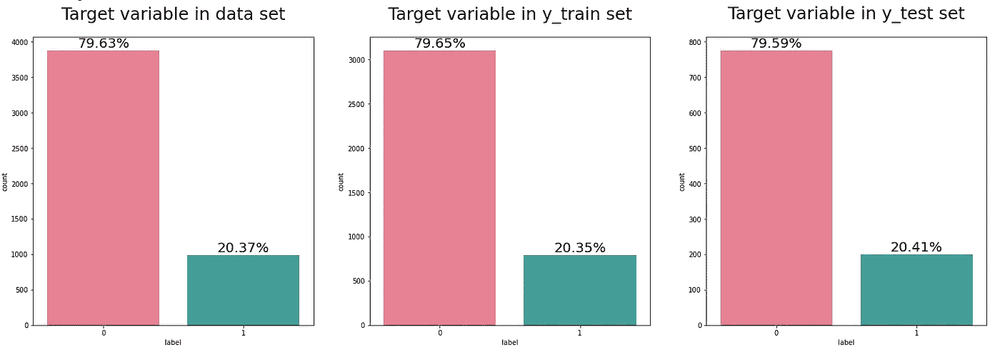
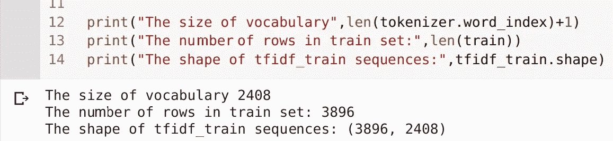

# 文本预处理和特征工程。Python。

> 原文：<https://medium.com/geekculture/nlp-text-pre-processing-and-feature-engineering-python-69338fa0372e?source=collection_archive---------0----------------------->

## 逐步指南

## 使用 Python: Numpy、Pandas、Regex、Spacy 和 Tensorflow 预处理文本数据、创建新要素(包括二进制分类的目标变量)。


Photo by [Pixabay](https://www.pexels.com/@pixabay?utm_content=attributionCopyText&utm_medium=referral&utm_source=pexels) from [Pexels](https://www.pexels.com/photo/text-on-shelf-256417/?utm_content=attributionCopyText&utm_medium=referral&utm_source=pexels)

# 介绍。

[数据预处理](https://en.wikipedia.org/wiki/Data_pre-processing)是数据科学家工作的基础部分。除了[数据采集](https://en.wikipedia.org/wiki/Data_collection)之外，这也是主要阶段之一。这取决于我们未来模型的质量和准确性。我们清理/准备数据越好:

*   我们越不需要在下一阶段调整模型，
*   我们可以应用的模型越简单，
*   我们看到的洞察力/模式越多，
*   我们的模型就越精确。

***那么在我们目前的情况下什么是预处理呢？***

简而言之:它是文本转换的过程。你必须让文本对你的商业目标的分析和预测有用。

本文将涵盖(在代码示例中)几种重要的文本数据处理方法。此外，您将看到使用特征工程技术为二元分类任务进行的数据准备。这些章节将讲述:

-数据描述、业务目标探索；

-数据操作(我们将从刚刚收集的非结构化数据中创建一个基础数据集)；

-使用自然语言处理方法的特征工程(基本上基于使用*空间*库的*词性标注*，基于语法+语义上下文，基于数据分析/洞察力/直觉)；

*-【文本转序列】*用 *Tensorflow* 转换——创建预测模型前的最后一步。

# ***数据描述。***

本教程的数据集来自我之前的数据收集任务:我从一个食谱网站上收集的。**业务目标**是确定每个段落的标签是*“配料”*还是*“配方”。*

首先，我们应该导入 *Pandas* 库并将显示选项设置为 *`max_colwithd`* 以获得更好的文本可读性:

```
import pandas as pd
pd.set_option('display.max_colwidth', None)
```

当您打开一个带有未清理文本数据的[文件](https://github.com/Galina-Blokh/ai_assignment_aidock/blob/refator/data/new_recipe.pkl)(使用*熊猫*)时，您会看到一个带有两列的集合:*“配方”*和*“说明”。*来自*数据框*中 *1009* 行的每一行都是来自 *1009* 带配方的唯一页面的数据。每个单元格中的每一项都是段落列表:



Pic.1 Read text data from pickle file in Pandas DataFrame

每个单元格中的说明列中的*“段落”*我们用*“\ n \ n”来定义。*配方栏中的*【段落】*保存每个单元格本身。

# 数据操作。创建一个基础数据集。

起初，似乎没有多少数据。但是让我们制作一个表格，在每个单元格中有一个实际的段落。 *Lambda 函数*和*列表理解*适用于配方列转换。对于说明列将足够嵌入 *Series.str()* 函数:

```
*#ingredients* recipe_col = df["Recipe"].apply( \
    lambda series: ' '.join([words for words in series])).to_numpy()*#instructions* instr_col = df["INSTRUCTIONS"].str.split('\n\n').to_numpy()
```

在下一步中，我们添加一个带有标签的列:1 —成分，0 —说明。注意:通过这种方式，**我们创建了目标变量**。从现在开始，我们将使用 *NumPy* 进行数据操作。 *Numpy* 的速度明显高于 *pandas* (和往常一样，它在大数据集下更明显):

```
import numpy as np*#ingredients* recipe=recipe_col.reshape(-1, 1)
recipe=np.hstack((recipe, np.ones(len(recipe), int).reshape(-1, 1)))*#instructions* instr=np.concatenate(instr_col).reshape(-1, 1)
instr=np.hstack((instr, np.zeros(len(instr), int).reshape(-1, 1)))
```

下一步是将这两个*n 数组*连接成一个:

```
*# forming a full data array with labels* data = np.concatenate((instr, recipe), axis=0)
```

> 从我自己的经验中得到的启示:有时，将你的数据标记并输入到神经网络中比应用无监督技术(Keras/Tensorflow)更方便。

在我们创建了一个属性数据集后，我们可以减少空的和重复的行。然后，再次回到 p *和 as 数据帧*格式进行进一步的特征工程:

```
*# remove duplicates* unique = np.unique(data.astype(str), axis=0)

*# #remove empty string rows* unique=np.delete(unique.astype(str),np.where(unique == **''**),axis=0)
data = pd.DataFrame(unique, columns=[**'paragraph'**, **'label'**])
```

如下图(图 2)可以看到，现在一个新集合的形状是 5144 行！同样，它有两列:字符串*“段落”*和整数*“标签”*。删除重复项和空行后，形状变小了。目前，我们得到了 4871 行用于分类——比上传的 pickle 文件多了四倍。太好了，我们终于有数据可用了！



Pic.2 Sample from created data set

每个单元格都包含一个字符串段落表示。现在我们终于可以开始特征工程部分了。

# 自然语言处理方法的特征工程。

对于接下来的文本版本，我们需要将 ***拆分*** ***集合*** 进行训练和测试(以防止过度拟合)。在我们的例子中，我们使用了一个 *Sklearn* 库。在分割之后，对于训练和测试数据，所有的操作将是相同的。

如果你检查标签的比例，你会看到不平衡:大约 80%的 0 和 20%的 1。测试集的分裂分数也取 0.2(我们不能取更多，因为我们没有太多的数据)。

```
*#splin on train and test data sets*
from sklearn.model_selection import train_test_splitX = data['paragraph'].copy()
y = data['label'].astype(int).copy()X_train, X_test, y_train, y_test = train_test_split(X,y,
                                                    stratify=y,
                                                    test_size=0.2,
                                                    random_state=42)
```

最好在目标变量上做一个*分层分割。
考虑到数据量小，标签不均衡，
我们希望保持两个集合中的分布比例相同。一个简单的检查(见图 3)表明分割进行得很顺利，正如预期的那样。*

**

*Pic.3 Target distribution plot in three data sets (data set, train set and test set).*

*让我们涉及一些 ***语言学见解*** 和 ***分析*** 我们的数据。当你看[图 1](https://cdn-images-1.medium.com/max/1200/1*753EdeeWiQFl3kH5CZbDcQ.png) 时，你可能会注意到:*

*   *带*【配料】*的段落包含很多数字；*
*   **【配料】*可以绝对不含*动词*，与*【说明】*相反；*
*   *一般来说，*【成分】*只保存数字，*名词**形容词*。*
*   **【配料】*段落不是完整的句子(可能不含*圆点*)；*

*因此，我们这里使用的第一种方法是 ***词性标注*** *。* **用**专用**标签**代替数字、和**冒号** **。**将**其他**标点** **换一个空格**。为此，合理使用 *regex* 和 *lambda 函数*。在此之前，为了更方便使用，将设置确定为熊猫*数据帧*:***

```
*import reDIGIT_RX = "($\d+([\.|,]\d+)?[\w]?[\s|-]){1,8}|[^A-Za-z\,()\.'\-:\!\? ]{1,8}"
SYMBOL_RX = "[/(/)\-/*/,\!\?]|[^ -~]"
DOT_RX = "\.{1,4}|\:"train = pd.DataFrame(X_train, columns=['paragraph'])train ['replaced_num']= train ['paragraph'].apply(lambda 
series: re.sub(DIGIT_RX, " zNUM ", series))train ['replaced_symb'] = train ['replaced_num'].apply(lambda series: re.sub(SYMBOL_RX, " ", series))train ['replaced_dot'] = train ['replaced_symb'].apply(lambda series: re.sub(DOT_RX, " zDOT ", series))*
```

*结果如下图(图 4)。我们需要跟踪这四列的变化。你可以只留下*"段落"*作为原文，以及*"替换点"*(因为我们需要它来应用下一个 *NLP* 方法):*

**

*Pic.4 Text transformation example*

*在图 4 中，几个数字用绿色下划线标出，以显示我们将标签 *zNUM* 更改为什么。红色—删除了额外的标点符号。蓝色——标记 *zDOT* 而不是 dots。此刻大写或小写标签并不重要。以后，所有文本都将是小写的。在这一点上，我们只想看看我们做了什么，并确保转型进展顺利。最后可以进入*词条化*步骤。*

****词汇化、特征工程和停用词删除同***[***SpaCy***](https://spacy.io/)***。这个出色的库对于任何 NLP 任务都是有用的。 *SpaCy Lemmatizer* 支持简单的词性敏感后缀规则和查找表。在对一个*字符串*的应用中，它原样返回可用的*词条*或字符串。****

*现在看看这个库是如何处理我们的文本的:我们希望**计算代词、动词并删除停用词。**第一步—安装/导入空间，加载英语词汇，定义 tokenaizer(我们这里称之为“nlp”)，准备停用词集:*

```
*# !pip install spacy
# !python -m spacy download en_core_web_smimport spacy
nlp = spacy.load('en_core_web_sm')from spacy.lang.en.stop_words import STOP_WORDS
stop_words = set([w.lower() for w in list(STOP_WORDS)])
nlp.Defaults.stop_words |= {" f ", " s ", " etc"}*
```

*现在和我们之前在创建基础集合时做的一样:*熊猫* *+* l *ambda 函数*，但是这次应用一个*空间* *词汇化*:*

```
*train['lemmatiz'] = train.replaced_dot.apply(lambda series: \        ' '.join([word.lemma_ for word in nlp(series)]))*
```

*需要一些时间才能得到结果。*词汇化*并不是一个快速的过程。顺便说一下，我们将单词转换成它们的基本形式，同时我们还得到另一个标签 *-PRON-* 。我们立即开始新的 ***特征创建*** :*

*   *使用标签 *-PRON-* 用于二进制列**包含 _pron** (段落是否包含此标签:1 —是，0 —否)；*
*   ***每段动词 _ 计数**。*

```
*train['contains_pron'] = train.lemmatiz.apply(lambda series: \
1 if series.__contains__('-PRON-') else 0 )train['verb_count'] = train.lemmatiz.apply(lambda series: \
len([token for token in nlp(series) if token.pos_ == 'VERB'])]))*
```

*下一步:**删除** **多余的空格**/仍然可能出现的标点符号，**删除** **停止** **单词:***

```
**#remove punctuation via String.tranlate(table)* def remove_punct(series):
   table = str.maketrans('', '', string.punctuation)
   tokens_punct = series.translate(table).lower()
   tokens_spaces = ' '.join(
   [token.strip() for token in tokens_punct.split() if token != ' ']
   )
   return tokens_spacestrain['tokens_punct'] = train.lemmatiz.apply(remove_punct) *#delete stopwords* train['remove_stop_words'] = train.tokens_punct.apply(lambda series: ' '.join([word for word in series.split() 
                                if word not in stop_words]))*
```

*基本的*语言统计*对于这个集合上的特征工程也是有价值的。我们可能会创建其他代表性特征，例如:*

*   ***count_sent** (每个清洗过的段落有多少句)；*
*   ***num_count** (每清理一段出现多少个数字)；*
*   ***count_words** (每清理一段包含多少字)。*

```
*train['count_sent'] = train.remove_stop_words.apply(lambda series: 
1 if series.count('zdot') == 0 else series.count('zdot'))train['num_count'] = train.remove_stop_words.apply(lambda series: series.count('znum'))train['count_words'] = train.remove_stop_words.apply(lambda series: len(nlp(series)))*
```

*现在，我认为，我们已经为基本模型运行创建了足够多的额外功能。看下图(图 5)。它显示五个数字列(用红色方块标记)和两个文本列:*

**

*Pic. 5 The train set: sourse text, preprocessed paragraphs and new features.*

*我们留下的“段落”列是整个研究任务结束时模型解释的源文本(不会出现在本文中)。我们暂时将数字特征放在一边，因为它们已经准备好作为模型输入。现在，我们将把焦点放在准备好的文本列上。*

# *用 Tensorflow 实现“文本到序列”的转换。*

**remove_stop_words* 我们将使用 *Tokenizer* 和[***text _ to _ sequence***](https://www.tensorflow.org/api_docs/python/tf/keras/preprocessing/text/Tokenizer#texts_to_sequences)方法用 ***Tensorflow*** 进行转换。*

**Tensorflow* 中的 Tokenizer 允许对文本语料库进行矢量化，通过将每个文本转换为整数序列(每个整数是字典中某个标记的索引)或向量，其中每个标记的系数可以是二进制的，基于单词计数，基于 tf-idf 等。在我们的例子中，我们应用了以 [*为基数的 TF* - *IDF*](https://en.wikipedia.org/wiki/Tf%E2%80%93idf) 系数(术语频率的缩写-逆文档频率，是一种数字统计，旨在反映一个词对集合或语料库中的文档有多重要)。*

*当我们将一个*记号赋予器*点定义为*【OOV】*词汇时，这种方式会使我们的数据免受损失:*

```
*from tensorflow.keras.preprocessing.text import Tokenizer tokenizer = Tokenizer(oov_token="<OOV>")
tokens = tokenizer.fit_on_texts(train['remove_stop_words']) *# Turn text into sequences (word --> num )* text_sequences = tokenizer.texts_to_sequences(train['remove_stop_words'])*# Turn text sequences into tf-idf sequences* tfidf_train = 
tokenizer.sequences_to_matrix(text_sequences , mode='tfidf')*
```

**Tensorflow Tokenizer* 类有一个内嵌函数 *sequence_to_matrix()* 带参数 *mode* —只需选择 *mode="tfidf"* 并用它包装您的文本序列。现在，您已经为每个文本段落中的每个单词赋予了权重/重要性(当您的集合很小时， *mode="tfidf"* 可能会充分改善您未来的结果)。完美！让我们检查 tfidf 矩阵的形状；它的大小应为(集合中的行数，词汇大小):*

**

*好了，这就是我们需要对文本做的所有事情，让它准备好作为模型的输入。不要忘记为测试集重复所有的转换和特性工程步骤！！！最后，您应该得到六个数组:三个用于训练，三个用于测试(带有 *tfidf* 、非文本特征和标签的序列)。*

*最后，我们可以说:“我们已经完成了文本预处理和特征工程”。下一步应该是—创建一个分类模型。这可能是下一篇文章的一个大主题。*

*在本教程中，您学习了如何使用 *Pandas* 和 *Numpy* 操作文本数据。熟悉作为模型输入的文本准备流程。看到了如何使用文本的 *Spacy* 和 *Tensorflow* 库的真实数据示例。现在你明白什么是*文本预处理*了吧。*

**[*Google collab*](https://colab.research.google.com/drive/1YOZ60sdOjSbIiB3IiJVUYprQhJDEVxXB?usp=sharing)*[*Github*](https://github.com/Galina-Blokh/ai_assignment_aidock/blob/refator/preprocess.py)*。****