# NLP 教程:使用 BERT 的电影推荐系统

> 原文：<https://medium.com/geekculture/nlp-tutorial-movie-recommendation-system-using-bert-d281dc609add?source=collection_archive---------68----------------------->

推荐系统是为特定项目生成推荐而构建的。在亚马逊这样的电子商务网站上，我们得到产品推荐，在 youtube 上，我们得到视频推荐。如今，推荐系统正被用于更多内容丰富的网站，如新闻、电影、博客等。

这里是我们自己使用 [BERT](https://github.com/google-research/bert) 创建一个基于[自然语言处理(NLP)](https://en.wikipedia.org/wiki/Natural_language_processing) 的电影推荐系统的尝试。你也可以参考或复制[我们的 colab 文件](https://colab.research.google.com/drive/1W4IM5H-di7jNHSDBKCyxjilzyLXAAVGM?usp=sharing)来遵循这些步骤。

该推荐系统基于各种电影特征而不仅仅是描述来推荐电影。我们考虑了

作为我们的特征。它根据电影的特征来识别它们之间的相似性。

我们使用了 kaggle 上的电影数据集。

该数据集在完整的 MovieLens 数据集中列出了 45，000 部电影。该数据集包括 2017 年 7 月或之前上映的电影。它有演员，工作人员，情节关键词，预算，收入，海报，发布日期，语言，制作公司，国家，TMDB 票数和平均票数。

# 下载数据集、执行过滤和其他处理的步骤。

安装凸轮，并进行如下检查

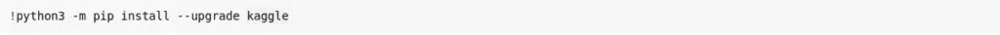

上传 kaggle.json 文件，您可以从您的 kaggle 帐户获取该文件

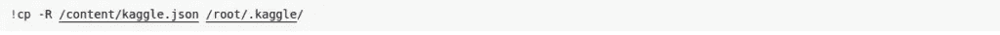

更改文件的权限并导出用户名和密钥

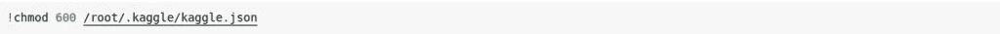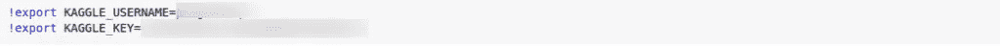

下载并解压缩数据集

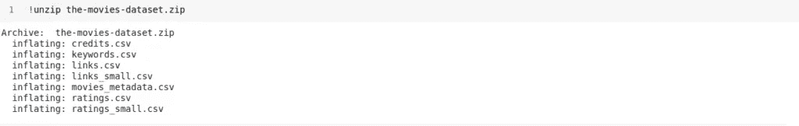

我们将使用 movies_metadata.csv、keywords.csv 和 credits.csv 文件

我们将首先从 movies_metadata.csv 文件中提取和过滤数据，用于导入库和读取 csv。

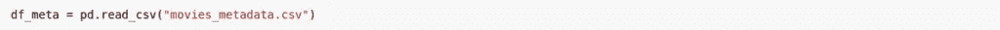

下面是 movie_metadata.csv 的列，我们将从这些列中考虑“id”、“流派”、“原创语言”、“制作国家”、“标语”、“原创标题”、“成人”、“发行日期”、“状态”

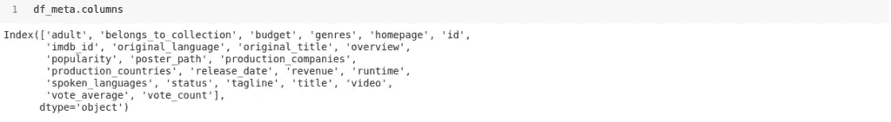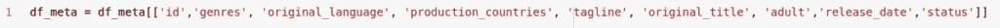

以下是状态的唯一值。过滤“状态”列，我们将只考虑那些状态为“已发布”的电影。

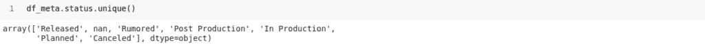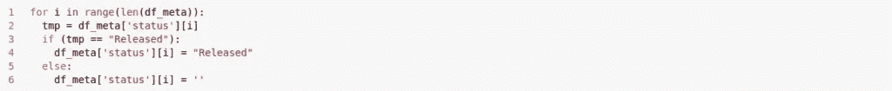

让我们过滤电影“类型”。下面是“流派”的格式。我们将从数据中过滤并获取电影类型名称。

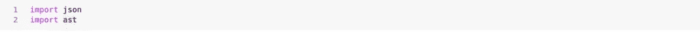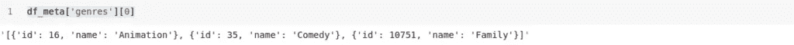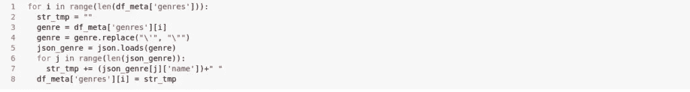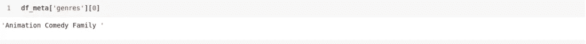

在流派之后，现在过滤‘生产 _ 国家’，下面是‘生产 _ 国家’的格式。我们将过滤并获取生产国名称。

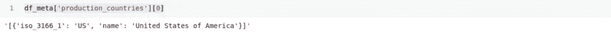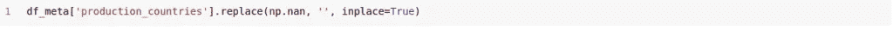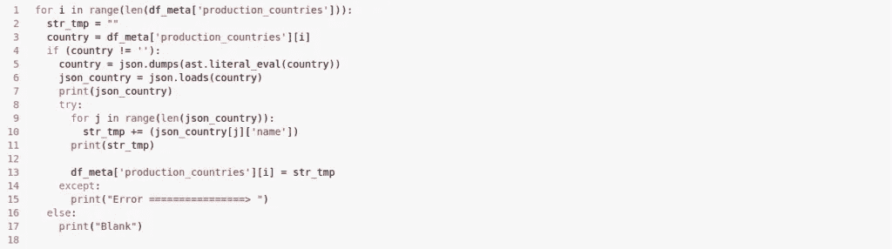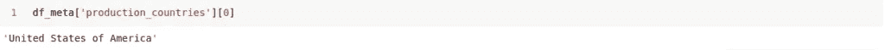

现在我们将读取 keywords.csv 并从中筛选关键字。

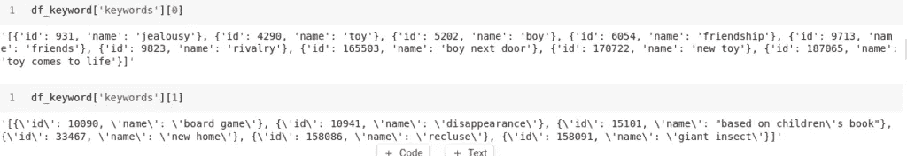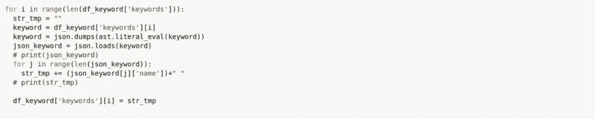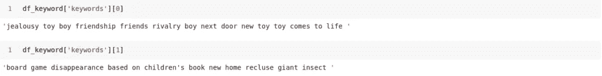

接下来，我们将读取“credits.csv ”,并过滤电影演员数据。

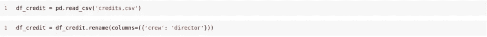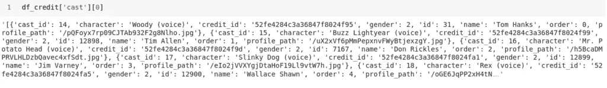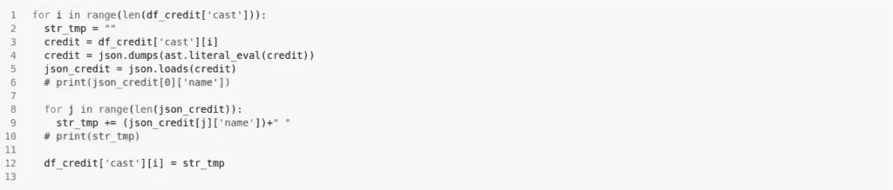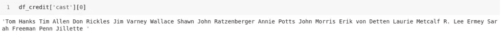

让我们也筛选一下控制器数据。

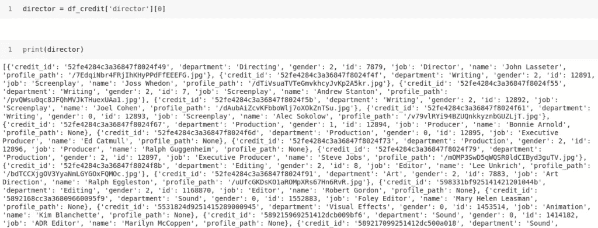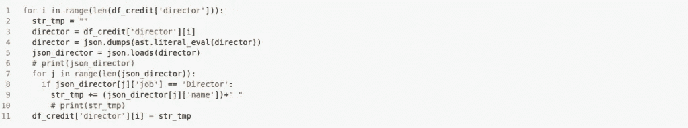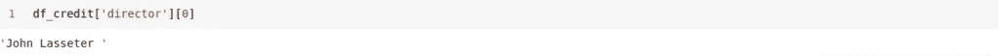

现在我们将合并所有三个表。

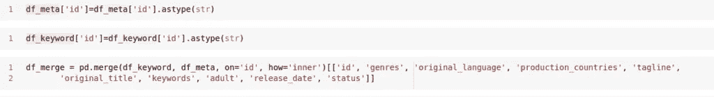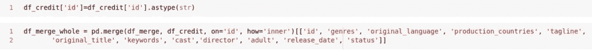

合并数据后。将空白替换为 NAN，并删除这些字段。

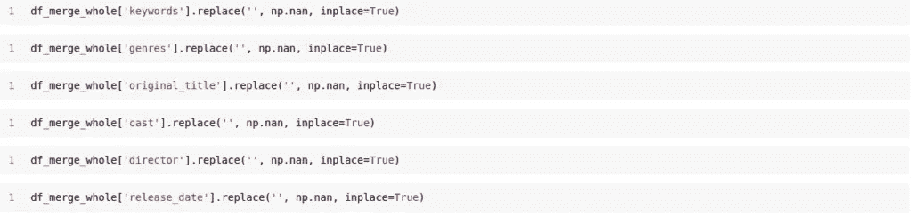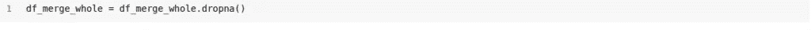

将过滤后的数据保存到 CSV 并读取新的 CSV

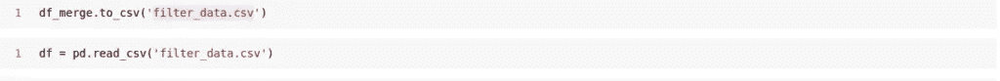

现在，我们将合并稍后要执行嵌入的列。

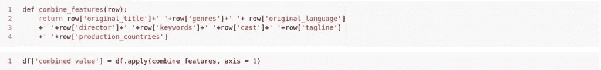

让我们也为电影创建一个索引列。

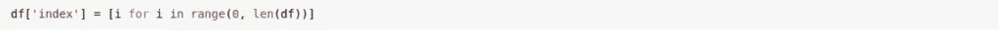

创建如下所示的两个函数

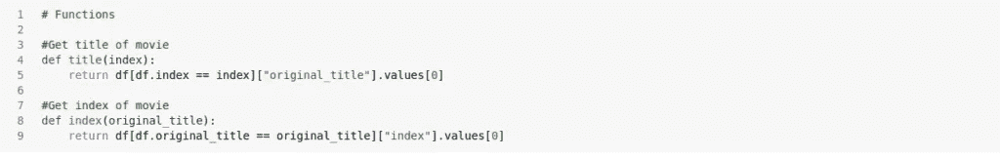

一旦我们得到组合的数据，我们将使用句子转换器进行 BERT 嵌入。安装库并下载预训练模型，我们使用了“bert-base-nli-mean-tokens”预训练模型。你可以提供任何预先训练好的模型，这里是[列表](https://www.sbert.net/docs/pretrained_models.html)

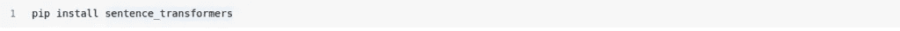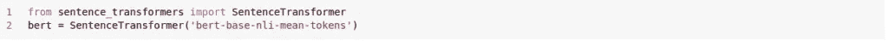

执行“组合值”的嵌入

计算编码后，我们将得到我们的向量，现在我们需要找到这些向量之间的相似之处。为此，我们将使用余弦相似性，它提供两个向量之间的相似性得分，其中 0 表示没有相似性，1 表示完全相似。

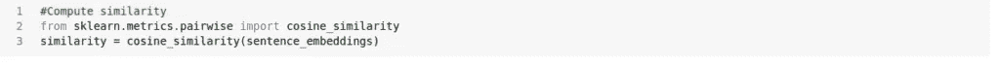

现在，当用户输入电影名称时，系统将输入的电影分数与其他分数进行比较，并向用户推荐该电影。

下面是电影推荐的片段。
输入:玩具总动员
推荐:玩具
乐高电影
大英雄 6

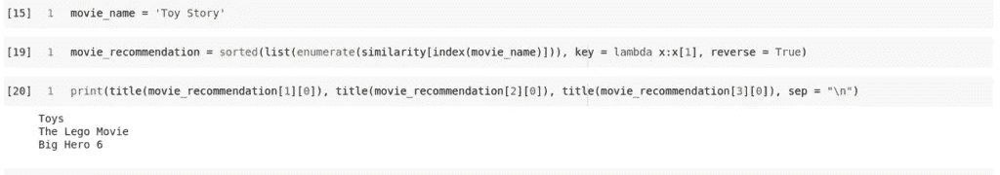

请分享您对我们推荐系统的反馈。

如果您正在为自己的使用案例寻找推荐系统，请联系我们。我们提供可靠的基于自然语言处理的解决方案和聊天机器人开发服务。

*原载于 2021 年 5 月 25 日* [*NLP 教程:使用 BERT*](https://www.pragnakalp.com/nlp-tutorial-movie-recommendation-system-using-bert/) *的电影推荐系统。*