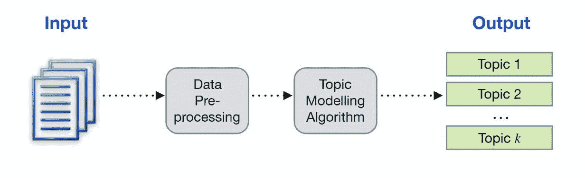
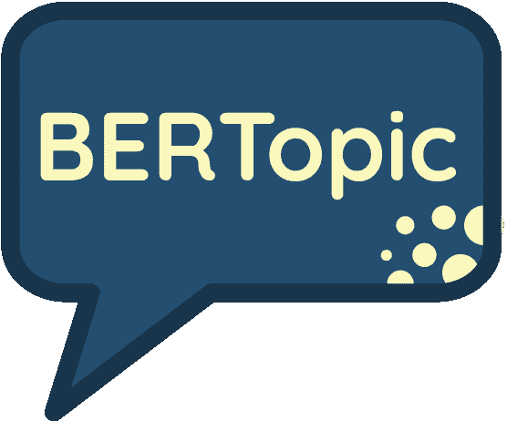
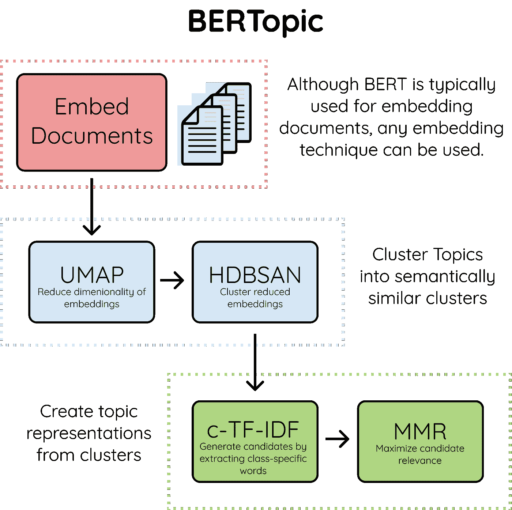
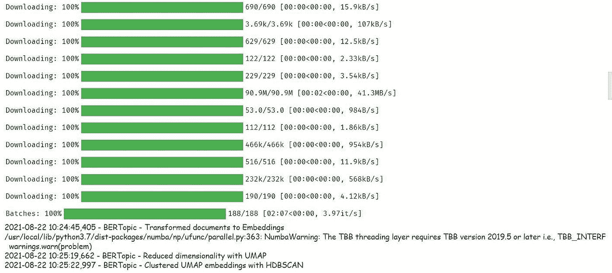
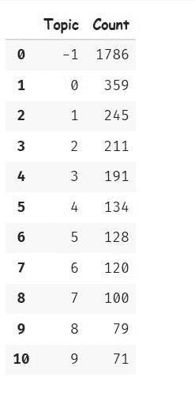
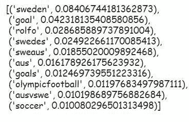
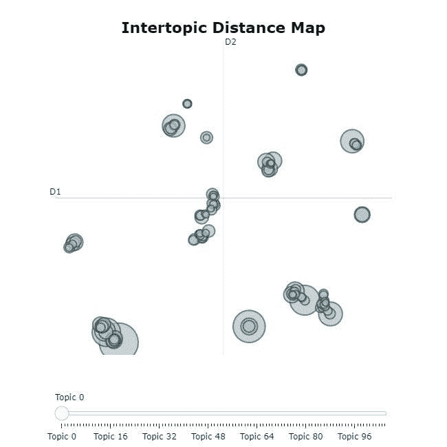
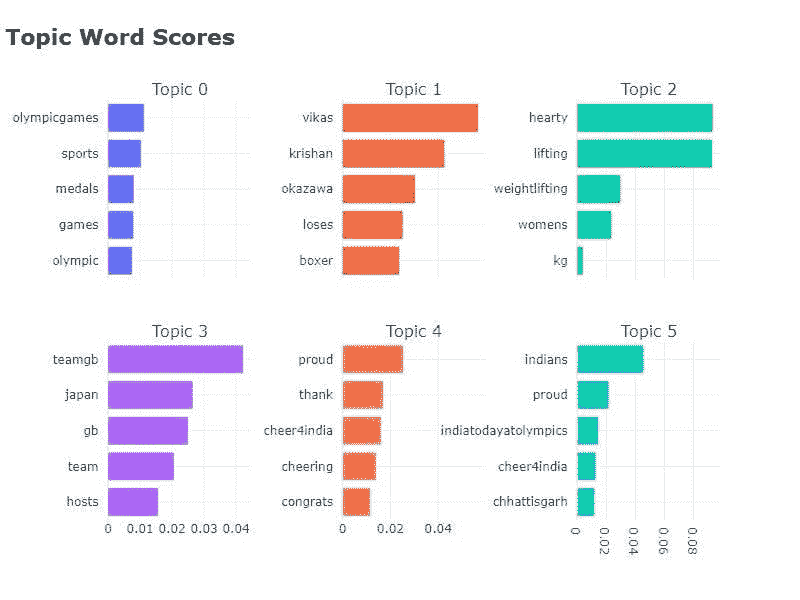
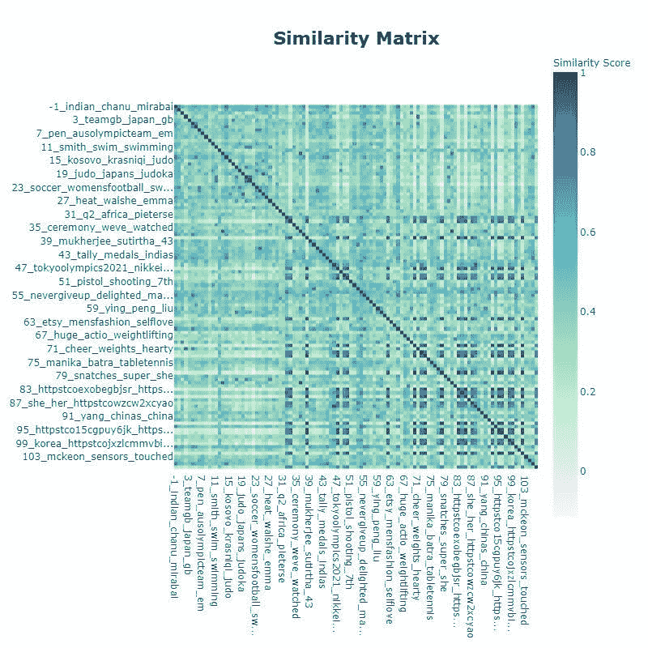

# NLP 教程:使用 BerTopic 在 Python 中进行主题建模

> 原文：<https://medium.com/geekculture/nlp-tutorial-topic-modeling-in-python-with-bertopic-da760e1d03aa?source=collection_archive---------0----------------------->


**主题建模**是一种无监督的机器学习技术，可以自动识别文档(文本数据)中存在的不同主题。数据已经成为运营全球许多企业的关键资产/工具。使用主题建模，您可以收集非结构化数据集，分析文档，并获得相关的和所需的信息，这些信息可以帮助您做出更好的决策。



有不同的技术来执行主题建模(例如 LDA ),但是，在这篇 NLP 教程中，你将学习如何使用由[马腾·格罗腾·奥斯特](https://github.com/MaartenGr?ref=hackernoon.com)开发的 BerTopic 技术。

# 目录:

1.  什么是 BerTopic
2.  如何安装 BerTopic
3.  加载东京奥运会推文数据
4.  创建 BerTopic 模型
5.  选择热门话题
6.  选择一个主题
7.  主题建模可视化
8.  话题缩减
9.  作出预测
10.  保存并加载模型

# 什么是 BerTopic？



BerTopic 是一种主题建模技术，它使用转换器(BERT 嵌入)和基于类的 TF-IDF 来创建密集的集群。它还允许您轻松地解释和可视化所生成的主题。

BerTopic 算法包含 3 个阶段:

**1。嵌入文本数据(文档)** 在该步骤中，该算法用 BERT 提取文档嵌入，或者它可以使用任何其他嵌入技术。

默认情况下，它使用以下语句 transformers

*   **“释义-MiniLM-L6-v2”**-这是一个基于英语 BERT 的模型，专门为语义相似性任务训练。
*   **“paraphrase-multilingual-MiniLM-L12-v2**”——这与第一个类似，一个主要区别是 xlm 模型适用于 50 多种语言。

**2。聚类文档** 它使用 UMAP 来减少嵌入的维数，并使用 HDBSCAN 技术来聚类减少的嵌入并创建语义相似文档的聚类。

**3。创建一个主题表示** 最后一步是用[基于类别的 TF-IDF](https://towardsdatascience.com/creating-a-class-based-tf-idf-with-scikit-learn-caea7b15b858?ref=hackernoon.com) 提取并约简主题，然后用最大边际相关性提高单词的连贯性。



# 如何安装 BerTopic

您可以通过 pip 安装该软件包:

```
pip install bertopic
```

如果您对可视化选项感兴趣，您需要按如下方式安装它们。

```
pip install bertopic[visualization]
```

BerTopic 支持不同的转换器和语言后端，您可以使用它们来创建模型。您可以根据下面的选项安装一个。

*   pip 安装 bertopic[flair]
*   pip 安装 bertopic[gensim]
*   pip 安装 bertopic[空间]
*   pip 安装 bertopic[使用]

# 图书馆

我们将使用下面的库来帮助我们从 BerTopic 加载数据和创建模型。

```
#import packagesimport pandas as pd 
import numpy as np
from bertopic import BERTopic
```

# 第一步。加载数据

在这篇 NLP 教程中，我们将使用【2020 年东京奥运会推文，目标是创建一个可以根据主题自动对推文进行分类的模型。

你可以在这里下载数据集。

```
#load data 
import pandas as pd 

df = pd.read_csv("/content/drive/MyDrive/Colab Notebooks/data/tokyo_2020_tweets.csv", engine='python')

# select only 6000 tweets 
df = df[0:6000]
```

**注意:**出于计算原因，我们只选择了 6000 条推文。

# 第二步。创建模型

要使用 BERTopic 创建一个模型，需要将 tweets 作为一个列表加载，然后将其传递给 fit_transform 方法。该方法将执行以下操作:

*   将模型拟合到推文集合上。
*   生成话题。
*   返回带有主题的推文。

```
# create model 

model = BERTopic(verbose=True)

#convert to list 
docs = df.text.to_list()

topics, probabilities = model.fit_transform(docs)
```



# 第三步。选择热门话题

定型模型后，您可以按降序访问主题的大小。

```
model.get_topic_freq().head(11)
```



**注意:** Topic -1 是最大的，它指的是不分配给任何生成的主题的离群 tweets。在这种情况下，我们将忽略主题 1。

# 第四步。选择一个主题

您可以选择一个特定的主题，并获得该主题的前 n 个单词及其 c-TF-IDF 分数。

```
model.get_topic(6)
```



对于这个选定的主题，常见的词是瑞典，目标，罗尔福，瑞典人，目标，足球。很明显，这个话题的焦点是“瑞典队的**足球**”。

# 步骤 5:主题建模可视化

BerTopic 允许您以非常类似于 LDAvis 的方式可视化生成的主题。这将让你对主题的质量有更多的了解。在本文中，我们将研究三种可视化主题的方法。

# 可视化主题

visualize_topics 方法可以帮助您可视化主题及其大小和相应的单词。可视化的灵感来自 LDavis。

```
model.visualize_topics()
```



# 可视化术语

visualize_barchart 方法将通过创建 c-TF-IDF 得分的条形图来显示一些主题的选定术语。然后，您可以相互比较主题表示，并从生成的主题中获得更多见解。

```
model.visualize_barchart()
```



在上图中，你可以看到话题 4 中的热门词汇是自豪、感谢、加油、欢呼和祝贺。

# 可视化主题相似性

您还可以想象某些主题彼此之间有多相似。要可视化热图，只需调用。

```
model.visualize_heatmap()
```



在上图中，您可以看到主题 **93** 与主题 **102** 相似，相似度得分为 **0.933。**

# 话题缩减

有时你可能会产生太多或太少的主题，BerTopic 为你提供了一个以不同方式控制这种行为的选项。

(a)您可以通过将参数“ **nr_topics** ”设置为您想要的主题数量。BerTopic 会找到相似的主题并将其合并。

```
model = BERTopic(nr_topics=20)
```

在上面的代码中，将生成的主题数量是 20。

(b)另一种选择是自动减少主题数量。要使用此选项，您需要在训练模型之前将“ **nr_topics** ”设置为“ **auto** ”。

```
model = BERTopic(nr_topics="auto")
```

最后一个选项是在训练模型之后减少主题的数量。如果重新训练模型需要很多时间，这是一个很好的选择。

```
new_topics, new_probs = model.reduce_topics(docs, topics, probabilities, nr_topics=15)
```

在上面的示例中，您在定型模型后将主题数量减少到 15 个。

# 第六步:做预测

为了预测新文档的主题，您需要在 transform 方法上添加一个新的实例。

```
topics, probs = model.transform(new_docs)
```

# 步骤 7:保存模型

您可以使用 save 方法来储存已定型的模型。

```
model.save("my_topics_model")
```

# 步骤 8:加载模型

您可以使用 load 方法加载模型。

```
BerTopic_model = BERTopic.load("my_topics_model")
```

# 关于用 BerTopic 在 Python 中进行主题建模的最后思考

在本 NLP 教程中，您已经学习了

*   如何创建 BerTopic 模型？
*   选择生成的主题。
*   可视化主题和每个主题的单词，以获得更多的见解。
*   减少生成主题数量的不同技术。
*   如何进行预测？
*   如何保存和加载 BerTopic 模型？

BerTopic 在创建模型时提供了许多特性。例如，如果您有一个特定语言的数据集(默认情况下，它支持英语模型)，您可以通过在配置模型时设置语言参数来选择语言。

```
model = BERTopic(language="German")
```

**注意:**选择其嵌入模型存在的语言。

如果文档中混合了多种语言，可以设置

```
language="multilingual"
```

支持超过 50 种语言。

如果你学到了新的东西或者喜欢阅读这篇文章，请分享给其他人看。在那之前，下期帖子再见！

也可以在 Twitter [@Davis_McDavid](https://twitter.com/Davis_McDavid?ref=hackernoon.com) 上找我。

*最后一件事:在以下链接中阅读更多类似的文章。*

[](https://medium.datadriveninvestor.com/nlp-datasets-from-huggingface-how-to-access-and-train-them-8852c2aca74) [## 来自 HuggingFace 的 NLP 数据集:如何访问和训练它们

### 拥抱脸的数据集库提供了一个非常有效的方法来加载和处理原始文件或…

medium.datadriveninvestor.com](https://medium.datadriveninvestor.com/nlp-datasets-from-huggingface-how-to-access-and-train-them-8852c2aca74) [](/geekculture/how-to-perform-data-augmentation-with-augly-library-e32279916b14) [## 如何使用 Augly 库进行数据扩充

### 来自脸书的一个新的开源 python 库

medium.com](/geekculture/how-to-perform-data-augmentation-with-augly-library-e32279916b14) [](https://medium.datadriveninvestor.com/23-common-data-science-interview-questions-for-beginners-59c2265a947e) [## 初学者常见的 23 个数据科学面试问题

### 回答常见面试问题的指南和资源。

medium.datadriveninvestor.com](https://medium.datadriveninvestor.com/23-common-data-science-interview-questions-for-beginners-59c2265a947e) 

*本文首发* [*此处*](https://hackernoon.com/nlp-tutorial-topic-modeling-in-python-with-bertopic-372w35l9) *。*