# 使用 TensorFlow/Keras 的 NLP:说明和教程

> 原文：<https://medium.com/geekculture/nlp-with-tensorflow-keras-explanation-and-tutorial-cae3554b1290?source=collection_archive---------0----------------------->


[https://www.blumeglobal.com/learning/natural-language-processing/](https://www.blumeglobal.com/learning/natural-language-processing/)

# 什么是 NLP？

自然语言处理(NLP)是机器学习和人工智能的一个分支，专注于从人类语言中获取意义并自动处理它。在我们的现代社会中，它有各种各样的使用案例，包括聊天机器人、来自客户评论的情感分析以及识别假新闻。在本文中，您将了解 NLP 背后最重要的概念，以及如何使用 TensorFlow 和 Keras 实现情感分析。

# 主要概念

## 标记化

标记化是将句子分割成各种“标记”的过程，这些标记很可能是单个单词。此外，这个过程还包括去掉某些不太重要的字符，比如标点符号。这对于理解上下文和发展模型的理解是极其重要的。这是每个 NLP 模型的重要组成部分。

## 停止单词删除

这是删除不相关的词，如“和”、“到”和“的”。这种常见的单词不会为 NLP 模型提供任何值，在将文本传递给模型之前会被过滤掉。虽然没有官方的停用词列表，但需要注意的是，该列表会根据模型的目的而变化。这对于在训练期间增加模型的准确性非常有用。

## 堵塞物

词干化是另一个过程，它有助于使模型更容易理解文本。它包括通过将单词缩减到词干来缩短文本。比如“waiting”和“waited”都简称为“wait”。

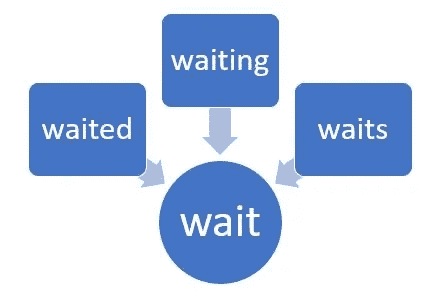

[https://www.c-sharpcorner.com/blogs/stemming-in-natural-language-processing](https://www.c-sharpcorner.com/blogs/stemming-in-natural-language-processing)

## 词汇化

词汇化是将一个单词转化为其基本形式并将同义词标准化为其词根的过程。比如“去了”变成“去了”，“欢喜了”变成“好了”。虽然它有点类似于词干，但它采用了不同的方法来简化文本。

# 主题建模

NLP 中的另一个重要主题是主题建模。它本质上是一种无监督的机器学习技术，用于将不同的文本分组到某些主题下。例如，它被用于 Gmail 等电子邮件系统中，在这些系统中，涉及某些主题的电子邮件被分组在一起。当使用主题建模时，我上面列出的所有技术也可以用来更好地训练您的模型。

# Tensorflow/Keras 教程

现在我们知道了 NLP 是什么，以及用来提高模型准确性的各种工具，我们将处理一个经典的 NLP 问题:**检测文本的情感**。对于数据集，我们将使用一组英语 Twitter 消息，这些消息被分为六种基本情绪:愤怒、恐惧、快乐、爱、悲伤和惊讶。您可以在这里查看数据集:【https://huggingface.co/datasets/emotion[。请注意，您不必下载它，因为我们将使用“nlp”模块来导入它。](https://huggingface.co/datasets/emotion)

## 进口

```
!pip install nlpimport tensorflow as tfimport numpy as npimport matplotlib.pyplot as pltimport nlpimport randomfrom tensorflow.keras.preprocessing.text import Tokenizerfrom tensorflow.keras.preprocessing.sequence import pad_sequences
```

## 导入和准备数据

```
dataset = nlp.load_dataset('emotion')train = dataset['train']val = dataset['validation']test = dataset['test']
```

这将导入数据集，并将其分为定型集、验证集和测试集。

```
def get_tweet(data):tweets = [x['text'] for x in data]labels = [x['label'] for x in data]return tweets, labelstweets, labels = get_tweet(train)
```

这将我们的训练数据分成两个数组:“tweets”和“labels”。

您可以运行此代码来更好地了解您的数据是什么样的:

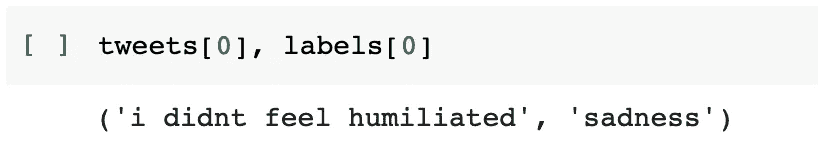

## 标记化

```
tokenizer = Tokenizer(num_words=10000, oov_token='<UNK>')tokenizer.fit_on_texts(tweets)
```

这段代码将初始化一个标记器，并将其校准到我们的训练数据上。这将根据单词在数据集中出现的频率给每个单词分配一个编号。

正如你在下面看到的，当我们在数据集的第一条 tweet 上运行“texts_to_sequences”时，我们将得到一个由四个数字组成的数组。每个数字对应于推文中的一个单词，并由该单词的常见程度决定。例如，你可以看到单词“I”与数字“2”相对应，因为它是一个非常常见的单词。

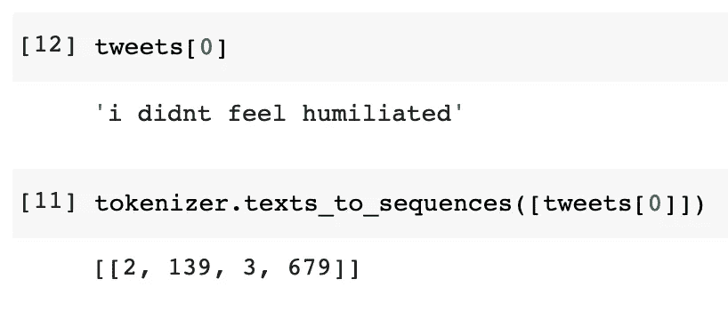

## 使所有序列形状相同

```
maxlen=50def get_sequences(tokenizer, tweets):sequences = tokenizer.texts_to_sequences(tweets)padded = pad_sequences(sequences, truncating = 'post', padding='post', maxlen=maxlen)return padded
```

上面的代码将简单地将数据集中的所有 tweetss 转换成相同的长度，并将每个 tweet 的长度设置为 50 个单词(这个数字可能会根据不同数据集中的文本长度而变化)。空格将被添加，多余的单词将在结尾被删除。这是一个必要的步骤，因为 ML 模型期望输入是固定的形状和长度。

当在我们的 tweet 上运行“get_sequences()”并从该集合中取出第一条 tweet 时，您可以看到我们有与上面相同的四个序列的集合，只是它的长度被扩展到了 50。

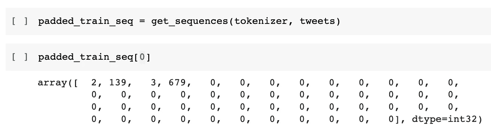

## 为模型准备数据

```
classes = set(labels)class_to_index = dict((c,i) for i, c in enumerate(classes))index_to_class = dict((v,k) for k, v in class_to_index.items())names_to_ids = lambda labels: np.array([class_to_index.get(x) for x in labels])train_labels = names_to_ids(labels)
```

这将创建一个包含所有标签的集合，以及一个字典，我们可以在将类转换为它们的索引以及将索引转换为类时使用它。这在将模型返回的值转换成我们更容易理解的内容时特别有用。此外，我们创建一个名为“names_to_ids”的 lambda 函数，并使用它将训练数据中的所有标签转换为它们各自的索引。

您可以在下面查看我们的每个变量，以便更好地理解它们的用途。请注意，您的单个变量的索引可能略有不同，这是完全正常的。

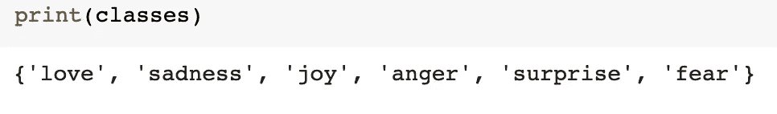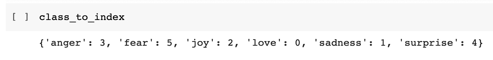

Corresponds classes to indexes

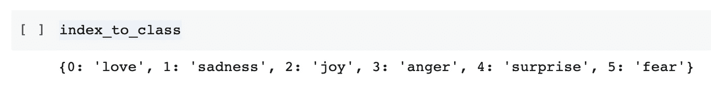

Values of index_to_class switch places from class_to_index

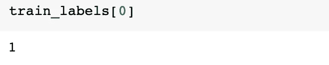

This shows that the first tweet has a class of index “1”, which corresponds to “sadness”

## 创建模型

```
model = tf.keras.models.Sequential([tf.keras.layers.Embedding(10000,16,input_length=maxlen),tf.keras.layers.Bidirectional(tf.keras.layers.LSTM(20, return_sequences=True)),tf.keras.layers.Bidirectional(tf.keras.layers.LSTM(20)),tf.keras.layers.Dense(6, activation='softmax')])model.compile( loss='sparse_categorical_crossentropy', optimizer='adam', metrics=['accuracy'])
```

这里，我们创建了一个非常简单的模型，包括一个嵌入层、两个双向 LSTM 层和一个用于输出的密集层。要了解更多关于嵌入层的信息，请访问此[链接](https://machinelearningmastery.com/use-word-embedding-layers-deep-learning-keras/)。双向层允许双向通信，并使用长期短期记忆层，这是一种能够学习长期依赖性的 RNN 体系结构。要了解更多信息，请访问此[链接](https://colah.github.io/posts/2015-08-Understanding-LSTMs/.)。

我们还编译了模型及其损失函数、优化器，并通过其准确性来衡量它。要了解更多关于 Adam 优化器的信息，请点击[这里](https://machinelearningmastery.com/adam-optimization-algorithm-for-deep-learning/)。要了解更多关于稀疏分类交叉熵的信息，点击[这里](https://datascience.stackexchange.com/questions/41921/sparse-categorical-crossentropy-vs-categorical-crossentropy-keras-accuracy)。

## 培训模式

```
val_tweets, val_labels = get_tweet(val)val_seq = get_sequences(tokenizer, val_tweets)val_labels= names_to_ids(val_labels)h = model.fit( padded_train_seq, train_labels, validation_data=(val_seq, val_labels), epochs=20, callbacks=[tf.keras.callbacks.EarlyStopping(monitor='val_accuracy', patience=2)])
```

终于可以开始训练模型了。请注意，当我们在验证集上的准确性没有上升超过 2 个时期时，请使用回调来停止训练。

它应该是这样的:

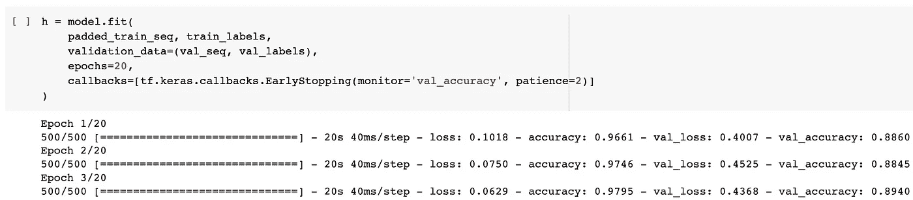

## 评估和测试模型

```
test_tweets, test_labels=get_tweet(test)test_seq = get_sequences(tokenizer, test_tweets)test_labels=names_to_ids(test_labels)model.evaluate(test_seq, test_labels)
```

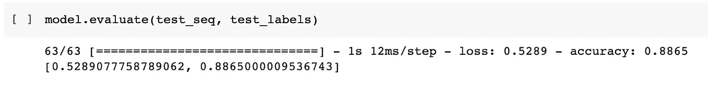

这将分离您的测试数据并获得它们的序列。它还允许模型根据测试数据评估其准确性。

```
i = random.randint(0,len(test_labels)-1)print('Sentence:', test_tweets[i])print('Emotion:', index_to_class[test_labels[i]])p = model.predict(np.expand_dims(test_seq[i], axis=0))[0]print(test_seq[i])pred_class=index_to_class[np.argmax(p).astype('uint8')]print('Predicted Emotion: ', pred_class)
```

这段代码只是生成一条随机的 tweet，并让模型预测它属于哪个类。它还预测推文及其标签，以便您可以比较预测和正确答案。

```
sentence = 'i am not sure what to do'sequence = tokenizer.texts_to_sequences([sentence])paddedSequence = pad_sequences(sequence, truncating = 'post', padding='post', maxlen=maxlen)p = model.predict(np.expand_dims(paddedSequence[0], axis=0))[0]pred_class=index_to_class[np.argmax(p).astype('uint8')]print('Sentence:', sentence)print('Predicted Emotion: ', pred_class)
```

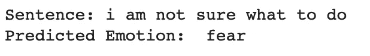

这段代码允许您输入自己的句子，并让模型预测其情绪。

## 保存模型

```
from google.colab import drivedrive.mount('/content/drive')model.save("/content/drive/My Drive/TweetEmotionRecognition/h5/tweet_model.h5")
```

这允许您以. h5 文件类型将模型保存到 Google Drive。请注意，我使用的是 Google Collab，所以如果您在本地运行代码，路径会改变。

## 装载模型

```
load_model = tf.keras.models.load_model("/content/drive/My Drive/TweetEmotionRecognition/h5/tweet_model.h5")print(load_model.summary())
```

如果您想从某个文件路径加载您的模型，您可以使用上面的代码来完成。从那时起，您可以使用您的模型运行您想要的所有函数，除了将单词“model”替换为“load_model”(例如，“load_model.predict()”)。

# 结论

话虽如此，我希望你喜欢我的文章，并了解自然语言处理！请随意查看我的其他文章，更多文章即将发布！

如果你想看完整的代码，你可以在我的 Github 库[这里](https://github.com/AlexanderChow9333/TweetEmotionRecognition)查看。

如果你有任何问题或想联系，随时给我发电子邮件:alexander.chow911@gmail.com

了解更多关于我的信息: [LinkedIn](https://www.linkedin.com/in/alexander-chow-6539771b3/)