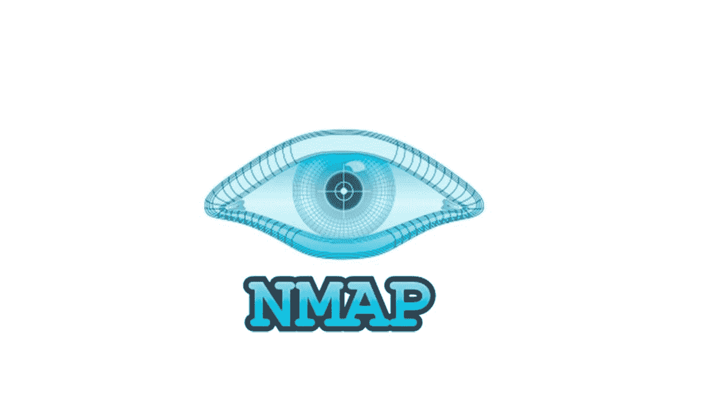

# 面向初学者的 Nmap(网络映射器)

> 原文：<https://medium.com/geekculture/nmap-network-mapper-for-beginners-6c01680d54ac?source=collection_archive---------12----------------------->

无论您是想扫描网络漏洞，还是只想查看您打开了哪些端口，nmap 都非常有用。

# 什么是 nmap？

Nmap(网络映射器)是 Gordon Lyon 创建的网络扫描仪。Nmap 发送数据包并检查答案，以找到计算机网络上的主机和服务。对于探测计算机网络，Nmap 提供了各种…