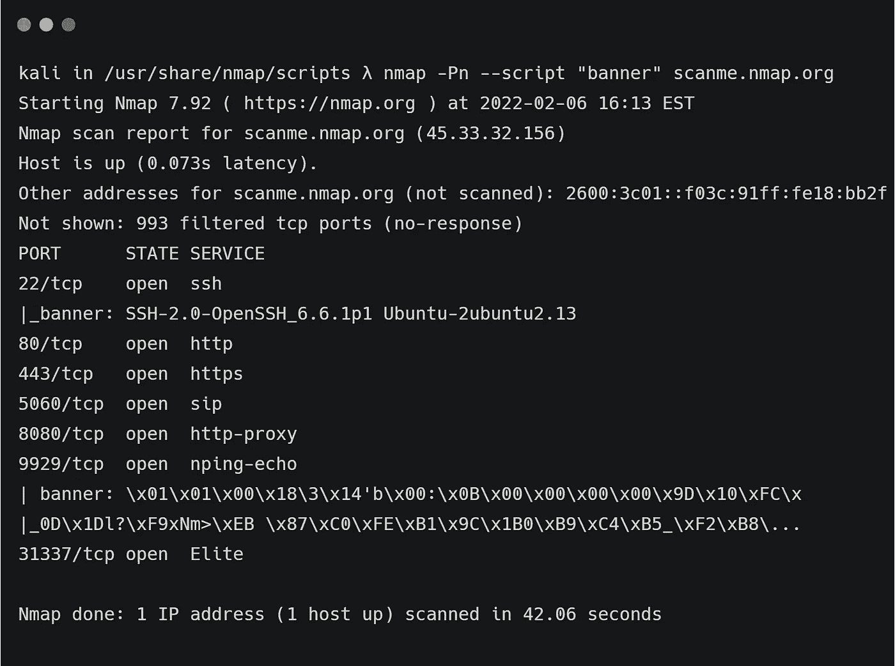

# Nmap 的脚本引擎

> 原文：<https://medium.com/geekculture/nmaps-scripting-engine-7f5c89c8d72c?source=collection_archive---------7----------------------->

## 用于枚举服务的强大脚本集合

H ello，🌎！是的，我在这篇博客中谈论的是 Nmap，尽管 Nmap 已经存在了大约 25 年了！Nmap 比我大好几岁！然而，它仍然被数百万专业人员维护和使用，并且仍然是最可靠的端口扫描器。在这篇博客中，我不会涉及 Nmap 的基本扫描选项，但…