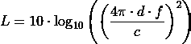
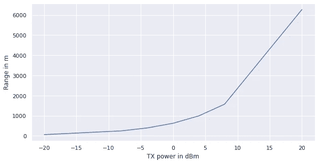

# 不，蓝牙的范围不是 10 米

> 原文：<https://medium.com/geekculture/no-bluetooths-range-is-not-10m-393b322de31e?source=collection_archive---------27----------------------->

# 关于个人无线连接最大的神话之一

Photo by [Jan Huber](https://unsplash.com/@jan_huber) on [Unsplash](https://unsplash.com/)

当我们谈论蓝牙时，我们必须指明我们谈论的是传统蓝牙还是低能耗蓝牙(BLE/乐)。除了音频连接(例如耳机)，Classic 现在已经很少使用了，但随着 LE audio 的推出，这种情况可能也会很快改变。除此之外，你可能会在老式键盘/鼠标中找到它，你可能会记得它来自美好的旧时光，那时你正在分享你的旧手机铃声。乐在智能家居领域占据主导地位，你会在许多物联网设备中发现它。到目前为止，所有现代手持设备都应该支持 LE。

不管怎样，我们怎么到这里？如果你开始为 LE 开发，或者只是想更深入地挖掘，你会发现大量的文章陈述了 10 米(或者对美国读者来说大约 33 英尺)的范围。这是无稽之谈。但我的硕士论文是关于蓝牙 LE 的，在那段时间里，我试图理解为什么人们认为它是 10m。

你不是无线工程师吗？别担心，我也不会——我会试着解释理解这一点所需的所有基础知识，但请记住，我可能会把事情过于简单化。

假设您想将音频从手机传输到耳机。你的手机是发射器，耳机是接收器。您的手机正在以 *dBm* 中给出的指定信号强度进行传输。默认值为 0 dBm。我们还可以量化接收强度:耳机的蓝牙无线电指定了数据集中某个地方的灵敏度。蓝牙的灵敏度规定了信号在传输过程中可以损失多少强度，但仍能被可靠地检测到(即不超过 0.1%的误码率(BER))。现代无线电的灵敏度约为–96 dBm，取决于无线电和传输波特率。

现在我们如何计算范围呢？这里有一个棘手的部分:你的范围将高度依赖于你的环境。在你的办公室或家里，你可能会有一个小范围，在一个空旷的地方，你会有一个高范围。以相同频率工作的其他无线设备会干扰您的设备，墙壁、微波…和水也会干扰您的设备！

但是有一种方法可以计算理想条件下的最大范围，即没有任何干扰的实验室环境。以 dB 为单位计算损耗 *L* 的公式称为自由空间路径损耗(FSPL)或 Friis 方程。 *d* 表示距离， *f* 表示传输频率， *c* 表示光速不变。

Friis-Equation. Image by author.

蓝牙工作在 2.4 GHz ISM 频段，传输频率介于 2400 MHz 和 2480 MHz 之间。因此，在默认设置和-96 dBm 灵敏度的接收机下，我们在理想条件下可以获得 607 至 627 m 的范围，具体取决于频率。BLE 发射机可以调整信号强度，变强或变弱(规格为 5.3 -20 dBm 至+20 dBm)。这里是它可以覆盖的范围的一个小比较(同样是在理想条件下)。

Maximum range by TX power. Image by author.

正如你所看到的，默认的传输强度给了你一个现代无线电 10 米以上的范围。那么，为什么似乎每个人都不准确地陈述范围呢？因为他们看过说明书(万岁！)…

该规范规定，任何 LE 接收机的灵敏度必须低于-70 dBm。假设发射机为 0 dBm，接收机为-70 dBm，线路某处(即环境)的损耗为 10 dB，则可获得 10 m。这就是所有的魔力。

指定的灵敏度阈值非常低，而且是理论上的，尽管由于历史原因，只是在规范中。事实上，我和一些 BLE 先驱交谈过，有些人甚至怀疑第一台 BLE 收音机是否有-70 dBm 那么差。

更现实的比较是使用现代灵敏度:如果我们插入-96 dBm 灵敏度，我们将获得大约 198 米的范围和 10 dB 的路径损耗。

## TL；DR:默认情况下，现代无线电的覆盖范围将远远超过 10 米，但这在很大程度上取决于您的环境。