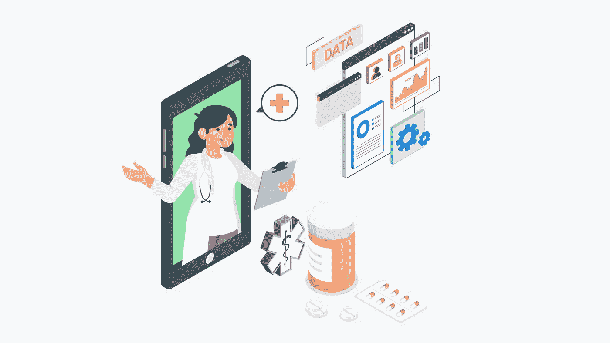

# 制药行业没有代码自动化

> 原文：<https://medium.com/geekculture/no-code-automation-for-pharma-industry-e319337784a?source=collection_archive---------24----------------------->

数字化的理念影响了许多制药行业；像代码运行和基于程序的特性这样的一些东西仍然在成为障碍。

*但是你听说过没有代码自动化平台吗？*

*是的，这就是我们将要讨论的，他们肯定不会吓跑任何制药企业，但可以很好地促进它们的发展。*

数字平台有能力将流程、人员和数据结合在一起，这有助于提高速度，让人们参与到生产力任务中，从而促进更好的问题解决和创新。

疫情推动许多公司走向数字化转型。现在数字化转型的重点是提高整体运营效率。它为患者护理、自动化管理、临床流程和增强的创新提供了一种集成的方法，提供了更好的患者结果。

制药公司正在寻找提高生产率和效率的方法，并利用数字技术来转变他们的业务。制药行业的代码自动化没有在这个领域打开新的视野。作为一个无代码自动化平台和值得信赖的 iPaaS，我们遇到了许多来自制药行业的客户，自动化帮助很大，解决了他们的挑战。

**没有代码自动化**

制药行业没有代码是将数字化带入业务核心的最佳方式。数字化的概念在制药行业并不新鲜，但无需编写任何代码即可实现工作流程和过程的自动化，对于当今的行业来说是一件全新且必不可少的事情。

**制药行业的挑战**

时间和资源短缺

产品旅行时间慢，市场慢

销售和营销渠道中的冗余流程

缺乏完善的技术环境

没有适当的安全措施

以下是一些真实的故事，讲述了无代码自动化如何帮助制药行业应对上述挑战并走向增长。

我们帮助几家制药公司实现了他们的目标并解决了他们的障碍。

**以下是一家领先制药公司如何利用 iPaaS 和数据分析进行研发:**

一家知名制药公司面临着不同数据源的挑战，因为他们无法为罕见疾病的进一步研发提供正确的见解。

我们将分散的遗留系统和数据库中的数据集成到一个中央存储库中。收集的数据被转移到分析工具中，以检测模式并获得洞察力。

这有助于制药公司可视化数据，并预测患者数据和罕见疾病的治疗方法。我们已经为上述流程集成和自动化了许多应用程序，以带来节省时间和金钱、减少错误以及帮助人们做出更好决策的潜在影响。

不仅仅是一家公司的问题；通过使用制药行业最好的无代码自动化平台，

有助于缩短上市时间

简化销售代表、合作伙伴、诊所等的查询流程。

实现医生和患者的互动

医生与公司的约定

员工入职自动化

自助聊天机器人

自动化人力资源部门及更多

为什么我们认为在制药行业中不应该使用任何代码来创建应用程序

大多数预制应用程序都是专门为其来源市场开发的，无法提供跨境援助或控制。它们限制了增长，但是没有一个代码平台可以根据需要帮助增强所有方面。

这些现成的应用程序是以“一刀切”的目标构建的，但对大多数组织来说是不够的。如果您选择制药行业的无代码自动化，应用程序编辑和新功能添加将变得简单而灵活。

跨平台功能可以很容易地集成到公民开发者开发的应用程序中。它们运行在其他系统上，从传统的应用程序到不同的系统，同样的事情也适用于扩展和维护。来自后端的更新有助于更新无代码平台前面的内容。

**结论:**

允许技术制药员工从他们的背景出发，利用他们现有的专业知识，开发他们需要的应用程序，可以快速解决问题，并在解决方案的寻找过程中获得授权。

No-code for pharma 将技术从应用转化为创新的解决方案。