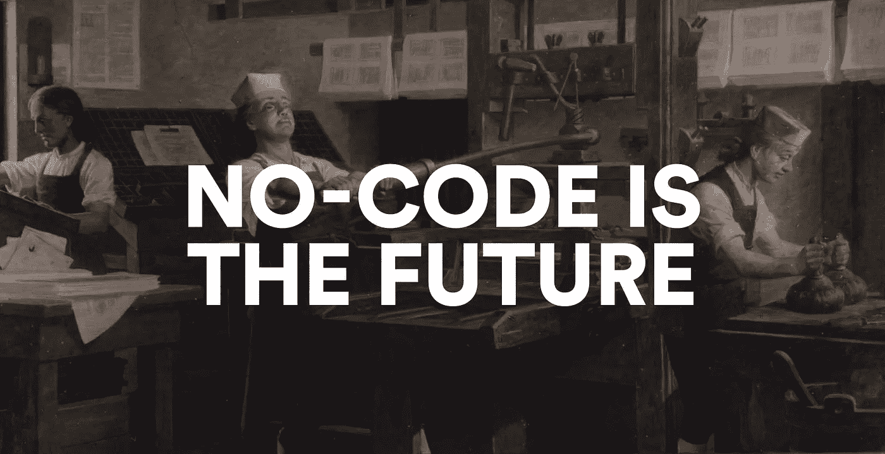

# 我们所有人都没有代码。这是件好事。

> 原文：<https://medium.com/geekculture/no-code-is-coming-for-us-all-and-thats-a-good-thing-7792d2d1eccc?source=collection_archive---------14----------------------->

## 我们不应该都是程序员。

Credit: Wikimedia Commons

我最近花了很多时间思考下一个“大事件”是什么——部分是因为我不相信当前流行的 crypto/web 3/等叙事。就像它被吹捧的那样。需要澄清的是，我不认为那里什么都没有，但我确实认为我们正处于这个领域的炒作周期中的一个点，这个领域充满了过度膨胀的预期。(实际上，我认为对大多数人来说，电动自行车将比非电动自行车更能改变游戏规则。)

在我寻找下一个火花塞的过程中，我越来越着迷于一套被称为**无代码**平台的新兴工具的力量。

无代码工具或多或少和他们在盒子上说的一样。他们让你不用懂一点代码就能构建数字化的东西。这些东西可能是网站、网络应用程序、移动应用程序，或者其他完全不同的东西，构建它们的过程感觉更像是在 Illustrator 或 Excel 之类的东西中无所事事，而不是在 Github 上打开一个项目。

几个月前，[我经营了一家数字营销代理公司](/@guttmann/at-least-do-the-little-things-right-3d2e60286238)，在过去的十年里，我们做了很多需要大量代码的东西——所以我很乐意承认，我可能属于这些东西是为谁设计的 99%。但在花了几周时间使用 Webflow、Zapier、Bubble 和 concept(之前在我们的机构使用过 Airtable、Carrd 和其他工具)等工具后，我确信这场运动将改变商业运作的方式，至少是一点点。

至少在第三个十年，教育工作者和政策制定者一直在强调在学校教授编程的必要性。像 General Assembly 和 Flatiron School 这样的私人公司提供昂贵的训练营来学习软件工程的基础知识。但是现在，我想我们可能在这里追逐错误的目标。

随着这些工具的发展，越来越明显的是，我们真正需要教授的技能不是如何编码，而是如何弄清楚要做什么。

无论是因为无代码工具，还是因为自动化的快速增长，也许我们根本不需要像我们曾经认为的那样多的开发人员。正如与一个世纪前相比，我们需要更少的排字工人来手动设置我们的印刷机一样，在未来几年，我们需要更少的网络开发人员来设置基本的登录页面和市场。

无代码不是一切的答案。我最近听到有人将这些工具描述为让你“从 A 到 M，而不是从 A 到 z”。它们确实让人们把时间花在他们能增加最大价值的事情上——有才华且专注于细节的设计师可以“拥有”营销网站，高薪的开发人员可以解决高杠杆的技术问题。

我最兴奋的是这些无代码工具如何打破在网络上创造东西的障碍——你不需要学习一种神秘的语言，你只需要按下正确的按钮，就可以将你的愿景变为现实。你会在 web3 领域听到很多关于去中心化互联网的讨论，但这通常表现在越来越多的私有财产，越来越多的公有财产。无代码则反其道而行之，为一个全新的创造者阶层打开了大门。看到建成的东西将是令人兴奋的。

让我知道你的想法，我很想听听你的想法。然后在 [**上与我保持联系**](https://twitter.com/guttmann) **或** [**上取得联系**](https://www.benguttmann.com/) **获取更多！**