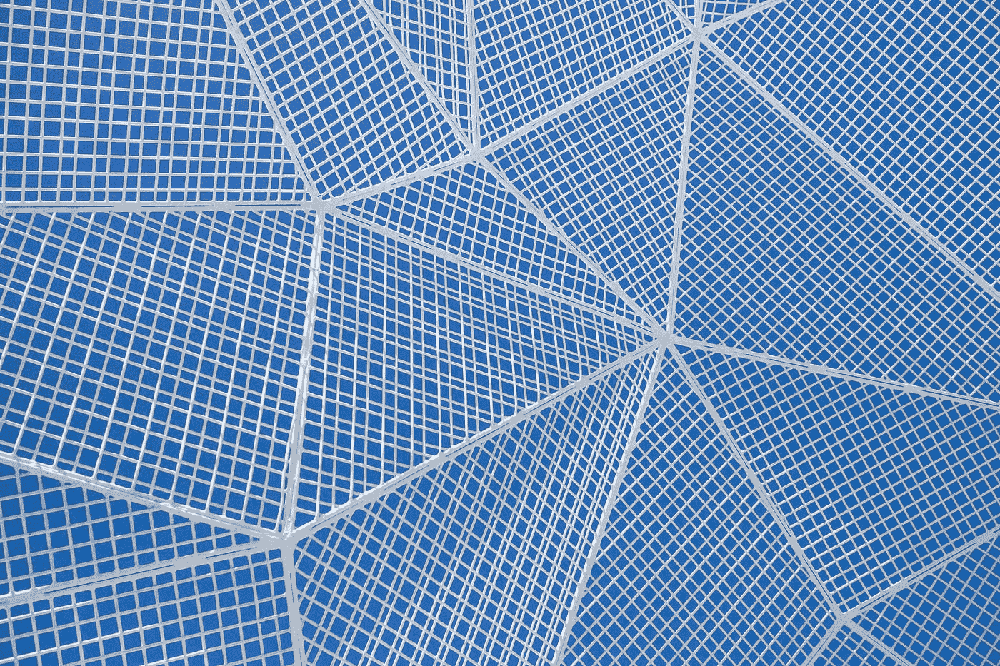

# 无代码:应用程序开发的下一波浪潮

> 原文：<https://medium.com/geekculture/no-code-the-next-wave-of-application-development-a4416c55a96f?source=collection_archive---------12----------------------->

Photo by [Susan Q Yin](https://unsplash.com/@syinq?utm_source=medium&utm_medium=referral) on [Unsplash](https://unsplash.com?utm_source=medium&utm_medium=referral)

直观的、类似于人类交流方式的、简洁的软件开发比更接近硬件的软件开发要容易得多。纵观编程历史，一直有一种趋势，即越来越多地将计算机硬件从人类程序员那里封装起来。