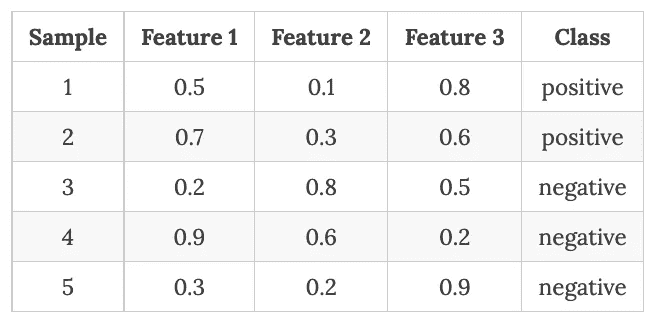
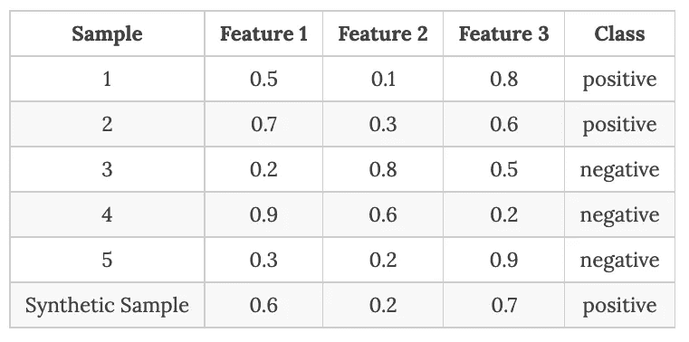

# 没有数据？没问题！

> 原文：<https://medium.com/geekculture/no-data-no-problem-3561a08f35c5?source=collection_archive---------9----------------------->

## 在几乎没有标注训练数据的情况下训练机器学习模型

Image used under license from josephsjacobs — stock.adobe.com

从医疗保健到金融到农业，机器学习已经成为许多行业不可或缺的一部分。机器学习算法准确预测结果、对数据进行分类并根据数据做出决策的能力，使其成为企业和组织的宝贵工具。然而，机器学习算法需要大量的标记训练数据才能有效。这是因为机器学习算法依赖于能够学习数据中的复杂模式，而这只能通过足够数量的示例来学习。这些数据用于指导模型寻找什么以及如何进行预测。然而，经常会出现没有或只有很少标记数据可用的情况，因为收集标记数据可能非常昂贵、耗时，甚至是不可能的。在这些情况下，很难训练有效的机器学习模型。

*   [简介](#a86e)
*   [无监督学习](#c42d)
*   [半监督学习](#dfd5)
*   [自我训练](#d0c9)
*   [标签传播](#71df)
*   [伪标签](#37b5)
*   [自我监督学习](#01da)
*   [弱监督+迁移学习](#797d)
*   [弱监管提示功能](#a56b)
*   [主动学习](#60b5)
*   [合成数据生成](#ec70)
*   [—方法 1:生成性对抗网络](#8b72)
*   [—方法二:数据扩充](#6d27)
*   [—方法三:模拟环境](#b2cf)
*   [—方法四:击打](#aebd)
*   [—方法五:扩散模型](#c55d)
*   [— —稳定扩散](#f05c)
*   [—方法 6:分室模型和信息扩散](#2dbf)
*   [— — SIR 模型](#436c)
*   [— —独立级联模型](#7dbe)
*   [— —线性阈值模型](#92bf)
*   [— —加权级联模型](#5c1d)
*   [零投和少投学习](#b568)
*   [问题还原](#5079)
*   [合奏学习](#fe0d)
*   [关于过拟合的说明](#9d82)
*   [结论](#59a5)

# 介绍

机器学习中的一个关键挑战是获得大型、多样化的数据集，这些数据集准确地表示模型将被部署的真实世界场景。这对于医疗保健、金融和安全等领域的应用尤为重要，在这些领域，数据隐私和道德问题阻碍了真实世界数据的使用。在本文中，我们将探索在没有足够多的高质量标记训练数据可用时，训练机器学习模型的方法。我们将讨论各种技术，如无监督学习、半监督学习、标签传播、伪标签、自监督学习、弱监督和迁移学习、弱监督提示函数、主动学习、合成数据生成、零镜头和少镜头学习、自我训练、问题简化、集成学习，以及如何在这些情况下使用它们来提高机器学习模型的性能。

# 无监督学习

当没有或只有很少的标记数据可用时，训练机器学习模型的一种方法是使用无监督学习。无监督学习是一种机器学习，涉及在无标签数据上训练模型。无监督学习的目标是发现数据中没有明确标记的模式和关系。

无监督学习算法可用于识别相似数据点的聚类或学习数据的底层结构。例如，无监督学习算法可能能够学习某些单词倾向于在自然语言文本中一起出现，或者某些像素倾向于在图像中一起出现。这对于在数据中寻找模式很有用，但是它不能为模型提供任何直接的监督或指导。这些算法没有要预测的目标变量，因此它们可以从数据中学习，而无需任何关于数据结构的先验知识或假设。

无监督学习的另一种方法是降维，这涉及减少数据中的特征数量。这有助于简化数据并使其更易于处理，但也会减少模型可用的信息量。

无监督学习在各种应用中是有用的，例如异常检测、数据压缩和数据可视化。它还可以用于下游任务的预训练模型，如监督学习或强化学习。

当没有或只有很少的标记数据可用时，使用无监督学习存在一些挑战。一个挑战是，很难评估无监督学习模型的性能，因为没有可以与之比较的基础事实。另一个挑战是，无监督学习算法有时可以发现数据中没有意义或有用的模式。

# 半监督学习

当没有或只有很少的标记数据可用时，训练机器学习模型的另一种方法是使用半监督学习。这是一种机器学习，涉及使用标记和未标记的数据来训练模型。半监督学习的目标是使用标记数据来指导学习过程，同时也使用未标记数据来提高模型的性能。它基于这样的想法，即使在没有标记数据的情况下，仍然可以从数据中学习到有价值的信息。例如，在自然语言处理中，文档中的单词和句子为理解其含义提供了有价值的上下文，即使该文档没有标记特定的类别或种类。

另一种方法是使用生成敌对网络(GANs)，它涉及同时训练两个模型:生成器和鉴别器。生成器试图生成与真实数据相似的虚假数据，而鉴别器试图区分真实数据和虚假数据。这对于从未标记的数据中学习很有用，因为它允许模型也从生成的数据中学习。我们将在本文后面详细回顾这种技术。

半监督学习的一个优点是，它允许模型从更大量的数据中学习，这可以提高其性能。另一个优点是，它可以帮助模型学习数据中更复杂的模式，因为它可以使用标记和未标记的示例进行学习。

半监督学习的一个挑战是，很难确定使用标记数据和未标记数据之间的正确平衡。另一个挑战是很难评估半监督学习模型的性能，因为在标记的数据中仍然存在一些不确定性。

使用半监督学习来训练机器学习模型的另一个挑战是需要大量的未标记数据。为了使算法有效地结合来自未标记数据的信息，必须有足够数量的数据可供学习。如果没有足够的未标记数据，模型可能无法学习数据的准确和鲁棒的表示。

半监督学习的另一个挑战是需要对标记数据进行准确预测。为了使算法有效地结合来自标记数据的约束，模型必须对标记数据做出准确的预测。如果模型的预测不准确，来自标记数据的约束可能无效，模型也可能无法学习。

一种解决方案是使用一种称为自我训练的技术，这种技术涉及使用少量的已标记数据来训练一个模型，然后使用该模型来标记额外的未标记数据。这个附加的标记数据然后可以用于训练新的模型，该模型可以比原始模型更准确和鲁棒。

# 自我训练

自我训练是机器学习中使用的一种技术，其中模型在少量已标记数据上训练，然后用于预测大量未标记数据的标签。然后，将标记的数据添加到训练集中，并在扩展的数据集中重新训练模型。重复这一过程，直到达到所需的性能水平。

自我训练在缺乏标记训练数据的情况下特别有用。在许多现实世界的应用程序中可能会出现这种情况，在这些应用程序中，标记数据是一个耗时且昂贵的过程。例如，在自然语言处理任务中，手动标记大量文本数据可能会非常昂贵。在这些情况下，可以使用自我训练来有效地利用有限的标记数据，并提高模型的性能。

一种常见的自我训练方法是使用半监督学习算法，如生成对抗网络(GAN)或变分自动编码器(VAE)，以生成合成数据(稍后讨论)。然后，使用初始训练集标记该合成数据，并将其添加到训练数据中。这使得模型可以有效地从大量数据中学习，并可以提高手头任务的性能。

另一种自我训练的方法是使用预先训练的模型来预测未标记数据的标签。当预训练模型在相关任务上被训练时，这可能特别有效，因为它将已经具有关于该领域的一些知识，并且可以为未标记的数据提供有用的标签。然后将标记的数据添加到训练集中，并在扩展的数据集中重新训练模型。

自我训练中的一个重要考虑是初始训练集的选择。初始训练阶段使用的标记数据应该代表整个数据集，并且应该包括各种各样的示例。这将确保模型可以很好地推广到更大的数据集，并实现良好的性能。

另一个考虑因素是由自我训练过程产生的标签的质量。在某些情况下，模型可能会对未标记的数据做出不正确的预测，如果将这些标签添加到训练集中，这可能会导致性能下降。为了解决这个问题，一些自训练算法包括质量控制步骤，其中在将预测的标签添加到训练数据之前检查其准确性。

总之，在标记的训练数据稀缺的情况下，自我训练是一种用于训练机器学习模型的强大技术。通过利用少量的标记数据，自我训练可以提高模型的性能，并使其能够有效地从更大的数据集中学习。这在实际应用中尤其有用，因为手动标记数据是一个耗时且昂贵的过程。

# 标签传播

标签传播是一种强大的技术，可以帮助提高机器学习模型的准确性，并减少所需的手动标记量。标签传播背后的基本思想是使用来自已标记数据点的信息来推断未标记数据点的标签。这是通过假设相似的数据点将具有相似的标签来实现的。已标记的数据点充当标签传播算法的“种子”，未标记的数据点的标签基于其最近邻居的标签进行更新。

为了实现标签传播，我们首先需要定义数据点之间的相似性度量。这种测量通常基于特征空间中数据点之间的距离。例如，我们可以使用欧几里德距离或余弦相似性来计算数据点之间的相似性。

一旦我们定义了相似性度量，我们就可以用它来构建一个相似性矩阵，该矩阵对所有数据点对之间的相似性进行编码。该矩阵用于计算表示数据的图中的边的权重。

接下来，我们需要定义传播规则，该规则确定如何根据相邻数据点的标签更新未标记数据点的标签。可以使用几种不同的传播规则，但最常用的是简单传播规则和谐波传播规则。

简单传播规则简单地将最相似数据点的标签分配给未标记的数据点。这个规则很容易实现，但是它可能不稳定，并且可能不总是产生好的结果。另一方面，谐波传播规则将相邻数据点的标记的加权平均值分配给未标记的数据点。基于数据点之间的相似性来计算权重。此规则比简单传播规则更稳定，产生的结果也更好，但它的计算开销也更大。

一旦我们定义了传播规则，我们就可以使用它来迭代地更新未标记数据点的标记，直到标记收敛。收敛标准可以基于数据点标签的变化或相似性矩阵。

使用标签传播来训练机器学习模型的一个关键优势是，即使只有少量的标签数据，它也可以提高模型的准确性。这是因为未标记数据点的标记是基于标记数据点的标记来推断的，这可以向模型提供附加信息。

此外，标签传播是一种快速和可扩展的算法，可以很容易地并行实现，这使得它适合于大规模的机器学习任务。此外，它是一种灵活的算法，可以很容易地适应不同类型的数据和学习任务。

因此，标签传播是一种强大而通用的半监督学习技术，可用于在标签训练数据稀缺时训练机器学习模型。它可以提高模型的准确性，减少所需的手动标记量，使其成为许多机器学习应用程序的一个有吸引力的选项。

# 伪标记

伪标记涉及使用模型的预测作为缺失标记数据的替代，允许模型继续学习并提高其准确性。传统上，机器学习模型是在具有输入数据和相应的标记输出数据的大型数据集上训练的。该模型使用这些标记数据来学习输入和输出之间的关系，然后应用该知识对新数据进行预测。然而，在某些情况下，获得大量的标记数据可能是困难的或昂贵的。在这种情况下，伪标记可用于增加可用的标记数据并提高模型的性能。

要使用伪标注，第一步是根据可用的标注数据训练模型。一旦模型被训练，它可以被用来对剩余的未标记数据进行预测。然后，可以将这些预测视为附加的标记数据，并添加到训练数据集中。然后，可以在这个扩充的数据集上重新训练该模型，合并对先前未标记的数据做出的预测。这个过程可以重复进行，直到模型达到令人满意的精度水平。

使用伪标记的一个关键方面是确保模型对未标记数据的预测是准确的。如果模型的预测不正确，它们会在训练数据集中引入噪声，并降低模型的性能。因此，仔细评估模型的性能并仅使用可信度高的预测非常重要。

选择高置信度预测的一种方法是使用模型的预测概率而不是预测的类别标签作为伪标签数据。例如，如果模型预测输入数据点属于几个类中的每一个类的可能性，则伪标签数据可以是具有最高预测概率的类。这种方法有助于减少错误预测对模型性能的影响。

另一种提高伪标记准确性的方法是使用多个模型并组合它们的预测。这可以通过在相同的标记数据上训练几个模型，并将每个模型的预测用作其他模型的伪标记数据来实现。然后，来自所有模型的预测可以被组合，并用作用于训练最终模型的增强标记数据。这种方法有助于减少任何单个模型的误差对最终模型性能的影响。

总的来说，当标记数据稀缺时，伪标记是一种用于训练机器学习模型的有用技术。使用模型的预测替代缺失的标注数据，有助于提高模型的性能和准确性。但是，仔细评估模型的预测并使用高可信度预测以避免在定型数据集中引入噪音是很重要的。通过使用诸如使用预测概率和组合多个模型的预测的策略，可以进一步提高伪标记在训练机器学习模型中的有效性。

# 自我监督学习

自我监督学习是一种机器学习，涉及在未标记的数据上训练模型，以学习数据的有用表示。这与监督学习形成对比，在监督学习中，模型根据标记的数据进行训练，目标是根据标签进行预测。近年来，自监督学习由于其从大量未标记数据中学习的能力而受到欢迎，这些数据通常比标记数据更容易获得且更便宜。

自监督学习是一种非监督学习，其中模型是在未标记的数据上训练的，并且没有给定明确的标签或目标来预测。相反，自我监督学习的目标是学习可用于下游任务(如分类或回归)的有用数据表示。

一种常见的自我监督学习方法是使用监督学习模型，并对其进行相关任务的训练，该任务可以很容易地从未标记的数据中生成。例如，在图像的情况下，可以使用像素的颜色作为标签，在分类任务上训练模型。这将允许模型学习图像的有用特征，例如形状和纹理，这可以用于其他任务。

自我监督学习的另一种方法是使用生成模型，例如生成对抗网络(GAN ),来学习数据的分布。生成模型的目标是生成与原始数据相似的新样本，这可以帮助模型学习数据的有用表示。

使用自我监督学习来训练机器学习模型的一个挑战是缺乏标记数据。在监督学习中，标签提供了关于模型可用来学习的数据的有价值的信息。如果没有标签，模型必须依靠数据的固有结构来学习有用的表示。这在许多应用中可能是困难的，例如自然语言处理或计算机视觉，其中数据的结构是复杂的并且不容易学习。

自我监督学习的另一个挑战是所学内容的质量。在某些情况下，通过自我监督模型学习的表示可能不如从标记数据学习的表示有用。这可能是由于未标记数据中可用的信息有限，或者是因为模型无法学习数据的底层结构。

一种解决方案是使用大量未标记的数据来训练模型。这可以帮助模型学习数据中更复杂的模式，并提高学习到的表示的质量。

# 弱监督+迁移学习

弱监督和迁移学习是两种强大的技术，可用于在很少或没有标记的训练数据可用时训练机器学习模型。我们将探索这些技术的基础知识，如何将它们结合起来提高机器学习模型的性能，以及使用弱监督和迁移学习的一些挑战和限制。

弱监督是一种允许机器学习模型在大量未标记数据或仅部分标记的数据上训练的技术。

可以使用弱监督的一种方法是通过使用启发法。试探法是可以用来以半自动方式标记数据的规则或指南。例如，可以使用试探法来识别包含猫的图像，即使这些图像没有被明确地标记为猫。通过使用启发式方法来标记大量数据，可以在这部分标记的数据上训练机器学习模型。

可以使用弱监管的另一种方式是通过使用远程监管。远程监督包括使用已针对不同任务标记的大型、预先存在的数据集，并使用来自该数据集的标签来标记当前任务的数据。例如，如果我们有一个很大的新闻文章的数据集，已经被标记为情感，我们可以使用这个数据集中的标签来标记一个新的客户评论数据集。这使得我们可以根据客户评论训练机器学习模型，而不必手动标记数据。

迁移学习是一种技术，它允许在一项任务上训练的机器学习模型用作在不同但相关的任务上训练的模型的起点。当一个任务有大量的标记数据，而另一个任务只有很少的标记数据时，这一点特别有用。通过使用迁移学习，我们可以利用模型在第一个任务中学习的知识来提高模型在第二个任务中的表现。

使用迁移学习的一种方法是使用预先训练好的模型。预训练模型是针对特定任务(如图像分类或自然语言处理)对大量数据进行训练的机器学习模型。然后，这些模型可以用作新模型的起点，该新模型针对不同但相关的任务进行训练。通过使用预先训练的模型，我们可以利用模型在原始任务上学习的知识来提高模型在新任务上的性能。

使用迁移学习的另一种方法是通过微调。微调包括调整预训练模型的参数，以更好地适应新任务的数据。这可以通过对新数据重新训练模型，使用较小的学习率以避免过度拟合，以及冻结模型的一些层以防止它们被修改来实现。通过微调预先训练的模型，我们可以进一步提高模型在新任务中的性能。

弱监督和迁移学习可以一起使用，以在很少或没有标记的训练数据可用时提高机器学习模型的性能。通过使用弱监督来部分标记数据，然后使用迁移学习来对该数据上的预训练模型进行微调，可以使用比使用传统监督学习方法所需的更少量的标记数据来训练机器学习模型。

然而，使用弱监督和迁移学习存在一些挑战。一个挑战是选择正确的试探法或预训练模型来使用。如果试探法或预先训练的模型不适合该任务，它们可能不会提供有用的见解，并且该模型可能不会像预期的那样执行。此外，试探法和预训练模型可能包含对模型性能有不利影响的偏差。选择试探法和预训练模型时必须小心谨慎，以确保它们是合适的和无偏见的。此外，在独立数据集上评估模型的性能以确保它不会过度拟合数据也很重要。

# 监管薄弱的提示功能

在缺少标记训练数据的情况下，一种方法是使用弱监督技术，例如提示函数，来生成额外的训练数据。提示函数是一个函数，它接受一个未标记的示例，并产生一组可用于标记该示例的提示或问题。例如，如果任务是将图像分类为不同的类别，提示函数可能会接收一幅图像并输出一组问题，如“这幅图像包含一只猫吗？”以及“这个图像包含一只狗吗？”。然后，通过要求人类注释者回答这些问题，可以使用这些问题来标记图像。

当标记数据不足时，使用提示函数是生成附加训练数据的有效方法，因为提示可以自动快速生成，而不需要手动标记。此外，使用提示功能还可以提高生成的标签的质量，因为提示是为与手边的任务相关而设计的。

有几种不同的方法使用提示函数来训练机器学习模型。一种方法是首先使用提示函数为训练集中的每个未标记的例子生成一组提示。然后，可以使用这些提示来标记示例，或者要求人工注释者回答提示，或者使用模型根据提示来预测标签。然后，标记的示例可以用于训练受监督的机器学习模型。

另一种方法是使用提示来训练弱监督的机器学习模型，该模型是在标记和未标记数据的组合上训练的模型。在这种方法中，prompt 函数用于为训练集中的每个未标记的示例生成一组提示。然后，这些提示用于训练弱监督模型，该模型可以根据提示学习预测示例的标签。

使用提示函数生成训练数据的一个潜在问题是，提示可能不总是准确的或者与手头的任务不相关。在这种情况下，生成的标签可能有噪声，这会对训练模型的性能产生负面影响。为了解决这个问题，仔细设计提示函数以生成与任务相关的高质量提示是很重要的。这可能涉及手动设计提示，或者使用主动学习(下面讨论)或强化学习等技术从数据中学习提示。

总的来说，在缺少标记数据的情况下，使用监督较弱的提示函数可以有效地生成额外的训练数据。通过生成高质量的提示，可以训练出即使在面临标签训练数据稀缺的情况下也能表现良好的机器学习模型。

# 主动学习

主动学习是一种机器学习技术，其中算法主动选择它用于训练的数据。这与传统的机器学习技术形成对比，在传统的机器学习技术中，算法使用所有可用的数据进行训练。在主动学习中，该算法使用可用数据的一个小子集，然后迭代地选择附加数据添加到训练集中。

主动学习的目标是选择信息量最大的数据进行训练，以提高模型的准确性。主动学习在标记数据稀缺的情况下可能很有用，因为它允许算法选择最具信息量的数据进行训练。通过迭代选择信息量最大的数据，即使数据量很小，算法也能有效学习。

有几种不同的方法来实现主动学习，但它们都涉及算法主动选择它用于训练的数据。一些常见的主动学习方法包括:

1.按委员会查询:在这种方法中，算法对同一数据训练多个模型，然后根据模型之间的不一致选择数据进行训练。

2.不确定性采样:在这种方法中，算法根据数据的不确定性来选择数据进行训练。例如，算法可以选择它不确定的数据，以提高其性能。

3.多样性采样:在这种方法中，算法根据数据的多样性来选择数据进行训练。目标是选择代表总体的数据，以提高模型的概化能力。

不管使用哪种特定的方法，主动学习都涉及算法迭代地选择用于训练的数据。该算法首先对一小部分数据进行训练，然后选择额外的数据添加到训练集中。重复该过程，直到达到期望的性能。

主动学习已经被用于多种应用，包括自然语言处理、图像分类和药物发现。这里有几个主动学习的例子:

-在自然语言处理中，主动学习已被用于提高情感分析算法的性能。

-在图像分类中，主动学习已被用于提高对图像中的对象进行分类的算法的性能。

-在药物发现中，主动学习已被用于提高预测潜在药物有效性的算法的性能。

使用主动学习也有挑战和限制。一个挑战是模型的性能可能高度依赖于查询函数的质量。如果查询函数不能选择信息最丰富的数据点，模型可能无法有效学习，性能可能会受到影响。

另一个挑战是，主动学习需要大量的人力，无论是手动标注还是设计和优化查询功能。这可能很耗时，并且对于某些应用来说可能不可行。

尽管存在这些挑战，但当很少或没有标记数据可用时，主动学习可以成为训练机器学习模型的有价值的工具。通过主动选择最具信息量的数据点进行标注，模型可以使用较少的标注数据进行更有效的学习，从而提高性能并更有效地使用标注资源。

# 合成数据生成

合成数据也称为人工数据，是由计算机程序或算法生成的数据，而不是从现实世界来源收集的数据。当没有或几乎没有可用的标记训练数据时，该数据通常用于训练机器学习模型。在本文中，我们将讨论生成合成数据的各种方法及其潜在的优缺点。

## 方法 1:生成对抗网络(GANs)

生成合成数据的最流行的方法之一是使用生成对抗网络(GANs)。GANs 是一种神经网络，由两部分组成——生成器和鉴别器。生成器的工作是生成与真实数据相似的合成数据，而鉴别器的工作是区分真实数据和合成数据。

GAN 首先根据真实数据训练发生器，然后根据真实数据和合成数据训练鉴别器。重复该过程，直到鉴别器不再能够区分真实数据和合成数据。然后，GAN 生成的合成数据用于训练机器学习模型。

使用 GANs 生成合成数据的主要优势之一是，它们可以生成与真实数据相似的高质量数据。这意味着，由此产生的机器学习模型将能够更好地推广到新数据，因为它已经在与现实世界中遇到的数据相似的数据上接受了训练。

GANs 的另一个优势是可以快速生成大量数据，这在处理有限的训练数据时很重要。此外，GANs 可以生成多样化的数据，这意味着机器学习模型将能够处理更广泛的输入。

然而，使用 GANs 生成合成数据也有一些缺点。一个主要的挑战是 GANs 计算量大，这使得它们难以在大规模应用中实现。此外，GANs 可能很难训练，需要大量微调才能生成高质量的合成数据。

## 方法 2:数据扩充

数据扩充是机器学习中常用的一种技术，用于增加模型可用的训练数据量。数据扩充包括通过对原始数据进行转换，从现有数据生成额外的数据样本。这些转换可以包括裁剪、缩放、翻转和旋转图像等操作，或者向音频或文本数据添加噪声。其想法是创建新的数据样本，这些数据样本与原始数据相似，但又有足够的差异，以便为模型提供更多的学习信息。

数据增强的一个常见应用是在计算机视觉领域。当训练机器学习模型来识别图像中的对象时，拥有大量不同的图像数据集进行训练是有益的。然而，收集和标记大量的训练数据既耗时又昂贵。通过对数据集中的现有图像应用变换，数据扩充可用于创建附加的训练数据。例如，可以旋转、翻转或裁剪一幅狗的图像，以创建与原始图像相似的新数据样本，但为模型学习提供附加信息。

数据增强的另一个应用是在自然语言处理(NLP)任务中，例如情感分析或机器翻译。在这些任务中，重要的是要有大量不同的文本数据集来进行训练。然而，收集和标记大量的文本数据可能具有挑战性。数据扩充可用于通过向原始文本数据添加噪声来创建额外的训练数据，例如改变词序或添加同义词，或者反向翻译(从源语言翻译到另一种语言，然后再翻译回源语言)。这可以帮助模型学习处理语言中的变化，并提高其在任务中的性能。

在使用有限数据训练机器学习模型时使用数据增强有几个好处。首先，它允许模型从更大和更多样化的数据集中学习，这可以提高它在任务中的性能。其次，它可以帮助模型更好地推广到新数据，并避免过度拟合，因为增加的数据样本与原始数据相似但不相同。第三，数据增强可以是收集和标记额外训练数据的一种具有成本效益的替代方法，因为它可以使用现有数据轻松实现，并且可以轻松集成到现有的机器学习管道中。最后，数据扩充可用于快速生成大量合成数据，这在处理有限的训练数据时非常重要。

然而，使用数据扩充来生成合成数据也有一些缺点。一个主要的挑战是，数据扩充只能生成与现有训练数据相似的数据。这意味着产生的机器学习模型可能无法推广到不同于训练数据的新数据。此外，数据扩充会在数据中引入偏差，这会对机器学习模型的性能产生负面影响。

总之，数据扩充对于用有限的数据训练机器学习模型是一种有价值的技术。通过使用转换从现有数据生成额外的数据样本，数据扩充允许模型从更大、更多样化的数据集中学习，从而提高其性能和泛化能力。这是一种收集和标记额外训练数据的经济有效的替代方法，并且可以在各种机器学习任务中轻松实现。

## 方法 3:模拟环境

模拟是生成合成数据的常用技术。它包括创建一个类似真实世界场景的虚拟环境，然后通过模拟该环境中实体的行为来生成数据。

例如，在医疗保健领域，我们可以模拟虚拟医院环境，并通过模拟患者、医生和其他医务人员的行为来生成合成病历。

当真实世界的场景被很好地定义并且底层机制可以被精确地建模时，模拟可能是有用的。然而，创建准确和真实的模拟可能具有挑战性，并且生成的数据可能不总是反映真实世界的情况。

## 方法 4:击打

SMOTE，即合成少数过采样技术，是一种用于生成合成数据来训练机器学习模型的流行方法。这种技术通常用于不平衡分类任务，其中少数类在训练数据中严重不足。通过为少数类生成合成数据，SMOTE 可以帮助平衡数据集并提高模型的性能。

为了理解 SMOTE 是如何工作的，让我们首先考虑一个简单的二进制分类任务，其中我们有一个包含两个类的数据集:“正”和“负”。在这种情况下，多数阶级是“消极的”，少数阶级是“积极的”。数据集可能看起来像这样:

Source: Image by the author

在该数据集中，少数类(正)代表不足，只有两个样本，而多数类(负)有三个样本。当训练机器学习模型时，这可能会导致问题，因为它可能没有足够的关于少数群体的信息来进行准确的预测。

为了解决这个问题，我们可以使用 SMOTE 为少数类生成合成数据。这种技术的工作原理是从少数类中选择少量样本，并将它们作为“种子”来生成新的合成样本。为此，SMOTE 首先计算少数类中所有样本对之间的距离。然后，它选择一对最接近的样本，并通过在两个选择的样本之间进行线性插值来生成新的合成样本。

例如，在我们的数据集中，我们可以使用 SMOTE 通过从少数类(正)中选择样本 1 和 2 并在它们之间进行线性插值来生成新的合成样本。新的合成样本将具有样本 1 和 2 中的值的加权平均值的特征值，权重由两个样本之间的距离确定。

Source: Image by the author

这个过程可以重复进行，以生成少数类的多个合成样本。通过将这些合成样本添加到原始数据集，我们可以平衡数据集，并提高机器学习模型的性能。

使用 SMOTE 生成合成数据时，有几个参数可以调整。一个重要的参数是要生成的合成样本的数量。这可以使用“k”参数来指定，该参数确定在生成每个合成样本时要考虑多少个最近邻。

SMOTE 的一个主要缺点是它会生成不真实或不代表少数类的合成样本。由于合成样本是基于最近邻生成的，因此它们可能无法捕捉少数类的真实多样性，并且可能无法很好地推广到新数据。

另一个很大的限制是它只能用于数值数据，因为用于识别最近邻的距离度量不适用于分类数据。

此外，如果生成的合成样本数量太大，SMOTE 还会过度拟合数据集。这可能会导致对不可见数据的低性能，在使用 SMOTE 时应谨慎考虑。

总之，SMOTE 是一种用于生成合成数据来训练机器学习模型的有用技术。该技术可用于不平衡分类任务，其中少数类在训练数据中代表性不足。通过为少数类生成合成数据，SMOTE 可以帮助平衡数据集，并提高机器学习模型的性能。

## 方法 5:扩散模型

扩散概率模型是一种潜在变量模型，可用于生成用于训练机器学习模型的合成数据。这些模型基于马尔可夫链，并使用变分推理进行训练，这使它们能够捕捉数据中的复杂模式和依赖关系。

为了理解扩散概率模型如何工作，首先需要理解潜在变量的概念。潜在变量是被认为对观察数据有影响的隐藏或未观察到的变量。例如，在社交网络中，潜在变量可以是个体之间的潜在关系，而观察到的数据可以是这些个体之间的交互。

扩散概率模型基于马尔可夫链，马尔可夫链是一种捕捉数据中变量之间依赖性的概率模型。在马尔可夫链中，特定状态(或观察变量)的概率只取决于当前状态，而不取决于先前的状态。这意味着该模型可以生成统计上独立的数据，同时仍能捕获原始数据中的相关性。

使用变分推理训练扩散概率模型，变分推理是一种估计模型参数的方法。这使得模型能够捕获数据的底层结构，并生成与原始数据高度相似的合成数据，同时仍然具有统计独立性。这允许合成数据被用作原始数据的代理，允许机器学习模型在比其他可能情况大得多的数据集上训练。

使用扩散概率模型的另一个好处是，它们可以捕捉数据的基本结构，使它们能够生成比其他方法更真实、更多样的数据。这可以提高机器学习模型的性能，因为它们将在更能代表它们将应用到的真实世界数据的数据上进行训练。

尽管使用扩散概率模型有许多优点，但也有一些应该考虑的限制。一个关键的限制是，这些模型可能是计算密集型的，尤其是对于大型数据集。这使得训练模型和及时生成合成数据变得困难。

另一个限制是扩散概率模型可能对模型的初始条件敏感，这会影响生成的数据。这意味着仔细选择初始条件是很重要的，并确保它们能代表数据。

此外，扩散概率模型并不总是生成合成数据的最佳选择。在某些情况下，其他方法，如生成式对抗网络或自动编码器，可能更合适。仔细评估机器学习模型和数据的要求，并选择合适的方法来生成合成数据是很重要的。

尽管有这些限制，扩散概率模型可以是生成合成数据的强大工具，用于训练机器学习模型以执行 NLP 任务，例如理解文本的含义，或者在计算机视觉中识别/分类图像中的对象。

为了选择合适的方法来生成合成数据，仔细评估机器学习模型和数据的要求是很重要的。例如，如果目标是在大数据集上训练机器学习模型，扩散概率模型可能是一个好的选择。然而，如果目标是捕获数据中的复杂模式和相关性，其他方法，如生成式对抗网络或自动编码器，可能更合适。

总的来说，扩散概率模型是生成用于训练机器学习模型的合成数据的强大工具。这些模型可以捕获数据中的复杂模式和相关性，并生成与原始数据高度相似的数据。这使得机器学习模型可以在更大的数据集上训练，从而提高它们的性能。尽管有一些限制，扩散概率模型是生成合成数据的有价值的工具，在训练机器学习模型时应该考虑。

## 稳定扩散

稳定扩散模型是一种生成用于训练机器学习模型的合成数据的新方法。这种方法由 Stability AI 开发，将高斯噪声添加到现实世界的数据中，然后应用去噪技术来消除噪声，同时保留底层模式，以创建与源数据相似但同时在统计上独立的新数据。

结果是合成数据与真实世界的数据无法区分，但可以用来训练机器学习模型，而不会损害底层数据的隐私或道德。这使组织能够在大型、多样化的数据集上训练他们的模型，这些数据集准确地表示模型将被部署的真实世界场景。

稳定扩散模型也非常灵活，允许组织定制添加到数据中的噪声级别以及所使用的去噪技术类型。这使组织能够生成适合其特定需求和要求的合成数据。

此外，稳定扩散模型是可扩展的，并且可以容易地集成到现有的机器学习管道中。这使得组织能够快速、轻松地将合成数据整合到他们的培训流程中，而不会对他们现有的工作流程造成重大中断。

稳定扩散模型是透明和可解释的，这意味着组织可以理解和解释生成的合成数据。这在医疗保健、金融和安全等领域尤为重要，在这些领域，数据透明度和可解释性对于确保信任和责任至关重要。

## 方法 6:分室模型和信息扩散

分室模型&信息扩散是一种数学模型，用于预测一种现象在人群中的传播。它通常用于流行病学，以研究疾病的传播，但它也可以应用于其他领域，如营销和社交网络分析，以模拟信息或影响通过网络的传播，使研究人员能够研究复杂的现象，如新技术的采用。

## SIR 模型

一种常见的房室模型是易感-感染-康复(SIR)模型，它描述了疾病在人群中的传播。在这个模型中，个体被分为三类:易感、感染和康复。易感个体是那些有感染疾病风险的人，受感染个体是那些患有疾病并能将其传播给他人的人，康复个体是那些已经从疾病中康复或已经接种疫苗的人。

SIR 模型通常用于研究传染病的传播，如流感或新冠肺炎病毒。通过模拟疾病在个体网络中的传播，研究人员可以估计将被感染的个体数量以及疾病达到高峰所需的时间。这些信息可用于为公共卫生政策和干预措施提供信息，如分发疫苗或实施社会距离措施。

除了研究疾病的传播，这些模型还可以用于为机器学习算法生成训练数据。例如，研究人员可能使用 SIR 模型来模拟新产品或技术通过个人网络的传播。通过跟踪产品或技术在网络中的传播，研究人员可以生成一个大型的个人数据集及其采用状态(易感、感染或恢复)。

要使用这些模型生成训练数据，第一步是定义要研究的群体和现象。这可以通过指定初始人口规模、人口特征(如年龄、性别、位置等)来实现。)，以及现象的性质(如其传播率、毒力等。).

一旦定义了群体和现象，就可以应用该模型来模拟现象在群体中的传播。这包括将扩散模型的数学方程应用于群体中的每个个体，考虑到他们的特征和现象的性质。

该模拟的结果是数据的时间序列，其可以用作机器学习模型的训练数据。例如，通过使用扩散模型生成的时间序列数据作为训练数据，可以训练机器学习模型来预测疾病在人群中的传播。

然后，这个数据集可以用来训练机器学习算法，以预测个人采用新产品或新技术的可能性。该算法可以从扩散模型生成的数据中学习，使其能够对未来新产品或技术的传播做出更准确的预测。

## 独立级联模型

另一种常见的信息扩散模型是独立级联模型，它基于这样的假设，即网络中的每个个体一次只能受一个邻居的影响。在这个模型中，信息或影响的传播被建模为一系列级联，其中每个级联代表信息从一个人到另一个人的传播。

独立级联模型可用于在以下步骤中为机器学习算法生成训练数据:

1.定义网络结构:第一步是定义网络结构，它代表了网络中个体之间的联系。这可以用图来完成，图中每个节点代表一个个体，每条边代表两个个体之间的联系。

2.选择种子节点:下一步是选择种子节点，它们是最初拥有信息或影响力的个体。这可以使用各种策略来完成，例如选择网络中最有影响力的个人或随机选择个人的子集。

3.模拟信息的传播:一旦选择了种子节点，就可以根据独立级联模型，通过迭代激活种子节点的邻居来模拟信息或影响力的传播。这可以使用蒙特卡罗模拟来完成，其中激活的概率基于网络结构和个体的特征来确定。

4.生成训练数据:最后一步是生成训练数据，它可以用来训练一个机器学习算法来预测信息在网络中的传播或影响。这可以通过从网络结构和个体特征中提取特征，并基于模拟结果将节点标记为活动或不活动来完成。

## 线性阈值模型

线性阈值模型类似于独立级联模型，但它考虑了单个节点对其他节点激活的影响。在该模型中，每个节点被分配一个阈值，节点的激活取决于它的邻居已经被激活的数量。这使得模型能够捕捉更复杂的信息扩散模式，并能够生成更现实的合成数据。

## 加权级联模型

加权级联模型是扩散概率模型的另一种变体，它用于模拟信息通过加权网络的扩散，其中节点之间的边具有不同的强度或权重。在这个模型中，一个节点的激活不仅依赖于它的邻居中已经被激活的节点的数量，还依赖于该节点和它的邻居之间的连接强度。这使得模型能够捕捉更细微的信息扩散模式，并生成反映原始数据集底层结构的合成数据。

一般来说，独立级联模型非常适合具有相对简单的信息扩散模式的数据集，例如社交网络，其中一个节点的激活对其他节点的激活只有有限的影响。线性阈值模型更适合具有更复杂信息扩散模式的数据集，例如推荐系统，其中一个节点的激活会对其他节点的激活产生重大影响。加权级联模型最适合具有加权网络的数据集，其中节点之间的连接强度在信息扩散中起着重要作用。

使用信息扩散模型为机器学习算法生成训练数据有几个优点。首先，这些模型允许研究人员研究信息或影响力通过网络的传播，为机器学习算法提供了丰富而现实的数据源。第二，扩散模型是灵活的，可以定制以研究广泛的现象，从疾病的传播到新技术的采用。第三，它允许生成大量数据，这对训练需要大量例子的机器学习算法很重要。最后，它允许整合特定领域的知识，这对于提高预测的准确性和可解释性很重要。

尽管扩散模型有许多优点，但也有一些限制和挑战，在使用它们生成合成数据时应予以考虑。这些模型的主要限制之一是它们基于静态网络结构的假设，其中节点之间的连接不随时间改变。这对于展现动态网络结构的数据集可能是一个问题，例如节点之间的连接不断变化的社交网络。

使用扩散模型生成合成数据的另一个挑战是需要仔细调整模型的参数，以便生成高质量的合成数据。这包括选择适当的扩散模型，设置其参数值，并试验不同的设置，以找到产生与原始数据集最相似的合成数据的最佳参数组合。

此外，扩散模型可能是计算密集型的，特别是对于具有许多节点和边的大型网络。这使得使用这些模型实时生成合成数据具有挑战性，并限制了它们对网络规模相对较小的数据集的适用性。

# 零投和少投学习

## 零起点学习(ZSL)

零触发学习是一种监督学习，它允许模型对看不见的类进行分类，即训练数据中不存在的类。这是通过使用一组辅助信息来实现的，例如语义属性或类描述，这些信息可用于推断在训练期间没有看到的类。这里，知识图用于提供关于正在学习的数据类别的附加上下文和信息。

知识图是现实世界知识的结构化表示，通常由一组相互连接的节点和边组成。每个节点代表一个概念、实体或一条信息，每个边代表两个节点之间的关系或连接。知识图通常是通过手动整理各种来源的数据来构建的，如维基百科、在线词典和分类法。

知识图的一个关键优势是它们能够提供上下文和关于它们所代表的概念和实体的附加信息。例如，人体的知识图可以包括不同器官、组织和细胞的节点，以及表示这些实体之间关系的边(例如，肝脏是消化系统的一部分)。这使得机器学习算法能够更好地理解和推理它们正在学习的数据，提高它们的性能和准确性。

考虑一个机器学习模型，该模型被训练成将动物的图像分类成不同的类别(例如，狗、猫、鸟等。).在传统的监督学习设置中，该模型将在大型标记图像数据集上训练，其中每个图像都用其对应的类别标记。但如果训练数据可能只包含每个类别的几个示例，如猫、狗和鸟，那么模型将能够准确地对看到的类别(猫、狗和鸟)进行分类，但它将无法对看不见的类别(如马或大象)进行分类。因此，在零射击学习设置中，可以在知识图上训练模型，该知识图包括不同动物类别的节点，以及表示这些类别之间关系的边(例如，猫是哺乳动物，鸟是脊椎动物，等等)。).这种额外的知识、诸如类别描述或语义属性之类的辅助信息然后可以用于训练模型来对新动物类别的图像进行分类，即使没有这些类别的标记示例可用。例如，马和大象的类描述可能包含“四条腿”和“大耳朵”等信息，这些信息可用于推断这些看不见的类的类。

零镜头学习的主要优势是它允许模型推广到看不见的类，这是传统的监督学习所不可能的。对于训练数据有限或不足的情况，这是一个很有吸引力的选择。

## 少量学习(FSL)

少镜头学习是另一种类型的监督学习，它允许模型使用有限数量的标记训练数据对新类别进行分类。这是通过使用来自几个类的一组标记的例子，然后使用这些例子来推断看不见的例子的类来实现的。

例如，考虑一个场景，其中机器学习模型被训练来对不同类型的花进行分类。训练数据可能只包含每个类的几个示例，如玫瑰、向日葵和百合。在这种情况下，模型将能够准确地对已看到的类(玫瑰、向日葵和百合)进行分类，但不能对未看到的类(如郁金香或雏菊)进行分类。

然而，通过少量的学习，该模型可以通过使用少量的标记示例来训练分类看不见的类。例如，可以为模型提供一些已标记的郁金香和雏菊示例，然后它可以使用这些示例来推断未看到的示例的类别。

少镜头学习的主要优势在于，它允许模型用有限数量的标记数据推广到新的类。这使得它成为标签训练数据稀缺的场景的一个有吸引力的选项。

## ZSL 和 FSL 面临的挑战

零射击学习的主要挑战之一是它依赖于关于数据的先验知识或信息。这意味着模型必须很好地理解数据才能做出准确的预测。例如，如果模型试图对动物进行分类，它必须很好地了解每种动物的不同特征和属性，以便做出准确的预测。知识图需要全面，并且应该准确地表示正在学习的数据的领域。这需要仔细的监管和人工努力，以及集成来自多个来源的数据的能力。

零炮学习的另一个挑战是，很难获得准确可靠的先验知识或关于数据的信息。例如，如果模型试图对医学图像进行分类，则可能难以获得关于每幅图像的特征和属性的可靠信息。

此外，零射击学习在计算上可能是昂贵的。这是因为模型必须使用大量的先验知识或信息来进行预测，这可能需要大量的计算资源。

同样，少投学习也有其挑战性和局限性。一个主要的挑战是，模型必须能够从非常少量的标记训练数据中学习。这可能很困难，因为模型可能没有足够的数据来准确了解数据的特征和属性。

少镜头学习的另一个挑战是模型可能会过度适应训练数据。这意味着模型可能对训练数据的特征和属性了解得太好，并且可能无法推广到新数据。

零起点学习的挑战和局限性的一个潜在解决方案是使用迁移学习。迁移学习(如前所述)涉及在大量标记的训练数据上训练机器学习模型，然后使用从这些数据中学习到的知识和信息在新的数据集上进行预测。例如，如果模型试图对动物进行分类，它可以在动物图像的大型数据集上进行训练。然后，该模型可以使用从这些数据中获得的知识和信息，对新的动物图像数据集进行预测。直推式零拍将看不见的图像纳入训练过程，也可能有助于缓解域转移和偏差的挑战。

对于少量学习，一个潜在的解决方案是使用数据扩充。数据扩充(如前所述)包括从现有的训练数据创建新的数据点。这可以增加可用的训练数据量，并且可以帮助模型更准确地学习数据的特征和属性。

# 问题简化

问题简化是一种在很少或没有标记的训练数据可用时用于训练机器学习模型的技术。这种方法包括将一个较大的复杂问题分解为较小的、更易于管理的子问题，然后使用标记数据和未标记数据的组合来训练一个模型来解决每个子问题。

将问题归约应用于机器学习的一种方式是使用多任务学习框架。在这种方法中，单个模型被训练来同时执行多个相关的任务。例如，模型可能被训练来执行图像中的对象识别和对象定位。然后，该模型能够在这两个任务之间传递知识，允许它提高在这两个任务上的性能，即使对于一个或两个任务，标记的数据是有限的。

将问题归约应用于机器学习的另一种方式是使用迁移学习。在这种方法中，首先在大型数据集上为相关但不同的任务训练模型，然后在较小的数据集上为目标任务微调训练的模型。例如，在用于图像分类的大型图像数据集上训练的模型可以在用于识别肿瘤的较小医学图像数据集上进行微调。预训练模型为微调过程提供了一个强有力的起点，与从头开始训练相比，它允许模型更有效地从较小的数据集学习。

训练机器学习模型的问题减少的一个关键优势是，它允许使用标记和未标记的数据。在许多真实世界的场景中，很难或者不可能为特定的任务获得大量的标记数据。通过使用问题简化，模型仍然可以利用可用的未标记数据，这些数据可以提供关于数据的底层结构的有价值的信息。这可以显著提高训练模型的性能，即使标记数据的数量有限。

问题简化的另一个优点是它可以帮助避免过度拟合。当模型在有限数量的数据上训练时，会发生过度拟合，并且对于该特定数据集而言变得过于专门化，从而导致对新数据的性能不佳。通过将问题分解为更小的子问题，并使用标记和未标记数据的组合，问题简化可以帮助防止过度拟合，并提高训练模型的概化能力。

总的来说，当很少或没有标记数据可用时，问题简化是一种用于训练机器学习模型的有价值的技术。通过将复杂问题分解为更小的子问题，并使用标记和未标记数据的组合，这种方法可以提高训练模型的性能，并避免过度拟合。

# 集成学习

集成学习是一种流行的机器学习技术，用于通过组合多个模型的预测来提高机器学习模型的性能。这种技术在缺少高质量标记训练数据的情况下特别有用，因为它允许模型利用多个模型的优势来进行更准确的预测。

在训练机器学习模型时，一个关键的挑战是确保模型可以访问大量不同的数据集。当数据高度不平衡或数据含有大量噪声时，这一点尤为重要。在这种情况下，单个模型可能无法捕获数据中的潜在模式，从而导致性能低下。

集成学习通过在同一数据集上训练多个模型，然后组合它们的预测来产生最终预测，从而解决了这一挑战。这种技术允许模型利用多个模型的优势，使其更加健壮和准确。

集成学习的一个关键优势是它允许模型从更大和更多样化的数据集中学习。例如，如果数据不平衡，集成模型可以组合在数据的不同子集上训练的多个模型的预测，允许它更准确地捕捉数据中的模式。类似地，如果数据有噪声，集成模型可以组合在数据的不同子集上训练的多个模型的预测，允许它过滤掉噪声并做出更准确的预测。

集成学习的另一个优点是它允许模型从具有不同架构和超参数的多个模型中学习。当缺少高质量的标记训练数据时，这尤其有用，因为它允许模型利用多个模型的优势来进行更准确的预测。

例如，如果数据不平衡，集成模型可以组合在数据的不同子集上训练的多个模型的预测，允许它更准确地捕捉数据中的模式。类似地，如果数据有噪声，集成模型可以组合在数据的不同子集上训练的多个模型的预测，允许它过滤掉噪声并做出更准确的预测。

总的来说，当缺乏高质量的标记训练数据时，集成学习是一种提高机器学习模型性能的强大技术。通过组合多个模型的预测，集成模型可以从更大和更多样化的数据集学习，使其更加稳健和准确。

# 关于过拟合的一点注记

过度拟合是指机器学习模型在训练数据上表现非常好，但在看不见的数据上却惨败。当模型过于复杂，并且在训练数据中捕获了太多的噪声，从而导致对看不见的数据表现不佳时，就会出现这种情况。过度拟合可能是一个巨大的问题，尤其是在没有足够的训练数据时。诸如正则化、整体/平均(如前所述)、特征工程等技术。可以用来更好地概括模型。

在没有或只有很少标记的训练数据可用的情况下，正则化变得更加重要。如果没有足够的数据，过度拟合的风险会增加，正则化可以帮助约束模型，以防止它捕获太多的噪声。

一种流行的正则化方法是 L1 正则化，也称为 LASSO(最小绝对收缩和选择算子)。这种方法在成本函数中增加了一个 L1 惩罚项，鼓励模型优先考虑某些系数。这可以导致一些系数变为零，从而有效地降低模型的复杂性并防止过拟合。

另一种方法是 L2 正则化，也称为岭回归。这种方法在代价函数中增加了一个 L2 惩罚项，从而鼓励模型具有较小的系数并降低复杂性。这有助于防止过度拟合，并提高模型的概化能力。

退出正则化是神经网络中使用的一种技术，通过在训练期间随机退出(禁用)网络中一定数量的神经元来防止过拟合。这迫使网络学习相同数据的多个独立表示，从而产生更一般化和更健壮的模型。它通常与其他正则化技术结合使用，如权重衰减和早期停止。

批处理规范化是深度学习中使用的一种技术，用于提高神经网络的性能和稳定性。它通过调整和缩放激活来标准化每一层的输入。这有助于减少内部协变量偏移，即由前一层的参数引起的层输入分布的变化。批处理规范化也作为一个正则化，减少过度拟合，提高泛化能力。它通过允许使用更高的学习速率来加速训练，并且还可以帮助改进网络的优化。批次归一化通常在每层的激活功能之前应用，并且可以使用各种技术来实现，例如使用小型批次或使用批次统计的指数移动平均。

在没有标记的训练数据可用的情况下，可以使用无监督的学习算法，例如维数减少。这包括减少数据中的要素数量，这有助于提高模型的可解释性并防止过度拟合。一种流行的降维技术是主成分分析(PCA)，它将数据投影到低维空间，同时保持数据中最大的方差。

总的来说，当没有或很少标记的训练数据可用时，正则化是训练机器学习模型的关键技术。它有助于防止过度拟合并提高模型的概化能力，从而在看不见的数据上获得更好的性能。

# 结论

最终，用很少或没有标记数据来训练机器学习模型的最佳方法将取决于特定的任务和可用的数据。通过使用上述技术，可以有效地训练这些模型并获得良好的性能。重要的是，要根据手头问题的具体要求仔细选择适当的技术，并不断监控和微调模型，以确保其准确性和有效性，同时要意识到这些技术的任何潜在偏差。仔细的实验和评估对于确定每种情况下的最佳方法是必要的。

[*阿南德·塔拉利卡*](https://medium.com/u/8366714e948c?source=post_page-----3561a08f35c5--------------------------------) *是一名* [*软件工程师*](https://linkedin.com/in/taralika) *他撰写了关于科技、数据、机器学习在金融、医疗保健、可持续能源方面的应用。* [*直接在你的收件箱里获取这些故事*](https://blog.anand.id/subscribe) *，让你永远不会错过！*

*附:你试过按拍手按钮吗*👏🏼*这里不止一次在培养基上看到会发生什么？* ❤️

# 进一步阅读

[1] S. Candemir，X. Nguyen，L. Folio，L. [Prevedello，数据受限场景下放射学深度学习模型的训练策略](https://pubs.rsna.org/doi/10.1148/ryai.2021210014) (2021)，放射学:人工智能第 3 卷，№。6

[2] L. Weng，[无足够数据的学习第一部分:半监督学习](https://lilianweng.github.io/posts/2021-12-05-semi-supervised/) (2021)

[3] L .翁，[在没有足够数据的情况下学习第二部分:主动学习](https://lilianweng.github.io/posts/2022-02-20-active-learning/) (2022)

[4] L .翁，[在没有足够数据的情况下学习第三部分:数据生成](https://lilianweng.github.io/posts/2022-04-15-data-gen/) (2022)

[5] A. Yakimovich，A. Beaugnon，Y. Huang，E. Ozkirimli，[干草堆中的标签:生物医学应用中监督学习之外的方法](https://www.ncbi.nlm.nih.gov/pmc/articles/PMC8672145/) (2021)，模式(纽约)2021 年 12 月 10 日

[6] S. Bach，(2022)用有限的标记数据学习，布朗大学计算机科学

[7] A. Adadi，[关于大数据时代数据高效算法的调查](https://journalofbigdata.springeropen.com/articles/10.1186/s40537-021-00419-9) (2021)，《大数据杂志》第 8 卷，文章编号:24

[8] N. Tajbakhsh，H. Roth，D. Terzopoulos，J. Liang，[注释-高效深度学习:医学成像的圣杯](https://ieeexplore.ieee.org/stamp/stamp.jsp?arnumber=9552974&tag=1) (2021)，IEEE 医学成像汇刊，第 40 卷，№10，2021 年 10 月

[9] B. Boecking，W. Neiswanger，E. Xing，A. Dubrawski，[交互式弱监督:学习对数据标注有用的启发法](https://arxiv.org/abs/2012.06046) (2021)，学习表征国际会议(ICLR) 2021

[10] Y. Hu，A. Chapman，G. Wen，W. Hall，[知识能给机器学习带来什么？—结构化数据的低射学习调查](https://arxiv.org/abs/2106.06410v1) (2022)，《美国计算机学会智能系统与技术汇刊》，第 13 卷，第 3 期，2022 年 6 月