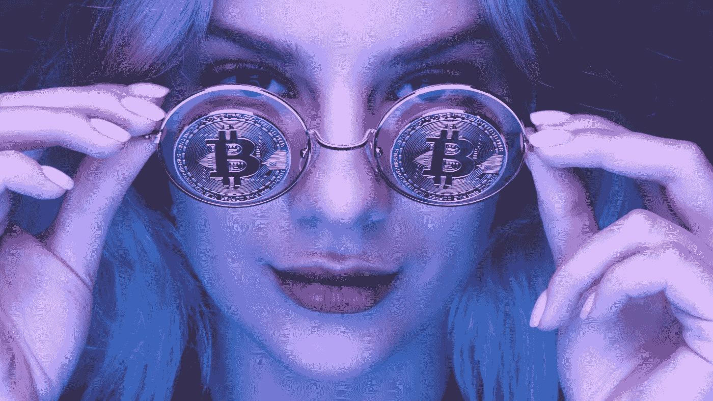

# 不，墨西哥没有推出加密货币|加密突发新闻

> 原文：<https://medium.com/geekculture/no-mexico-did-not-just-launch-a-cryptocurrency-crypto-breaking-news-12c9995206c1?source=collection_archive---------9----------------------->

## 一家墨西哥私营公司推出了 AxenCoin，而不是政府。

***没有炒作。没有 FUD。没有 FOMO。可能影响加密技术未来的突发新闻。*** [***订阅只需 5 美元/月！***](https://cryptofuturist.medium.com/membership)

> 我每天花 3 个多小时梳理加密新闻，所以你不必。
> 如果你觉得这个内容有价值，我非常感谢提示。***-ETH:****0x CB 056 fcf 3 FB 7 EC 68104 AC 3 a4 f 06 EB 018 ba 56 F2 a5* ***-BTC:****BC 1 qan ju 64y 5 ez 7g 4 ntg 0v 084 KF 38 uy pwff 7 TQ 8 p 8 p 8* ***-T29***

# 密码突发新闻，2022 年 5 月 4 日

## **AxenCoin 是“新的墨西哥加密货币”吗？**

有时候消息传得很快。并不总是出于正确的原因。有时，如果标题不清楚，很容易得出结论或寻找答案。当它故意模糊不清时，它被称为*点击诱饵。*

**(这篇短文讲的是*假*爆料。如果你愿意，你可以向下滚动到下面真正的爆炸性新闻。)**

一直流传着一个故事，标题中有“新墨西哥加密货币”的字样。这篇文章已经被几个新闻来源转载，包括一些金融新闻来源，并且在 Twitter 和其他社交网站上也流传了很多。

很多人乍一看，以为这意味着墨西哥政府推出了一种新硬币。事实是，这只是一个关于一家私人公司向成千上万的领域推出另一种加密货币的故事。

根据流传的故事:

> *“你将能够在百货商店、食品上花费阿克森币，但它也将作为交换手段；如果你想购买比特币或以太坊，你可以用 AxenCoin 来完成。”*

它继续落下一个大名字:

> 上周，墨西哥共和国[参议院](https://www.entrepreneur.com/article/425833)组织了一个论坛，以提高对加密货币使用的认识，并分析和触发其增长。参议员们肯定看到了一些东西，因为数字货币环境在墨西哥日益活跃是一个现实。"

当然，这枚硬币的发行和墨西哥参议院主办的论坛没有任何关系，无论是形式上还是形式上。

尽管如此，据报道，这枚硬币在推出后不久就从 10 美元涨到了 300 多美元，让一些人赚了很多钱，也让很多人赔了钱！

## 为什么这很重要

这只是 clickbait 和 *$#中的一节速成课！+币*点钞。

这是 clickbait 的第一个线索是加密货币没有国籍。没有所谓的“墨西哥加密货币”如果这是一个合法的故事，它会说，“墨西哥政府推出加密货币。”

其次，也是更重要的一点，除了项目本身的内容之外，我在 Google 上找到的关于 Axen 的信息非常少。然而，快速搜索发现了这个 [WikiFX Chrome 插件审查](https://www.wikifx.com/en/dealer/7363027120.html)，上面写着，“经核实，该经纪人目前没有有效的监管[原文如此]，请注意风险！”

底线是，如果一个项目一开始就不得不求助于点击诱饵内容来吸引注意力，我们就应该持怀疑态度。我真的很惊讶，这么多的出版物选择了这个毫无价值的故事。

在分享新闻之前，人们至少应该做一点点研究。

**现在播报真正的爆炸性新闻！**

# 更多突发新闻

*   [**每周机构 BTC 流出量达到 2021 年 6 月以来最高水平**](https://www.financemagnates.com/cryptocurrency/news/weekly-institutional-btc-outflows-reach-the-highest-level-since-june-2021/)
    *“在 BTC 价格艰难突破 4 万美元的同时，机构加密投资者已经开始加速从比特币投资产品中流出。上周，价值 1.33 亿美元的投资离开了 BTC 投资产品公司，这是近 11 个月来的最高水平。”*
*   [**承诺零汽油费的北海巨妖 NFT 公司的候补名单发布会**](https://decrypt.co/99346/waitlist-launches-for-kraken-nft-which-promises-zero-gas-fees)
    *“无汽油交易可能是北海巨妖 NFT 与众不同的地方。据该公司称，一旦 NFT 由该平台托管，用户就不必为该网站上的交易活动(包括销售和转让)支付任何与区块链相关的天然气费用*

*   [**NFT 博彩公司 Stakes 筹集 530 万美元建立社交博彩平台**](https://www.sportspromedia.com/news/nft-betting-stakes-seed-funding/)
    *“数字体育博彩越来越像数学作业——缺乏激励粉丝，尤其是新一代体育爱好者的情感、能量和社区意识。赌注通过使用 NFTs 作为奖励，重新想象了 21 世纪的体育博彩。”*
*   [**星巴克今年将推出 NFTs，提供“独特的体验和好处”**](https://techcrunch.com/2022/05/04/starbucks-to-launch-nfts-this-year-offering-access-to-unique-experiences-and-benefits/)
    *“我们正在创造数字第三地。为了实现这一目标，我们将拓宽人们成为星巴克社区成员的意义框架，加入我们在 Web3 领域看到的所有权和基于社区的会员模式等新概念。”*
*   [**Polkadot 现在允许您跨副链发送令牌**](https://www.theblockcrypto.com/post/144989/polkadot-now-lets-you-natively-send-tokens-across-parachains)
    *“现在 Polkadot 的跨链消息协议已经启用，Polkadot 已经实现了成为完全可互操作的多链生态系统的目标。”*

# 有趣的加密文章

*   [**保护比特币开采由卢克索的尼克·汉森主演**](https://bitcoinmagazine.com/business/bitcoin-bottom-line-protecting-bitcoin-mining)
    *“威尔逊说，‘散列率是全球性的，机器每隔几年就会变得更好，现在有了新的创新，因为像卢克索这样的公司正在涉足固件领域。’”*
*   [**阿罗哈密码！夏威夷州批准任务小组监管比特币和 Web3 技术**](https://bitcoinist.com/hawaii-approves-task-force-to-regulate-crypto/)
    *“任务委员会计划研究来自其他司法管辖区的数据，并制定‘促进区块链在私营和公共部门使用的路线图’，等等。”*
*   情侣关系漫画成为 NFT 新系列的灵感来源
    *“耶胡达和玛雅·德维尔因他们迷人的关系漫画《那一天》而闻名。这个网络漫画已经活跃了多年，记录了他们作为已婚夫妇和现在作为父母的生活。这种关联性、幽默和真诚已经赢得了超过 900 万人的忠诚社区。这使他们出版了五本书，成为 TEDx 讲师，为艺术家和创客开设了在线课程，等等。”*
*   [**IOST 与 Label Foundation 合作，推动 NFT 音乐产业**](https://cointelegraph.com/press-releases/iost-partners-with-label-foundation-to-drive-music-nft-industry) **Label 团队是最早致力于为顶级音乐人(包括格莱美获奖艺术家)的音乐 IP 不可兑现令牌(NFT)创建可持续生态系统的先锋之一，这些音乐 IP 不可兑现令牌受到分布式账本的保护。”**
*   *[**NFT 成长的烦恼:“蓝筹股”的成功暴露了以太坊的弱点和市场优势**](https://www.forbes.com/sites/michaeldelcastillo/2022/05/03/nft-growing-pains-blue-chip-success-exposes-ethereum-weaknesses-and-market-strengths/?sh=35c0d58a675f)
    *“很多人卖掉了一些优质资产来筹集流动性。因此，如果你在过去的六个月里投入了大量自己的密码并投资于 NFTs，你可能会缺乏流动性，获得更多流动性的唯一方法是以折扣价出售一些东西。”**
*   *[**《华尔街日报》称“NFT 市场正在崩溃”，但数据显示并非如此**](https://cointelegraph.com/news/wsj-says-the-nft-market-is-collapsing-but-the-data-says-otherwise)
    *“追踪 NFT 十大项目的南森蓝筹 10 指数今年迄今上涨了 81%，而相比之下，追踪顶级艺术和博彩 NFT 藏品的指数今年以来分别下跌了 39%和 49%。”**
*   *[**加密货币的肮脏秘密:能源消耗**](https://news.climate.columbia.edu/2022/05/04/cryptocurrency-energy/)
    *“谈到比特币的能源使用，它目前有点像一个‘投机者’市场。德克萨斯州电网运营商 ERCOT 估计，到 2023 年年中，加密矿工可能会增加高达 60 亿瓦的能源需求，大致相当于为电网增加另一个休斯顿。**
*   *[**加密货币挖矿其实需要清理吗？**](https://corp.smartbrief.com/original/2022/05/does-cryptocurrency-mining-actually-need-to-be-cleaned-up)
    *“Soluna Computing 的创始人兼首席执行官约翰·贝利扎尔(John Belizaire)参加了这个节目，深入探讨加密货币采矿和区块链技术如何影响网格。”**

# *最近的加密视频*

# *最近的解密新闻报道*

*   *[**秒加倍对密码警察**](/coinmonks/sec-to-double-up-on-crypto-police-e0ce0d011149)*
*   *[**美国参议员:“限制对密码的资本利得税”**](/geekculture/u-s-senators-limit-capital-gains-tax-on-crypto-crypto-breaking-news-cb86aa332dd0)*
*   *[**币安冻结克里姆林宫关联账户**](https://blog.blockmagnates.com/binance-blocks-kremlin-linked-accounts-crypto-breaking-news-6365aa7a86bf)*
*   *[**NFT 是合法的金融工具:高盛**](https://blog.cryptostars.is/goldman-sachs-sees-nfts-as-legit-financial-instruments-crypto-breaking-news-6c5cdceeb3b2)*
*   *[**富达将比特币纳入 401k 退休计划|加密突发新闻**](/coinmonks/fidelity-to-include-bitcoin-in-401k-retirement-plans-f9feccf3f3c7)*
*   *欧洲刚刚禁止了加密钱包吗？*

# *订阅只需 5 美元*

*[**订阅加密突发新闻**](https://cryptofuturist.medium.com/membership) 接收每日邮件更新。
跟随 Crypto Futurist 上 [**中**](http://thecryptofuturist.io/) 、 [**推特**](https://twitter.com/PaceLavia) 、 [**Instagram**](https://www.instagram.com/thecryptofuturist/) 。*