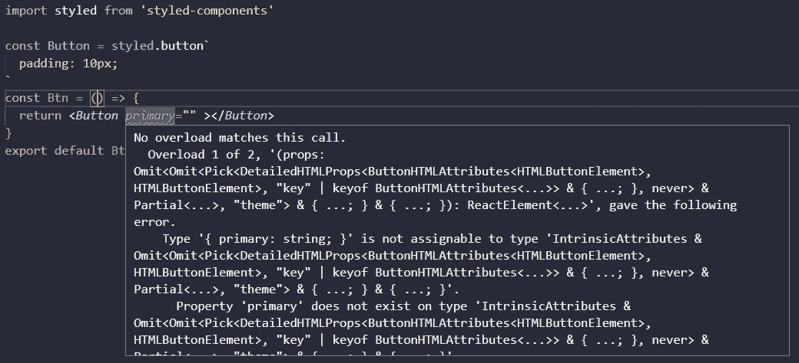
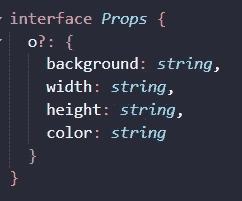
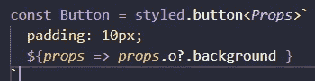
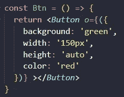
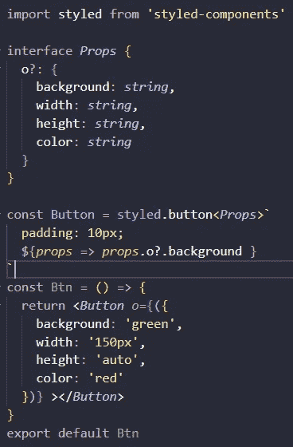

# 没有重载将此调用与样式化组件 TypeScript 匹配

> 原文：<https://medium.com/geekculture/no-overload-matches-this-call-with-styled-components-typescript-eea63fe7e231?source=collection_archive---------3----------------------->

如何尽快解决这个问题！！！

# 问题

没有重载匹配这个调用在 TypeScript 中真的很烦人，没有太多的解决方案，虽然我们有一个解决方案！！



Example No overload matches this call.

你需要创建一个接口，在这个接口中你只需要添加一个你需要的所有类型的对象。因为它是可选的。



Example Interface

在那之后，你必须在 styled.button 之后设置它(在这个例子中)作为一个泛型，这将只接受你在接口上需要的所有类型的这个对象。



Adding generic to the Styled component

最后，您只需要添加“o ”,因为我们在接口上创建了这个“o ”,作为您的按钮样式组件的一个属性，其中包含我们在接口上添加的类型。



Example styled component without error “No overload”



Complete Example of no error in styled component

# 密码

```
import styled from 'styled-components'interface *Props* {
o?: {
background: *string*,
width: *string*,
height: *string*,
color: *string* }
}const Button = styled.button<*Props*>`padding: 10px;`const Btn = () => {
return <*Button* *o*={({
background: 'green',
width: '150px',
height: 'auto',
color: 'red'})} ></*Button*>
}
export default Btn
```

# 结论

这个错误真的很容易解决，但我真的想出了如何解决它，因为没有太多的解决方案，这并不像它显示的那样困难。错误是惊人的，但如果你坚持不懈或过于咄咄逼人，你会征服它，这个解决方案将帮助你很多。

# 来源

[](https://stackoverflow.com/questions/65750628/no-overload-matches-this-call-with-styled-components) [## 没有重载将此调用与样式化组件匹配

### 我试图创建一个按钮组件使用样式的组件，需要一个道具，可以是组件类型|…

stackoverflow.com](https://stackoverflow.com/questions/65750628/no-overload-matches-this-call-with-styled-components)