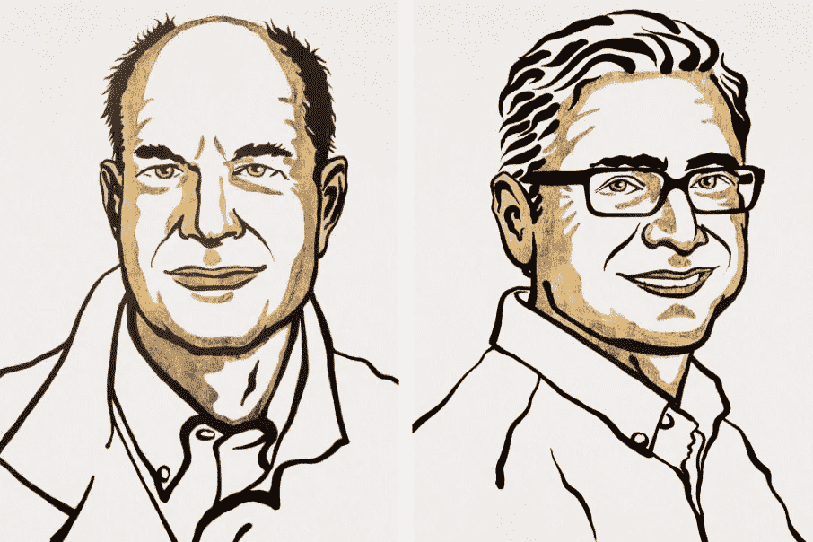
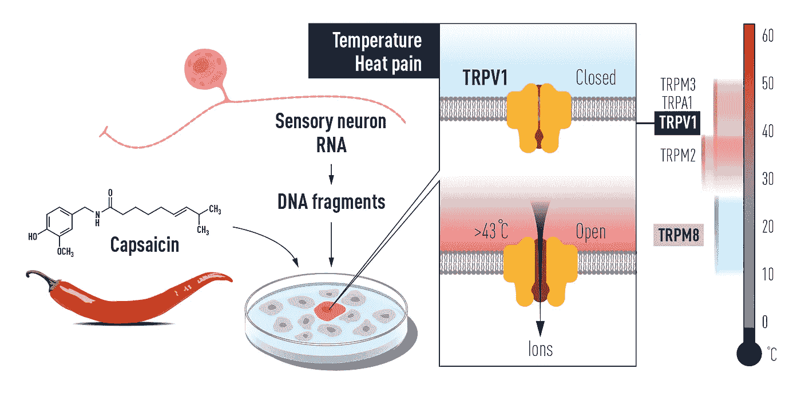
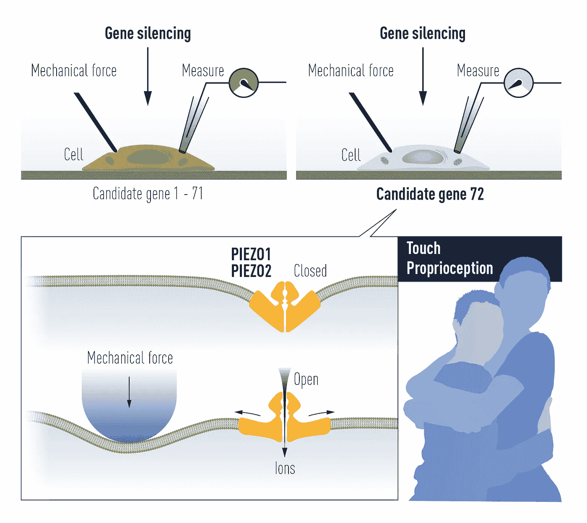
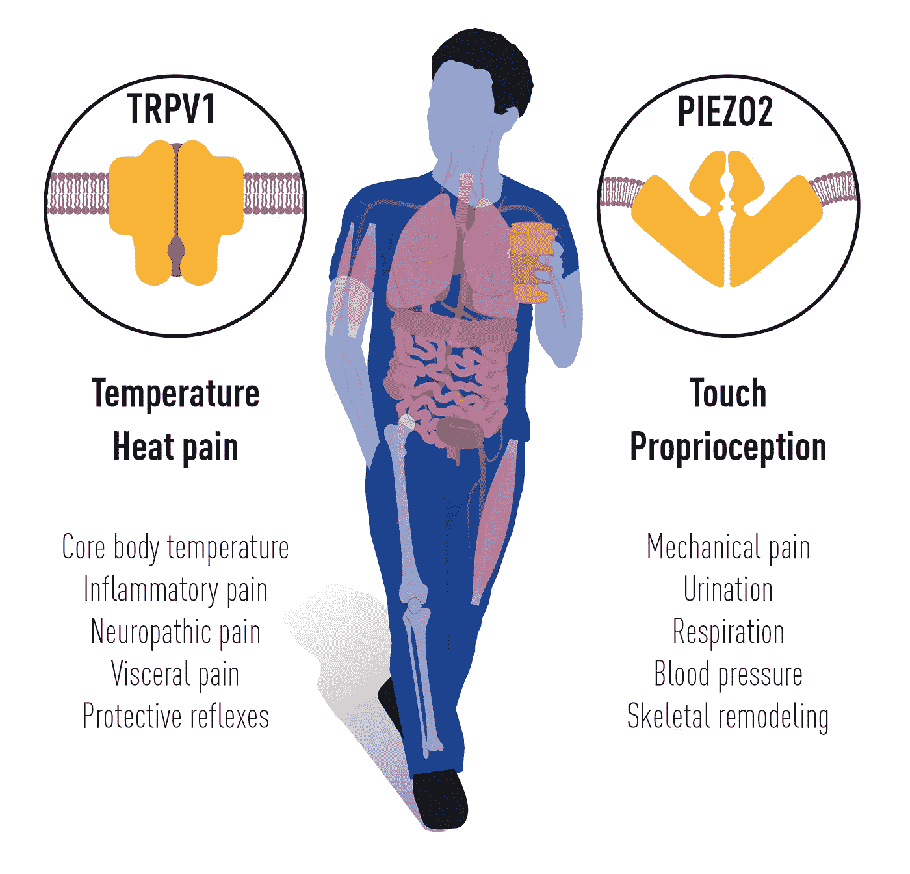

# 诺贝尔奖授予对温度和触觉的研究

> 原文：<https://medium.com/geekculture/nobel-prize-awarded-for-research-about-temperature-and-touch-fab4fa7f2a21?source=collection_archive---------28----------------------->

生理学家大卫·朱利叶斯和神经科学家 Ardem Patapoutian 因发现温度和触觉受体细胞而获得诺贝尔医学奖。斯德哥尔摩的诺贝尔评审团表示，他们的“革命性发现”使“理解热、冷、机械力如何启动神经冲动，让我们感知和适应世界成为可能”。

谁是大卫·朱利叶斯和阿尔登·帕塔普蒂安？

Credit: [Niklas Elmehed © Nobel Prize Outreach](https://www.nobelprize.org/prizes/medicine/2021/summary/)

[65 岁的大卫·朱利叶斯](https://fr.wikipedia.org/wiki/David_Julius)是加州[大学](https://www.universityofcalifornia.edu)的教授，他利用辣椒素(红辣椒中引起灼烧感的活性成分)来识别皮肤神经末梢中对热量做出反应的传感器。

出生于 1967 年的加州斯克里普斯研究所教授 Ardem Patapoutian 利用压力敏感细胞发现了一种新型传感器，这种传感器能够对皮肤和内脏器官中的机械刺激做出反应。这些细胞用于触觉反馈设计，并在我们的智能手机上使用，这要归功于 haptics android 和 iphone。

**当科学遇上温度感知。**

吃一个辣椒、一颗薄荷糖、芥末……我们经常把这些场合的感觉与热或冷联系起来。这并不奇怪，因为旧金山加利福尼亚大学的大卫·朱利叶斯团队表明，参与这些感知的受体是相似的。这项工作刚刚被授予 2021 年诺贝尔医学奖的一半。这项工作也与触觉反馈相关，触觉反馈是我们在 android 或 iphone 上通过触觉感知的触觉。

在 20 世纪 90 年代，该小组研究了由辣椒素激活的 TRPV1 受体(瞬时受体电位香草素 1)，辣椒素是辣椒中的“非常”活性成分，以及香草素家族的类似化合物，如…香草醛。他们随后发现，这种受体对热(44℃以上)也很敏感。作为对这些刺激之一的响应，位于敏感神经元末端的 TRPV1 改变了其构象，从而打开了它:钙和钠离子随后进入细胞并触发神经元信号。

[https://www.nobelprize.org/prizes/medicine/2021/advanced-information/](https://www.nobelprize.org/prizes/medicine/2021/advanced-information/)

这些离子通道家族随后随着同一组发现对薄荷醇和寒冷敏感的受体 TRPM8 以及被芥末和山葵化合物激活的受体 TRPA1 而传播开来。当摄入被描述为“强烈”的食物时，这就是导致流泪和咳嗽的原因。这些不同受体的结构，对于理解它们的功能至关重要，是通过电子冷冻显微镜(样品在电子显微镜下观察之前被冷冻)揭示的。

这些蛋白质的作用超出了简单的味觉感知，因为它们也有助于疼痛的感知，正如 David Julius 几年前在《科学》杂志上解释的那样，通过伤害感受的途径，这些途径向中枢神经系统指示非常明显的刺激，如烧伤。

**寻找感觉感受器**

在花了大约一年时间在实验室培养皿中戳神经细胞后，Patapoutian 发现了一种响应机械压力而打开的受体。被称为压电 1，它是根据希腊单词压力命名的。第二个感受器，称为压电 2，也允许人们感觉触摸。

[https://www.nobelprize.org/prizes/medicine/2021/advanced-information/](https://www.nobelprize.org/prizes/medicine/2021/advanced-information/)

压电 2 是皮肤中称为默克尔细胞的神经细胞上的受体。他们感觉到轻微的触摸和爱抚。这种受体还有助于肺部神经防止器官过度膨胀。它甚至在膀胱和肠道功能中发挥作用。出生时没有压力感受器的孩子有平衡问题；Koroshetz 解释说，它们不知道自己的肢体在哪里。"当他们伸手去抓东西时，他们不得不看着自己的手指在哪里。"这种受体的异常反应也可能在青光眼、眼疾和高血压中起作用。

触觉和温度感受器也可以帮助我们感知疼痛。一些公司正试图阻止这些热感受器。这样做可能会减轻疼痛。Gary Lewin 说，但是制药公司一直在努力寻找通过这些受体发挥作用的新药。他在柏林马克斯·德尔布吕克分子医学中心的实验室研究身体如何对感官刺激做出反应的分子作用。

**这一切都有道理！**

今年诺贝尔奖获得者对 TRPV1、TRPM8 和压电通道的突破性发现使我们能够理解热、冷和机械力如何启动神经脉冲，使我们能够感知和适应周围的世界。TRP 通道对我们感知温度的能力至关重要。压电 2 通道赋予我们触觉和感受身体部位位置和运动的能力。TRP 和压电通道也有助于许多依赖于感知温度或机械刺激的附加生理功能。源于今年诺贝尔奖的密集研究集中在阐明它们在各种生理过程中的功能。这一知识正被用于开发多种疾病的治疗方法，包括慢性疼痛。

[https://www.nobelprize.org/prizes/medicine/2021/advanced-information/](https://www.nobelprize.org/prizes/medicine/2021/advanced-information/)

**谁是 Interhaptics？**

[Interhaptics](https://www.interhaptics.com) 是一家专门从事[触觉](https://www.interhaptics.com/explore/what-is-haptics)的软件公司。Interhaptics 为虚拟现实(VR)、混合现实(MR)、iphone 和 android 的移动触觉、增强现实(AR)和控制台应用程序提供手部交互和触觉反馈开发和部署工具。Interhaptics 的使命是促进可扩展的 haptics 生态系统的发展。Interhaptics 致力于为 VR/MR/AR、移动和控制台开发人员社区提供一流的开发工具，以及支持 haptics 的内容在任何支持 haptics 的平台上的互操作性。

