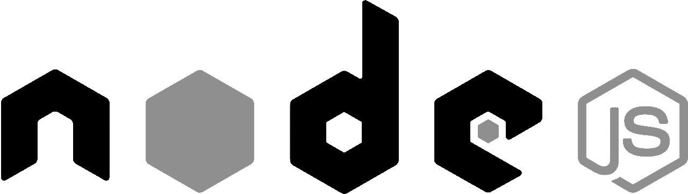
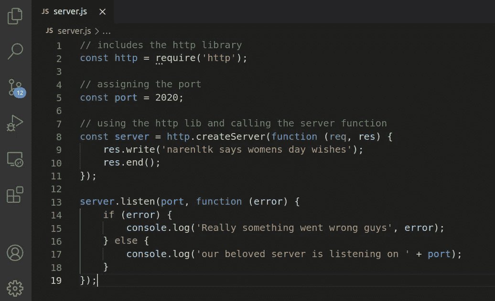
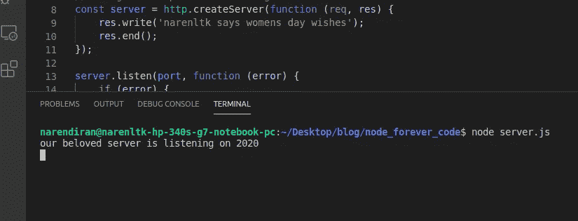
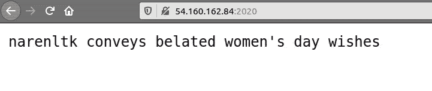
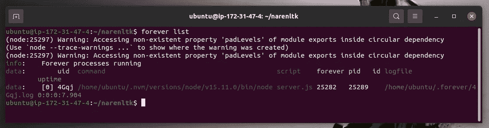
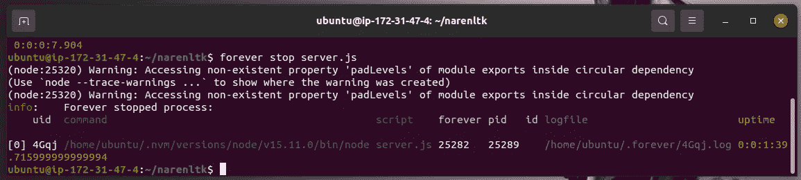
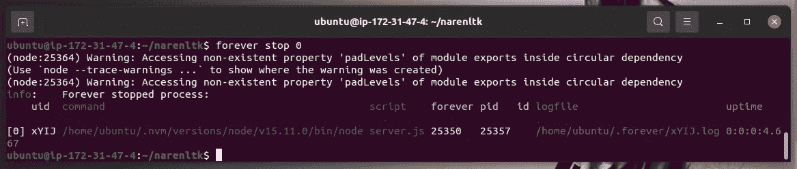
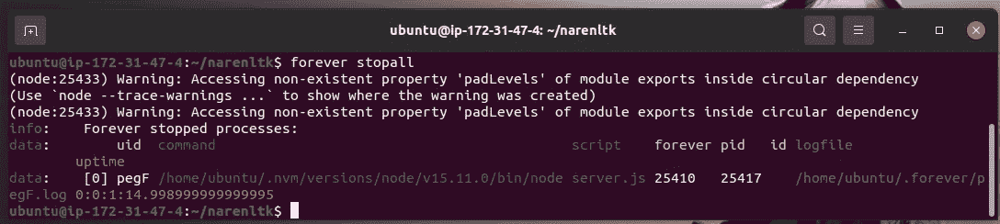
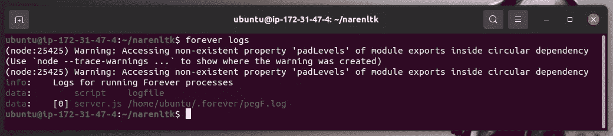
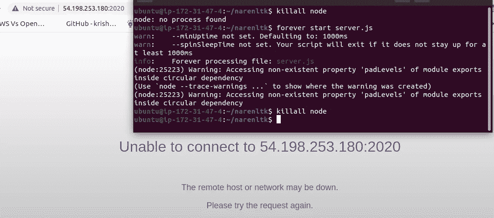

# 任何虚拟机上的节点永久 JS

> 原文：<https://medium.com/geekculture/node-forever-js-on-any-virtual-machine-e5d573583b67?source=collection_archive---------17----------------------->

## 从任何虚拟机永久托管您的 web 应用



credit goes to some random dude in this world

如果您曾经想要永久托管 Node.js 应用程序，那么就在这个正确的地方。在这里，您将学习如何永远运行 Node js 应用程序，即使控制台关闭。

## **永久** →一个简单的 CLI 工具，用于确保给定脚本持续运行(即永久运行)

如果你曾经在使用虚拟机时遇到过如下所示的问题，那么，这个博客将帮助你克服这个问题。

```
“ **client_loop: send disconnect: Broken pipe** “
```

是的，这种情况总是在使用云时发生，这就是 package Forever Js 派上用场的地方。

在这里，我将揭示所有有用的命令是永远的 Js 所需要的。现在我们开始吧，不过在开始之前，先安装 forever js。

代码如下:

```
**sudo apt-get update****sudo su****npm i forever -g**
```

下一步是创建一个测试节点 js 应用程序，我们将把它用于这个永久的应用程序。

> **注:**
> 
> **伙计们，我正在使用 EC2 服务器实例，像往常一样，我只是抓取了自由层限制下的任何东西，即 Ubuntu 或任何基于 Linux 的操作系统。**

下面是代码，首先创建一个 **server.js** 文件



Server js code

一旦你这样做了，只要验证它是否工作正常



verify whether it works without error

现在，使用分配给 EC2 实例的 IP 访问浏览器，这样就可以验证这一点，如下所示



verify from your browser

好吧，我想我们现在有我们心爱的服务器成功运行。

现在剩下的就是利用永久的 js 库了。

## **永远的命令**

## **永远开始**

通常，我们通过运行 node server.js 代码来启动我们的服务器，但是在这里，在运行时使用代码会有一个小的变化，代码如下:

```
**forever start server.js**
```

## **永远的名单**

好了，现在我们可以使用永久列表命令进行验证

```
**forever list**
```



forever list

这个命令实际上是用来列出所有永远运行的脚本，它不会在这里停止。它还向我们显示位置、进程 id、运行时间以及正在运行的每个脚本的日志文件名的详细信息。

## **永远停止**

下一个命令是停止，是的，如果有一个开始，那么肯定会有一个停止。

我们可以停止使用您想要停止的脚本的文件名。

代码如下所示，

```
**forever stop server.js**
```

使用这个命令，您必须到达节点应用程序正在运行的文件的特定位置，然后才停止运行，否则它将无法正常工作。



forever stop cmd

好吧，如果你想停止一个基于 uid 的文件。

## **永远停止 uid**

嗯，无论何时使用 forever 命令启动 else list，都会显示带有 uid 的脚本的输出。因此，我们也可以停止使用这些命令，而不是键入脚本文件的名称。您可以使用 start 或 list 命令进行验证。现在键入以下命令，

```
**forever stop o**
```



forever stop 0

即使在这里，您也可以看到我提到的 uid。

## **永远停止**

好吧，如果你想停止所有正在运行的程序，简单的 stopall，但是有两个命令，一个是永久命令，另一个是普通的节点命令。



forever stopall

## **永远的日志**

如果您希望找到日志，那么您可以使用下面的代码

```
**forever logs**
```

它将列出该列表，以及与 uid 一起运行的每个脚本的路径。



forever logs

既然我们停止了 forever 脚本并验证了我们的浏览器，它应该会弹出以下屏幕，



killall node

为此，您可以使用任何命令，即正常节点命令或永久命令，

```
**killall node****forever stopall**
```

现在您可以使用 forever start 命令并关闭 EC2 实例终端，然后自己进行验证。

我想我已经给出了大部分 Forever js 命令的细节，剩下的几个命令我会给你们，并尝试一下。

## 命令:

```
**forever restart server.js****forever restart 0 -->** restarts uid o script alone**forever restartall -->** restarts all running forever scripts**forever -h -->** -h, –help: Command line help information**forever config -->** lists all forever user configurations**forever clear -->** clears the specified forever config by its key**forever cleanlogs -->** deletes all historical forever log files**forever set -->** defines a forever config value for an unique key
```

你可以在我的 GitHub 中找到 server.js 文件。

> **GitHub**[链接 ](https://github.com/narenltk/forever_node_js)

如果您想了解如何使用 openssl 为 web 应用程序进行证书绑定，

[](https://javascript.plainenglish.io/generate-ssl-certificate-using-node-js-for-web-apps-73d452ad5898) [## 使用 Node.js 为 web 应用程序生成 SSL 证书

### 嘿，这里的每一个人，我将给你们一个带 SSL 证书的节点 js 应用程序的基本设置的提示。我们会…

javascript.plainenglish.io](https://javascript.plainenglish.io/generate-ssl-certificate-using-node-js-for-web-apps-73d452ad5898) 

> **如果您希望保持联系，**

[](https://www.linkedin.com/in/narenltk/) [## Narendiran Krishnan —印度泰米尔纳德邦哥印拜陀|职业简介| LinkedIn

### 查看世界上最大的职业社区 LinkedIn 上 Narendiran Krishnan 的个人资料。纳伦德兰有 6 份工作…

www.linkedin.com](https://www.linkedin.com/in/narenltk/) [](https://github.com/narenltk) [## narenltk —概述

### 骗人的把戏。需要咖啡来聚焦…！！！narenltk 有 10 个可用的存储库。在 GitHub 上关注他们的代码。

github.com](https://github.com/narenltk) 

> 你可以用谷歌搜索“narenltk / narendiran krishnan”或者发邮件到→narenltk@gmail.com→乐意帮忙..！！！