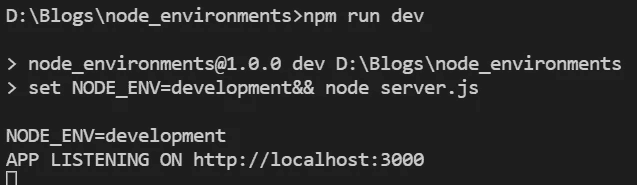
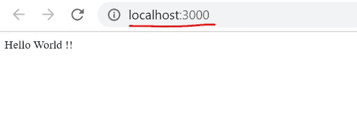
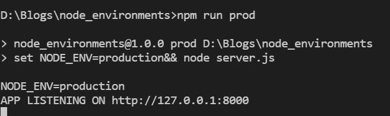
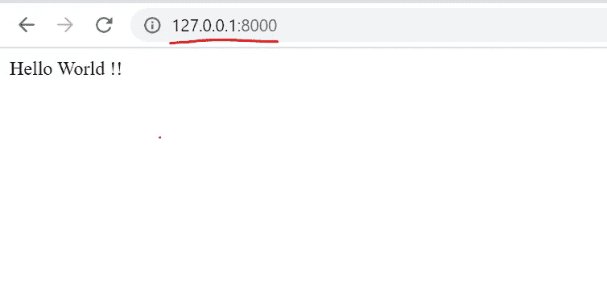

# Node JS 环境变量—为多个环境设置 Node app。

> 原文：<https://medium.com/geekculture/node-js-environment-variables-setting-node-app-for-multiple-environments-51351b51c7cd?source=collection_archive---------0----------------------->


环境变量是 Nodejs 最重要的核心概念之一，因为它们允许我们为多个环境配置应用程序，并允许应用程序在每个环境(如开发、测试、试运行、生产)中表现不同。它通常用于配置我们的应用程序应该连接到不同环境模式的端口、数据库连接、主机，或者可以用于您认为应该根据您运行应用程序的环境模式而更改的代码的任何部分。将环境变量配置到一个单独的文件中，而不是在我们的 node js 代码中，这使我们能够运行应用程序并将其指向不同的环境，而无需重新构建或更改代码。

在这个博客中，我们将看到如何设置自定义。使用 **dotenv** 库的不同环境的节点应用程序的 env 文件

# 入门指南

让我们先从创建一个节点应用程序开始

# 设置我们的节点应用程序⚙

要创建一个节点应用程序，用 **npm init** 命令创建 package.json 文件

```
npm init
```

用 Express 包安装 Express.js

```
npm express --save
```

# 使用 dotenv 包为多种环境设置我们的节点应用程序

让我们首先使用下面的命令在我们的应用程序中安装 dotenv 包

```
npm i dotenv --save
```

***现在我们已经完成了应用程序所需的所有库的安装，让我们继续创建节点应用程序，并使用 dotenv 库为多种环境配置应用程序。***

**多环境节点 app 设置步骤:**

1️⃣创造了两个。 **env** 文件 **development.env** 和 **production.env**

2️⃣创建一个 **config** 文件来从**读取**和**设置**环境。我们在第一步中创建的 env 文件

3️⃣创建一个 **server.js** 文件作为我们的 nodeapp 的启动文件

4️⃣在 **package.json** 中为多个环境设置 **npm run** **脚本**。

# **🔸创造。环境文件**

让我们创建两个新文件 **development.env** 和 **production.env** ，每个环境一个，其中将包含 NODE_ENV 变量、我们希望应用程序运行的主机和端口:

**development.env**

**production.env**

# 🔸创建配置文件

配置文件将使用 **dotenv** 库，这将允许我们加载所需的。env 文件通过 **config()** 方法和 **path** 对象实现。读取文件后，我们将变量的值设置为。env 文件并导出它们，以便在 **server.js** 文件中进一步使用它们

# 🔸创建一个 **server.js** 文件

既然我们有不同的。env 和 config 准备就绪，我们现在将在 **server.js** 文件中创建我们的应用程序的起点，server.js 文件将导入 config.js 文件并基于此配置运行我们的应用程序。

# **🔸设置 npm 运行命令:**

我们将修改 **package.json** 文件以添加两个新任务，对于每个环境，我们将设置我们希望我们的应用程序运行的 NODE_ENV，并为我们的应用程序指定启动文件，即 server.js

现在让我们以两种不同的模式(开发和生产)运行我们的应用程序，看看我们的应用程序如何选择我们为这些模式设置的配置。

要在开发模式下运行应用程序，请使用以下命令:

```
npm run dev
```

***这里发生了什么？:*** *当我们运行* **npm 命令运行 dev** *，* **NODE_ENV** *被设置为***development***from****package。json*** **脚本段，在 config.js 文件中，***dotenv . config***函数读取***development . env***文件并设置* **环境变量** *如***development . env***文件、* **server.js** *文件中所指定的这些设置值**

*您将看到我们的应用程序选择了我们在 **development.env** 文件中设置的配置，即 **PORT : 3000** 和 **HOST : localhost***

**

*app running in development mode*

**

*要在生产模式下运行应用程序，请运行命令*

```
*npm run prod*
```

*您将看到我们的应用程序选择了我们在 **production.env** 文件中设置的配置，即**端口:8000** 和**主机:127.0.0.1***

**

*app running in production mode*

**

# *结论*

*为我们的节点应用程序配置不同的环境模式使我们能够为每种模式指定不同的配置，并允许我们运行我们的应用程序，而无需重新构建我们的应用程序或更改我们的代码。*

*您可以在这里访问该项目:[https://github.com/RaheelShaikh/node_env.git](https://github.com/RaheelShaikh/node_env.git)*

****如果你觉得这篇文章很有帮助，请鼓掌👏并与您的朋友分享🤘****