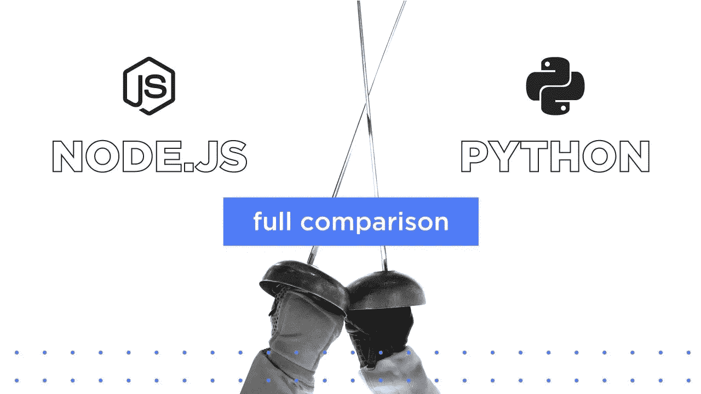
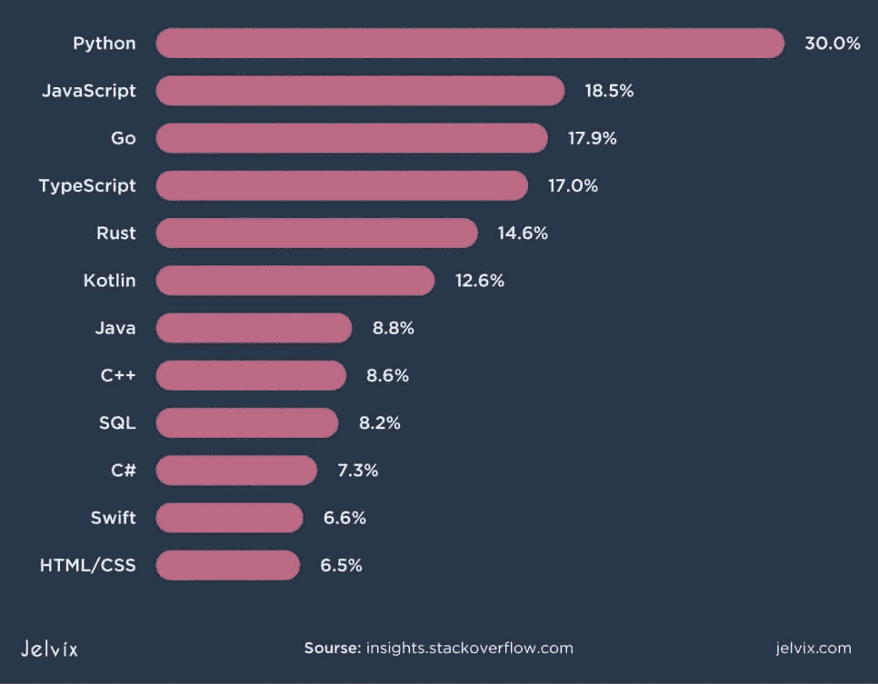
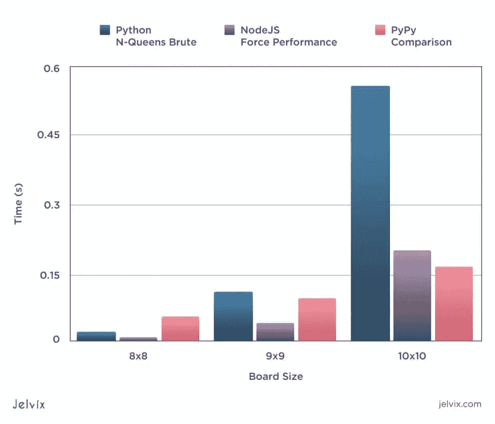
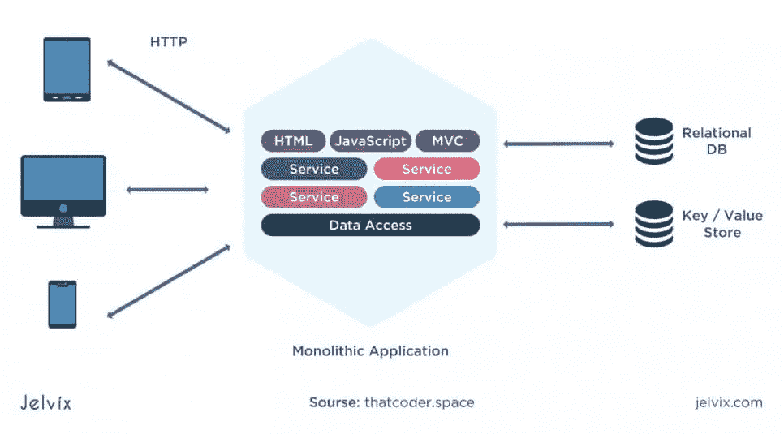
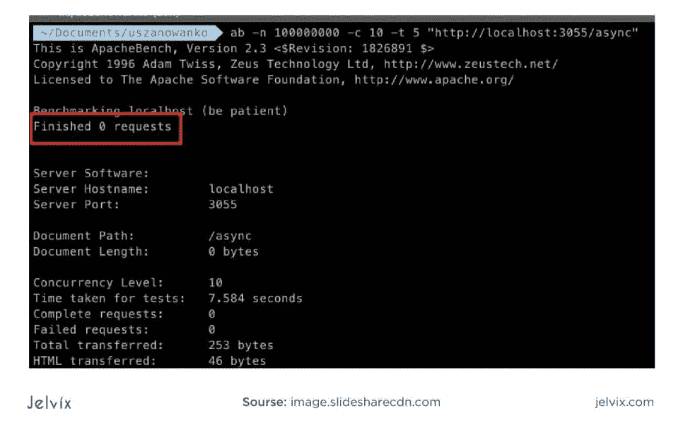
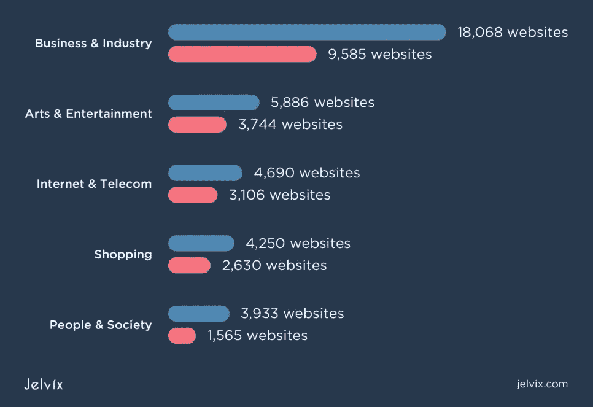
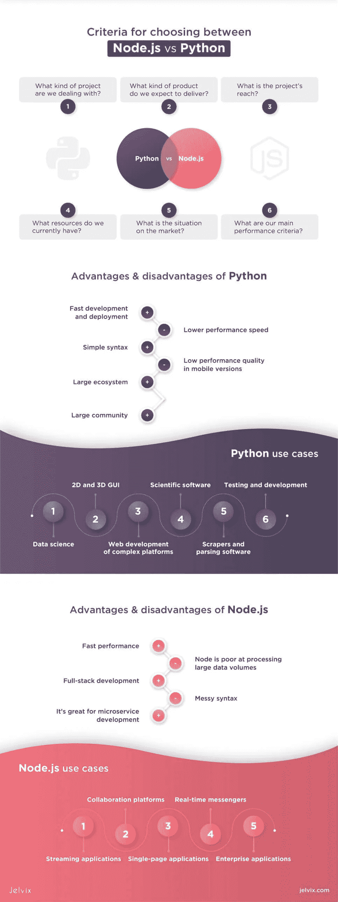

# Node.js 与 Python 进行后端开发

> 原文：<https://medium.com/geekculture/node-js-vs-python-for-backend-development-ab396ff17b22?source=collection_archive---------17----------------------->

在选择后端开发的编程语言时，您需要提前做出许多决定。选择后端技术栈的主要问题是，它意味着你对产品的深入了解。您的选择决定了产品将如何操作、扩展和满足用户要求。

这就是为什么，尽管在后端开发方面有多年的经验，即使是现在，我们在选择后端开发工具时也要进行彻底的研究。最常见的困境之一是在 Python 和 Node.js 之间做出选择。这两种选择都非常受欢迎，并且都有其优缺点。

在本文中，我们将分享我们对 Python vs Nodejs 开发的看法。首先，我们将比较它们各自的优缺点，然后将它们放在一起，按照关键标准进行精确比较。

# 选择 Node.js 还是 Python 的标准

为项目选择后端语言时，最好马上定义期望。当我们为客户选择技术组合时，我们通常关注以下标准。

我们在处理什么样的项目？项目类型从商业应用、或计算应用到基于数据的软件、信使、[社交媒体](https://jelvix.com/blog/develop-a-social-media-app)等等。它定义了后端操作的性质和强度。

我们期望交付什么样的产品？这里，我们分析一下软件的重点。它是一个重数据的应用程序还是一个注重界面的程序？它的功能主要是静态的还是交互的？为了得到答案，我们分析了竞争对手、市场和用户的期望。

**项目的范围是什么？**当我们选择后端堆栈时，了解我们将处理哪种负载至关重要——本地、全国还是国际项目。项目的地理范围越大，我们在选择建筑和技术解决方案时就越小心。

**我们目前有哪些资源？**其他团队成员拥有哪些技能？他们以前使用过什么技术？

**市场上的情况如何？**我们检查所选技术的专家的可用性。我们希望有足够的选择，以确保我们不会面临更换或增加新的开发人员。

我们的主要绩效标准是什么？没有一个后端工具是完美的。理想情况下，我们需要高速、[安全性](https://jelvix.com/blog/database-security)、交互性和响应性，但是没有一个选项能够完美地满足所有这些要求。我们应该选择那些优先级较高的，并选择一个专注于这些特征的工具。

现在，让我们深入分析 Python 和 Node，检查它们的优点、缺点、特征和用例。

# Python:简介和统计

Python 是一种面向对象的动态语言，以其简单、有组织的语法和通用性而闻名。随着[机器学习](https://jelvix.com/blog/machine-learning-as-service-companies)和[人工智能](https://jelvix.com/blog/ai-vs-machine-learning-vs-deep-learning)的日益流行，Python 成为市场上最受欢迎的语言之一。

Python 的主要优势之一是支持多种编程风格——这使得它同样非常适合复杂的计算项目和简单的网站。让我们看看这种语言为不同的项目类型提供了哪些优势。

**Python 使用统计**

根据 [JetBrains 的研究](https://www.jetbrains.com/research/python-developers-survey-2018/#:~:text=General%20Python%20Usage&text=84%25%20of%20Python%20users%20in,language%20and%2021%25%20as%20secondary.)，大多数了解 Python 的开发人员将它作为主要语言使用(大约 87%的受访工程师)。大约 50%的人将它与 JavaScript 一起使用——这一事实显示了 Python 在 web 后端的使用有多普遍。

当被问及 Python 用于哪些类型的开发时，结果是 27%的人将 Python 用于 web 开发，28%用于机器学习，大约 18%用于数据分析，一小部分人选择了其他用途。

最重要的是，根据统计数据，Python 是 2020 年最流行的编程语言。29%的开发人员使用它——相比之下，Java 和 JavaScript 的使用比例分别为 19%和 8%。

Python 的语法和生态系统非常适合当前开发市场的需求。让我们快速总结一下促成这种压倒性增长的特征。

# Python 的优势

统计数据清楚地表明，Python 同时受到开发人员、企业主和员工的喜爱。比起其他语言，学习 Python 的人往往更喜欢它——这就是为什么它是许多人首选的主要语言。我们也喜欢 Python——这里有五个原因(尽管这个列表可能会变得更长)。

## 快速开发和部署

Python 动态和面向对象的语法允许开发人员快速编写复杂的代码。包、插件和库为几乎所有东西提供了现成的选项——从简单的 web 后端到复杂的科学计算(是的，NumPy，我们正看着你)。

多种开发方式的通用性和支持，使得 Python 适合于[MVP](https://www.techopedia.com/definition/27809/minimum-viable-product-mvp)和原型的开发。好处是显而易见的——上市时间缩短，同时支持各种迭代的机会，以及高比例的重用代码。

## 简单语法

Python 比包括 Node.js 在内的许多编程语言和框架使用更少的代码行。然而，这不仅仅是代码的大小，它的措辞也很简单。Python 允许开发人员用几行代码描述复杂的概念。

Python 的一个显著特点是频繁使用英文关键词，而不是数学表达式。代码易于阅读和理解。假设你和多个团队一起工作。Python 是个好主意——因为开发人员可以很容易地借鉴他人的成果。不像 [Ruby](https://jelvix.com/blog/red-or-blue-pill-neo-ruby-vs-python-which-will-you-choose-for-your-backend) 和 [Perl](https://www.perl.org/) ，这两种语言提供了许多方法来解决同一个问题，Python 提供了最直接的解决方案(通常只有一个)。

这种一致的方法使得建立代码标准并在整个产品生命周期中维护它们变得容易。

## 大型生态系统

Python 最近如此受欢迎的主要原因可能是它能够应对多种开发挑战。尽管这个生态系统非常古老，但是不断涌入的新包和插件使 Python 保持了相关性。目前，它是最适合人工智能、[计算机视觉](https://www.sas.com/en_us/insights/analytics/computer-vision.html)、机器学习、[数据科学](https://jelvix.com/blog/top-data-science-programming-languages)、统计学和其他领域的语言之一。

让我们看看 Python 生态系统中一些最流行的包——这只是冰山一角。

**机器学习和深度学习资源** **语言处理** **网页开发**

*   [Scikit-learn](https://scikit-learn.org/) —一个机器学习库，它利用其他 Python 包(如 SciPy 和 NumPy)来帮助自动化数据分析和挖掘。该库是开源的，可以免费用于商业用途。开发人员使用它来构建基本的机器学习算法(决策树、随机森林等)。
*   [Torch](https://pytorch.org/) —最简单的机器学习库之一，拥有丰富的生态系统和简单的界面。值得注意的是，它提供了稳定的 GPU 支持和简单的基于 C 的接口。
*   [TensorFlow](https://www.tensorflow.org/) —最流行的机器学习开源库。无论你想构建哪种算法，是旧的还是新的，都可以用 TensorFlow 来执行。

**语言处理**

*   NLTK 是一个自然语言工具包，提供自然语言处理、机器学习、语言解析等功能。免费的模板、资源和数据集可以集成到软件的后端。
*   [Gensim](https://radimrehurek.com/gensim/) —自动定义句子语义结构的文本处理库。这对于准备文本建议、修改和检测文本的含义非常有用。

**网页开发**

*   Django 是市场上最受欢迎的 web 开发框架之一，通常被认为是 Node.js 的直接竞争对手。它被 Instagram、Bitbucket、Dropbox 等多家公司使用。
*   一个简单的基于 Python 的 web 开发框架。它是 Django 的更简单的替代方案，功能更少，但性能更快。Django 可以很好地处理复杂的企业级应用，而 Flask 则是小型项目的替代方案。

这些并不是 Python 生态系统覆盖的唯一领域。该语言是科学计算、统计和移动开发中许多框架和库的核心。这是市场上的通用工具之一，可能的修改数量呈指数增长。

## 大型社区

Python 已经存在了一段时间，所以难怪会有一个大型社区围绕它成长。开发者和企业主可以加入 Python 开发社区，使用无数基于 Python 的开源资源和教程。

Python 开发者在当地社区高度整合，这使得专业成长和经验交流更加容易。每年都有数百场 Python 会议和在线聚会。像 PyLadies(一个专门针对女性 Python 开发者的团体)这样的专属社区帮助开发者防止精疲力竭，并交流个人故事。

起初，这似乎是一个无关紧要的优势，但是我们实际上发现拥有一个强大的社区有助于保持开发人员的积极性和学习意愿。

# Python 的缺点

作为一个后端工具，Python 有很多优势——但它绝不是完美的。特别是两个突出的问题:较低的性能速度和移动版本的问题。

## 较低的性能速度

如果您的主要目标是快速性能，Python 可能不是您的最佳选择。这种语言在处理密集型操作方面非常出色，但是需要更多的时间来处理。如果需要运行多个并发请求，Node.js 及其异步输入和输出是更好的选择。

看看这篇[文章](http://www.cdotson.com/2014/08/nodejs-vs-python-vs-pypy-a-simple-performance-comparison/)吧，在这篇文章中，一名开发人员比较了 Node.js、Python 和 [PyPy](https://www.pypy.org/) (一个带有即时编译器的 Python 版本)的速度。从图中可以看出，Python 需要的时间比 Node.js 多得多，也比修改后的版本多得多。

因此，如果您的应用程序将同时处理多个操作，Python 可能不会提供令人满意的用户体验。

## 移动版本中的低性能质量

在移动版本上，低速性能问题甚至比在桌面上更严重。移动版本的网站可能会更慢，如果后端设计得很慢，用户体验会受到影响。

让 Python 代码适应移动设备的另一个问题是，它不能很好地与原生组件混合。Python 代码感觉不像是真正的原生代码。如果我们将来自不太兼容的代码库的后果与低性能结合起来，很明显为什么我们会有性能问题。

# Node.js:简介和统计

Node.js 是一个基于 JavaScript 的后端开发运行时环境。它使用[谷歌 Chrome 的 V8 引擎](https://v8.dev/)来处理服务器端操作。Node.js 是语言吗？实际上，Node.js 是一个基于 JavaScript 语言的运行时环境。

Node.js 使用异步、事件驱动的输入输出。这意味着运行时环境可以处理许多并发请求，而不必等待前面的过程结束。

使用 Node.js 的主要优势是可以对前端和后端使用相同的技术栈。从长远来看，这会节省大量时间，并使招聘和入职变得容易。

**node . js 统计**

据 [Statista](https://www.statista.com/statistics/793840/worldwide-developer-survey-most-used-frameworks/) 称，Node.js 是全球最受欢迎的开发框架，赢得了 Node.js vs React 的竞争。大约 53%的开发人员在他们的项目中使用 Node.js。运行时环境由 Discord、Twitter、Aliexpress、Coursera 和其他网站使用。

最近，由于越来越多地向微服务架构转型，迁移到 Node.js 已经成为一种流行趋势。网飞和 Paypal 都选择 Node.js 来支持他们的微服务。这种迁移使他们能够[将启动时间](https://hackernoon.com/how-netflix-and-paypal-did-product-transformation-using-node-js-22074e13caad)从 40 分钟缩短到仅仅 1 分钟。

Node.js 的主要强项是处理复杂的并发进程。这种品质使它成为后端企业开发最流行的工具之一。大型公司选择 Node 为其基础架构提供动力，因为它能够快速处理大量工作负载，这一点已得到证实。

让我们来看看 Node.js 的主要优势，以确定它最适合哪些类型的项目。

# Node.js 的优势

Node.js 有两个与竞争对手不同的品质:快速的性能(可以说是所有后端开发工具中最快的)和对整个 web 项目使用单一堆栈的可能性。现在让我们更深入地了解一下它们。

## 快速性能

Node 出色性能的主要原因是无阻塞的输入输出。它在一台服务器上并行处理许多请求。它是同时处理多个简单操作的首选工具。当进程不超过更新或网络访问时，节点性能的峰值看起来最好。

此外，Node.js 使用 Google Chrome 的 V8 引擎作为运行时环境来执行 JavaScript。该引擎使用即时编译来处理 JavaScript 代码，并快速提供即时输出。这就是 Node.js 成为交互式开发首选的原因。

高交互性和速度构成了一个伟大的最终用户体验。这就是为什么 Node.js 是实时应用、信使、简单游戏应用等的首选。

## 全栈开发

全栈 web 开发是一种流行趋势——许多企业(Medium、Airbnb、Paypal、网飞)转向 Node.js，在前端和后端都使用 JavaScript。

*   **开发团队中更好的相互理解**。后端和前端是连接的，一直在合作。此外，您可能不需要两个团队在一起——单个堆栈可以减少要雇佣的开发人员的数量。跨职能团队很好地符合敏捷原则，并允许简单快速的管理。
*   **通过重用代码**节省时间和资源。开发人员可以从前端到后端重新应用代码片段，反之亦然。它减少了行数，将产品快速交付给市场，并使重构和维护变得更加简单。
*   **获得庞大的人才库**。JavaScript 是最流行的语言之一。熟练的前端工程师可以很容易地学会使用 Node.js，因为基本原理是相同的。

在整个 web 开发项目中重用 JavaScript 的可能性加速了交付，并使交流更加透明。从长远来看，这是一个巨大的优势——当所有团队成员都能很好地理解代码时，维护和重构就很容易了。

## 这对微服务开发来说非常好

Node.js 生态系统有许多 [NPM 包](https://en.wikipedia.org/wiki/Npm_(software))，这使得开发团队更容易模块化他们的架构和从单片移植。网飞和 Paypal 同时执行了向 Node.js 和微服务的迁移，结果非常好。

他们能够消除代码重复，组织架构，引入额外的功能，并改善用户体验。Node.js 具有处理多个请求的能力，允许同时处理多个服务。

# Node.js 的缺点

Node.js 的强项在于出色的性能、交互式用户体验和易于维护。然而，就像 Python 一样，它也不是完美的。让我们来看看运行时环境中较弱的方面。

## Node.js 不擅长处理大数据量

与在 CPU 密集型和基于数据的任务中表现出色的 Python 不同，Node.js 不能很好地处理复杂的操作。它的强项是快速处理多个简单的请求，但是任何复杂的事情都会造成延迟。

Node.js 擅长获得多个输入-输出，包括从服务器向用户提取数据的操作。然而，当该过程还需要应用程序对这些数据进行更改时，Node.js 开始遇到问题，原因如下:

*   **Node.js 使用单线程事件循环来处理请求**。当我们谈论快速 I/O 操作时，任务很快就结束了。但如果是计算，Node.js 需要一段时间才能得到结果。该线程将被阻塞，其他操作将无法进行。一个简单的任务，比如得到一个[斐波纳契数](https://dev.to/kayslaycode/running-cpu-intensive-task-in-nodejs-201k)就可以阻塞一条线。
*   **一个 Node.js vs JavaScript 的问题。** JavaScript 本质上是一种前端语言，导致 Node.js 的 CPU 处理能力较低。它与硬件和处理单元的通信不太顺畅。

在这里，开发者完全没有执行复杂的操作。尝试执行该操作花费了 7 秒钟，但该过程没有完成。它根本没有通过。

假设你的应用要运行复杂的操作。Node.js 不是一个好的选择。当然，有[种方式](https://github.com/yogain123/Workers-Pool)可以让 Node.js 更好地工作，即使是复杂的任务，但是一般来说，默认的功能没有配备好。

## 混乱的语法

Node.js 没那么难。这种语言吸收了其他语言的许多特性，并且全心全意地遵循 JS 原则。然而，JS 仍然是一种前端语言，这不可避免地会影响节点的后端能力。

这种语言基于 NPM 模块，允许开发者扩展内置的功能并创建几乎任何东西。但是，这些模块的质量和兼容性几乎没有被官方团队检查。一个模块可以独立工作，但与系统的其他部分不兼容。

某些 NPM 模块可能不兼容或需要重新设置。这正是这里所发生的——NPM 不一定坠毁。它只是不能与旧的网络设置一起工作。如果你运行一个大的基础设施，这样的错误会累积并导致崩溃。

因此，Node.js 有多个不一致的模型，经常缺乏语义标准化，并且经常发生变化。因此，长期维护变得更加困难。

# Python vs Node.js:用例

Node.js 和 Python 的应用领域差别很大。Node.js 被认为是企业的首选工具。尽管 Python 通常更多地被用作服务器端语言，但 Node.js 更受欢迎。一旦我们看看顶级网站，Node.js 就会成为领导者——正是因为它非常适合大公司的需求。

正如你所看到的，Node.js(红色的)用例较少，但是在一些行业——比如互联网和电信，它几乎赶上了 Python(蓝色的)。考虑到语言本身使用较少，互联网和电信、艺术和娱乐的渗透率非常高。

至于行业，Node.js 是互联网和电信类的佼佼者，几乎赶上 Python 了。Python 在商业类别中处于领先地位，因为商业网站通常不需要超快或处理多个请求。

为了理解为什么这些工具的应用领域不同，让我们来看看最常见的用例。

# Python 用例

Python 是一种通用语言，用于不同规模和侧重点的项目。通常，这些是需要处理复杂操作的 CPU 密集型应用程序。让我们来看看最常见的例子。

**数据科学**:处理数据收集和分析的软件最终往往依赖于 Python。Apache Spark、脸书数据分析系统、私人和政府的面部和语音识别系统都使用 Python 作为主要语言。

**复杂平台的 Web 开发**:如果一个论坛必须执行计算、处理大量数据并提供分析，Python 是一个首选。Python 通常支持网络跟踪、会计软件和预测工具。

**2D 和 3D GUI** :动画和复杂的图形可以用 Python 的 API 创建，比如 Scribus、Maya、Blender 等等。

科学软件 : Python 用于 FreeCAD，一个 3D 建模的应用程序，Abaqus 等分析软件。

**抓取器和解析软件** : Python 为预测和分析收集数据，并在直观的仪表盘上显示结果。

**测试和开发:** Python 用于编写自动化测试框架，包括最流行的一个——Selenium。

# Node.js 用例

Node.js 流行于企业开发和微服务开发。它是实时网站和交互平台的首选堆栈。现在，当责任和交互性的标准比以往任何时候都高时，Node.js 正获得越来越多的关注。那么，Node.js 是用来做什么的呢？

**流应用**:运行时环境有一个原生流 API，允许传输内容并保持流之间的稳定连接。由于快速 I/O 处理，Node.js 非常适合创建不间断的流环境。

**协作平台:** Node.js 对于任何需要同时从多个来源输入和输出的应用程序来说都是一个非常棒的后端工具。当几个用户同时进行音频或视频会议或编辑文件时，Node.js 可确保实时更新和无错误处理。Trello 是 Node.js 支持的强大协作平台的一个例子。

**单页应用**:spa 很少需要执行复杂的操作；他们优先考虑的是交互性和快速性能。使用单个 JS 栈允许开发人员在预算范围内快速构建快速响应的应用程序。

**实时信使** : Node.js 有多个 API 和 NPM，允许通过单个连接创建双方交流，这是聊天开发的基础。它还有用于通知开发和实时服务器端更新的附加组件。

**企业应用** : Node.js 是复杂企业应用的绝佳选择，因为它允许分解微服务中的功能，转而执行简单的操作。您不再需要执行复杂的计算，而不是一个复杂的结构，您将拥有多个简单的服务。

# 结论

Node.js 和 Python 栈是很棒的后端工具，为开发团队提供了极好的可能性。然而，这些机会不是没有牺牲就能获得的。Python 在执行复杂操作和支持创新方面表现出色，但在速度上有所欠缺。另一方面，Node.js 以其出色的性能而闻名，但它不具备处理复杂操作的能力。

最终的选择取决于你项目的特点。希望本文能让您清楚地了解这两种工具的优点和缺点，以及它们的用例。如果你想继续开发或者找人对你的项目进行公正的评价，[联系我们的团队](https://jelvix.com/contact-us)。我们将分析您的产品需求，并选择满足您的业务和用户期望的后端工具。

*原载于*[*https://jelvix.com*](https://jelvix.com/blog/node-js-vs-python)*。*