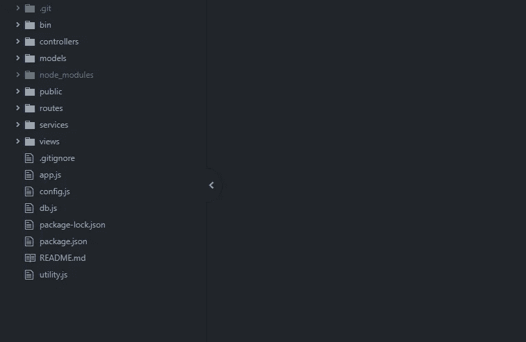
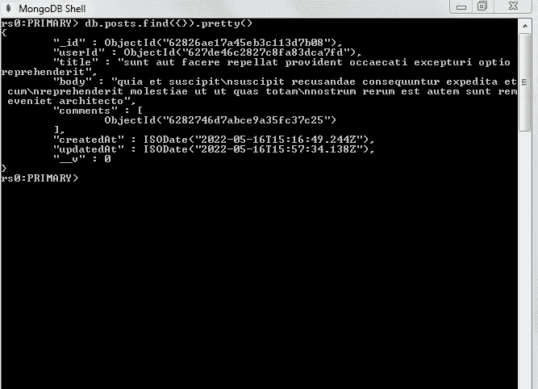
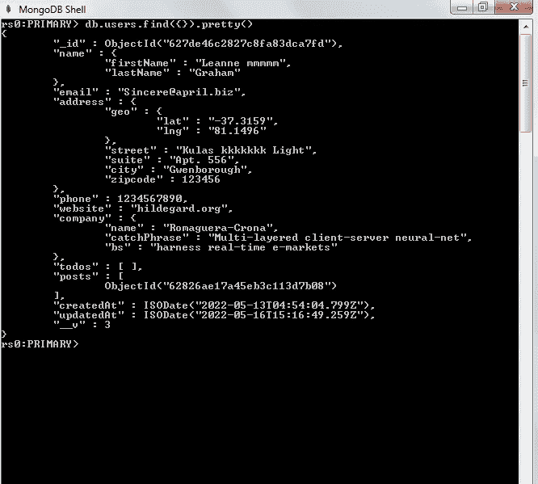
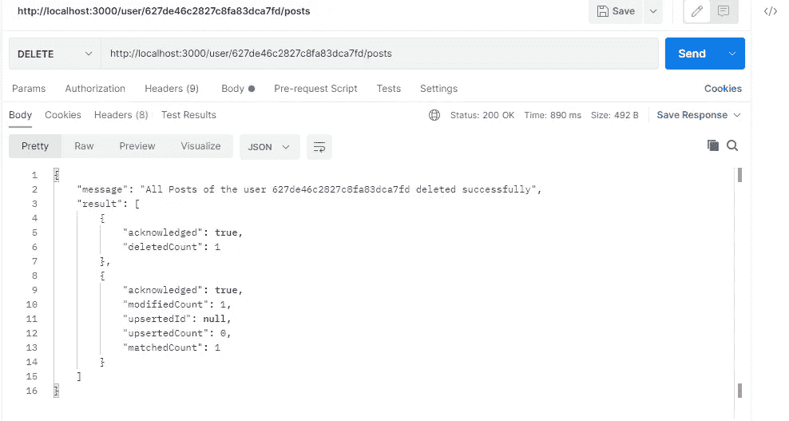

# Node:CRUD 示例，演示如何使用可重用的 helper 函数按顺序执行承诺

> 原文：<https://medium.com/geekculture/node-mon-crud-examples-to-demonstrate-using-a-reusable-helper-function-to-execute-promises-in-df9c5f2b8c8b?source=collection_archive---------9----------------------->

在开发一个节点应用程序时，我遇到了多个任务必须按顺序执行的场景。我想把它们分类如下:

1.  任务 1 和任务 2 顺序执行，在数据方面彼此不依赖，即任务 2 不需要任务 1 的执行产生的结果来执行。
2.  Task-1 和 Task-2 按顺序执行，但 Task-2 只能在 Task-1 执行产生结果后执行。

在第一种情况下，我更喜欢使用一个通用的助手函数，它将按顺序执行任务，并减少控制器中的代码行。

在第二种情况下，公共助手函数是没有用的。我们需要使用**然后捕捉块**或**等待异步方法**。

我们将通过一个例子来探讨这两种情况。

这是节点应用程序的结构。对于所有的 CRUD 操作，节点应用程序与 NoSQL 数据库 MongoDB 通信。



1.  **路线文件夹**包含每个集合的路线文件。每个文件包含一个路由器，它接收来自客户端的 HTTP 请求。
2.  HTTP 请求被转发到**控制器文件夹**中的适当控制器。
3.  控制器调用**服务文件夹**中的适当服务来执行任何查询。响应由服务返回给控制器。

使用**服务**的目的是为了跨多个控制器重用查询。这确保了两个控制器不会相互通信，也不会增加复杂性。

4.控制器将响应返回给更新视图的客户端(例如:Angular、React 等)。

让我们从 **userRouter.js** 开始。这个文件实际上包含了许多路线，但是为了简单起见，我在下面的要点中只包含了一条路线来演示这两个场景。

我们有 2 个集合:**用户和帖子**。用户可以创建帖子，检索用户创建的所有帖子，还可以删除用户创建的所有帖子。

这些动作在[**http://localhost:3000/user/:userId/posts**](http://localhost:3000/user/:userId/posts)路由下处理。在这个路径下，我们已经定义了将为每个 HTTP 请求类型(即 GET、PUT、POST 和 DELETE)调用的控制器方法。

集合的结构在这里并不重要，但是它可以更好地理解任务在每个场景中将做什么。

下面是帖子集中一个**文档的截图。**



Document in the Posts collection

下面是用户集合中一个**文档的截图。**



Document in the Users collection

一、**场景-1** :任务-1 和任务-2 相互独立但顺序执行

DELETE 方法就是这种情况的一个例子。我们需要执行 2 个步骤来删除用户创建的所有帖子。

= >从 posts 集合中删除与用户相关的所有帖子。

= >我们将用户创建的所有帖子的引用存储在用户集合中名为**帖子**的字段(sql 中的列)中。您可以在 Users 集合中的文档截图中看到该字段。

因此，帖子字段是用户创建的所有帖子的引用数组。我们需要将用户集合中的 posts 字段设置为[]。

**userController.js** 是处理来自 **userRouter.js 中所有路由的所有 HTTP 请求的控制器文件。**正如我们在路由器文件中看到的， **deleteAllPostsOfUser()** 是处理路由的删除请求的控制器方法。

在 **deleteAllPostsOfUser()** 控制器方法中有很多代码，但是大部分超出了本文的范围。

下面我只捕获了控制器方法 **deleteAllPostsOfUser()的相关部分。**我们使用了一个公共的帮助器函数**executetaksinsinsequence()**来按顺序执行这两个任务。这两个任务实际上是在 **UserService.js** 文件中定义的方法，与我们无关。

```
try{
let result=await **executeTasksInSequence**([ **removeAllPostsOfUser**(req.params.userId,opts), **updateUser**(req.params.userId,{“posts”:[]},opts) 
]);
}
catch(e){      
console.log("Some error in the transaction.Aborting it");         
**return next(e);**    
}
```

让我们来看看 **utility.js** 中定义的助手函数。

该方法接受按顺序执行的任务数组。每个任务都有一个承诺。该方法使用 **reduce 方法**按顺序执行它们，并将每个任务的响应连接成一个数组。这个按顺序包含所有任务响应的数组被返回给控制器，以进行进一步的操作。

下面是来自邮递员的回复截图。



任务执行期间发生的任何错误都将在 catch 块中被捕获。catch 块将再次引发错误。这个错误将最终在控制器方法的 catch 块中被捕获，并返回给客户端。如果其中一个任务失败，那么下一个任务就不会执行。

二。**场景二**:任务二的执行取决于任务一的执行结果。

POST 方法就是这种场景的一个例子，用户创建一篇文章。该任务的两个步骤是:

= >在 Posts 集合中创建一个 post 文档。

= >用创建的帖子的引用更新用户集合中用户文档的**帖子字段**。

步骤 2 需要完成步骤 1。为了用创建的帖子的引用更新用户文档，我们首先需要创建帖子。

正如在 **userRouter.js** 中提到的，POST 请求由 **createPost()** 控制器方法处理。

同样，这个方法有很多超出本文范围的代码。

只捕获代码的相关部分。我们使用了 **await 和 async** 方法来依次执行这两个任务。

```
await executeTransaction(**async**(session)=>{
try{
**let newPost=await createPost(payload,opts);****let updatedUser=await updateUserArray({“_id”:req.params.userId},{$push:{“posts”:newPost[0]._id}},opts);**
}catch(e){ 
console.log(“Caught in the controller catch block”); 
**return next(e)** 
}
})
```

newPost 是在 Posts 集合中创建的 Post 文档。我们使用 **newPost** 将 Post 文档的引用推送到**用户文档**的 **posts 字段**中。

创建这个节点应用程序对我来说是一次很好的学习经历。

我希望这个故事对你也有用。

您可以查看下面的完整代码。

[](https://github.com/ramya22111992/NodeMongoDBOperations) [## GitHub-ramya 22111992/NodeMongoDBOperations:试图在此涵盖所有可能的 MongoDB 操作

github.com](https://github.com/ramya22111992/NodeMongoDBOperations)