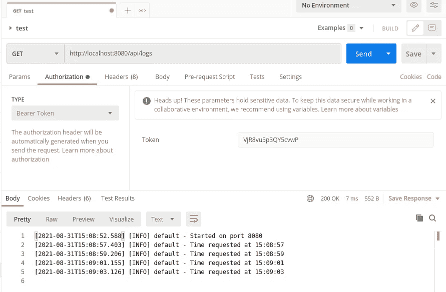

# Docker 容器中的 NodeJS 控制台日志:不再隐藏

> 原文：<https://medium.com/geekculture/nodejs-console-logs-in-docker-containers-hidden-no-more-d04bcfe1dc5c?source=collection_archive---------2----------------------->

# 背景

许多开发人员习惯于编写依赖 console.log()的 NodeJS 程序，不管是好是坏。没有什么比运行您的 Express 服务器更简单的了，您可以简单地在终端上记录您想要的任何内容。毕竟，这是书中最古老的调试技巧。

然而，一旦他们的应用程序被容器化并部署到某个地方，许多开发人员就陷入了痛苦的深渊。您不能只是将标准输出重定向到一个文件，然后轻松地打开您的日志文件。服务器不再是您可以访问的独立机器——可能容器正在通过 Docker Compose 或 Kubernetes 运行，或者部署为其他一些基于容器的云实例，不允许您通过 SSH 或 RDP 进行访问。谁知道你是否能访问正在运行的容器本身。

如果你幸运的话，有人将基于 Docker 的部署配置为从其容器中捕获标准输出，并将其放在你可以看到的地方——但是说实话；当你真正需要它的时候，没有人能把它做好。

所以让我们自己来处理它，并在容器中添加日志检索。这篇文章将带你了解它。如果你是 NodeJS 或 Docker 的新手，不要担心——下面详细说明了一切。当然，您可能会发现这种技术对其他平台也很有用。

# 简单的 NodeJS 服务器应用程序

首先，让我们从一个非常简单的 NodeJS/Express 服务器开始，它有一个返回时间的 API。我们将一次处理一个文件，但作为参考，当我们完成时，我们将得到如下所示的文件和文件夹结构:

```
logging-docker-example
├── **docker-compose.yaml**
├── **Dockerfile**
├── logs
├── node_modules
├── **package.json**
├── package-lock.json
├── **server.js**
└── utils
    └── **logger.js**
```

让我们从 **package.json** 文件开始:

```
{
  "name": "logging-docker-example",
  "version": "1.0.0",
  "description": "Showcasing a logger API",
  "main": "server.js",
  "author": "Baruch Speiser, Cambium",
  "license": "ISC",
  "dependencies": {
    "dotenv": "^10.0.0",
    "express": "^4.17.1",
    "log4js": "^6.3.0"
  }
}
```

您将在我们的依赖项中看到我添加了 Log4JS(稍后会有更多介绍)。用 **npm install** 安装所有这些依赖项，生成您的 *node_modules* 文件夹，然后我们可以开始添加代码。

现在我们将添加一个 **server.js** 文件来提供我们的 API:

```
require("dotenv").config();
const express = require('express');const app = express();app.get("/api/time", (request, response) => {
  const today = new Date();
  const now = today.toTimeString().substring(0,8);
               //chop off the timezone information
  const result = {
    time: now
  };
  console.info(`Time requested at ${now}`); response.set('Content-Type', 'application/json');
  return response.send(result);
});const PORT = process.env.PORT || 8080;
app.listen(PORT, () => {
  console.info(`Started on port ${PORT}`);
});
```

使用 **node server.js** 运行应用程序(假设您的端口没有被阻塞)，您应该看到它已经启动了。打开浏览器到[http://localhost:8080/API/time](http://localhost:8080/api/time)，应该会看到当前时间。在您启动应用程序的终端中，您还应该看到它记录请求的位置。

到目前为止简单明了。现在让我们为 NodeJS/Express 应用程序添加一个典型的 **Dockerfile** ，我们可以将它构建到一个容器中:

```
FROM node:14-alpineWORKDIR /usr/src/appCOPY package*.json ./
RUN npm ci --only=productionCOPY server.js ./USER node
ENV PORT=80
EXPOSE 80
CMD ["/bin/ash", "-c", "node server.js"]
```

对于那些不熟悉 Docker 的人来说，这里有一个关于这个文件设置的基本解释:

1.  从预先安装了 NodeJS 版本 14 的 Alpine Linux 容器开始。
2.  在容器中设置放置文件的位置。
3.  将 *package.json* 文件复制到容器中(到其 */user/src/app* 文件夹)。
4.  仅安装运行应用程序所需的相关依赖项(即不包括任何开发工具)。
5.  复制我们的 *server.js* 代码。
6.  当容器启动时，它应该作为用户“节点”而不是根用户运行(这是一个安全最佳实践)。
7.  将我们的应用程序中的端口预先配置为标准的 HTTP 端口 80，但是允许它作为容器环境变量被覆盖。
8.  默认情况下，允许外部请求访问该容器的端口 80。
9.  当容器启动时，运行我们的代码。

现在我们将使用一个 **docker-compose.yaml** 文件来构建并运行它:

```
version: "3.3"
services:
  logger-example:
    build: .
    ports: 
      - "8080:80"
```

确保您停止了应用程序的本地执行，以便我们可以通过 Docker Compose 运行它。使用命令:

```
docker-compose up --build
```

(如果你是一个 Linux 用户，你可能需要以 sudo 的身份这样做。)

同样，使用您的浏览器来检查时间，您应该看到 Docker Compose 报告在您的终端中请求了时间。

到目前为止，一切顺利。通过以上所有内容，我们已经建立了一个基本的容器化 NodeJS/Express 应用程序。现在让我们把它提高一个档次，加入我们特殊的日志机制。这将允许我们从容器外部查看应用程序日志。

# 升级日志记录

我们的下一步是向我们的项目添加一个新文件， **utils/logger.js:**

```
const log4js = require("log4js");
const fs = require('fs')log4js.configure({
  appenders: {
    "stdout" : { type: "stdout" },
    "file"   : { type: "file", filename: "logs/out.log" }
  },
  categories: {
    default:  { appenders: [ 'stdout', 'file' ], level: 'info' }
  }
});exports.logger = log4js.getLogger();exports.readLog = () => {
  let log = fs.readFileSync('logs/out.log','utf8', 
    (error, content) => {
      if(error) {
        log4js.getLogger().error(error);
        return error;
      }
      //otherwise
      return content;
    });
  return log;
}
```

我们在这里做了两件事:首先，我们从 Log4JS 设置了一个日志记录器来代替我们的控制台日志记录。该记录器将同时将相同的文本记录到控制台*和*的一个文件 **logs/out.log** 中。在日志术语中，我们称之为对日志使用多个*附加器—* 不同的输出通道。其次，我们添加了一个读取日志文件的方法。

现在让我们回到我们的 **server.js** 文件并修改它——既使用新的日志记录器，又添加一个将返回日志的新方法:

```
require("dotenv").config();
const express = require('express');
**const { logger, readLog } = require('./utils/logger');**const app = express();app.get("/api/time", (request, response) => {
  const today = new Date();
  const now = today.toTimeString().substring(0,8);
               //chop off the timezone information
  const result = {
    time: now
  };
  **logger.info**(`Time requested at ${now}`);

  response.set('Content-Type', 'application/json');
  return response.send(result);
});
**app.get("/api/logs", (request, response) => {
  try {
    const result = readLog();
    response.set('Content-Type', 'text/plain');
    return response.send(result);
  } catch(e) {
    return response.sendStatus(500);
  }
});**const PORT = process.env.PORT || 8080;
app.listen(PORT, () => {
  **logger.info**(`Started on port ${PORT}`);
});
```

为了确保安全，创建 **/logs** 文件夹并运行程序。使用您的浏览器检查时间，您应该看到控制台记录时间——尽管现在它在日志条目中会有更多的信息，因为 Log4JS 为您提供了许多您可能会发现有用的附加信息。

您现在可以导航到[http://localhost:8080/API/logs，](http://localhost:8080/api/logs,)，您应该可以在浏览器中看到所有的服务器日志。

下一步是更新我们的容器构建。特别是，我们需要确保它有创建和读取文件的适当权限，这样我们就不会遇到任何文件权限问题。对 **Dockerfile** 进行如下修改:

```
FROM node:14-alpineWORKDIR /usr/src/appCOPY package*.json ./
RUN npm ci --only=production**RUN mkdir utils \
 && mkdir logs \
 && touch logs/out.log \
 && chmod 777 logs/out.log**COPY server.js ./
**COPY utils/logger.js ./utils/**USER node
ENV PORT=80
EXPOSE 80
CMD ["/bin/ash", "-c", "node server.js"]
```

使用构建选项再次运行 Docker Compose，并检查您的容器。

# 坚持住——保安！

你不可能认为向世界公开你的容器的日志是一个好主意，对吗？很好，很好——所以让我们增加一些安全性。我们将使用一个简单的访问键，它可以在容器运行时配置，这样您就可以在需要的时候修改它。

首先，让我们修改日志 API，使其受到有效的密码保护:

```
app.get("/api/logs", (request, response) => {
  try {
    **const auth = "Bearer " + process.env.ACCESS_KEY;
    if(request.headers.authorization == auth) {**
      const result = readLog();
      response.set('Content-Type', 'text/plain');
      return response.send(result);
    **} else {
      return response.sendStatus(401);
    }**
  } catch(e) {
    return response.sendStatus(500);
  }
});
```

让我们在我们的 **docker-compose.yaml** 文件中定义访问键:

```
version: "3.3"
services:
  logger-example:
    build: .
    ports: 
      - "8080:80"
 **environment:
      ACCESS_KEY: 'VjR8vu5p3QY5cvwP'**
```

现在，如果您运行它并试图用浏览器打开它，您应该会得到一个 401 未授权错误。但是，如果您使用 Postman 之类的工具，您可以使用在 Docker Compose 中配置的访问密钥添加一个不记名令牌，然后您可以读取日志:



现在，您可以在任何您想要的黑盒环境中部署您的容器，并且使用正确的访问密钥，您可以远程访问日志。

这是处理事情的最佳方式吗？大概不会。如果您经常使用容器，您可能应该有一个好的计划来读取容器的标准输出，否则会让您了解应用程序实际上是如何运行的。不过，在紧要关头，有时提前计划并在口袋里装上这样的小把戏会很方便。