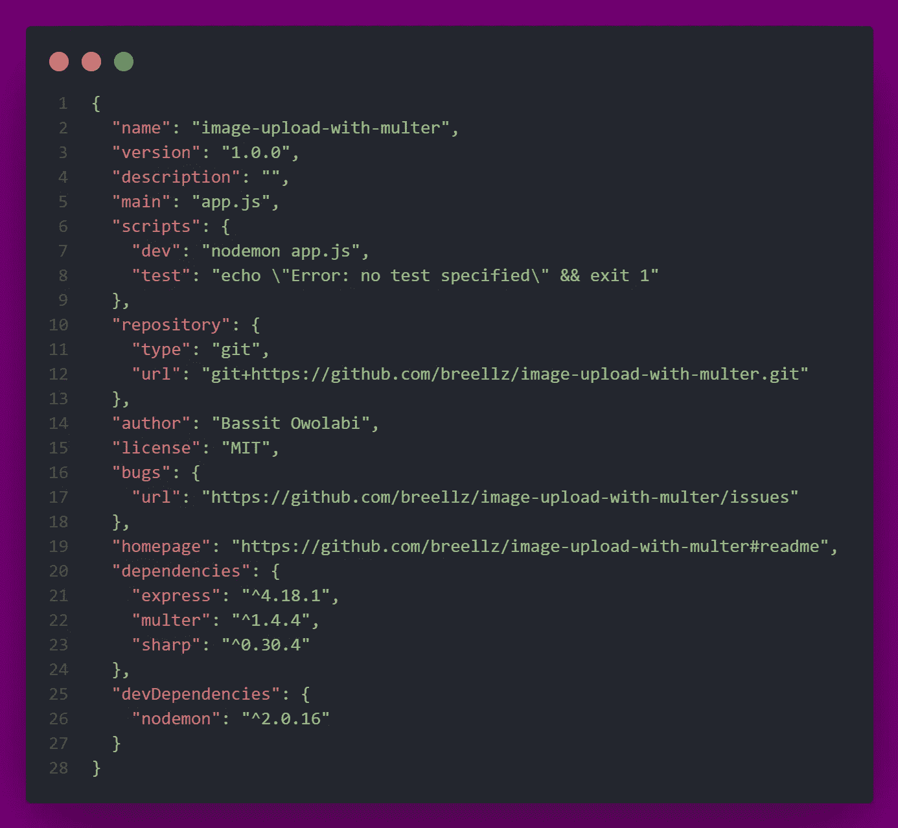
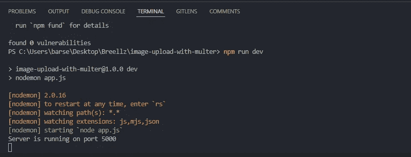
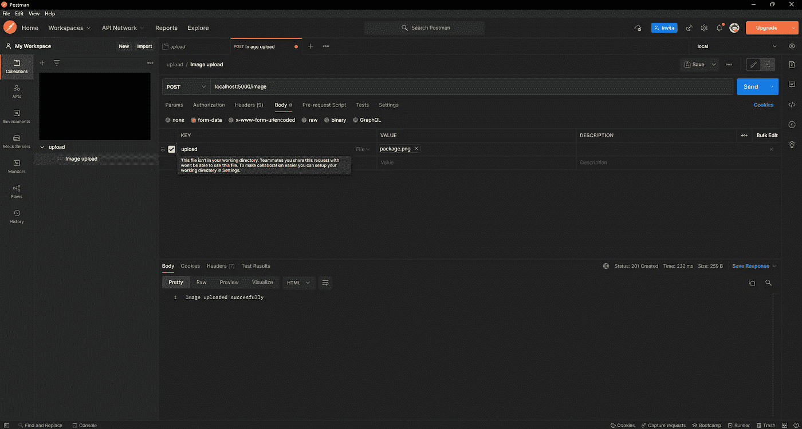
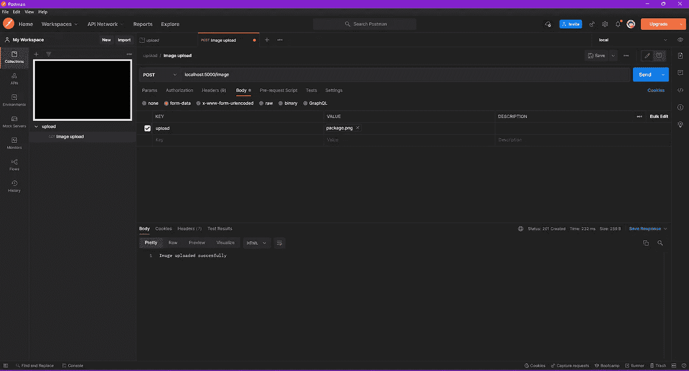
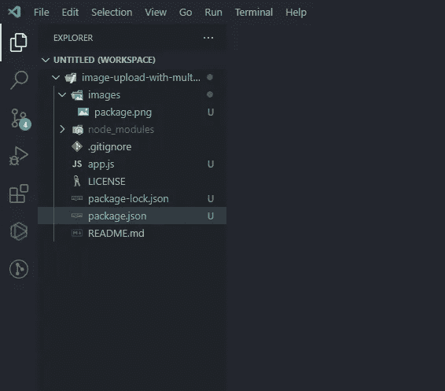

# 使用 Multer 上传 NodeJs 图像

> 原文：<https://medium.com/geekculture/nodejs-image-upload-with-multer-e6cf08c1562f?source=collection_archive---------1----------------------->


# **简介**

我曾经发表过一篇[文章](/geekculture/how-to-upload-images-to-cloudinary-with-a-react-app-f0dcc357999c)关于如何用 React 应用上传图片到 cloudinary，但是如果我们想上传图片到我们自己的 Nodejs 服务器上呢？这就是我将在本教程中涉及的内容。我将向您展示如何使用 Multer 上传图像，以及如何使用 Sharp 处理图像。在本教程结束时，您将能够在现有的或新的项目中实现这一点。

Multer 是一个处理`multipart/form-data`的 node.js 中间件，主要用于上传文件。

# 先决条件

*   对 javascript 的基本理解
*   NodeJs/Express 的基础知识
*   您机器上安装的最新版本的 nodeJs
*   邮递员

# 1.设置我们的项目

## 1.1 安装节点

打开 cmd 并运行下面的命令来检查你是否安装了 NodeJs，如果你没有查看这篇关于如何在你的 windows 机器上安装 Nodejs 的[文章](https://www.geeksforgeeks.org/installation-of-node-js-on-windows/)。

```
node -v
```

## 1.2 创建文件夹目录

您可以在终端中运行该命令，或者在文件浏览器中创建一个文件夹，然后在终端中导航到该文件夹

```
mkdir image-upload-with-multer
cd image-upload-with-multer
```

# 2.项目初始化

## 2.1 创建 package.json 文件

运行 npm init 以创建 package.json 文件。

```
npm init -y
```

“y”标志使用默认设置创建文件。

## 2.2 安装依赖和开发依赖

```
npm i express multer sharp
```

我们将使用 express 来设置我们的服务器，multer 来处理文件上传，sharp 来裁剪图像到我们想要的大小。

```
npm i -D nodemon
```

每当文件改变时，我们将需要 nodemon 来重启我们的服务器。D 标志是作为开发依赖项安装的，因为在生产环境中不需要它。

在安装 nodemon 之后，打开 package.json 文件并添加一个新脚本，如下所示

```
"dev":"nodemon app.js"
```

您的 package.json 文件应该如下所示



# 3.设置我们的服务器

## 3.1 基本服务器设置

在根目录中创建一个“app.js”文件，然后粘贴以下代码

```
const express = require('express')const multer = require('multer')const sharp = require('sharp')const port = process.env.PORT || 5000const app = express()
app.use(express.json())app.listen(port, () => {
console.log('Server is running on port '+ port)
})
```

然后，您可以在终端中运行以下命令

```
npm run dev
```

如果一切顺利，您应该会在控制台上看到这个



# 4.穆尔特

## 4.1 配置乘法器

在“app.use”下面粘贴以下代码

```
const upload = multer({limits: {fileSize: 1000000},fileFilter(req, file, cb) {if(!file.originalname.match(/\.(jpg|jpeg|png)$/)) {return cb( new Error('Please upload a valid image file'))}cb(undefined, true)}
})
```

limits 属性指定上载数据的限制。在这里，我们为上传的图像设置了 1mb 的限制。

由于我们正在进行图像上传，我们需要限制文件类型，只接受图像。可以为每个端点设置不同的 Multer 来接受不同类型的文件。

fileFilter 属性接受三个参数，即请求、要上传的文件和回调。

回调接受两个参数，如果发生任何错误，则为错误，第二个参数为布尔值(如果应该接受上传，则为真，否则为假)

“file.pathname”包含用户计算机上的文件名及其扩展名，因此我们正在检查文件扩展名是否与接受的三种图像类型相匹配。如果没有，我们使用回调抛出一个错误。如果匹配，我们将' undefined '作为第一个参数传递给回调，将' true '作为第二个参数，指定应该允许上传。

这种验证也可以针对其他文件类型进行修改。

更多信息请参考 multer [文档](https://www.npmjs.com/package/multer)。

# 5.图像上传路线

配置 multer 后，复制并粘贴以下代码来创建图像上传路径

```
app.post('/image', upload.single('upload'), async (req, res) => {try {await sharp(req.file.buffer).resize({ width: 250, height: 250 }).png().toFile(__dirname + `/images/${req.file.originalname}`)res.status(201).send('Image uploaded succesfully')} catch (error) {console.log(error)res.status(400).send(error)}})
```

为了传入 multer 中间件，我们使用“上传”，这是我们之前做的配置，然后我们调用它的一个函数，返回我们需要的中间件。该功能是“单一”的。Single 需要一个参数，一个可以是任何内容的字符串。在这里，我们称之为“上传”。

您还可以使用“upload.array()”上传多个文件。有关如何设置的步骤，请访问 multer [文档](https://expressjs.com/en/resources/middleware/multer.html)

multer 完成图像处理和验证后，可以在“req.file”上访问数据，您可以将此记录到控制台，以查看其外观。

我们做的下一件事是将图像缓冲区传递给 sharp，调整它的大小，并使用“toFile”属性保存图像。toFile 属性将输出图像数据写入文件。它将文件路径作为一个参数，在这里，我指定它用原始文件名保存图像。

这只是你可以用 sharp 做什么的一个提示。夏普比这强大得多，你绝对应该看看文档[这里](https://sharp.pixelplumbing.com/)

保存文件，服务器应该重新启动。

您的 app.js 文件应该是这样的

# 6.邮递员测试

在项目的根目录下创建一个名为“images”的新文件夹

转到 postman，创建一个新的 post 请求到 url，如下所示

```
localhost:5000/image
```

在“正文”选项卡中，选择“表单-数据”。键是我们之前传递给' upload.single '的字符串，值是要上传的图像。

将密钥类型更改为文件，并选择要上传的图像。

注意:图像必须小于 1mb



点击发送按钮，你应该会得到一个响应，图像已经上传成功，如下所示。



前往项目文件夹，您应该能够看到上传的图像。



# 7.结论

我们已经成功构建了一个 nodejs 服务器，它使用 multer 和 sharp 接受图像上传。

Github 回购可以在这里找到[https://github.com/breellz/image-upload-with-multer](https://github.com/breellz/image-upload-with-multer)

觉得这个有用就留个掌声。

感谢阅读