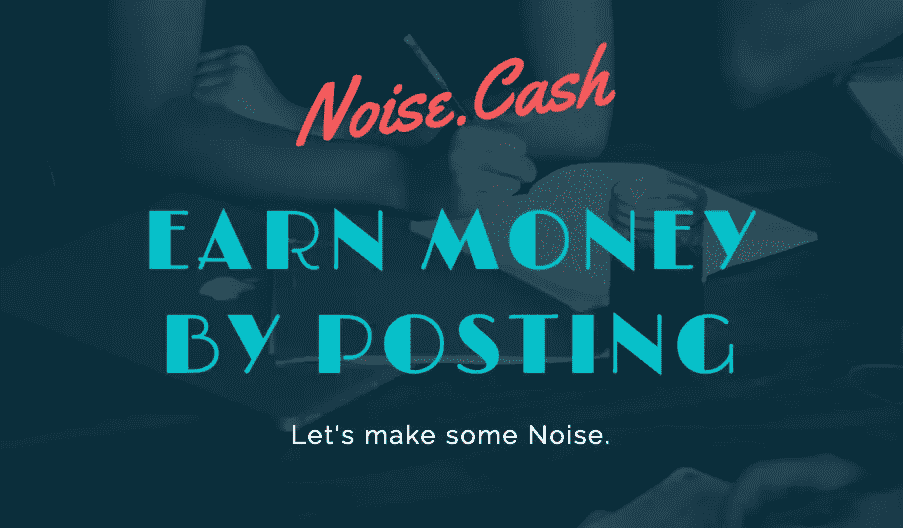
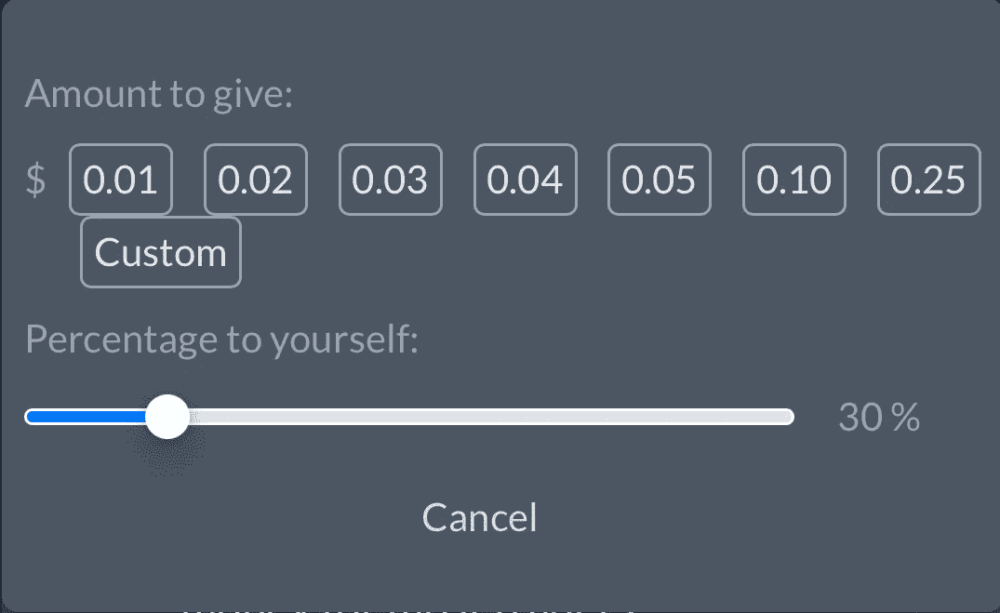
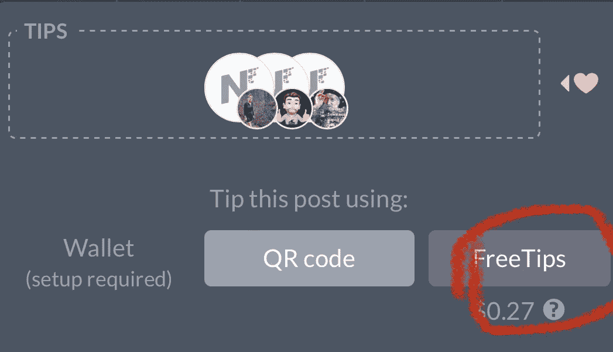
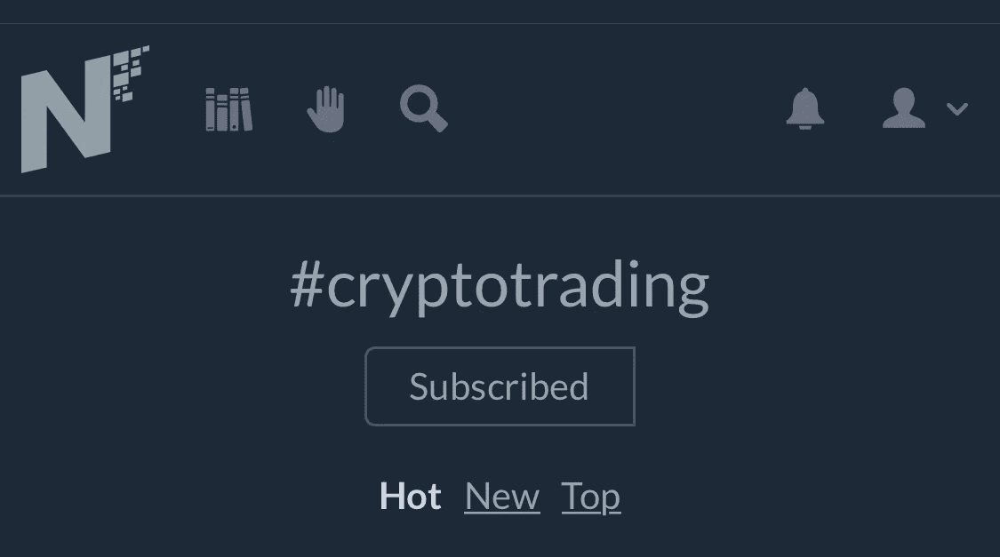
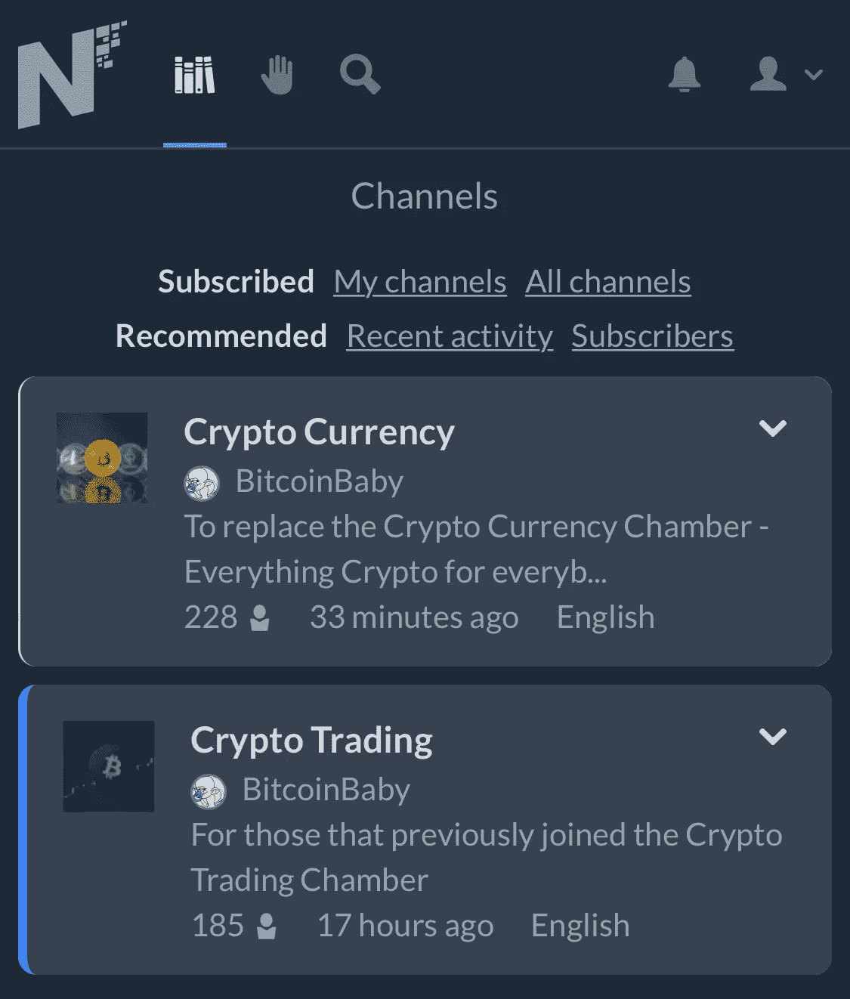
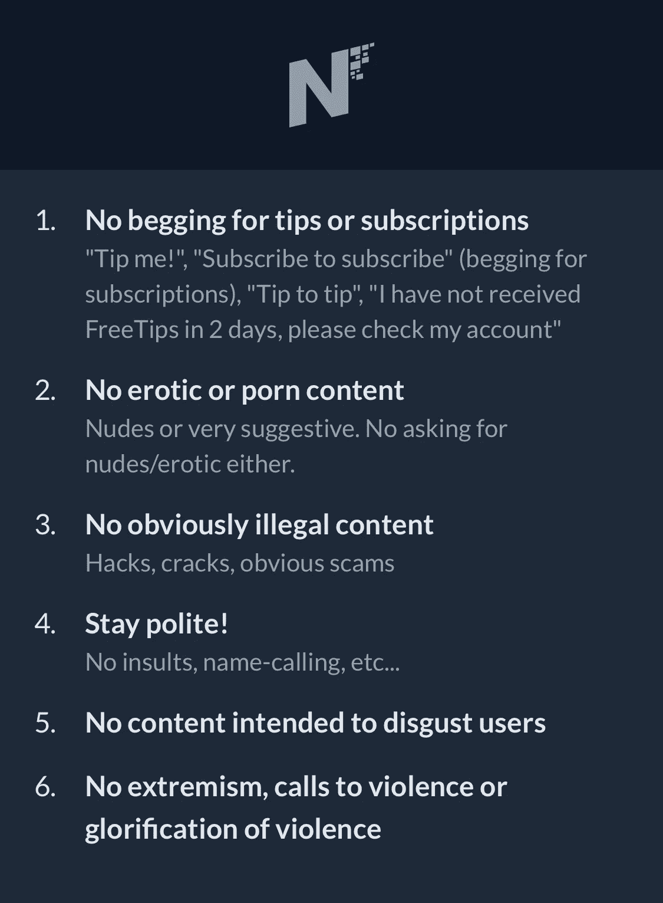

# 噪音。现金——通过张贴获得 1 年的 BCH

> 原文：<https://medium.com/geekculture/noise-cash-1-year-earning-bch-by-posting-590eb7d5ce11?source=collection_archive---------11----------------------->

大约一年前，在疫情寻找关于区块链和加密货币的信息时，我发现了一个新的社交网络， [Noise。现金](https://noise.cash/u/Phoenix)，你可以通过发布帖子获得比特币现金(BCH)形式的利益。

# 噪音是如何？现金工作？

到[噪音处登记。现金](https://noise.cash/u/Phoenix)你只需要一封电子邮件。注册后，您可以开始发布内容或评论他人的帖子:

[**注册链接**](https://noise.cash/u/Phoenix)

虽然去年有所变化，但目前[噪音。Cash](https://noise.cash/u/Phoenix) 以“免费提示”的形式自动向用户支付金钱(美元)。这些钱用来给其他用户小费(其中一部分给给小费的人，最多 80%，另一部分给帖子，剩下的)。

70% of the tips goes to the author of the post.

然而,“免费提示”不会马上收到:你必须是一个发布和评论的活跃用户才能开始收到它们。

$0.27 FreeTips available to give.

你也可以通过二维码从你自己的加密钱包和钱里给小费。

# 标签和频道

我们制作的出版物可以通过标签(就像 Twitter 上做的那样)和渠道来分类。

*   **标签**允许我们给帖子“贴标签”。然后，当我们点击一个标签时，我们将看到包含该标签的所有帖子的列表。

Cryptotrading tag. You can order post as Hot, New adn Top.

*   **频道**是主题相似的帖子列表。任何用户都可以就他们想要的主题创建一个频道，并建立发布规则，他们甚至可以在发布之前对帖子进行修改。

Two channels I follow.

# 关于噪音的规则。现金

这个平台有一系列简单的规则，你必须在注册时接受，其中许多是显而易见的:

# 结论

在[的喧闹中得到金钱。现金](https://noise.cash/u/Phoenix)你只需遵循 2 个步骤:

*   报名吧。
*   开始发帖和评论别人的帖子。你会看到如何在短时间内你会开始收到“提示”,你可以以 BCH 的形式撤回。