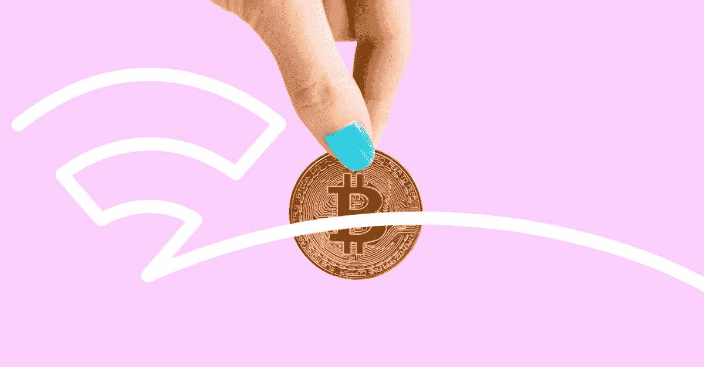

# 不可替代的代币和数字资产不断变化的价值

> 原文：<https://medium.com/geekculture/non-fungible-tokens-and-the-ever-changing-value-of-digital-assets-efff726cf2f3?source=collection_archive---------24----------------------->

“直到现在，适合我作品的画廊才最终存在”

*失踪人员*

这位流行艺术家本月通过[基金会](https://foundation.app/)在 24 小时在线拍卖中拍卖了一幅名为“ [KIZHI COYN](https://foundation.app/MIA/kizhi-coyn-25324) 的移动图像。NFT 以 174，013.59 美元(77.777 瑞士法郎)的天价售出，它是一个更大系列的一部分，她将其描述为“…一幅活生生的、呼吸的、心理光谱的油画，为我及时将这一时刻具体化。”

[https://gph.is/g/4oyMz7P](https://gph.is/g/4oyMz7P)

也许没有其他视觉资产比 NFT 更能概括这一时刻。

# 那么，什么是 NFT，我们是如何来到这里的？

NFT 代表不可替代的令牌。

这些是“独一无二”的数字资产，可以用加密货币进行买卖。像比特币一样，它们不是有形的，但与加密货币不同，它们也不能被取代。

想想一张罕见的交易卡，上面有自己不完美的签名；完全独一无二。

但与其他收藏家的物品类似，它们已经以这样或那样的形式存在了一段时间。

2014 年，Glitch 的首席执行官 Anil Dash 和艺术家 Kevin McCoy 一起在纽约市新的当代艺术博物馆进行了现场演示，展示了 NFT 的原型。麦考伊用一个名为 Namecoin 的区块链注册了一个他妻子制作的视频剪辑，然后 Dash 用他钱包里的 4 美元买了下来。

一点也不随大流。

甚至提到“货币化图形”这个词都会引起观众的笑声，在接下来的几年里，他们在推广这个想法方面取得了有限的成功。

Dash 认为，当时和现在的主要问题之一是 NFT 如何依赖区块链技术进行认证。他说，这种东西对普通用户来说毫无价值。

“在区块链第一次引起科技极客注意的十多年后，你与朋友或同事一起使用的智能手机应用程序中，没有一个是基于这项技术的。相比之下，当网络和今天的比特币处于同一时代时，它在世界各地拥有 5 亿用户，他认为，对于大西洋来说，NFTs 不应该以这种方式结束。

但是我们对收藏的迷恋比互联网要古老得多。在存放世俗财产的空间有限的地方，虚拟金库至少让人感觉其容量是无限的。

# 必须抓住他们(收集心理学)

早在 2016 年 7 月推出，*口袋妖怪 Go* 在*仍然*是一件大事。事实上，游戏开发商 Niantic 最近在春季活动中发布了闪亮的 Bunnelby 和其他罕见的盛装口袋妖怪。

[https://gph.is/g/4oyMz7P](https://gph.is/g/4oyMz7P)

但是怎么会有*仍然* [超过 6000 万活跃月玩家](https://activeplayer.io/pokemon-go/)对追逐像素化口袋妖怪感兴趣呢？

是的，FOMO。

《福布斯》的杰米·马迪根(Jamie Madigan)表示，正是这种对匮乏的感知和对错过的担忧让虚拟物品变得真实。利用市场研究人员丽贝卡·马登和拉塞尔·贝尔克的方法，他认为我们收集无形资产的愿望可以归结为两个因素:

难以捉摸——本质上，获得或解锁一件物品的难度。像 Niantic 这样的游戏开发商已经将虚拟的“追逐的刺激”游戏化，成为一门艺术。而对于 NFT 呢？这都是关于网上拍卖过程。

真实性——这是虚拟对象被视为“真实事物”的程度。在口袋妖怪 Go 中，这可能是你在现实中发现它的地方；对于非正规金融机构来说，这是一种“所有权”证书。当然，它可以被复制和分享，但是你的个人知识已经打上了真实性的印记。

# 在无形中发现价值

就目前情况来看，NFT 只存在于高端收藏家的圈子里。

他们是否会为你我这样的人找到目标有待商榷。尤其是，当你考虑到用户不得不支付的隐性“汽油费”时；这是在区块链上处理和验证交易所需的计算能量。问题是这些费用会随着时间的变化而波动。

但是还有另一个代价。

NFT 本身可能不可互换，但加密货币是可以互换的。不同的网站会收取不同的转换费用。

Kapwing 的高级内容策略师罗伯特·马丁(Robert Martin)试图买卖 NFT，结果在这个过程中损失了 200 多美元。

马丁告诉知情人说，隐性费用对新用户构成了风险。像 Rarible 这样的网站向购买 NFT 的买家收取 2.5%的费用，但其他市场可能会收取更高的费用。

“我们需要更多的教育。他说:“看起来大多数资源都是为了迎合已经涉足加密领域的人。”。

但是这种媒介确实给视觉艺术家提供了他们自文件共享出现以来一直缺少的东西:控制。

Shutterstock 的亚历杭德罗·麦德林认为，无论你是摄影师、摄像师还是插图画家，你都可以通过 NFTs 更好地控制自己的作品。

但这些资产还是要“活”在某个地方。买方和卖方应该考虑远远高于加密货币成本的无形价格。

# 加密货币之外的无形成本

但如果事实确实如此，你不禁会想:这有什么意义呢？

据比尔[在与 The Verge](https://www.theverge.com/2021/3/15/22328203/nft-cryptoart-ethereum-blockchain-climate-change) 的对话中称，仅抵消*一个*系列的排放量就需要大约 5000 美元。

目前，对气候的成本远远超过了任何秘密收藏的价值——只有少数艺术家对此大声疾呼。

伦敦的艺术家和创意技术专家 Memo Akten 花了几个月的时间调查 NFTs 的碳影响。尽管他的工作几乎无人问津，但一位名叫 Joanie Lemercier 的密码艺术家也紧随其后。

以及令人震惊的结果。

那么，与其他形式的数字娱乐相比，为什么非功能性数字电视会占据如此大的空间呢？

加密货币。

然而，领先的 NFT 市场 SuperRare 的首席执行官 John Crain 认为这种想法是不公平的。他告诉 Wired ，将以太坊比作一架不管飞机上有多少密码艺术家都会起飞的飞机。

“有一整个生态系统的人在制造排放，所以我认为对艺术家来说，说*你*制造了这么多二氧化碳是不公平的。”

也许他说得有道理。

毕竟，如果你停止使用脸书，这仍然只是每月 26 亿用户中少了一个——这仍然是一个可怕的茶壶。

此外，以太坊还透露了向低碳模式发展的计划——减少 99%的排放量。

但不幸的是，这已经酝酿多年了。因此，在 NFTs 走上隐猫的道路之前，它是否会重见天日还有待观察。

观看这个数字空间。

*原载于 2021 年 4 月 28 日*[*【https://www.builtbybright.com】*](https://www.builtbybright.com/blog/non-fungible-tokens-and-the-ever-changing-value-of-digital-assets?utm_campaign=Blog&utm_content=164007581&utm_medium=social&utm_source=linkedin&hss_channel=lcp-497129)*。*