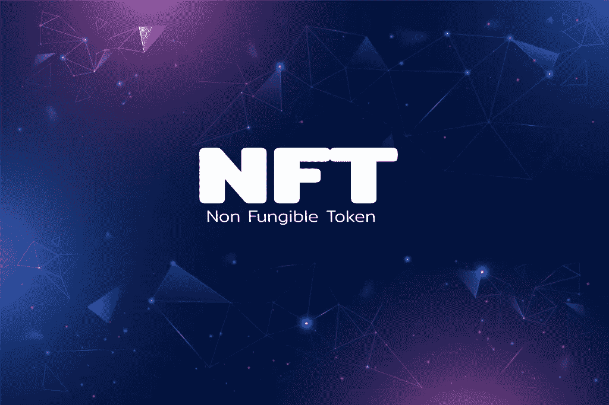
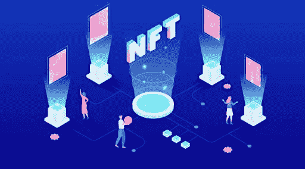

# 不可替换令牌(NFT):完整指南

> 原文：<https://medium.com/geekculture/non-fungible-tokens-nfts-a-complete-guide-46f3d6941d28?source=collection_archive---------16----------------------->

## 进入 NFT 世界…

## NFTs —简介

你可能听说过“NFT”这个词最近在网上流传。如果你想知道这些是什么，并想了解更多，这个博客可能会帮助你。基本上，NFT 是不可替换令牌的缩写，这不能解释很多。在了解什么是不可替代性之前，必须知道什么是可替代性。可替代的意思是某种价值的物品可以被另一种价值相同的物品替代。例如，一张 10 美元的钞票可以换成另一张 10 美元的钞票，或者换成两枚 5 美元的硬币，甚至是相同金额的在线交易。但是，有了不可替换的代币，两个代币就不会相同，而且 [***每个 NFT 都有唯一的***](https://bit.ly/3tijBQn) 。

## 非功能性测试的开始和发展

NFT 是区块链技术和加密货币的产物。在我们深入研究 NFT 之前，应该先了解这些术语。区块链是数字分类账，可以代表产品经历的任何过程的时间戳。加密货币是一种使用密码学概念来保护交易安全的数字货币。随着世界上许多百万富翁开始投资加密货币，区块链的发展找到了将他们纳入其中的途径，NFT 诞生了。虽然 NFTs 在 2014 年就已经存在，但只是在病毒式网络游戏 CryptoKitties 出售以猫为特色的 NFTs 之后，这个词才获得了更广泛的社交媒体用户。类似地，被称为 CryptoPunks 的像素化艺术形式的贴纸使 NFTs 更受欢迎。随着越来越多的艺术家提出他们的 ***NFT 艺术*** 形式，非传统艺术正慢慢流行起来。目前，一些在线游戏以 NFT 形式的独特配件为特色，这些配件可以用加密货币购买，并可以在特定游戏的环境中使用。此外，像 NBA 和 f1 这样的体育联盟也推出了自己的专注于游戏内项目的 NFTs。越来越多的名人根据他们的主题，甚至特殊时刻的照片和视频来出售 NFT，以拉近与粉丝的距离。还有，歌曲，电影，甚至一些现实生活中的物品都在成为 NFT。

 [## 最佳 NFT 发展公司|最佳 NFT 发展服务| NFT 发展公司解决方案|…

### 我们的 NFT 开发公司用强大的技术帮助您创建您的 NFT 平台。我们的 NFT 开发流程…

bit.ly](https://bit.ly/3tijBQn) 

## 更现实的用途

虽然从外表上看，NFT 看起来像是一个艺术品收藏家的乐趣或一次赌博尝试，但像社交媒体一样，它们也有其他正在探索的应用。首先，NFTs 可以让那些从事房地产行业的人松一口气，因为提供与地块相关的 NFT 令牌及其文档可以减少地块被多次出售的情况。此外，智能住房合同可以使双方受益，无需第三方干预，从而节省相关费用和时间。车辆登记或婚姻登记也是如此。

甚至在美国也发生过非功能性投票，这通常可以确保透明的选举实践，几乎可以立即产生结果。篡改 NFTs 几乎是不可能的，因为每个 NFT 都是一个独特的实体，这种做法可能会使其一文不值。一些服装品牌，如耐克，已经推出了实物 NFT 产品，你可以找到该项目是在哪里制造的，并确保它是真正的交易。NFT 也希望在数字和现实生活应用中作为验证或认证因素。

从数字上来说，这种可能性可以缓解社交媒体上的版权侵权检查，因为另一个人不能声称他们创造了一个病毒模因，而他们并没有。随着时间的推移，将 NFT 整合到更现实的应用程序中成为可能，随着元宇宙的到来，NFT 只会从这里开始上升。

## 它们是如何工作的？

你可以在市场上买到非功能性食物，比如 OpenSea、币安等等。在这些网站上，人们可以使用诸如以太、USDT 等加密货币付费购买他们最喜爱的艺术或歌曲或视频作为 NFT。在某些情况下，非森林交易通过拍卖出售，一些著名的拍卖行将非森林交易视为他们的下一个目标。在被列入 NFT 市场之前，每一件物品(一件艺术品或一首歌曲)都会被转换成 NFT。NFT 可能是独一无二的(就像蒙娜丽莎的艺术作品)，也可能有多个相同的 NFT 副本(就像玩家交易卡)。创作者也可以在网站上列出他们的作品，并可以要求任何他们选择的加密货币。出售作品后，创作者可以在物品转手时获得版税，确保被动收入。

## 一家 NFT 开发公司在这里做什么？

一家从事 NFT 开发的公司可以为你做几乎所有的工作，除了创建或购买 NFT 资产并出售。他们可以帮助使用区块链技术实践将资产(数字或物理)转换为非功能性资产。这些公司中的一些也可以帮助你使用 NFT Launchpad，它可以被认为是出售 NFT 的 YouTube 工作室。使用这些，您可以有效地创建和发布 NFT，这样您每次通过另一个组织创建 NFT 的花费就会更少。

## 非功能性交易对买方或卖方有什么好处？

如果你是创作者，恭喜你！你现在可以为你作品的数字化形式赚取更多，确保你随时都有被动收入。如果你是买家，也恭喜你！你是在直接支持你最喜欢的艺术家，也可以夸耀自己收藏了一件独一无二的物品。

如果你是一名销售人员， [***创建自己的 NFT 市场***](https://bit.ly/3GSbrUm) 当你接近一家 NFT 开发公司时，会变得很容易，他们会减轻你的压力，你现在可以投入到 NFTs 的世界中。