# 正态分布和正态性检验

> 原文：<https://medium.com/geekculture/normal-distribution-and-normality-test-9e2b6e1a7bba?source=collection_archive---------4----------------------->

Photo by [Joshua Sortino](https://unsplash.com/@sortino?utm_source=unsplash&utm_medium=referral&utm_content=creditCopyText) on [Unsplash](https://unsplash.com/s/photos/data-quality?utm_source=unsplash&utm_medium=referral&utm_content=creditCopyText)

正态分布也称为高斯分布，在许多自然发生的测量中观察到，如出生体重、身高等。它是对称的钟形。它的范围可以从负无穷大到正无穷大，并且它的大部分值都集中在平均值附近。低于平均值的曲线部分将是高于平均值的曲线部分的镜像，这使得平均值等于中值。

在参数检验中，我们很清楚所做的参数或假设，并且总体分布总是已知的。这里的概率分布是一个正态分布，如果它失败了，我们使用中心极限定理来近似正态分布。

我在之前的[文章](/geekculture/hypothesis-parametric-and-non-parametric-testing-7c75a6673349)中已经详细介绍了参数化和非参数化测试。

根据**经验法则**，或者**68–95–99.7**法则，你在正态分布中的大部分值将分布为:

*   大约 68%的值在平均值的 1 个标准偏差之内。
*   大约 95%的值在平均值的 2 个标准偏差之内。
*   大约 99.7%的值在平均值的 3 个标准偏差之内。

# 歪斜

当低于平均值的曲线部分不是高于平均值的曲线部分的镜像时，我们说分布是**偏斜的**。这里，分布的一个尾部相对于另一个尾部更长或更长。根据有长尾的一边，我们说分布偏向那一边。“右偏”分布是尾部在右边的分布。“左偏”分布是尾部在左侧的分布。**偏斜度**测量数据值围绕平均值不对称的程度。偏斜度可以计算如下

对于正态分布，[偏斜度](https://www.kaggle.com/code/sandhyakrishnan02/normal-distribution-skewness-and-kurtosis)为零。

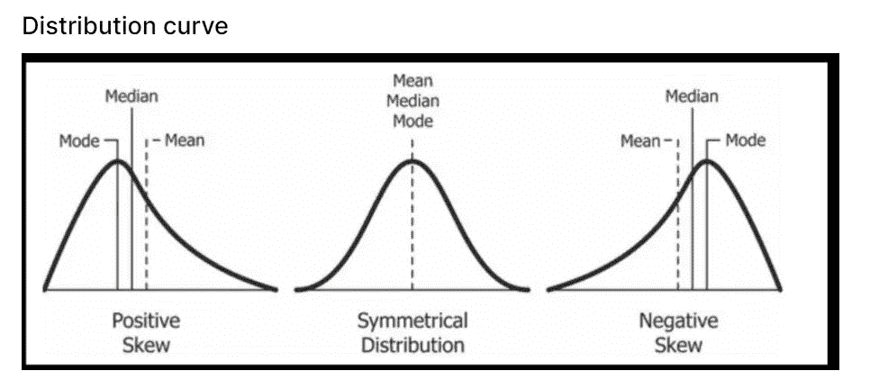

[https://en.wikipedia.org/wiki/Skewness#/media/File:Relationship_between_mean_and_median_under_different_skewness.png](https://en.wikipedia.org/wiki/Skewness#/media/File:Relationship_between_mean_and_median_under_different_skewness.png)

## 峭度

它测量分布曲线的峰值，或者曲线升高接近分布中心的程度。它将峰的形状与正态分布的峰的形状进行比较。

过度峰度定义为峰度减 3。如下所述，有 3 种不同的状态。

*   **中峰态** :-任何一元正态分布的峰度为 3，称为中峰态。
*   **尖峰值** :-分布将有一个上升更陡的峰值中心，平均值附近的值更集中，与正态分布相比，尾部有许多值，峰度大于 3，正的过度峰度。
*   **平峰** :-与正态分布相比，该分布将具有较少的峰值中心，并且具有负的过度峰度。

下图右侧显示了以下七种密度的线性和对数曲线:

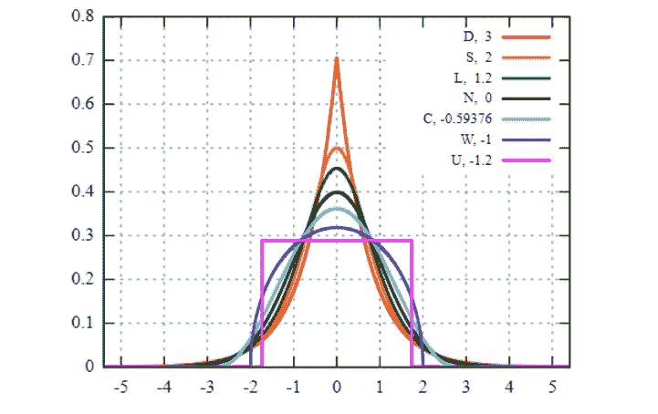

[https://upload.wikimedia.org/wikipedia/commons/3/33/Standard_symmetric_pdfs.svg](https://upload.wikimedia.org/wikipedia/commons/3/33/Standard_symmetric_pdfs.svg)

*   **D** :拉普拉斯分布，也称为双指数分布，红色曲线(对数标度图中的两条直线)，超额峰度= 3
*   **S** :双曲正割分布，橙色曲线，超额峰度= 2
*   **L** :逻辑分布，绿色曲线，超额峰度= 1.2
*   **N** :正态分布，黑色曲线(对数标度图中的倒抛物线)，过度峰度= 0
*   **C** :升余弦分布，青色曲线，过度峰度= 0.593762…
*   **W** :维格纳半圆分布，蓝色曲线，过度峰度= 1
*   **U** :均匀分布，洋红色曲线(为清晰起见，在两幅图像中均显示为矩形)，过度峰度= 1.2。

**要查看如何使用 python 绘制正态分布图，以及如何使用 python 检查数据集的偏度和峰度，可以在这里参考******。****

**为了确定数据集是否符合正态分布，使用了正态性检验。它计算数据集下的随机变量服从正态分布的可能性。**

**这通常是通过使用:**

1.  **图形方法**
2.  **形式正态性检验**

# **图形方法:**

**在这里，数据是可视化的，从可视化，解释。我们可以通过很多图来可视化，这里我使用直方图和箱线图**

## **柱状图**

**在直方图中，我们将数据分成一系列连续的、相邻的、大小相等的非重叠区间，称为区间。落在每个条柱中的值被计数，并且当数据是数字时可以使用它，并且它是检查频率分布的最常见的图形。**

**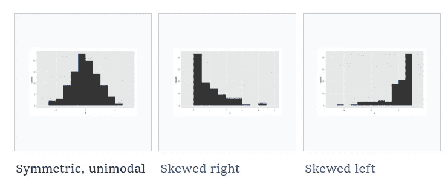**

## ****方框图****

**箱线图是数值数据通过其四分位数的分布和偏斜度的图形可视化。四分位数将数据点的数量分成四个部分或四分之一，即 Q1、Q2 和第三季度。Q1(第一个四分位数)被定义为最小数和数据集中位数之间的中间数。它也被称为较低或第 25 个经验四分位数，因为 25%的数据低于这一点。Q2(第二个四分位数)是一个数据集的中位数；因此，50%的数据位于该点以下，Q3(第三个四分位数)是数据集的中值和最高值之间的中间值。它被称为上四分位数或第 75 个经验四分位数，因为 75%的数据位于该点以下。Q3 和 Q1 之间的差异被称为**四分位数间距(IQR)** 。**

**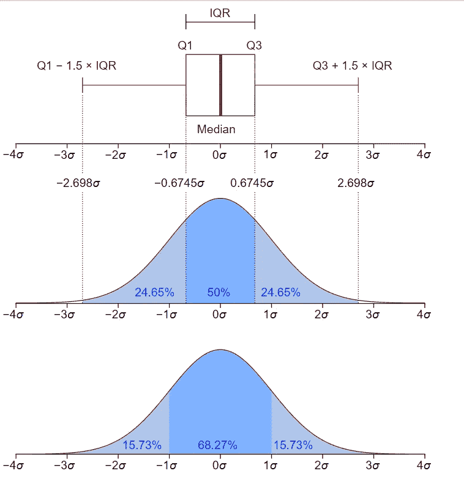**

**[https://upload.wikimedia.org/wikipedia/commons/1/1a/Boxplot_vs_PDF.svg](https://upload.wikimedia.org/wikipedia/commons/1/1a/Boxplot_vs_PDF.svg)**

**在正态分布的盒图中，分布的中值在盒的中间，盒的两边的胡须大致相同。而对于**正偏或右偏**，分布的中值更接近盒子的底部，如果盒的下端的须状物更短，对于**负偏或右偏**，分布的中值更接近盒子的顶部，如果盒的上端的须状物更短。**

# **形式正态性检验:**

**常见且广泛使用的正规正态性检验有夏皮罗-维尔克(SW)检验、科尔莫戈罗夫-斯米尔诺夫(KS)检验、利列福斯(LF)检验和安德森-达令(AD)检验。这四个测试的功效比较是通过从遵循对称和非对称分布的备选分布生成的样本数据的蒙特卡罗模拟获得的。蒙特卡洛模拟发现，在比较夏皮罗-维尔克、科尔莫戈罗夫-斯米尔诺夫、利列福斯和安德森-达林测试时，夏皮罗-维尔克在给定的显著性方面具有最佳功效，紧随其后的是安德森-达林。**

****经验分布函数**是与样本的经验测量相关的分布函数。如果 X1，X2，..是具有概率分布 P 的状态空间 S 中的值的独立同分布随机变量的序列，则经验测量 Pn 被定义为对于[指示符](https://en.wikipedia.org/wiki/Indicator_function)函数 IA 的 S 的可测子集，并且由下式给出**

**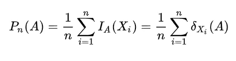**

**经验分布函数也称为经验累积分布函数(eCDF ),因为它估计生成样本中点的累积分布函数。EDF 测试可以进一步细分为属于上确界和方差类的测试。**

## **夏皮罗-维尔克试验**

**SW 测试最初被限制在小于 50 的样本量。该书由塞缪尔·桑福德·夏皮罗和马丁·维尔克于 1965 年出版。该检验的无效假设是总体呈正态分布。这个测试是第一个能够检测到由于偏度或峰度或两者而偏离正态性的测试。它被定义为，**

**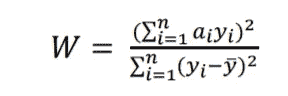**

**For ordered random sample y1<y2<…yn, y bar is the sample mean and yi is ith order statistics. W lies between 0 and 1.**

**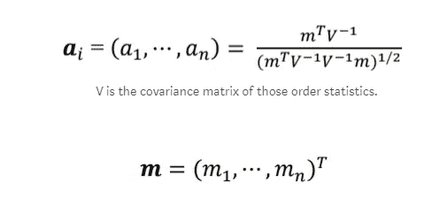**

**w 的分布没有名称。统计的临界值是通过蒙特卡罗模拟计算的。W 的小值导致拒绝正态性，1 表示数据的正态性。**

**众所周知，夏皮罗-维尔克检验不适用于有许多相同值的样本。**

## **科尔莫戈罗夫-斯米尔诺夫试验**

**KS 是以安德雷·柯尔莫哥洛夫和尼古拉·斯米尔诺夫的名字命名的。KS 统计量量化了样本的经验分布函数和参考分布的累积分布函数之间的距离，或者两个样本的经验分布函数之间的距离。KS 检验属于 EDF 统计量的上确界类。**

**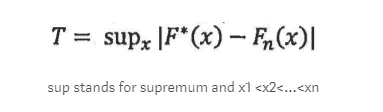**

**该统计采用所有 *x* 值中两个分布函数之间的最大绝对差值。**

**Ho: F(x)等于 F*(x)对于从-无穷大到无穷大的所有 x，即数据遵循指定的分布。**

**Ha:对于至少一个 x 值，F (x)不等于 F* (x ),即数据不符合指定的分布。**

**如果 T 超过了 Kolmogorov 检验统计量的分位数表给出的(1-α)分位数，那么我们在显著性水平α上拒绝 Ho。**

## **柯尔莫哥洛夫分布**

**Kolmogorov 分布是随机变量的分布，可以定义为:**

**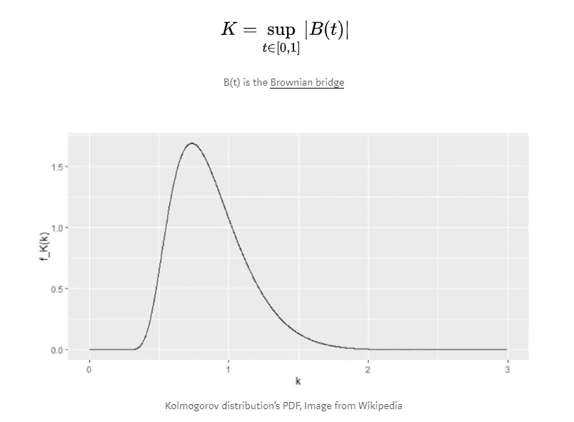**

**K 的累积分布函数由下式给出:**

**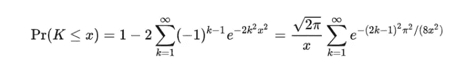**

**在样本来自假设分布 *F* ( *x* )的零假设下，**

**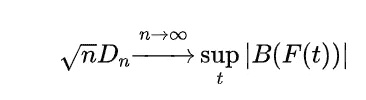**

**如果 F 是连续的，那么零假设收敛于不依赖于 F 的 Kolmogorov 分布，这个结果也称为 **Kolmogorov 定理**。**

## **利列佛斯试验**

**LF 检验是对 Kolmogorov-Smirnov 检验的改进。LF 检验是以乔治·华盛顿大学统计学教授休伯特·利里福斯的名字命名的。当分布的期望值和方差未指定时，它用于检验数据来自正态分布总体的零假设。这里的参数需要根据样本数据进行估计。LF 统计被定义为**

**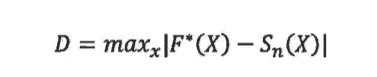**

**对于 n 次观察，Sn(X)是样本累积分布，F* (X)是累积正态分布函数，其中= Xbar 是样本均值，S 平方是样本方差。**

## **安德森-达林(AD)试验**

**AD 检验是检测大多数偏离正态性的最强有力的统计工具之一，它是一种统计检验，检验给定的数据样本是否来自给定的概率分布。它属于基于平方差的 EDF 统计的二次类**

**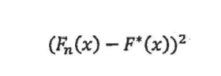**

**该测试以西奥多·威尔伯·安德森(1918-2016)和唐纳德·达林(1915-2014)的名字命名，他们在 1952 年发明了该测试，并将该测试的统计量定义为:**

**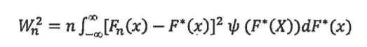**

**其中 Psi 为非负权重，可通过下式计算**

**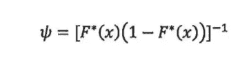**

**统计公式可以简化为**

**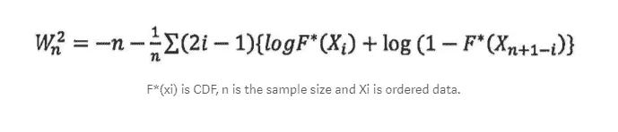**

**参考**

**[https://www . ka ggle . com/code/sandhyakrishnan 02/normal-distribution-skewness-and-Kurt osis](https://www.kaggle.com/code/sandhyakrishnan02/normal-distribution-skewness-and-kurtosis)**