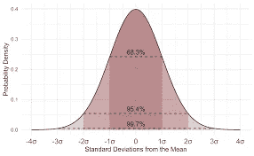

# 正态分布或高斯分布只需 5 分钟

> 原文：<https://medium.com/geekculture/normal-distribution-or-gaussian-distribution-in-just-5-minutes-22bc63794cd0?source=collection_archive---------17----------------------->

## 统计学中什么是正态分布，经验公式是什么？

Photo by [Mohamed M](https://unsplash.com/@mohamed_m?utm_source=medium&utm_medium=referral) on [Unsplash](https://unsplash.com?utm_source=medium&utm_medium=referral)

在数据科学领域，统计学是一件非常重要的事情，你必须从统计学中学习所有重要的主题

在之前的文章中，我已经谈到了统计数据中包含的一些重要主题

但是有一个非常重要的术语，那就是你必须知道的正态分布

在本文中，我们将了解什么是正态分布，什么是正态分布中的经验公式

关于这个分布，有几件事你必须知道，这很重要

所以，不用浪费你太多的时间，让我们开始吧

# 什么是正态分布或者高斯分布？

Normal Distribution or Gaussian Distribution

现在在这里，首先我会告诉你高斯分布或正态分布的技术定义

高斯分布也称为正态分布，是钟形曲线的形式

在测量时，这些值将遵循正态分布，该分布具有相等的测量次数，并且将高于和低于平均值

所以，这是技术上的，或者我们可以说是这种分布的一般定义

我知道你可能会感到困惑，或者在阅读了这个定义之后，你并没有完全理解这背后的含义

所以，不要担心，因为我会进一步扩展这一点，并尝试简单地告诉你，这样你就可以很好地理解它

假设我们有一个名为“X”的随机变量，它可以有任何分布

假设，它包含任何连续的值，或者我们可以说在这个范围内的值

所以这里我们可以说,‘X’属于具有某个平均值和某个标准差的高斯分布

我们可以把它表述为，

> **X ~高斯分布(均值(μ)，标准差(适马))**

看完这个你可能会疑惑，[是什么意思，标准差是什么？](/@aniketkardile/what-is-mean-variance-and-standard-deviation-in-statistics-and-how-to-calculate-it-b0bde8a0d8e7?source=user_profile---------6-------------------------------)

我只是简单地告诉你，平均值就是数据点的总和除以数据点的总数

所以基本上，我们只是取我们所有数据点的平均值，也就是平均值

标准差就是方差的平方根

现在你可能会说，标准差和方差有什么用，或者它说明了什么？

所以基本上它规定了，所有的数据点离平均值有多远？

也就是说，数据点是向右偏离平均值 1 个标准偏差还是向左偏离 1 个标准偏差

如果数据点向右偏离 2 个标准差或 3 个标准差，它会持续 3 个标准差

既然你已经对这些术语有了概念，那么让我们继续我们的主题

如上所述，我们已经讨论过，随机变量 X 将遵循具有某个平均值和某个标准偏差值的高斯分布

如果你有一个随机变量 X，这种情况下，这将遵循上图中的钟形曲线

所以，基本上，服从高斯分布的随机变量，服从钟形曲线，叫做钟形曲线

这个钟形曲线会告诉你数据点离平均值有多远，它基本上说明了标准差

也就是说，如果右边的标准差是正的，左边的是负的

如果它向右偏离平均值 1 个标准偏差，那么它将被表示为“μ+适马”

如果偏离平均值 2 个标准偏差，则表示为“μ+2 适马”,对于 3 个标准偏差，表示为“μ+3 适马”

现在正如我们在理论后面已经看到的正态分布或高斯分布和一些重要的点

但是有一个重要的术语是经验公式

所以在高斯分布中，有一个很重要的东西，就是我们将要看到的经验公式

> pr(μ-适马< = x < =适马)= 68%(约等于)
> 
> pr(Mu-2 sigma < = x < = Mu+2 sigma)= 95%(约等于)
> 
> pr(Mu-3 sigma < = x < = Mu+3 sigma)= 99.7%(约等于)

读完这个经验公式后，你可能会有疑问，或者你会问，这个经验公式是什么意思？

所以基本上，如果你谈到第一个经验公式，那么我们可以说，X 是我们的随机变量 X 的一部分，它是 X 的值或元素的数量的一部分，出现在第一个标准差到第一个标准差之间的第一个标准差和第一个标准差之间的第一个标准差之间的第一个标准差是 68%

这意味着 68%的随机变量元素将出现在第一个标准差中

如果我们讨论第二个经验公式，那么 95%的随机变量元素将遵循第二个标准差

也就是说，总元素的 95%将出现在第二个标准差中

如果我们讨论最后一个经验公式，那么 99.7%的随机变量元素将遵循第三个标准差

这意味着，99.7%的元素将出现在第三个标准差中

因此，我们在上面看到的任何信息都被称为正态分布的经验公式

所以人们总是记得一件事，当我们谈论高斯分布或正态分布时，它总是会形成一条钟形曲线

钟形曲线的中间部分是平均值，右边是第一个标准差，第二个标准差，最后第三个标准差

经验公式将指定多少百分比的数据分布在第一标准偏差、第二标准偏差和第三标准偏差内

# 结论

在本文中，我们已经了解了什么是高斯分布或正态分布

我们还研究了，什么是正态分布的经验公式？

所以如果我简单地告诉你，你只需要记住，这种正态分布总是一个钟形曲线

曲线的中心是平均值，有三个标准差，你可以从中得到数据点的分布

我希望大家读完这篇文章后，对正态分布和经验公式有了完整的了解

所以非常感谢你花宝贵的时间来阅读这篇文章，并有一个美好的未来，再见