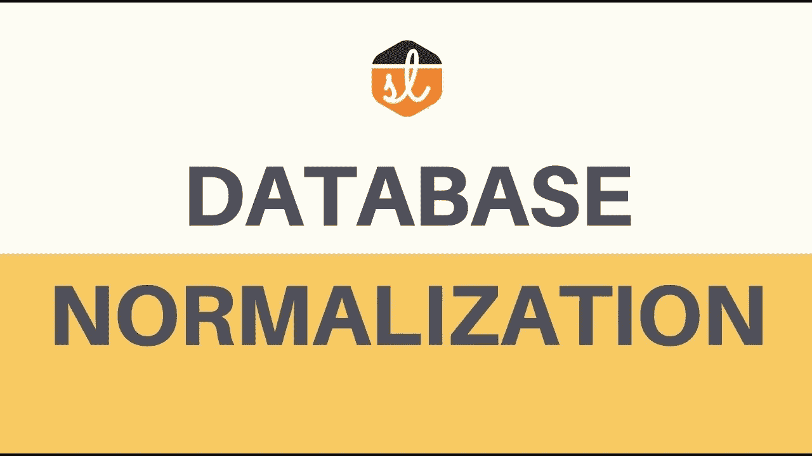
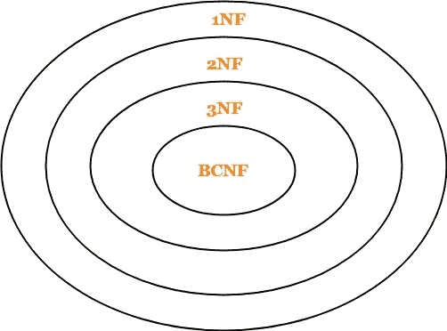
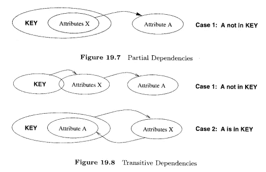
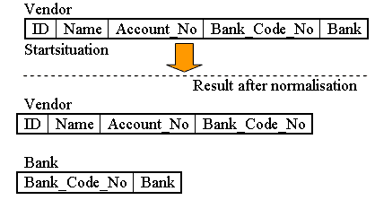

# DBMS 中的规范化

> 原文：<https://medium.com/geekculture/normalization-in-dbms-3b2af915ee25?source=collection_archive---------31----------------------->



规范化是一个过程，通过这个过程，我们可以将任何关系分解或划分为一个以上的关系，以消除关系数据库中的异常。

**更新异常**:更新异常是数据冗余和部分更新导致的数据不一致

**删除异常:**当您删除可能包含不应该删除的属性的记录时，会出现删除异常

**插入异常:**我们试图在一个根本不存在的记录中插入数据。

规范化规则分为以下几种标准形式:

1.  第一范式
2.  第二范式
3.  第三范式
4.  BCNF



**第一范式:**关系处于第一范式如果每个值的定义域只包含一个原子或单个值，这意味着原子性必须存在于关系中。

```
ID   Name       Courses
--------------------
1    Akshay     c1,c2
2    Abhishek   c3
3    Aditya     c2,c3ID   Name       Courses
------------------
1    Akshay      c1
1    Akshay      c2
2    Abhishek    c3
3    Aditya      c2
3    Aditya      c3
```

**第二范式:**如果一个关系在第一范式中，并且没有部分依赖，则它在第二范式中。**部分依赖**当一个非主属性在功能上依赖于候选关键字的一部分时发生。



**第三范式:**如果一个关系在第二范式中，并且没有传递依赖，则它在第三范式中。

**Boyce–Codd 范式:**一个关系在 BCNF 中当且仅当每一个非平凡函数依赖 X → Y 都以 X 为超键。



**琐碎的函数依赖**是一种数据库依赖，当您描述一个属性的函数依赖或包含原始属性的属性集合时，就会出现这种依赖。如果函数依赖 X →Y 成立，其中 Y 不是 X 的子集，这个依赖称为**非平凡函数依赖。**

**第四正常正常:** It 是数据库规范化的一个级别，其中除了候选关键字之外，没有非平凡的多值依赖项。

它建立在前三个范式(1NF、2NF 和 3NF)和 Boyce-Codd 范式(BCNF)的基础上。它规定，除了满足 BCNF 要求的数据库之外，它不能包含多个多值依赖项。

**第五范式:**第五范式又称为项目-联结范式。如果在 4NF，关系是第五范式(5NF ),并且不会无损分解成更小的表。

如果候选键暗示了其中的每个连接依赖，您也可以认为一个关系在 5NF 中。