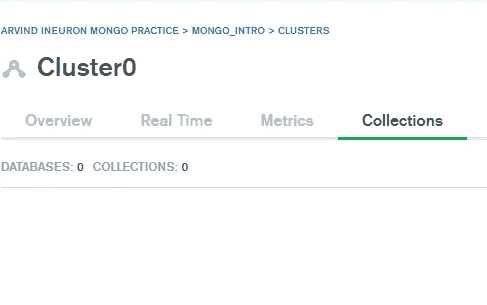
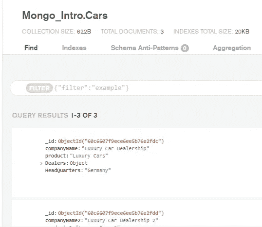
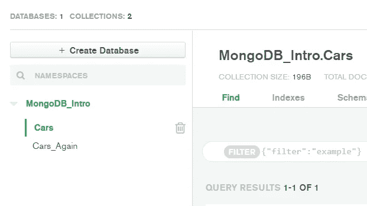
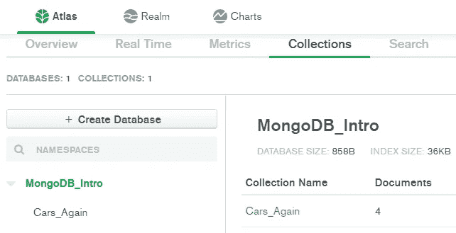

# NoSQL 数据库处理

> 原文：<https://medium.com/geekculture/nosql-database-handling-349176dc7be7?source=collection_archive---------57----------------------->

处理 MongoDB 的 Pythonic 方式

Obviously, from the [mongodb.com](http://mongodb.com)

SQL 数据库，如 MySQL、Oracle 等。每个表遵循一个固定的模式。架构指的是列的数量和输入到列中的数据类型。Schema 用 SQL 数据库表示表的结构。这种方法的问题是，如果我们想突然增加列的数量，我们需要用新的结构创建一个全新的表。使用 SQL 处理临时的大量数据不是很有效。

这就是 NoSQL(不仅仅是 SQL)数据库发挥作用的地方。这里的模式不是一个固定的实体。我们可以轻松地缩放数据。Python 提供了直接处理 NoSQL 数据库的工具。在本文中，我们将讨论 Python 和 NoSQL 数据库 MongoDB 之间连接的建立。

ineruon.ai 发表了一篇非常有帮助的[文章](https://github.com/arvindhhp/PyDB/blob/main/Ancillary_Files/MongoDB_Atlas.ipynb)来建立名为 ATLAS 的云版本的 MongDB。在本文中，我们使用的是 MongoDB ATLAS 的免费版本。

所有的代码片段及其输出都可以从@ [Github](https://github.com/arvindhhp/PyDB/blob/main/Part_002_MongoDB_Python_Connection.ipynb) 获得。

# 在 Python 和 MongoDB 之间建立连接

MongoDB ATLAS Connector for Python (pymongo)

# 在 MongoDB 中创建数据库和集合

# 只是暂时的观察

与 MySQL 不同，不会创建空集合。见下图。集合仅在输入记录时可见。

Empty Cluster (even after adding a databse)

# 将记录插入集合

输入以键值对的形式提供。我们称之为 JSON (Java Script Object Notation ),但是现在，让我们把它看作一个字典。

# 唯一 ID

Auto created Unique ObjectIDs

> 现在，在 MongoDB ATLAS 的实际数据库中，所有记录都是可见的。为了简单起见，只展示一个。
> 
> _id 会自动创建。这对于每个记录都是唯一的。然而，这可以手动超越。但是在一个集合中，用户必须确保所有的记录都有唯一的 id

# 覆盖唯一标识

Overriding Object IDs

User defined _id in MongoDB\

# 从 MongoDB 提取数据

Data extraction from MongoDB using filters in Queries

# 更新 MongoDB 中的数据

这可以通过向 update_many(old_dict，new_dict)传递两个字典来实现

该函数查找与查询匹配的第一个文档(记录),并用定义文档新值的对象更新它，即基于过滤器更新集合中的单个记录。

Updated data is now appended to the Collection’s Record

## 请注意在 id 为 1 的集合中更新的新数据

# 从集合中删除记录(文档)

# 删除完整的集合

我们还有一个现成的选项，可以从数据库中删除完整的集合。

# 在删除前，数据库再次包含两个集合 Cars 和 Cars _

# 只有 1 辆收集汽车的数据库 _ 丢弃后再次

> 所以，欢迎来到 NoSQL 数据库的世界
> 
> 结束。
> 
> 代码可从@ [Github](https://github.com/arvindhhp/PyDB/blob/main/Part_002_MongoDB_Python_Connection.ipynb) 获得。请务必在 [Linkedin](https://www.linkedin.com/in/arvindhhp/) 上联系我了解更多信息。