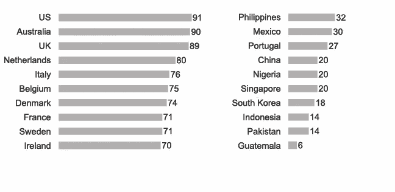

# 不是每个分析专家对“团队”都有相同的定义

> 原文：<https://medium.com/geekculture/not-every-data-scientist-has-the-same-definition-of-team-e4a8a2489748?source=collection_archive---------67----------------------->

Photo by [https://unsplash.com/@timmarshall](https://unsplash.com/@timmarshall)

在与遍布六大洲的分析师和开发人员一起工作后，我通过艰苦的方式了解到这一点。

问自己以下问题:

*   在团队会议上，你在想你同事的技术是如何的错误，或者他们的编码是如何的草率。你在会议上说这个吗？
*   *你的新同事邀请你参加社交活动，但你有很多工作要做。你应该告诉他们什么？*
*   *你的团队刚刚交付了一些伟大的成果。你是称赞整个团队，还是关注特定个人的成就？*

这些问题没有正确的答案。更糟糕的是，**你的同事可能认为相反的答案是“明显正确的”**！

对于这些问题中的每一个，“显然正确的答案”取决于你的文化背景。数据科学家、分析师和软件开发人员面临的挑战是，我们经常与来自不同文化的同事和利益相关者一起工作。如果我们假设每个人都像我们一样思考，这就很容易“弄错”。

你对上述问题的回答很大程度上取决于你来自“集体文化”还是“个人文化”(根据荷兰心理学家海尔特·霍夫斯泰德的研究定义)。

集体文化自然形成有凝聚力的群体，为其成员提供保护以换取忠诚。这种归属感非常重要，所以自然会形成“进”和“出”的群体。关系比任务甚至道德规范更重要，成员避免批评其他群体成员。因此，为了和谐，情感通常被压抑。

另一方面，个人主义文化期望人们关心自己，拥有隐私和独处的权利。个人观点受到重视，说出自己的想法被认为是一件好事。任务压倒关系。

**你是否开始意识到这在你的团队中是一个地雷？**

这是我在易贝分类广告集团担任全球商业分析主管时的一个例子。

> 几年来，当我自己在阿姆斯特丹工作时，我在上海管理着一个中国开发团队。我对上海队的凝聚力感到惊讶。他们不仅会一起工作很长时间，还会在周末花大部分时间出去闲逛，有时会唱卡拉 ok 直到周六凌晨(当两个团队成员最终结婚时，这并不令人惊讶)
> 
> 与此同时，我注意到中国人在交流同事时有一个微妙的不同。我的标准面试问卷的一部分是要求应聘者描述一个他们过去喜欢共事的人和另一个他们不喜欢共事的人。
> 
> *我注意到，很少有中国申请者愿意用负面的词语来描述以前的同事。我很快就把这个问题丢给了中国申请者。*

为了让你了解不同文化之间的差异，这里列出了个人主义的最高分和最低分(使用霍夫斯泰德量表)

Countries with highest and lowest individualism

回到本节开头的两个问题，如果你处于一种集体文化中，你应该格外小心，不要说一些在集体环境中会让同事看起来很糟糕的话。只要有可能，你会想参加集体社交活动，比如和你的团队一起吃午饭。在个人主义文化中，这两者都是不太重要的(尽管仍然受到重视)实践。

# **与不同层次的个人主义打交道的技巧**

这个话题相当微妙，但这里有一些提示

**与个人主义的同事一起工作时:**

*   认可他们的个人成就。他们通常会欣赏自己在某些方面与众不同的感觉。
*   意识到他们可能选择不把工作和社交生活混为一谈。他们可能很友好，甚至会在工作时谈论他们的私人生活，但如果他们没有和你一起喝酒或吃饭，也不要生气。
*   鼓励个人观点的辩论和表达。如果他们觉得不被允许表达自己的意见，他们会变得沮丧。

**与集体主义同事一起工作时:**

*   当你不工作的时候，试着花时间在一起，比如在吃饭或者社交活动的时候。你可能会发现他们甚至喜欢周末被邀请一起做事。
*   避免表达负面情绪或对他人的想法表示否定，尤其是在公共场合。这些文化使用其他反馈渠道——这些渠道在各自的文化中是可以接受的，但在你看来可能不太寻常。找出那些与你互动的文化的渠道。
*   突出团队而不是个人的成就。用团队社交活动来庆祝团队的成就效果很好，因为这些文化对于在工作时间之外举办这样的活动更加开放。

既然归属感是如此核心的人类需求，我们可以看到在这个维度上的文化误解是如何引起深刻的情感混乱，并可能导致严重的冲突。如果处理不当，这方面的文化误解很容易使你的项目短路。

你呢？在你的工作中，有没有因为团队成员对“团队”的含义有不同的理解而产生误解的例子？

*这篇文章摘自我最近的书* [*数据科学家的商业技能:六个关键主题的实践指导*](https://www.amazon.com/dp/B08TY93PMC) *，这本书本身是基于我为公司和大学项目开发的培训。关注我*[*Linkedin*](https://www.linkedin.com/in/dmstephenson/)*。*