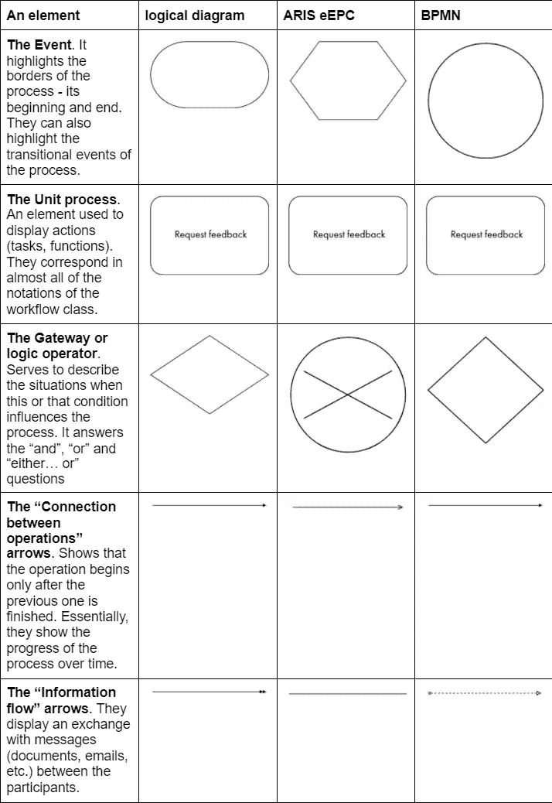
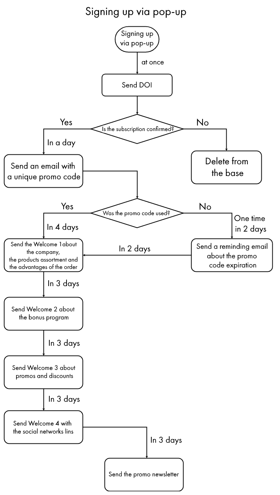
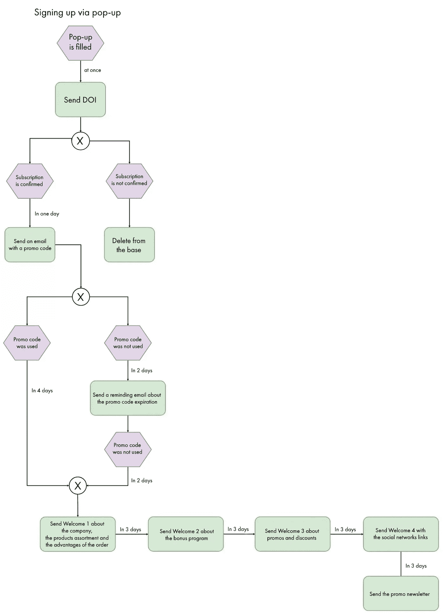
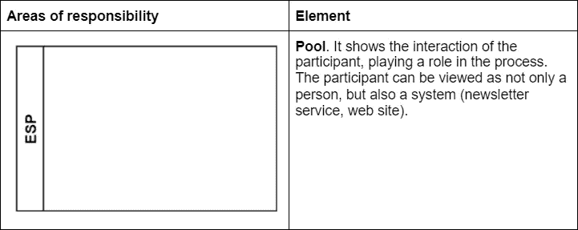
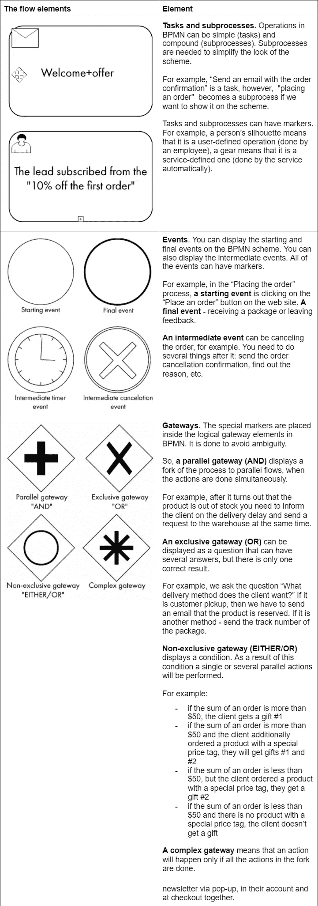
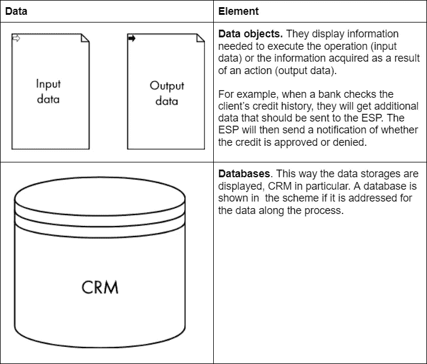
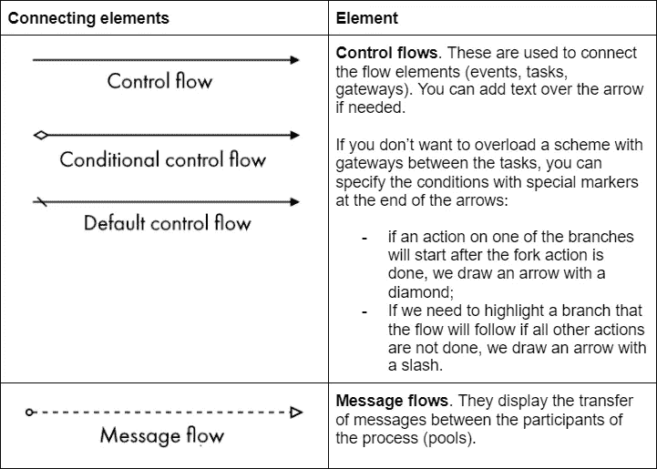
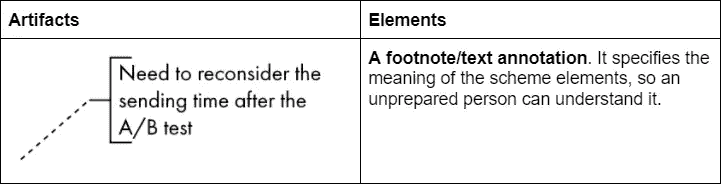
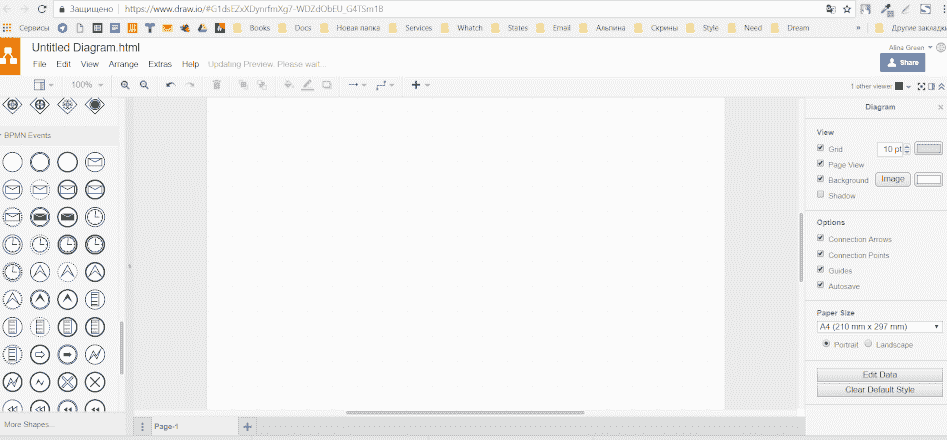

# 符号:如何借助逻辑图解释复杂的过程

> 原文：<https://medium.com/geekculture/notations-how-to-explain-complicated-processes-with-the-help-of-logical-diagrams-902b97f8c3f6?source=collection_archive---------23----------------------->

Original picture by A.Malyavina

一些电子邮件营销策略让我们想起了大卫·林奇的场景。如果不解释什么是相互关联的以及它是如何工作的，这是不可理解的。

为了让客户理解一个策略，我不仅设计了文本，还设计了一个方案。对于用同一种语言“编写”的所有方案，我使用**符号。**

# 什么是记谱法

**符号是一组用于显示系统元素的图形元素。**简单地说，符号定义了我们用来定义方案中的流程、操作和事件的规则，并将它们相互联系起来。

# 我是如何选择符号的

有几十种符号，既简单又非常复杂，用于编程、物流、业务分析——任何需要流程描述的地方。先说清楚哪种适合我们。

我的目标是描述我们将电子邮件营销实施到品牌与买家的现有沟通系统中的方式，或者，从零开始建立这个系统，这种情况较少发生。

任务是**在参与者之间建立互动链**，并展示我们将在何时以及在何种条件下发送简讯。

我试着遵循这些符号标准:

*   **通俗易懂**。符号应该简单，否则会花太多时间去理解，而且会冻结工作进程。
*   **容易感知**。一个没有准备，不懂记谱法语言的人，应该懂方案。

这些符号在业务流程工程的工作流类中列出。这些是所谓的工作流程图，显示了一段时间内的操作顺序。

让我们通过 ICT 课程中的简单逻辑图、流行的 ARIS eEPC 符号和更复杂的现代 BPMN 符号来分析这些符号的基本元素。

# 基本元素的列表

Table made by the author

现在让我们试着用每种符号描述一个简单的策略。

# 1.简单的逻辑图

“简单逻辑图”符号中最常用的元素是**流程**、**解决方案**、**文档**、**数据**和**箭头**。箭头要么根本没有名字，要么方案制定者试图给它们取一个简短易懂的名字。

Scheme made by the author

这个方案非常简单，对用户友好，它将很好地描述更小的策略。它也很灵活，这意味着你可以创建自己的元素，并根据自己的喜好组合它们。

请记住，如果你想在你的公司中实施构建方案的技术，那么你必须开发一个关于它们的使用的内部标准。否则，你会得到很多不同的方案，很难弄清楚。

# 2.ARIS eEPC

eEPC 缩写的意思是扩展的事件驱动过程链。**一个事件**“创建”**一个操作(函数)**，它的任务是“创建”下一个事件。

在用 ARIS eEPC 符号构建方案时，你需要考虑**主要规则**:

*   每个函数都应该在事件之前**；**
*   每个函数都应该以事件结束**；**
*   只有**一个箭头**，连接一个功能与其引发事件或后续事件，**可以进入和离开每一个功能。**

Scheme made by the author

现在，这个符号需要更多的描述。它基于 **BPM** (业务流程管理)方法论。BPMN 符号或 BPMN 中的方案模拟了参与者在一段时间内的**行为**。

需要建立业务战略、发现缺陷并使之现代化的业务流程管理专业人士选择了 BPMN。这个符号让我们能够反映细节，并从鸟瞰的角度来看它们。

BPMN 语很难，需要特别学习。然而，你不必使用所有的元素，你可以选择适合你的元素。

# BPMN 元素的方面

Table made by the author

# 如何使用 BPMN

在与 BPMN 合作时，你需要坚持标准。如果你真的想学习说 BPMN 语，你不能改变图形元素的外观，也不能随心所欲地连接它们。

# 如何快速画出方案

创建方案并不难，主要是理解过程的本质，思考其实现机制，遵循方案创建算法。

1.  **设置页边距**。您需要在方案上显示流程的开始和结束事件。
2.  **绘制主程序块**。想象这个过程完美无缺，建立一个任务链，当完成时，它会给你结果。
3.  **加叉**。指定场景。这样做比一开始就把它们放在一起，然后被箭头缠住要容易得多。
4.  **添加缺失的数据**。如果需要，在计划上放置重要的文档、数据库和文本注释。

# 使用了什么工具

现在有很多商业和免费的工具用于业务流程建模。如果我们谈论免费工具，我喜欢 BizAgi Modeler 和 T2 的 Draw.io 在线服务。他们有一个简单的界面，完整的符号和方案可以保存为 jpg，png 和 svg 图像。

对我的公司来说这就足够了，所以我们不使用任何商业工具。但是如果你真的想要，你可以买**视觉范例**。订阅费用为每月 6 美元至 89 美元，完全许可费用为 99 美元至 1999 美元。另一个受欢迎的选择是**微软 Visio** (订阅每月 5 美元到 15 美元不等)。

商业版本中最有趣的选项是过程检查。当你建立一个方案时，程序会检查它是否包含任何逻辑错误。

暂时就这样了。我希望这篇文章能让您对图形符号和正确使用这种语言的方法有所了解。