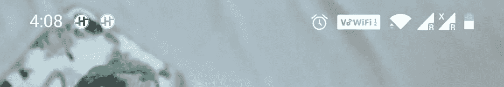
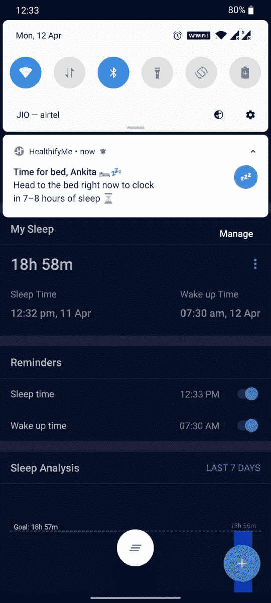
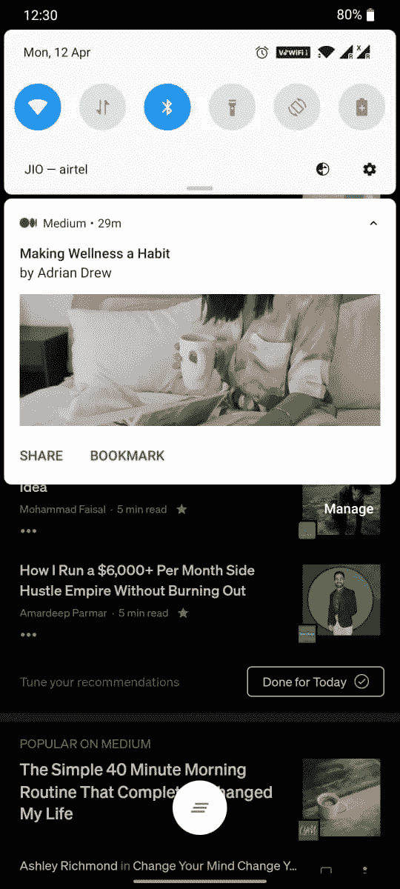
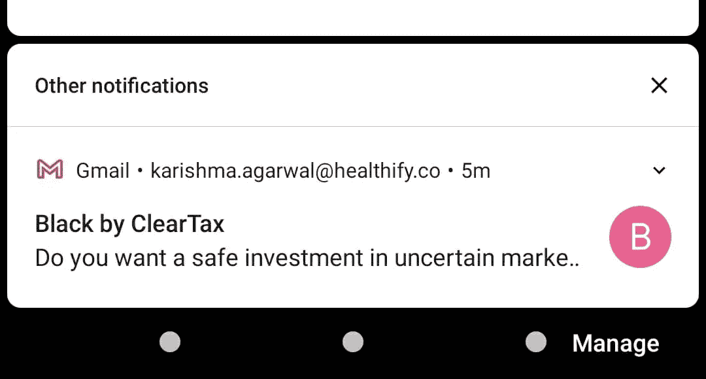
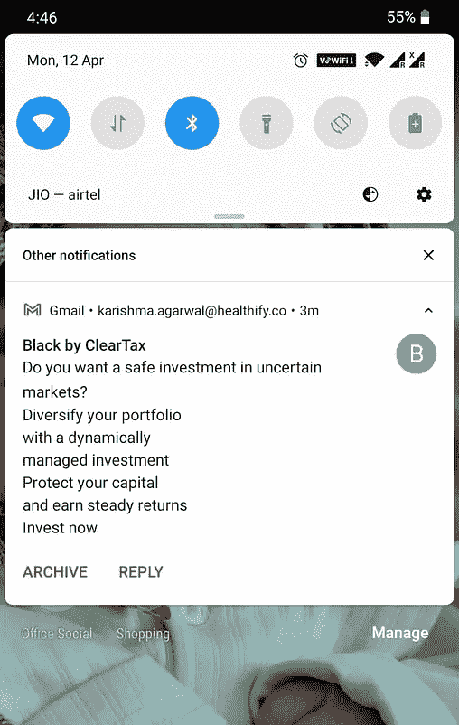
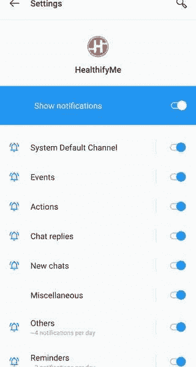
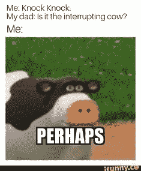
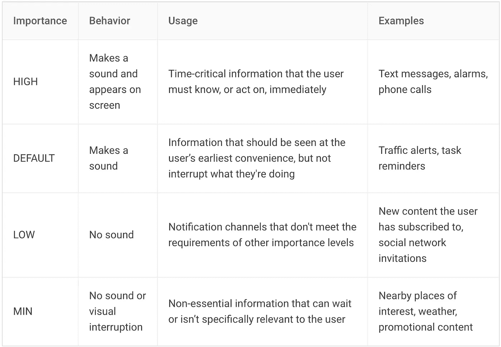

# Android 中的通知

> 原文：<https://medium.com/geekculture/notifications-in-android-6b2d195d35b1?source=collection_archive---------1----------------------->


[https://ifunny.co/picture/tinder-yesterday-10-22-am-who-are-all-these-new-Wbsry7hr6?s=cl](https://ifunny.co/picture/tinder-yesterday-10-22-am-who-are-all-these-new-Wbsry7hr6?s=cl)

通知是我们在应用程序外部向用户显示的显示消息。它有助于提醒基于时间的事情或与其他人交流。用户可以通过点击通知来打开应用程序，或者只在那里提供操作。

就像在 WhatsApp 中，如果用户点击通知，我们会收到消息通知，我们会打开一个聊天窗口，或者我们可以简单地在通知中键入我们的消息。然后发送出去。

# 设备上的外观



Notification icons appear on left side of status bar



Reminder for sleep time in HealthifyMe app

用户可以在最上面的抽屉中看到通知。通知卡包含图标、标题、消息、大图标和操作按钮。

用户可以向下拖动通知来查看扩展视图。

通知在通知抽屉中保持可见，直到被应用程序或用户取消。

通知将在锁定屏幕上可见，直到用户从设置中隐藏它。



Gmail small and expanded notification view

正如你从上面的截图中看到的，左边是一个电子邮件通知的小视图，当用户拖动它时，我们可以看到一个扩展的视图。我们这里有两个动作按钮存档和回复。点击这些按钮，用户将进入一个集成屏幕。在本文的下一部分，我们将看到如何实现这一点。

# 创建通知

我们将从基础开始，然后转向扩展、行动和 it 优先级。基本通知包含图标、标题和消息，然后单击。

**设置通知内容:**


[https://developer.android.com/images/ui/notifications/notification-callouts_2x.png](https://developer.android.com/images/ui/notifications/notification-callouts_2x.png)

1.  **小图标**:从上面的截图来看，小图标会被`[setSmallIcon()](https://developer.android.com/reference/androidx/core/app/NotificationCompat.Builder#setSmallIcon(int))`设置。
2.  **App 名称**:由系统提供。
3.  **时间戳**:这是系统提供的，但是你可以用`setWhen()`覆盖它或者用`setShowWhen(false)`隐藏它。
4.  **大图标**:这是可选的(通常只用于联系人照片；不要用于你的应用图标)并用`setLargeIcon()`设置。
5.  **标题**:可选，用`setContentTitle()`设置。
6.  **文本**:可选，用`setContentText()`设置。

您需要使用一个`NotificationCompat.Builder`对象来设置通知的内容和通道。

```
val builder = NotificationCompat.Builder(context, NotificationUtils.*CHANNEL_OTHERS*)
builder.setContentTitle(title)
    .setContentText(message)
    .setSmallIcon(icon)
    .setWhen(notificationTimeInMillis)
    .setColor(ContextCompat.getColor(context, R.color.*brand_nutrition_track*))
    .setStyle(NotificationCompat.BigTextStyle().bigText(message))
    .setDeleteIntent(dismissIntent)
```

注意`NotificationCompat.Builder`构造函数要求您提供一个通道 ID。这是与 Android 8.0 (API 级别 26)和更高版本兼容所必需的，但被旧版本忽略。

默认情况下，通知文本在一行中。**如果您的内容很大，无法在一行中显示，您可以通过添加样式来添加扩展视图**:

```
setStyle(NotificationCompat.BigTextStyle().bigText(message)
```

**创建频道**

在 Android 8.0 和更高版本上发送通知之前，您必须通过将`NotificationChannel`的实例传递给`createNotificationChannel()`来向系统注册您的应用程序的通知通道。所以下面的代码被`[SDK_INT](https://developer.android.com/reference/android/os/Build.VERSION#SDK_INT)`版本上的一个条件阻塞了:

因为在 android 8.0 或更高版本上需要设置一个通知通道来发送通知，所以这应该在应用程序启动时或者至少在创建通知构建器之前进行。

带频道的用户控制应用程序通知。我们可以进入应用程序设置->通知，你会看到一个这样的窗口。



上面你可以看到 HealthifyMe 应用中的频道列表。如果我们不想要特定的通道通知，只需禁用它。

**锁屏可视性**

从上面的代码片段可以看出，我们正在设置**锁屏可见性。**用于安全目的，比如用户不想在设备锁定时显示通知，或者只想显示有限的内容。

使用 `**setVisibility()**`方法:

*   `[VISIBILITY_PUBLIC](https://developer.android.com/reference/androidx/core/app/NotificationCompat#VISIBILITY_PUBLIC)`显示通知的全部内容。
*   `[VISIBILITY_SECRET](https://developer.android.com/reference/androidx/core/app/NotificationCompat#VISIBILITY_SECRET)`在锁定屏幕上不显示该通知的任何部分。
*   `[VISIBILITY_PRIVATE](https://developer.android.com/reference/androidx/core/app/NotificationCompat#VISIBILITY_PRIVATE)`显示基本信息，如通知的图标和内容标题，但隐藏通知的全部内容。

**设置通知优先级**

通知优先级定义了当用户在做其他事情时，一个通道如何中断用户来显示通知。



[https://ifunny.co/picture/me-knock-knock-my-dad-is-it-the-interrupting-cow-Xsgbeaca6?s=cl](https://ifunny.co/picture/me-knock-knock-my-dad-is-it-the-interrupting-cow-Xsgbeaca6?s=cl)

您指定的重要性级别将是频道的默认值。用户可以在 Android 设置中更改频道的重要性级别。



```
setPriority(NotificationCompat.PRIORITY_DEFAULT)
```

**通知的点击动作**

当您单击通知时，它应该会打开一个活动，为此，您必须指定一个用`[PendingIntent](https://developer.android.com/reference/android/app/PendingIntent)`对象定义的内容意图，并将其传递给`[setContentIntent()](https://developer.android.com/reference/androidx/core/app/NotificationCompat.Builder#setContentIntent(android.app.PendingIntent))`。

请注意，我们添加了 setAutoCancel()，当您点击它时，它将取消通知。

**设置标志**

```
val pendingIntent = PendingIntent.getActivity(context,
    notificationId,activityIntent,PendingIntent.*FLAG_CANCEL_CURRENT*)
```

当我们为通知的触摸动作创建待定意向时，我们可以通过调用`setFlags()`方法或在方法中提供对象值来设置标志 y。它有助于在用户通过通知打开您的应用程序后，保持他们预期的导航体验。

现在，我们是否需要设置这取决于我们正在打开的活动的类型。有两种情况:

*   **常规活动**:这是作为你的应用正常 UX 流的一部分而存在的活动。因此，当用户从通知到达活动时，新任务应该包括一个完整的 [back stack](https://developer.android.com/guide/components/activities/tasks-and-back-stack) ，允许他们按 *Back* 并在应用程序层次结构中向上导航。
*   **特殊活动**:只有从通知开始，用户才能看到该活动。从某种意义上说，该活动通过提供难以在通知本身中显示的信息来扩展通知 UI。所以这个活动不需要 back stack。

**关于标志的详细信息**

我们已经讨论了一些在创建`PendingIntent`时可以使用的标志，但是还有一些其他的标志需要讨论。

🤡`[FLAG_IMMUTABLE](https://developer.android.com/reference/kotlin/android/app/PendingIntent#FLAG_IMMUTABLE:kotlin.Int)`:表示`PendingIntent`内的意图不能被传递`Intent`到`PendingIntent.send()`的其他应用修改。一个应用程序总是可以使用`FLAG_UPDATE_CURRENT`来修改它自己的挂起内容

🆕`[FLAG_MUTABLE](https://developer.android.com/reference/kotlin/android/app/PendingIntent#FLAG_MUTABLE:kotlin.Int)`:只有当某些功能依赖于修改潜在意图时，才应该使用它，例如，任何需要与内嵌回复或气泡一起使用的 PendingIntent。

😎`[FLAG_UPDATE_CURRENT](https://developer.android.com/reference/kotlin/android/app/PendingIntent#flag_update_current)`:请求系统用新的额外数据更新现有的`PendingIntent`，而不是存储新的`PendingIntent`。如果`PendingIntent`没有注册，那么这个就会注册。

👆🏻`[FLAG_ONE_SHOT](https://developer.android.com/reference/kotlin/android/app/PendingIntent#flag_one_shot)`:表示该 PendingIntent 只能使用一次的标志。与#getActivity、`[getBroadcast](https://developer.android.com/reference/kotlin/android/app/PendingIntent#getBroadcast(android.content.Context,%20kotlin.Int,%20android.content.Intent,%20kotlin.Int))`和`[getService](https://developer.android.com/reference/kotlin/android/app/PendingIntent#getService(android.content.Context,%20kotlin.Int,%20android.content.Intent,%20kotlin.Int))`一起使用。

如果设置了，在对它调用`[send()](https://developer.android.com/reference/kotlin/android/app/PendingIntent#send())`之后，它将自动为你取消，并且任何未来通过它发送的尝试都将失败。

🔐利用`FLAG_ONE_SHOT`可以防止诸如[“重放攻击”](https://en.wikipedia.org/wiki/Replay_attack)之类的问题。

`[FLAG_CANCEL_CURRENT](https://developer.android.com/reference/kotlin/android/app/PendingIntent#flag_cancel_current)`:在注册新的`PendingIntent`之前，取消现有的`PendingIntent`(如果存在的话)。如果一个特定的`PendingIntent`被发送到一个应用程序，而你想把它发送到不同的应用程序，可能会更新数据，这可能很重要。通过使用`FLAG_CANCEL_CURRENT`，第一个应用程序将不再能够调用 send，但是第二个应用程序可以。

这就是我们在上面的代码片段中使用的内容。

**设置声音:**

```
Uri alarmSound = RingtoneManager.*getDefaultUri*(RingtoneManager.*TYPE_NOTIFICATION*);
builder.setSound(alarmSound);
builder.setVibrate(AbstractNotificationGCMHandler.*DEFAULT_VIBRATE_PATTERN*);
```

**显示通知**

创建通知生成器、通道并将内容设置为后。展示和。全体行动。是时候展示了。通知。

```
notificationManager.notify(notificationId, builder.build());
```

**见下面通知的完整代码:**

我希望这篇文章对你有帮助。如果我们想引起用户的注意，通知在许多 android 应用中是很重要的。在这里，我们了解了什么是通知，如何通知。他们着眼于，如何创建一个通知通道，如何为通知添加显示内容，如何提供点击动作和显示通知。

但这还没有结束。在本文的下一部分，我们将了解分组通知、有时间限制的通知和通知上的用户操作按钮，以及在应用程序进度条中检索用户输入数据。

在此找到本文的下一部分:

[](https://karishma-agr1996.medium.com/notifications-in-android-part-2-d37102e7e29a) [## Android 中的通知—第 2 部分

karishma-agr1996.medium.com](https://karishma-agr1996.medium.com/notifications-in-android-part-2-d37102e7e29a) 

# 参考

[](https://developer.android.com/training/notify-user/build-notification#notify) [## 创建通知| Android 开发者

### 当您的应用程序未被使用时，通知会提供有关该应用程序中事件的简短、及时的信息。本页教你…

developer.android.com](https://developer.android.com/training/notify-user/build-notification#notify) [](https://developer.android.com/reference/kotlin/android/app/PendingIntent#flag_one_shot) [## 待定内容| Android 开发者

### AccessibilityServiceMagnificationController . OnMagnificationChangedListener

developer.android.com](https://developer.android.com/reference/kotlin/android/app/PendingIntent#flag_one_shot) [](/androiddevelopers/all-about-pendingintents-748c8eb8619) [## 关于未决事件的一切

### 待定内容是 Android 框架的重要组成部分，但大多数可用的开发人员资源都集中在…

medium.com](/androiddevelopers/all-about-pendingintents-748c8eb8619) 

如果你有任何反馈，请给我回信，地址是*karishma.agr1996@gmail.com。非常感谢你的鼓掌帮助其他人找到这篇文章😃。*

