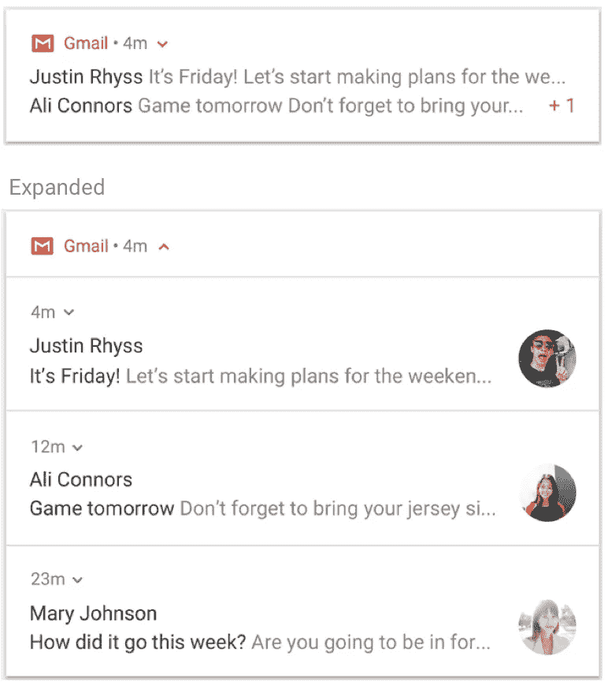
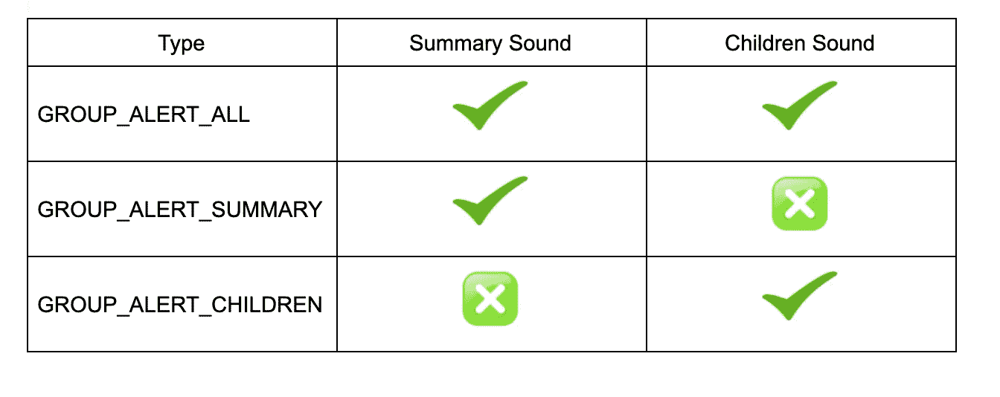
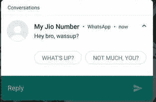

# Android 中的通知—第 2 部分

> 原文：<https://medium.com/geekculture/notifications-in-android-part-2-d37102e7e29a?source=collection_archive---------6----------------------->

通知对于引起用户注意很重要。在本文的第一部分，我们讨论了通知，为什么我们需要它们，如何创建通知，如何触发它们，以及它们在设备上的外观。

您可以从这里访问第 1 部分:

[](/geekculture/notifications-in-android-6b2d195d35b1) [## Android 中的通知

### 通知是我们在应用程序外部向用户显示的显示消息。它有助于提醒基于时间的事情或…

medium.com](/geekculture/notifications-in-android-6b2d195d35b1) 

在本文中，我们将了解:

*   分组通知
*   有时限的通知
*   通知中按钮的用户操作
*   添加直接回复操作
*   在应用程序中检索用户输入数据

# 分组通知

我们用一个例子来理解这个。在你的 WhatsApp 里，有一天你被加入了一个新的家庭群。现在，当你的所有家庭成员都在分享他们正在做的事情、家庭聚会或双关语的照片时。你的手机被成百上千的通知轰炸，这很烦人。

为了在 Android 7 中救你一命，我们更新了**分组通知**。其中我们可以将冗余通知组合成一个通知，当您展开它时，可以看到每个通知。



# **创建一组通知**

*   `setGroup` 要创建一个通知组，为该组创建一个唯一的键，然后只需为该组中的每个通知调用`setGroup`。

```
NotificationCompat.Builder builder = new NotificationCompat.Builder(context, CHANNEL_ID)
        .setNumber(notificationId)
        .setSmallIcon(smallIcon)
        .setContentTitle(title)
        .setContentIntent(contentIntent)
        .setContentText(msg)
        .setGroup("group");
```

*   `setSortKey()` 默认情况下，通知按照发布的时间排序，但是您可以通过调用`setSortKey().`来更改顺序
*   `setGroupAlertBehavior()` 该方法设置通知的群组提醒行为。如果此通知组的警报应由不同的通知处理，请使用此方法将通知静音。当然，这适用于组通知的情况，否则，每一个通知都会发送一个警告来引起用户的注意。
    报警行为有 3 种类型:
    1。GROUP_ALERT_ALL
    2。GROUP_ALERT_SUMMARY
    3 组 _ 警报 _ 儿童



*   `setGroupSummary`
    如前所述，群组通知出现在 android 7 中。为了支持旧版本，我们需要创建一个额外的通知作为摘要。

检查下面的完整代码:

# 有时限的通知

在某些情况下，当你的应用程序在后台时，你的应用程序可能需要用户立即关注，就像打电话或报警一样。为了提供这种行为，我们需要做一些设置。

我们以 HealthifyMe App 中的视频通话服务为例。当教练想和用户通话时，我们会发送视频通话通知


**第一步:创建通知渠道**

我们将通知重要性设置为**高。**而且锁屏可见性也是公开的，所以不管你的应用是在后台还是你的设备被锁定，用户都会优先收到这个通知。

**第二步:启动铃声并检查振动** 现在在视频通话情况下我们想要手机的铃声和振动，这是根据您的需要可选的。

这也是可选的，有时你不想让你的通知全屏显示。在我们的例子中，我们正在进行视频通话，所以我们希望全屏显示。

**第四步:向用户显示通知** 当向用户显示通知时，他们可以选择确认或取消应用程序的警告或提醒。例如，用户可以选择是接受还是拒绝来电。

如果您的通知是一个正在进行的通知，例如一个来电，将通知与一个[前台服务](https://developer.android.com/guide/components/services#Foreground)相关联。以下代码片段显示了如何显示与前台服务关联的通知:

```
startForeground(*NOTIFICATION_ID_INCOMING_CALL*, notification)
```

# 通知中按钮的用户操作

让我们举同样的例子，在全屏通知中，我们有两个按钮，一个接受呼叫，另一个拒绝呼叫。

**步骤 1:** 创建拒绝呼叫事件的待定意向。您正在发送动作为`ACTION_DECLINE_CALL`的广播。

```
val declineCall = Intent().*apply* **{** *action* = ACTION_DECLINE_CALL
**}** val declineCallIntent: PendingIntent =
    PendingIntent.getBroadcast(this, 0, declineCall, PendingIntent.*FLAG_UPDATE_CURRENT*)
```

**步骤 2:为接受呼叫创建待定意向**

```
val acceptCall = Intent().*apply* **{** *action* = ACTION_ACCEPT_CALL
**}** val acceptCallIntent: PendingIntent =
    PendingIntent.getBroadcast(this, 0, acceptCall, PendingIntent.*FLAG_UPDATE_CURRENT*)
```

**步骤 3:** 使用`addAction()`创建通知时，将这些添加为操作

**步骤 4:** 处理广播接收器
我们在这里使用广播，所以事情将在后台运行，主线程上没有任何东西受到干扰。

有关构建一个`[BroadcastReceiver](https://developer.android.com/reference/android/content/BroadcastReceiver)`来运行后台工作的更多信息，请参见[广播指南](https://developer.android.com/guide/components/broadcasts)。

停止您运行以显示通知的前台服务。

# 添加直接回复操作



**添加回复按钮**

**步骤 1:** 创建远程构建器的实例。

```
private RemoteInput getReplyRemoteInput(Context context) {
    *// Key for the string that's delivered in the action's intent.* String replyLabel = context.getResources().getString(R.string.*type_message*);
    return new RemoteInput.Builder(*KEY_TEXT_REPLY*)
            .setLabel(replyLabel)
            .build();
}
```

**第 2 步:**创建一个待定意向回复按钮。

```
private PendingIntent getReplyPendingIntent(Context context, Group group) {
    Intent intent = new Intent(context, FirebaseSyncService.class);
    intent.putExtra(FirebaseSyncService.*ARG_GROUP*, group);
    return PendingIntent.*getService*(context,
            FirebaseSyncService.*REQUEST_CODE_NOTIFICATION_DIRECT_REPLY*,
            intent, PendingIntent.*FLAG_UPDATE_CURRENT*);
}
```

**第三步:**使用`addRemoteInput()`将`RemoteInput`对象附加到一个动作上。

```
private NotificationCompat.Action getReplyAction(Context context, Group group) {
    *// Create the reply action and add the remote input.* return new NotificationCompat.Action.Builder(R.drawable.*ic_send_white*,
            context.getString(R.string.*reply_label*), getReplyPendingIntent(context, group))
            .addRemoteInput(getReplyRemoteInput(context))
            .build();
}
```

**步骤 4:** 将此操作应用于通知

# **从回复中检索用户信息**

**第一步**:调用`RemoteInput.getResultsFromIntent()`

```
private CharSequence getMessageText(Intent intent) {
    if (intent == null)
        return null;

    Bundle remoteInput = RemoteInput.*getResultsFromIntent*(intent);
    if (remoteInput != null) {
        return remoteInput.getCharSequence(*KEY_TEXT_REPLY*);
    }
    return null;
}
```

**步骤 2** :处理完文本后，您必须通过使用相同的 ID 和标签(如果使用的话)调用`NotificationManagerCompat.notify()`来更新通知。这对于隐藏直接回复用户界面并向用户确认他们的回复已被正确接收和处理是必要的。

```
// Build a new notification, which informs the user that the system
// handled their interaction with the previous notification.
val repliedNotification = Notification.Builder(context, CHANNEL_ID)
        .setSmallIcon(R.drawable.ic_message)
        .setContentText(getString(R.string.replied))
        .build()

// Issue the new notification.
NotificationManagerCompat.from(this).apply {
    notificationManager.notify(notificationId, repliedNotification)
}
```

# 结论

通知是把双刃剑。它们可以促进参与，但也可能导致用户烦恼。因此，正确理解对你的整体体验很重要。让我知道你对我们什么时候应该和不应该使用它们，以及它们如何改善用户体验的想法。

# 资源

[https://developer . Android . com/guide/topics/ui/notifiers/notifications](https://developer.android.com/guide/topics/ui/notifiers/notifications)

如果您有任何反馈，请在*karishma.agr1996@gmail.com 给我回信。非常感谢你的鼓掌帮助其他人找到这篇文章😃。*

