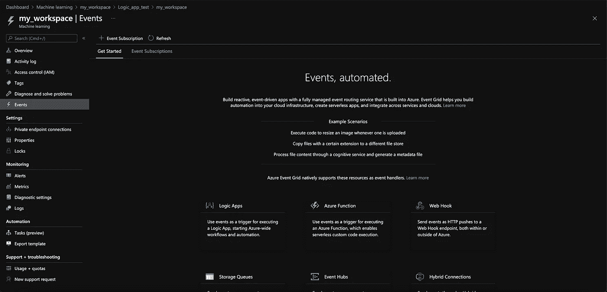
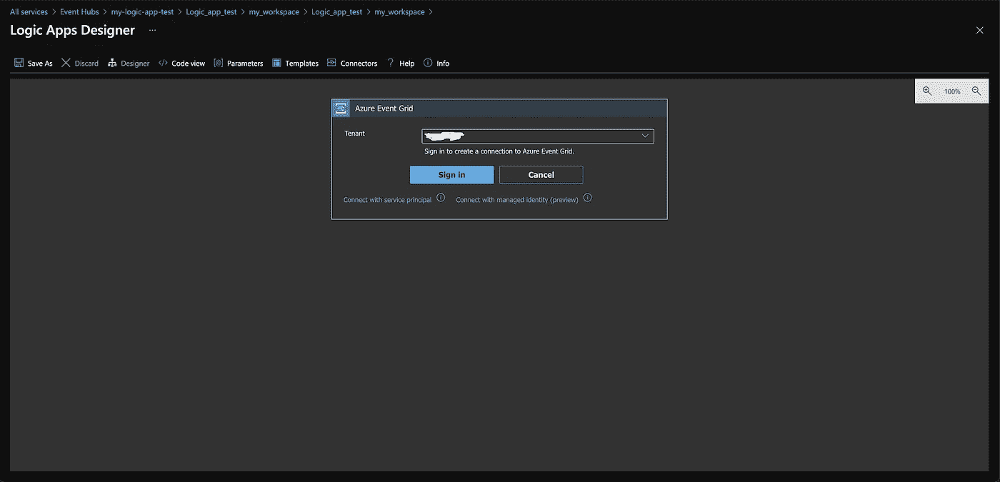
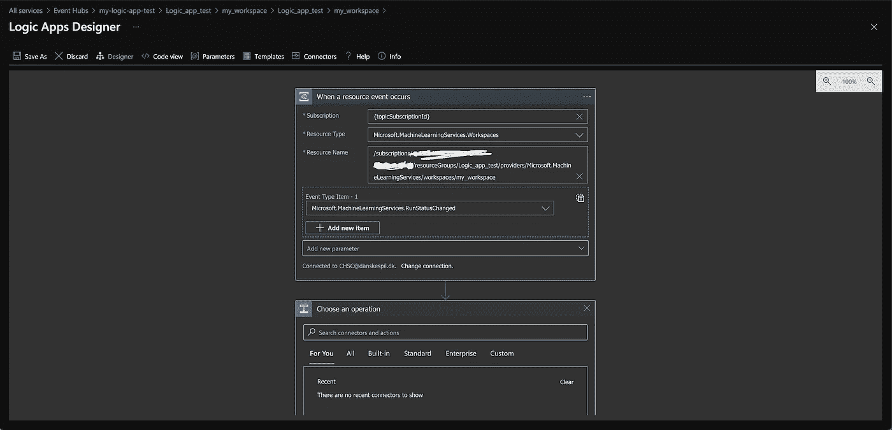
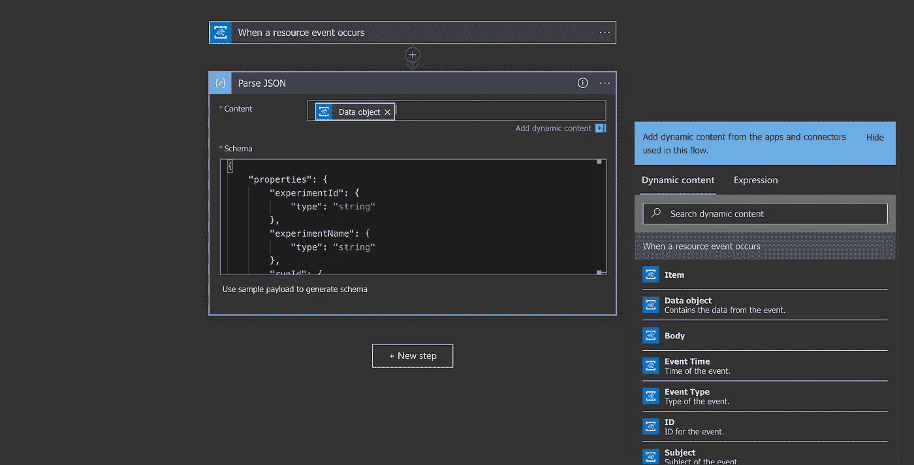
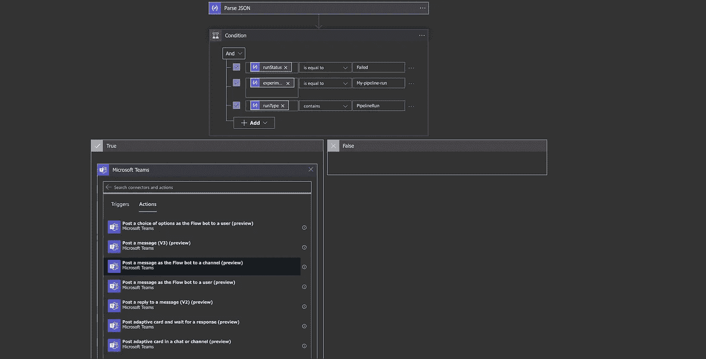

# 带有逻辑应用的 Azure 机器学习管道上的通知

> 原文：<https://medium.com/geekculture/notifications-on-azure-machine-learning-pipelines-with-logic-apps-5d5df11d3126?source=collection_archive---------8----------------------->


Photo by [Charles Deluvio](https://unsplash.com/@charlesdeluvio?utm_source=medium&utm_medium=referral) on [Unsplash](https://unsplash.com?utm_source=medium&utm_medium=referral)

Microsoft Azure Machine Learning 是微软提供的一个可靠产品，用于改善组织的机器学习操作。它相当于微软的 Kubeflow，可以更轻松地管理、部署和维护机器学习工作负载。简而言之，它使一个组织更容易恰当地运用 ML Ops。然而，Azure 机器学习的当前化身没有得到很好的记录，大概是因为它目前正处于紧张的开发中，并频繁发布新功能。一个特别有趣的新功能，目前正在预览中，是 Azure Logic 应用程序和 Azure 机器学习之间的集成。这篇短文**演示了如果管道运行失败**，如何向微软团队通道发送消息。你可以在这里找到更多信息:[https://docs . Microsoft . com/en-us/azure/machine-learning/how-to-use-event-grid](https://docs.microsoft.com/en-us/azure/machine-learning/how-to-use-event-grid#set-up-in-azure-portal)

# 设计逻辑应用程序

*注意，我必须手动启用“微软。网络”和“微软。EventGrid”在我的订阅下，这是我用于测试的 MSDN 订阅。您的里程可能会因您的具体订购配置而异。您可以在订阅详细信息的“资源提供者”选项卡下启用资源提供者。*

首先，转到工作区的“事件”菜单:



The “Events” menu. From here you will create a Logic App instance. For fine tuned control you can add an “Event subscription” from the button and manually set up an Event grid. For our purposes here, it is sufficient to let Azure fill in the blanks.

点击逻辑应用程序图标。Logic 应用程序是一个简单的基于云的事件处理程序，带有一个漂亮的 GUI。它将消费 Azure 服务抛出的事件，处理它并触发一些动作，如发送电子邮件，上传文件或类似的。在我们的例子中，Logic 应用程序将捕获一个类型为 *Microsoft 的 Azure 机器学习事件。machine learning services . RunStatusChanged*，解析此事件中提供的信息并在 Microsoft Teams 中发送消息。从我们的 ML 工作区中单击逻辑应用程序图标会将您带到逻辑应用程序设计器。首先，您必须定义消息代理。这里我们将使用一个事件网格。幸运的是，逻辑应用程序设计者默认了这一点，所以没有必要自己设置一个。我们只需登录，如下图所示。



Connecting to an Event Broker. The Designer is clever enough to provision an Event grid for us, so there is little customization here. For fine tuned control, we would have to manually add an Event Subscription as mentioned above.

这样做将我们带到了重要的部分:设计如何处理 Azure 机器学习发送的事件的逻辑。我们要做的第一件事是配置我们想要处理什么类型的事件。这一点可以从下面的截图中看出。我们希望以资源类型工作区为目标，因为我们正在进行 Azure 机器学习，而事件类型 RunStatusChanged 是因为我们希望在失败的管道上触发一个操作。你可以在你的机器学习工作区的“属性”面板下找到“资源名称”——这里应该叫“资源 ID”。



Designing the logic flow step 1: Defining the type of events to process.

在我们进一步细化逻辑之前，最好检查一个 RunStatusChanged 事件。这种事件的 JSON 序列化如下所示。

```
{
    "headers": {
        "Connection": "close",
        "Accept-Encoding": "gzip,deflate",
        "Host": "prod-47.northeurope.logic.azure.com",
        "aeg-subscription-name": "XXX",
        "aeg-delivery-count": "0",
        "aeg-data-version": "2",
        "aeg-metadata-version": "1",
        "aeg-event-type": "Notification",
        "Content-Length": "983",
        "Content-Type": "application/json; charset=utf-8"
    },
    "body": {
        "topic": "/subscriptions/XXX/resourceGroups/Logic_app_test/providers/Microsoft.MachineLearningServices/workspaces/my_workspace",
        "eventType": "Microsoft.MachineLearningServices.RunStatusChanged",
        "subject": "experiments/a4badd35-1c73-4322-822a-a097442cedd4/runs/2a7b95bb-9a26-442e-8de7-93f451c8019f",
        "id": "1280a0fd-90dc-52d2-b26a-8baf5e268b26",
        "data": {
            "runStatus": "Completed",
            "experimentId": "a4badd35-1c73-4322-822a-a097442cedd4",
            "experimentName": "My-pipeline",
            "runId": "2a7b95bb-9a26-442e-8de7-93f451c8019f",
            "runType": "azureml.PipelineRun",
            "runTags": {
                "azureml.pipelineid": "47a6a7c1-3adb-4ad1-930f-b85d9e740ba7",
                "azureml.pipelineComponent": "pipelinerun"
            },
            "runProperties": {
                "azureml.runsource": "azureml.PipelineRun",
                "runSource": "Unavailable",
                "runType": "Schedule",
                "azureml.parameters": "{}",
                "azureml.pipelineid": "47a6a7c1-3adb-4ad1-930f-b85d9e740ba7"
            }
        },
        "dataVersion": "2",
        "metadataVersion": "1",
        "eventTime": "2021-04-28T04:33:45.5390469Z"
    }
}
```

这里重要的部分是身体。“数据”字段包含我们需要的信息。具体来说，我们需要解析事件 JSON，并在满足三个条件时触发一个动作:runStatus 是 *Failed* ，experimentName 是 *My-pipeline* ，因为我们只想在特定的管道上触发它，runType 是 *azureml。管线运行*。如果我们没有最后一个条件，我们的逻辑应用程序将被触发两次，因为管道中的每个单独步骤也会发出一个事件。请注意，上面提供的示例来自于在 runProperties 字段 runType 中看到的计划运行。因此，我们可以进一步指定仅在计划运行时触发，而不是一次性的。

下一步是在“数据操作”类别中选择一个“解析 JSON”操作。我们希望直接在数据字段上工作，所以我们在内容字段中定义它。我们需要指定预期的模式——为了方便起见，我将它粘贴在这里:

```
{
   "properties":{
      "experimentId":{
         "type":"string"
      },
      "experimentName":{
         "type":"string"
      },
      "runId":{
         "type":"string"
      },
      "runProperties":{
         "properties":{
            "_azureml.ComputeTargetType":{
               "type":"string"
            },
            "azureml.moduleid":{
               "type":"string"
            },
            "azureml.nodeid":{
               "type":"string"
            },
            "azureml.pipelinerunid":{
               "type":"string"
            },
            "azureml.runsource":{
               "type":"string"
            },
            "computeTargetType":{
               "type":"string"
            },
            "contentSnapshotId":{
               "type":"string"
            },
            "stepType":{
               "type":"string"
            }
         },
         "type":"object"
      },
      "runStatus":{
         "type":"string"
      },
      "runTags":{
         "properties":{
            "azureml.nodeid":{
               "type":"string"
            },
            "azureml.pipeline":{
               "type":"string"
            },
            "azureml.pipelineComponent":{
               "type":"string"
            },
            "azureml.pipelinerunid":{
               "type":"string"
            }
         },
         "type":"object"
      },
      "runType":{
         "type":"string"
      }
   },
   "type":"object"
}
```

我们将上述用于数据字段的 JSON 模式粘贴到解析 JSON 操作中，如下图所示:



Working on the data field in the JSON serialized event. We could also work on the body, and extract the data field from that, but why bother? Note that the name of the content may be “Event data” instead of “Data object” as shown in the picture.

对于所有后续步骤，由于我们指定了我们期望的 JSON 模式，数据字段中的数据可以作为动态内容使用。因为我们的用例是一个相当简单的 if 条件，所以我们使用控制类别中的条件操作。此外，我们希望在条件评估为真时发布来自微软团队的消息。下面是它的样子:



Posting a Teams message when the 3 criteria are met. You will need to provide your login details to Teams. The message sent will be from the Flow bot, but your name will appear in the message text as well.

就是这样！当然，你也可以发送一个宽松的信息或电子邮件。Logic Apps 提供了许多集成，非常灵活和直观。由于设计器中提供的 GUI，您不需要成为 Azure 专家。