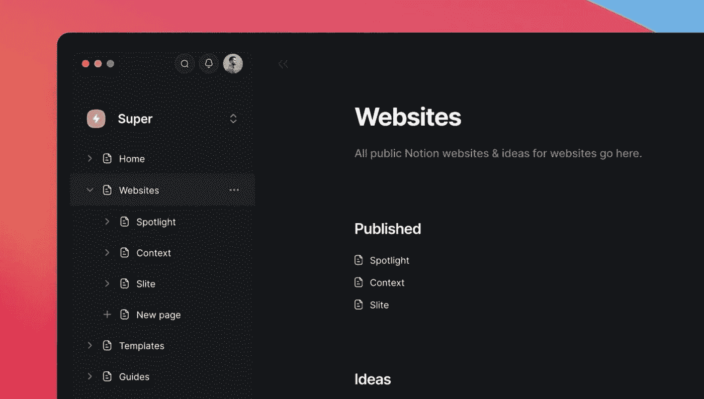

# 想法不会永远持续，但他们可以…

> 原文：<https://medium.com/geekculture/notion-wont-last-forever-748b2bdc4685?source=collection_archive---------9----------------------->

Taken from Traf’s Notion — [here](https://twitter.com/traf/status/1422345122642112516)

## 观念的堕落是不可避免的…他们能做些什么来阻止它呢？

## 所有的事情都会结束…我想我们都同意，我们不想去的是观念

像所有生产力应用程序和软件一样，世界继续随着趋势和创新而发展…