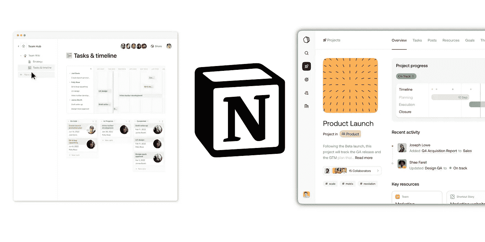

# 观念的最大挑战

> 原文：<https://medium.com/geekculture/notions-hardest-challenge-yet-6ad4d5fbd017?source=collection_archive---------2----------------------->

## 预建项目管理工具的兴起是真实的

## 是的。在 2022 年，微软 Loop 可能不是所有人的想法。

当人们选择和发现团队的下一个生产力工具和工作空间时，我称之为预建工具的兴起又回到了人们的脑海中。