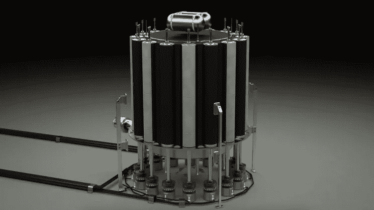

# 核能将拯救世界

> 原文：<https://medium.com/geekculture/nuclear-power-will-save-the-world-60681c9e8b71?source=collection_archive---------24----------------------->

模块化、便携式核能反应堆将帮助世界摆脱碳排放。

Concept-Image for the Radiant Nuclear Reactor created by Radiant.

## 它们已经存在

如果你认为这样做是不可能安全的，那你就错了。

事实是，美国海军已经成功运行便携式核反应堆大半个世纪了。他们生产的反应堆无可争议地…