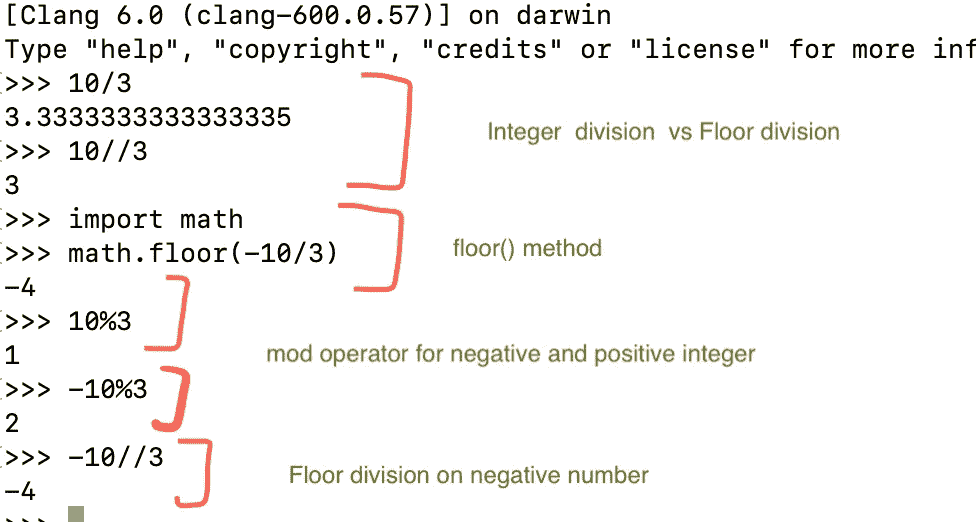
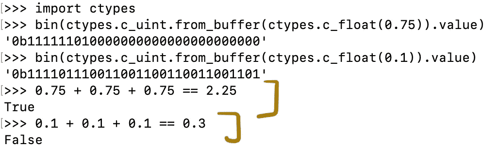
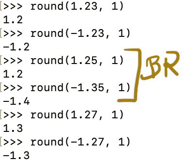
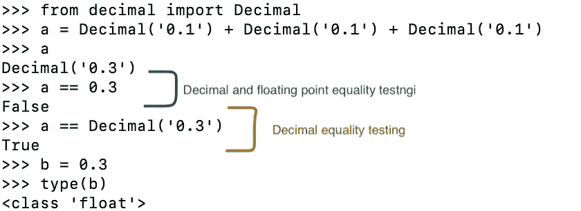
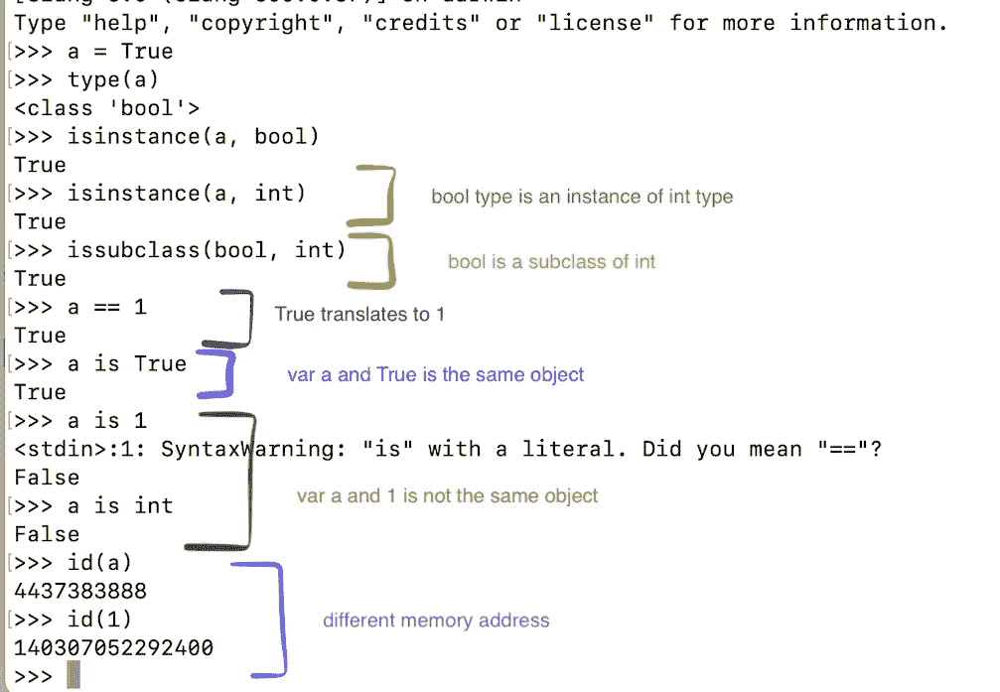
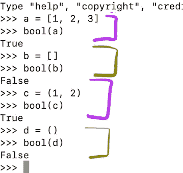
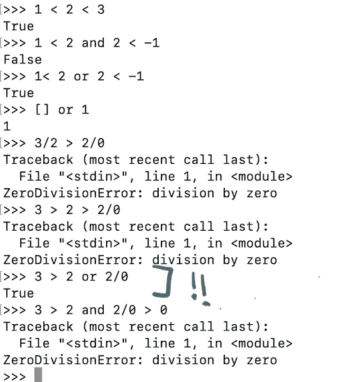

# Python 中的数字类型

> 原文：<https://medium.com/geekculture/numeric-types-in-python-3a1956161ea9?source=collection_archive---------69----------------------->


Photo by [Matej Rieciciar](https://unsplash.com/@m_riecko?utm_source=unsplash&utm_medium=referral&utm_content=creditCopyText) on [Unsplash](https://unsplash.com/s/photos/migrating-birds?utm_source=unsplash&utm_medium=referral&utm_content=creditCopyText)

如果你在美国，祝你独立日快乐！

不敢相信我在过去的 3 年里没有上学，这也意味着我没有积极地做数学，尽管它在 2015 年 3 月后开始慢慢减少。我在 2015 年冬季参加了最后一堂正式的数学课，以完成次要要求。这门课叫做初等数论。这个话题让我忽略了巨大的冬季暴风雪事件。自从你能记起你在学校的时光以来，你学到的那些数字不是数字；他们富有他们的财产。你好，质数，圆周率，gcd，你好，所有这些简洁的公式，基本上让你知道方程的变量值是什么，像‘oiler’，哦，我的天。我还学到了数字中的知识在过去是如何被使用的，比如凯撒密码，以及今天在现代的应用中，比如密码学中的公钥、私钥。然后我意识到这就是为什么他们被称为数学家；思想遇到了真正天才的作品。🪄

我猜初等数论和微积分有不同的味道，尽管我喜欢我的大学微积分课程！一旦你掌握了它，你就会成为一个忍者，就像我的高中朋友一样——仍然有灵感，在那里你可以解决看起来很奇怪的方程，答案通常是 0、1 或∞。非常感谢有这么好的 calc profs，甚至让我考虑把数学作为第二专业。我喜欢翻转课堂教学；我想我也会喜欢在疫情进行的远程学习。我有 93.999%的把握，因为我自愿参加了远程研究生班。⚠️舒适区。

好了，这是 Python 中真正的内容数字类型的前传。谢谢你忍受我怀旧的唠叨。我们开始了数字类型！🏄🏽‍♀️

在本文中，我们将学习整数 Z、有理数 Q、实数 R、复数 C 和布尔真值的 Python 实现。

我将谈论我们在大多数日常场景中可能不会遇到的小怪癖，除非我们在数字敏感领域工作，比如航空航天工程。

**整数**

不像 Java 这样的语言，我们有`byte`、`short`、`int`、`long`，整数对象可以是可变长度的；受到可用内存量的限制。

运行该文件时，我们得到:

```
size of integer value 8 is 28 bytes
size of integer value 976562500000000000000000000 is 36 bytes
```

构造函数和基础:

整数的构造函数是`int(x)`或`int(x, base=10)`，默认基数是 10。我们还可以传递一个数字的字符串表示来获得一个整数，或者将不同基数的数字转换为整数类型。

如果我们只是给一个像`a=3`这样的变量赋一个数，那么它将调用`__int__()` dunder 方法。如果你需要知道什么是 dunder 方法，几周前我写了一篇[文章](/geekculture/magic-dunder-methods-in-python-ce83c4f9701b)。

运行该文件时，我们得到:

```
value of a: 5, type = <class 'int'>
value of b: 5, type = <class 'int'>
value of c: 5, type = <class 'int'>
value of d: 5, type = <class 'int'>
value of e: 5, type = <class 'int'>
```

负整数和正整数的不同运算。



operations on integers

现在让我们来看花车…💨 ☁️

**浮动**

在 Python 中，它是表示实数的默认实现。简单重述一下，实数的形式是`p/q`，其中`p`和`q`属于整数(Z)，而`q`不是 0。

Float 使用固定数量的字节，8 字节等于 64 位。

64 位按如下方式用完:

*   符号-> 1 位
*   指数-> 11 位，所以范围[-2 ⁰，2 ⁰ -1]
*   有效数字-> 52 位(概括一下，有效数字是除了前导和尾随 0 之外的所有数字)

一些浮点数确实有有限的十进制表示，但**有** **没有**有有限的二进制表示；`0.1`如。所以一些浮点等式给了**惊人的**输出。



float equality

这里`0.1+0.1+0.1`给出的是 0.3000000000000004，显然不等于 0.3。

为了减轻这种情况，有两种方法可以进行相等测试——绝对的和相对的。Python 在`math`模块中有`isclose(a, b, *, rel_tol=1e-09, abs_tol=0.0)`来计算相对和绝对公差。**相对**公差以%为单位，用于对**不**接近 0 的数字进行相等测试。**绝对**公差用于数字**接近**到 0 的相等测试。

这里有一个例子:

这是一个输出:

```
sum_1: 0.30000000000000004, b: 0.3
is sum_1 == b? using isclose() with relative tolerance of 5% and default absolute tolerance: Truesum_2: 0.6000000000000001, d: 0.6
is sum_2 == d? using isclose() with default relative and absolute tolerance: True
is sum_2 == d? using isclose() with relative tolerance of 1/10^16 and default absolute tolerance: False
is sum_2 == d? using isclose() with relative tolerance of 1/10^15 and default absolute tolerance: Truee: 1e-05, f: 1e-12
is e == f? using isclose() with default relative and absolute tolerance: False
is e == f? using isclose() with default relative tolerance and absolute tolerance of 0.00001: True
```

对于浮点数的舍入，Python 有一个`round(number, [ndigits])`方法，该方法采用一个可选参数`ndigits`，该参数告诉我们在舍入时要考虑多少个小数点。

对于打破平局，像 1.5，-1.5，1.25，1.35，Python 使用银行家舍入(BR)。BR 表示四舍五入到最接近的值，平局四舍五入到最接近的值，偶数**最低有效数字**。



现在让我们深入研究小数！

有一个叫做`decimal`的模块可以让你定义和使用十进制数的内置方法。它的工作方式类似于我们习惯于十进制数的有限表示，不像我们见过的浮点，例如`0.1+0.1+0.1`的浮点表示。

可以通过多种方式创建十进制构造函数:

运行该文件时，我们得到:

```
integer way: 123
string way: 1.23
floating point way: 1.229999999999999982236431605997495353221893310546875
tuple way: -1.23
```

我们可以执行十进制运算并查看结果，就像我们习惯的那样:



检查`Decimal('0.3')`是**而不是**等于`0.3`，因为 Python 中默认的十进制数表示是浮点类型。

我们有一个叫做**上下文**的东西，它使我们能够确定一个十进制数的精度。

运行该文件时，我们得到:

```
default global decimal precision: 28
default global decimal precision: ROUND_HALF_EVEN
local decimal precision: 2
local decimal rounding: ROUND_DOWN
outside of local context (ctx) manager scope:  2
```

检查本地上下文`ctx`在其本地范围之外仍然保持其精度。

除非有要求，否则建议在 Python 中使用浮点数而不是十进制数，因为在绘制我们想要的精度时会有资源开销，就像我们在纸笔模式中看到的那样。

我把[复数](https://docs.python.org/3/library/cmath.html)留给你探索。

现在我们来 **Boole** ans！(乔治**布尔**

类`bool`包含两个单例对象`True`和`False`。这里有一些关于这两个物体的有趣事实:



从 cli 中，我们看到`bool`类是`int`的子类。即使`True`的值是`1`，它们也是两个不同的对象，反之亦然，对于另一个`bool`对象`False`。

Python 有内置函数`bool([x])`,它给出传递给它的任何参数的布尔值。

运行该文件时，我们得到:

```
val 1's boolean value is True
val 0's boolean value is False
val -1's boolean value is True
val -1111's boolean value is True
val 1111's boolean value is True
```

我们看到，除了+0 和-0，所有的数字都给出了`True`。

事实上，我们也有与我们构建的对象相关联的真值。



任何为空或`None`的内置对象都有布尔值`False`。

让我们来看看自定义对象的真值:

运行该文件时，我们得到:

```
Default truthy value of object light pink oleander is True
```

见对象的默认布尔值是`True`。如果没有定义`__bool__`或`__len__` dunder 方法，默认真值为`True`。如果定义了`__bool__`和`__len__`邓德方法，则`__bool__`优先。

让我们将真值改为假值:

在运行该文件时，我们得到

```
Setting truthy value to False
Truthy value of object ivory oleander is False
```

我想这给了你一个为什么我们可以用`if`语句短路的想法。我曾经想知道为什么这在 Python 中是可行的，即使我们不计算一个布尔对象。

我们也有像`all(iterable)`这样的方法，它检查一个可迭代集合中的所有项是否为真(和)，以及`any(iterable)`这样的方法，它检查一个可迭代集合中的任何项是否为真(或)。

我们还有比较运算符的链接方法！这与逻辑运算符可能有点意思。



我已经看到了如何使用对象的布尔值来使代码简洁并且具有 pythonic 风格。

这个帖子到此为止！我希望它为您提供了关于 Python 中数值类型的有用信息！

恭喜你，感谢你的阅读！很快将在我的下一篇文章中见到您。

嗯..想想数学，也许有一天我会重温线性代数，看看向量计算——特征向量、特征值、点积——有多酷... 🥴

参考:

[Python:深潜](https://www.udemy.com/course/python-3-deep-dive-part-1/)