# C++中的数值计算。第二部分

> 原文：<https://medium.com/geekculture/numerical-computation-in-c-part-2-33dcdbe6c726?source=collection_archive---------2----------------------->

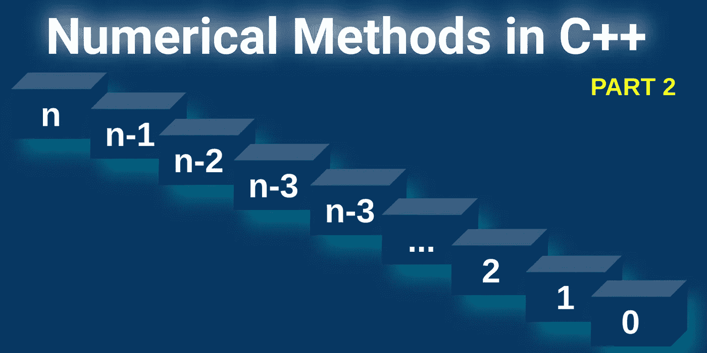

by author

接下来的文章是关于 C++中数值计算讨论的继续(第 2 部分，共 2 部分)。 [**在第一部分**](/geekculture/numerical-methods-in-c-1c8ef1160c2b) 中，我展示了常用于执行插值、数值微分或积分的基本原理。此外，我解释了如何添加和运行绘图库，并使 C++更加“友好”。
现在我要给你们一个简单概述，如何解决一阶和二阶微分方程。文章以描述求解非线性方程的方法的简短解释结束。

为了您的方便，我将重复如何编译和运行程序，您可以在[上一篇文章](/geekculture/numerical-methods-in-c-1c8ef1160c2b)中找到。源代码和所有以 Latex 形式呈现的方程你会在 [**我的要点**](https://gist.github.com/markusbuchholz/f1f25d3c88bbd3b1412c7a5c97ba0548) 中找到。

[头文件](https://github.com/lava/matplotlib-cpp)(用于绘图库)必须在与 cpp 相同的文件夹中。
你编译的每个程序如下:

```
//compile
g++ my_prog.cpp -o my_prog -I/usr/include/python3.8 -lpython3.8// //run
./my_prog//folder tree
├── my_prog
├── my_prog.cpp
├── matplotlibcpp.h
```

# **微分方程**

[微分方程](https://en.wikipedia.org/wiki/Differential_equation)在需要建立物理现象数学模型的地方起着重要作用。在这种情况下，微分方程提供了在方程中联系物理量(未知函数)和该函数的导数(代表它们的变化率)的机会。

为了探讨微分方程的原因，让我们考虑一个 [RLC 电路](https://en.wikipedia.org/wiki/RLC_circuit)。这种电路的微分方程(描述特定系统“动态”的电路数学模型；这里，动态特性可以与电流 I(t)相关联，电流 I(t)的值随时间变化(在电路启动之后)。使用[基尔霍夫电压定律](https://en.wikipedia.org/wiki/Kirchhoff%27s_circuit_laws)可以推导出解决方案。我真的推荐你去研究维基百科上面这两个链接下给出的信息。
简化了给定的 RLC 电路的理论背景，微分方程为我们提供了一个绝佳的机会来分析该系统的主要组件(R、L 和 C)在瞬态时间内的影响(RLC 电路接通后，电流幅度如何随时间变化)。

微分方程是针对基尔霍夫电压导出，且可以写成如下:

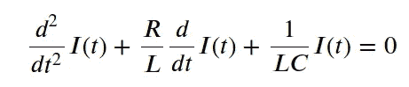

微分方程，正如我上面提到的，可以理解为函数之间的联系(它描述了过程值= >物理值如何随时间变化；当然，微分方程适用于所有可能的域)。
**我们寻找的解是满足微分方程的函数。简化我们正在寻找给我们“数学图像”的函数，在那里我们能够看到函数在特定时间的变化(就像上面讨论的当前情况)。**

在许多情况下，微分方程的解析解是未知的，因此数值方法在相关领域中起着重要的作用。

微分方程可以规定如下:

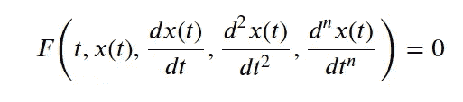

为了用**数值方法**解这个方程，我们需要重写方程的显式形式。

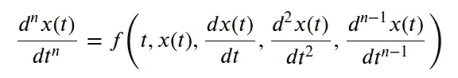

这一点非常重要。在数值方法中，我们寻找满足上述方程的函数。从技术上讲，我们一步一步地接近这个等式的右边部分

# **一阶常微分方程**

在本节中，我将描述三种不同的方法来解决所讨论的方程。我们称这种[方程**为普通**](https://en.wikipedia.org/wiki/Ordinary_differential_equation) ，因为这种方程包含一个或多个关于一个独立变量及其导数的函数。术语**普通**的使用与[偏微分方程的概念相反](https://en.wikipedia.org/wiki/Partial_differential_equation)将术语普通与应用各种偏导数和多变量函数的术语偏微分方程联系起来使用。我不打算关注 C++代码描述，因为我认为它是不言自明的。这篇文章的原因不是向你展示如何编程，而是如何在特定领域使用你的技能。获得直觉并熟悉解决这类方程的最流行的方法是很棒的。

# **欧拉方法**

欧拉法是求解微分方程的简单方法之一，然而与下一篇文章中描述的其他方法相比，其性能(精度)非常低(也称为**前向欧拉法**)是一种一阶数值程序，用于求解具有给定[初始值](https://en.wikipedia.org/wiki/Initial_value_problem)的常微分方程(ODEs)。ODE —带初值的微分方程称为柯西问题，可以写成如下形式:

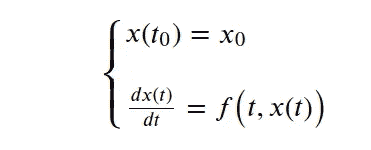

已知初始值，给定的方程可以通过使用欧拉方法，应用下面的简单方程逼近函数 f(x)来求解，这就是我们正在寻找的解。

首先我们可以用导数的定义:

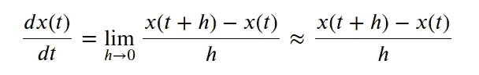

重新排序后，我们可以写出最终方程，它近似 f(x ),即我们所寻找的解。

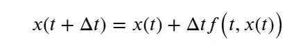

C++实现(在 cpp 文件上)和结果给出了所有讨论过的(一个文件)方法。请看看这一部分的结尾。

# **中点法**

[中点法](https://en.wikipedia.org/wiki/Midpoint_method)是欧拉法的修正。如您所知，在欧拉方法中，为了估算下一个值 x(t+∏t)(考虑上述等式)，我们只需计算点 t 的导数。为了提高精度，我们可以通过线段[t；t+⇼t】。

中点法可以推导如下:

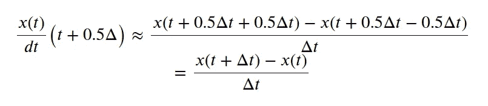

正如我之前提到的，应用方法的实现和结果将在本节的末尾给出。

# **龙格-库塔法**

跟随法是求解常微分方程最常用的方法。Runge-Kutta 方法优于用于求解所讨论类型的方程的其他数值方法(非常容易实现、精确且通常稳定，可以通过提供一个初始值来求解)。

所讨论的方法提供了估计函数增量(变化)的机制:x(t+∏t)-x(t)。

有 n 阶方法，规定了我们计算函数 f (t，x(t))的次数。然而，最常用的方法也是下面描述的方法是方法**四阶**。

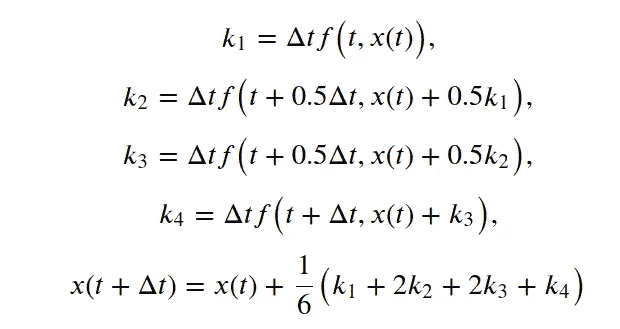

现在我们可以在 C++中部署所讨论的方法并求解一个简单的微分方程。

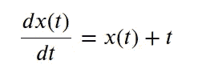

它有一个解决方案。

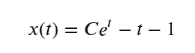

**请注意，解数值微分方程意味着，我们需要一步一步地接近导函数的值(在上面的方程中，方程的右边)！！**

下图显示了解决给定微分方程的已实现方法的解决方案。

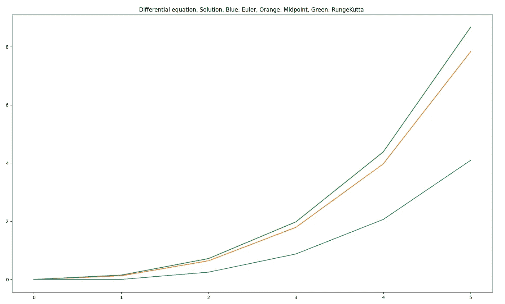

by author

# 二阶常微分方程

用 [**韦列特法**](https://en.wikipedia.org/wiki/Verlet_integration) 逼近二阶微分方程的解。本节介绍的方法在物理学中经常用来求解牛顿运动方程，这给描述物体的位置、速度和加速度提供了极好的机会。
Varlet 方法中演示的方法假设位置与速度无关，因此运动方程可给出如下:

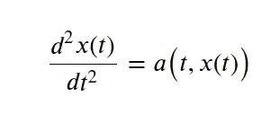

**a** 被认为是时间(t)和位置 x(t)的加速度。

上述方程的解可用中心微商进一步逼近。
重写本节中描述的所有方程，给出最终方程，该方程将用于计算物体的下一个位置:

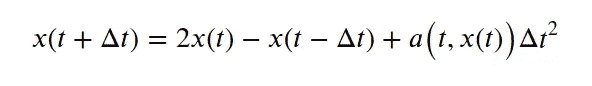

如您所见，没有直接的解决方案。x(t+t)的计算需要 x(t)和 x(t)的知识。

更进一步，x(t+∏t)可以直接应用泰勒级数来计算，

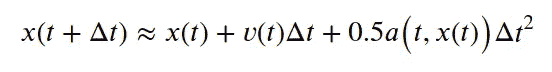

最后，Varlet 方法(速度方法)可以给出如下


现在我将展示一个如何逼近 [**谐振子**](https://en.wikipedia.org/wiki/Harmonic_oscillator) 的解，可以用运动方程来描述。

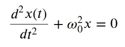

该方程的解可由下式给出:

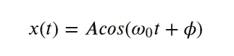

**请注意，类似于一阶微分方程，我们正在寻找满足运动方程的函数。该函数由二阶导数(运动方程右侧)**逼近，可指定为:

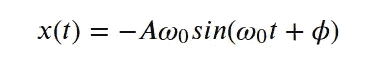

我在 C++中实现的 considerer 方法和解决方案如下

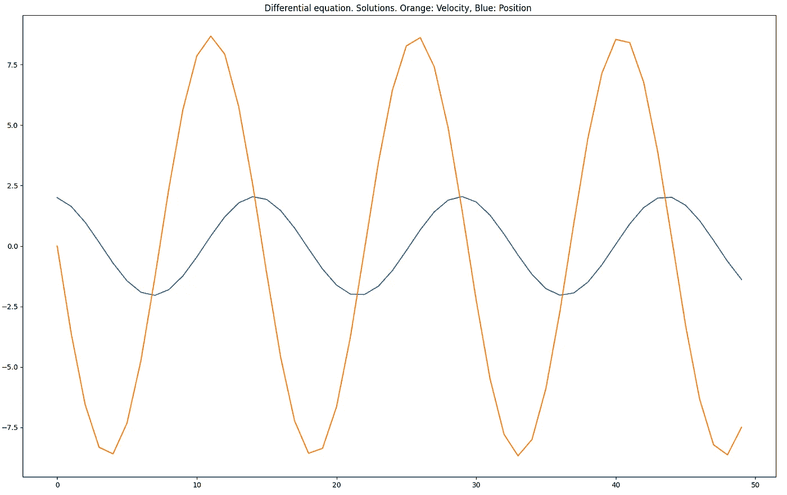

by author

# **非线性方程**

本节我将描述 [**牛顿法**](https://en.wikipedia.org/wiki/Newton%27s_method) (牛顿-拉夫逊法)，它允许计算[非线性方程](https://en.wikipedia.org/wiki/Nonlinear_system)的根:

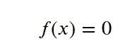

下面的函数 f(x)可以理解为三阶多项式(或其他)，在这种情况下可以由下面的等式给出:

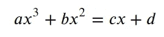

使用泰勒级数，我们可以将 f(x)表示为

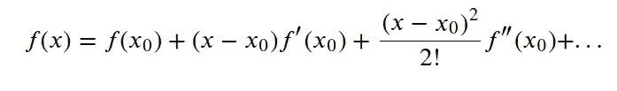

仅考虑本系列的前两个要素，我们可以按如下方式处理解决方案，

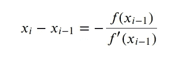

我在 C++中实现的牛顿-拉夫森方法以及三个简单方程的示例解:

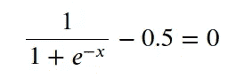

而且，

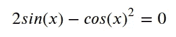

最后一个，我们的程序解决了:


上述“讨论”在 C++中的实现如下。


第一个方程的根是 0。

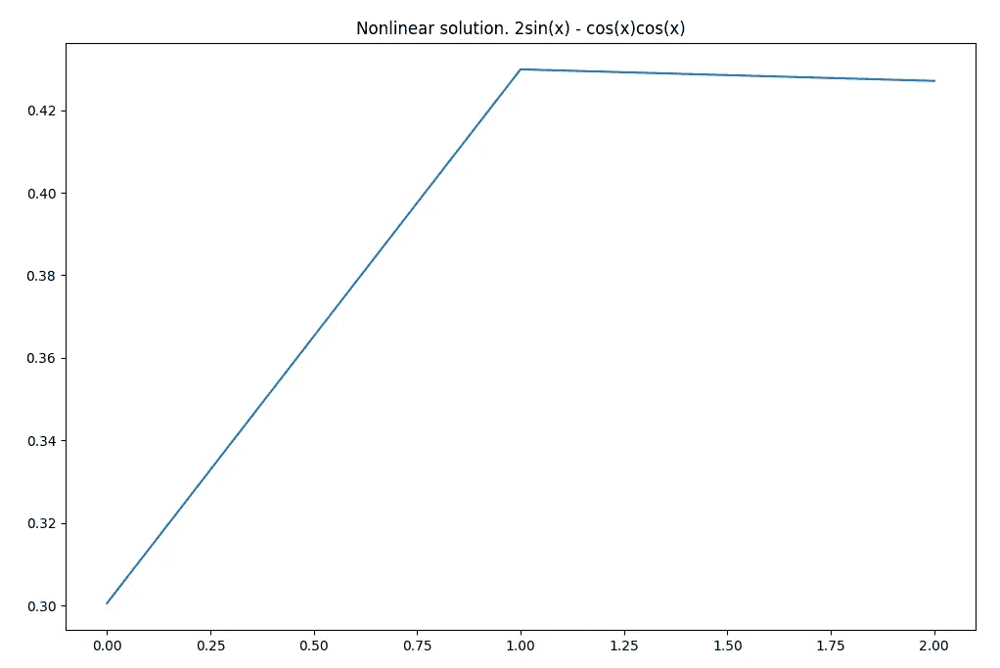

by author

第二个方程的根是 0.42708。

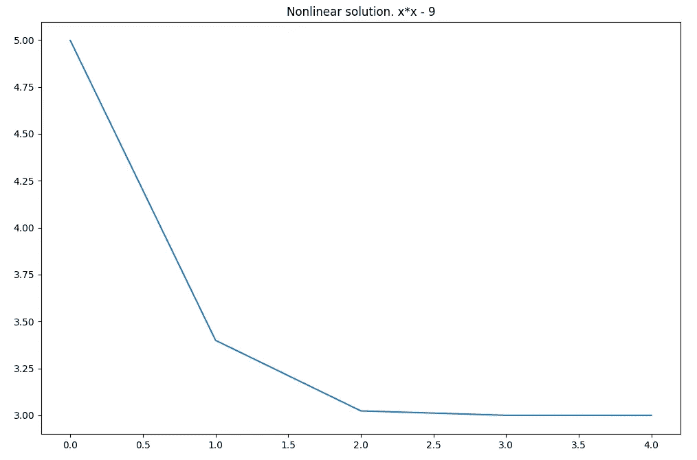

by author

最后，第三个例子的解是 3。不奇怪。

谢谢你的阅读。