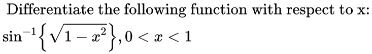
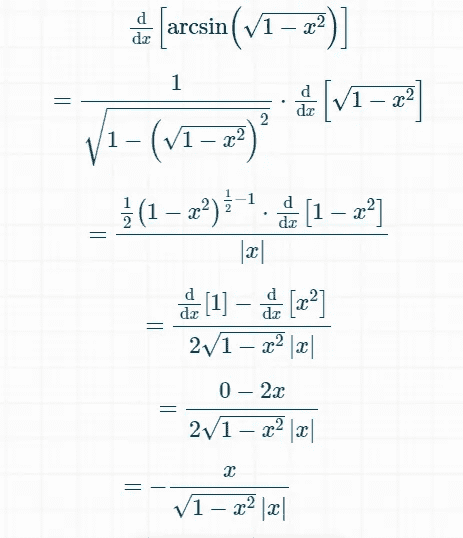
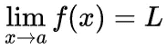
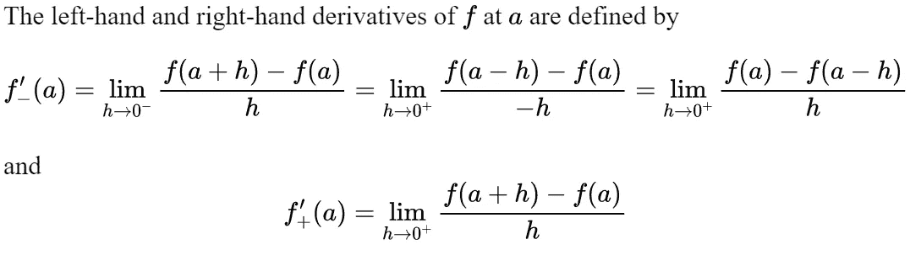

# 编码中的数值微分:Pythonic 式的方法

> 原文：<https://medium.com/geekculture/numerical-differentiation-in-coding-the-pythonic-way-c6cc4f837cea?source=collection_archive---------5----------------------->

您在对函数`**f(x)**`的微分值进行编码时遇到过**问题吗？你是否需要一种**功能性方法**来为你**自动化差异化**？如果这两个问题的答案都是肯定的，那么这篇博文绝对是为你而写的。**

我已经提供了 [Google 协作笔记本](https://colab.research.google.com/github/khanfarhan10/Num_Diff/blob/main/NumericalDifferentiationFinalNB.ipynb)和[Github Repository Num _ Diff](https://github.com/khanfarhan10/Num_Diff)，因此您可以使用这些工具来更好地理解这个主题。


Let’s start Numerical Differentiation in Python.

## **为什么要进行数值微分？**

考虑以下问题:



Sample Problem by Author

在写一些正式代码之前，先导入 Python 中的`**math module**`:

```
**import math**
```

现在，您可以按如下方式构建目标函数:

```
**def f(x):
  return math.asin(math.sqrt(1-math.pow(x,2)))**
```

对于微分函数`**f’(x)**`，一个典型的数学家随后会使用冗长而复杂的链式法则手动微分该函数，可能如下所示，然后对其进行编码:



Calculation for d/dx{f(x)} [Source : [Online Derivative Calculator](https://www.derivative-calculator.net/)]

```
**def differentialfx(x):
  return (-x)/(abs(x) * math.sqrt(1-math.pow(x,2)))**
```

很可怕，是吧？嗯，我们在这里不是为了那个，我们将试着把**微分算子(** `**d/dx**` **)** 作为一个整体来自动化。


Let’s simplify maths using maths. (Source: [KnowYourMeme](https://i.kym-cdn.com/photos/images/newsfeed/001/534/991/18e.jpg))

## 极限、导数和近似值的概念

> 函数在其定义域中的点`*a*`处的极限(如果存在的话)是函数随着其自变量接近`*a*`而接近的值。



Limit of a Function

我们将使用上述定义来获得左手和右手导数，分别如下:



Definition of **LHD** and **RHD**

为了获得更好的近似值，通常将两者的平均值视为`x=a`处差值的最佳估计值。数学上，我们试图计算的是:


Computed Average Derivative

因此，为了得到 f(x)在 x=a [ `**f’(x=a)**` ]处的微分值，我们将使用上面的公式，用一个非常小的正数{比如说`10^(-6)` }代替`h`。让我们开始编码吧:

```
**def differentiate(func,a,h=1e-6):
  """
  Returns a derivative of the passed function f(x) at a given value
  a using the concept of Right Hand and Left Hand derivative
  approximation.
  f = univariate function f(x)
  a = value at which derivative should be calculated f'(x=a)
  h = the tolerance h, which is a value very close to zero but not  
      zero.
  """
  return (func(a+h)-func(a-h))/(2*h)**
```

## 验证结果

现在让我们使用上面为`**0<x<1**`定义的脚本找出一些差异。我们在这里使用的方法很简单:

1.  **从`0.01 to 0.99`开始循环**到`num`
2.  **使用硬编码方法&计算微分**数值微分
3.  了解两个计算值的值是否**彼此接近**。
4.  如果数值不接近，**存储并显示**数值。
5.  **检查结果不接近的单个值**。

```
**DIFFS = []
for i in range(1,100):
  num = i/100
  approx_estimated_value = differentiate(f,num)
  actual_true_value = differentialfx(num)
  val = math.isclose(approx_estimated_value,
                     actual_true_value,rel_tol=1e-9)
  if val == False:
    print("Suitable Difference Found at",num)
    DIFFS.append(num)**
```

**获得的输出**:

```
Suitable Difference Found at 0.02
Suitable Difference Found at 0.99
```

> 注意:这些差异是由于近似误差造成的。如果我们希望检查到小数点后的`n`位，那么可以通过在`math.isclose(approx_estimated_value, actual_true_value,**rel_tol=1e-n**)`中使用`n=6`(或更小的值)来避免这些差异。在这种情况下，没有发现明显的差异。

**考察**差异:

```
**for each_num in DIFFS:
  print("Values at",each_num,":",differentiate(f,each_num,h=1e-6),
        ",",differentialfx(each_num))**
```

**输出:**

```
Values at 0.02 : -1.0002000616626816 , -1.000200060020007 
Values at 0.99 : -7.088812059172223 , -7.088812050083354
```

这些值仅在大约 8 位数之后不同，因此使用`math.isclose(approx_estimated_value, actual_true_value,**rel_tol=1e-8**)`运行脚本显示没有差异。


Yay! We were very accurate! (Source : [The Culturist](https://www.theculturist.com/home/mysterious-dancing-russian-boy.html))

## 高层信息

PyTorch(一个 Python 深度学习模块)具有**亲笔签名的**特性，这些特性使用复杂的树状结构(图形)采用微分的链式规则机制，以更高效、更快速的方式执行相同的功能:

```
**import torch
x = torch.autograd.Variable(torch.Tensor([0.5]),requires_grad=True)
def fnew(x):
  return torch.asin(torch.sqrt(1-torch.pow(x,2)))
y = fnew(x)
y.backward()
print(float(x.grad))**
```

然而，在使用 PyTorch 时，`math`模块的实现将不起作用。我们必须使用`torch`模块来使用`autograd`功能。由于这是一个超出讨论范围的大话题，下面是一些方法，通过这些方法您可以学习如何使用 PyTorch 中的 autograted 实现自动区分:

*   [PyTorch 亲笔签名官方教程/文档](https://pytorch.org/tutorials/beginner/blitz/autograd_tutorial.html)
*   [Pytorch 教程 Python 工程师亲笔签名的梯度下降和反向传播](https://www.youtube.com/watch?v=E-I2DNVzQLg)

> 注意:本博客中提到的实现是为了展示最简单的微分方法——数值方法，但是因为它需要另一个函数旁路调用，所以不应该大规模使用，因为会出现适当的时间损失。以下部分显示了合适的实施时间差。

## 脚本运行时间

分别运行这三种方法并对这些脚本计时后，将获得以下平均计时数据:

```
Over  100  Iterations : 
ClassicalDifferential : 6.438255310058594e-05 seconds. NumericalDifferential : 0.00017073869705200195 seconds. TorchDifferential : 0.010568954944610597 seconds. Over  1000  Iterations : 
ClassicalDifferential : 5.8611392974853516e-05 seconds. NumericalDifferential : 0.00013384795188903809 seconds. TorchDifferential : 0.010314790725708008 seconds.
```

**附录:运行时间代码—**

Code for Running Time of Each Method

## 进一步阅读和理解

如果任何/所有这些对您来说都不完全有意义，请考虑阅读这些文章来增强您的 POC:

*   精彩— [函数极限](https://brilliant.org/wiki/limits-of-functions/)
*   CueMath — [左舵&右舵](https://www.cuemath.com/jee/left-hand-and-right-hand-derivatives-limits-continuity-differentiability/)