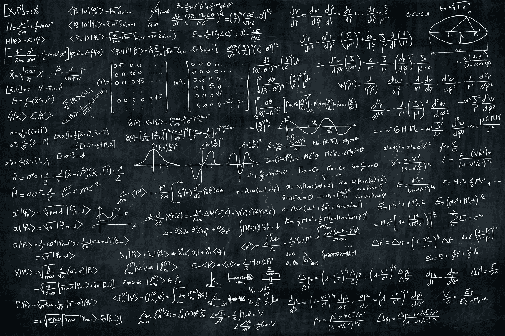
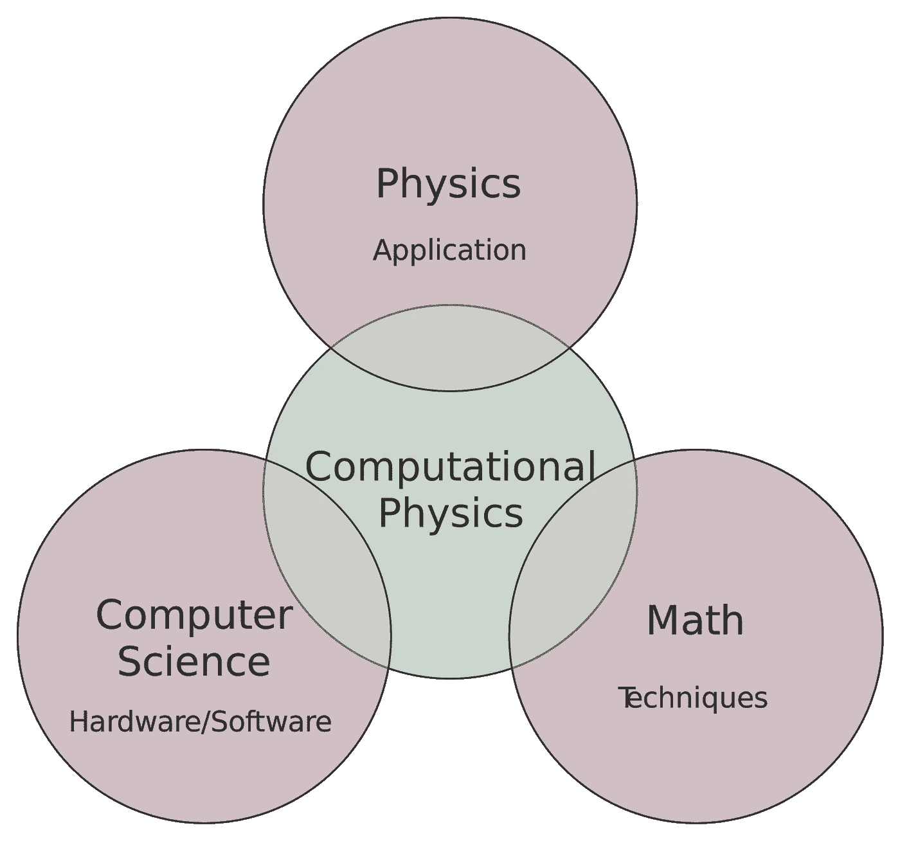
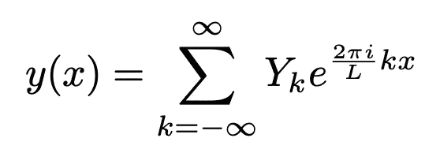
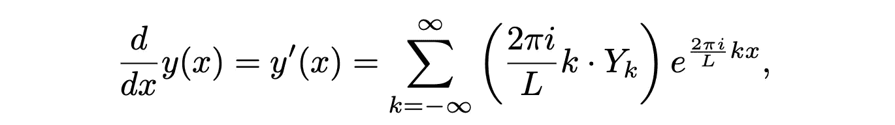
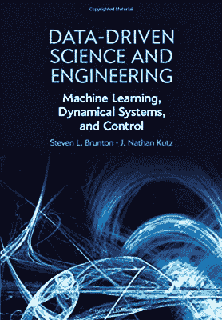
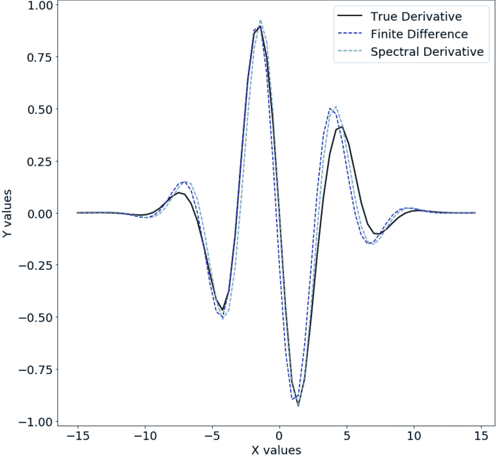
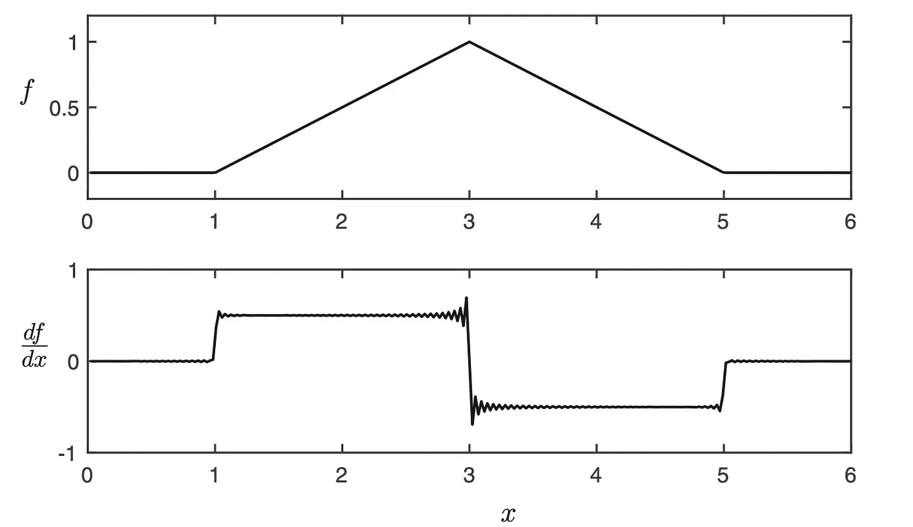

# 通过 FFT 算法的数值微分:计算光谱导数

> 原文：<https://medium.com/geekculture/numerical-differentiation-via-the-fft-algorithm-calculating-the-spectral-derivative-a8ab18e1abbe?source=collection_archive---------0----------------------->

物理领域确实取得了长足的进步。

过去，当一个人想到物理职业时，通常会联想到怪人的形象，蓬头垢面，胡须未刮，围着黑板团团转。



Something like this?

这些天来，这个领域发生了巨大的变化。计算的复杂性早已超越了袖珍计算器和黑板，需要大量使用计算机算法。

计算物理领域已经发展到能够满足当今科学家和研究人员的需求。

从根本上说，物理原理是一样的。

然而，明智的软件优化有助于大大提高计算的准确性。或者，它有助于对手工无法解决的问题做出更准确的估计。



Credits: Wikipedia

让我们开始吧

# 正弦函数的性质

考虑一个一维周期函数，用复数表示。



函数的微分导致以下微分:



导数与原函数几乎相同，增加了 **i 和 2(π)k/L，**使我们可以获得结果:

> **F**(*df*/*dx*)= Iω**F**(F)，其中 **F** 表示傅里叶变换。

> 通过利用傅里叶变换和傅里叶逆变换，我们有一个非常方便的方法来恢复函数的导数。

## 测试光谱导数的准确性。

再说一次，该表扬的地方就要表扬。

参考文献和结果都是从这本教科书中获得的。



[https://www.amazon.sg/Data-Driven-Science-Engineering-Learning-Dynamical/dp/1108422098](https://www.amazon.sg/Data-Driven-Science-Engineering-Learning-Dynamical/dp/1108422098)

以下代码示例被细分为 3 个块。

1.  **我们创建一个简单的周期函数。**

由于这里的作用是**评估光谱导数的准确性**，我们创建了一个简单的函数，在该函数中可以获得解析解，以便为比较提供基线。

```
import numpy as np 
import matplotlib.pyplot as pltplt.rcParams['figure.figsize'] = [12, 12]
plt.rcParams.update({'font.size': 18})n=64
L=30
dx=L/n
x=np.arange(-L/2,L/2,dx,dtype="complex_") **#Create a Function**f=np.cos(x) * np.exp(-np.power(x,2)/25) **#Analytically obtain the Derivative**

df= -(np.sin(x) * np.exp(-np.power(x,2)/25 + (2/25)*x*f))  #Derivative
```

2.**我们试图通过有限差分法(FDM)来估计导数。**

FDM 是微分和求导的另一种方法。事后看来，我们知道这是一种更粗糙、更不准确的确定导数的方法。但是为了比较，我们已经包括了它。

```
**##Approximate derivative by FDM****#Create a numpy array
#Discretizes the function into finite regions**dfFD=np.zeros(len(df), dtype='complex_') **#Iterate across array**for kappa in range(len(df)-1):
    dfFD[kappa]=(f[kappa+1]-f[kappa])/dx   

dfFD[-1]=dfFD[-2]
```

3.**通过快速傅立叶变换&快速傅立叶变换近似光谱导数。**

```
**##Approximate derivative by FFT**fhat = np.fft.fft(f)kappa = (2*np.pi/L)*np.arange(-n/2,n/2)**#Re-order fft frequencies**kappa = np.fft.fftshift(kappa) **#Obtain real part of the function for plotting**dfhat = kappa*fhat*(1j)**#Inverse Fourier Transform**dfFFT = np.real(np.fft.ifft(dfhat))**##Plot results**plt.plot(x, df.real, color='k', LineWidth=2, label='True Derivative')
plt.plot(x, dfFD.real, '--', color='b', LineWidth=1.5, label='Finite Difference')
plt.plot(x, dfFFT.real, '--', color='c', LineWidth=1.5, label='Spectral Derivative')plt.xlabel('X values')
plt.ylabel('Y values')plt.legend()
plt.show()
```



对于平滑和连续的函数区域，可以观察到代表**光谱** **导数的线**更接近实际导数的线，证明它是真实导数的更精确的近似。

值得注意的是，对应于 FDM 和 FFT 的代码(代码块 2 和 3)对于表达式是不可知的，t **它们将接受任何表达式，不管有多复杂，并返回估计值。**

在现实生活中不可能获得解析导数的情况下，使用光谱导数是有意义的。

## 光谱导数可能不准确的情况

函数是**不连续**的情况，并且具有尖锐的转折点，这导致光谱导数变得不精确的情况。

这就是众所周知的[吉布斯现象](https://en.wikipedia.org/wiki/Gibbs_phenomenon)，它试图量化为什么光谱导数不能精确地逼近这些急剧转折点处的导数。



幸运的是，在现实世界中，趋势表现出不连续跳跃的情况非常罕见，如果不是不可能的话。

吉布斯现象的讨论和证明最好留给纯数学领域。

光谱导数到此为止！